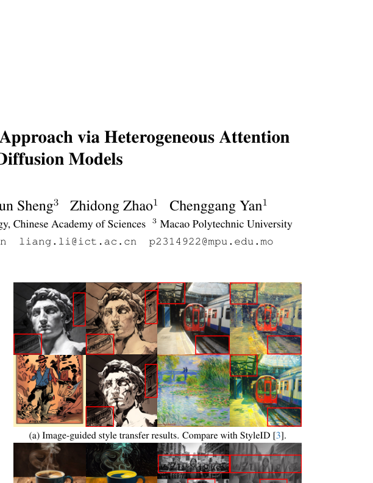
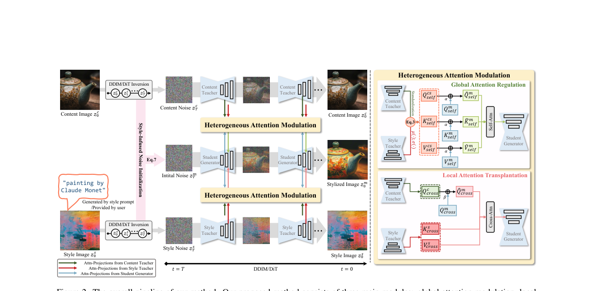
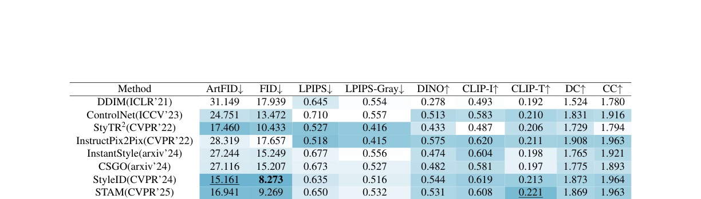
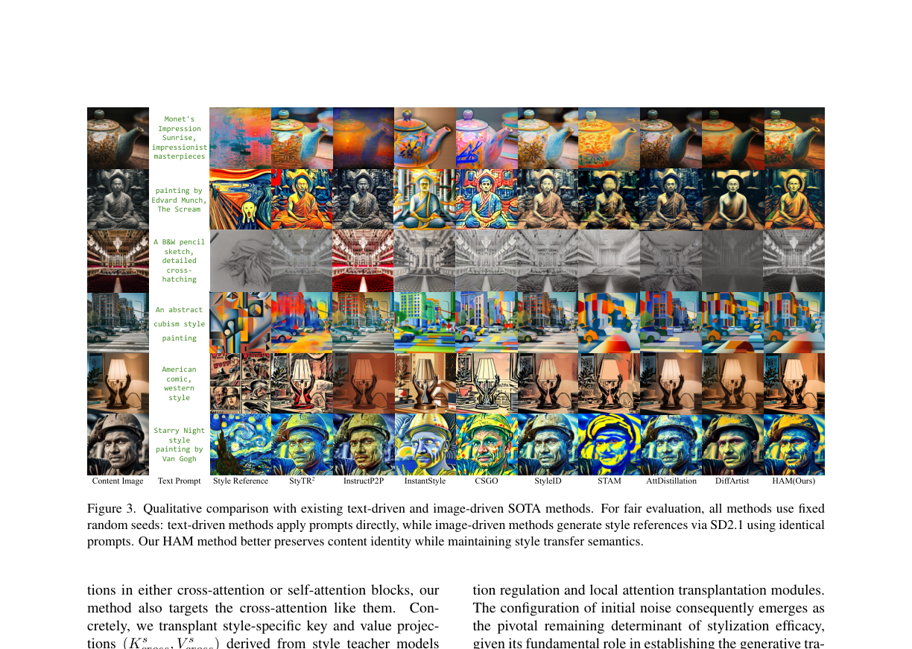
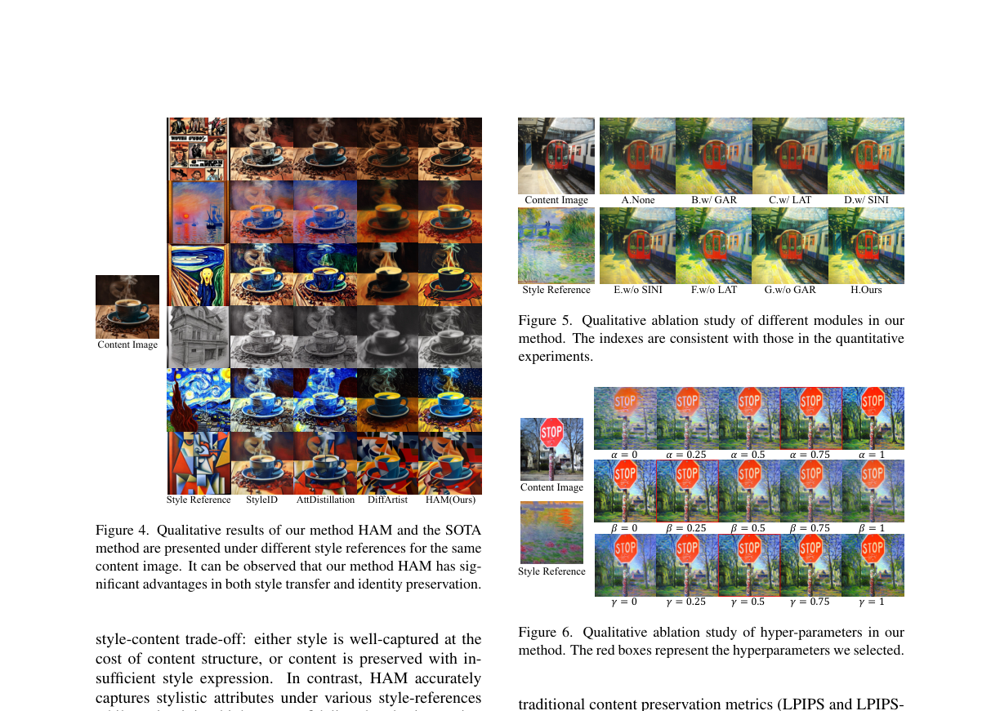

# AI Daily

## HAM: A Training-Free Style Transfer Approach via Heterogeneous Attention Modulation for Diffusion Models

**論文標題**: HAM: A Training-Free Style Transfer Approach via Heterogeneous Attention Modulation for Diffusion Models
**作者**: Yeqi He, Liang Li, Zhiwen Yang, Xichun Sheng, Zhidong Zhao, Chenggang Yan
**發表會議**: CVPR 2026 Findings
**論文連結**: [arXiv:2603.24043](https://arxiv.org/abs/2603.24043)

---

### 論文核心貢獻和創新點

這篇論文提出了一種名為 **HAM (Heterogeneous Attention Modulation)** 的「免訓練 (training-free)」風格轉換方法，專為擴散模型 (Diffusion Models) 設計。過去的風格轉換方法常常陷入「風格與內容平衡 (style-content balance)」的困境：若要強化風格，往往會喪失原圖的內容特徵；若要保留內容，風格的呈現又會大打折扣。

HAM 的核心創新在於：
1. **異質注意力調變 (Heterogeneous Attention Modulation)**：不再只單純修改自注意力 (Self-Attention) 或交叉注意力 (Cross-Attention) 層，而是針對兩者進行不同的操作。
2. **全局注意力調節 (Global Attention Regulation, GAR)**：在自注意力層進行巨觀的控制，將內容與風格的特徵進行融合。
3. **局部注意力移植 (Local Attention Transplantation, LAT)**：在交叉注意力層進行精確的控制，將風格特徵移植到生成過程中，同時保護內容查詢 (Query)。
4. **注入風格的噪聲初始化 (Style-Infused Noise Initialization, SINI)**：在擴散過程的初始階段 (Timestep T)，透過自適應實例正規化 (AdaIN) 融合內容與風格的初始噪聲。

---

### 技術方法簡述

HAM 方法的整體架構建立在預訓練的擴散模型（如 Stable Diffusion 2.1 或 3.5）之上，無需進行任何微調或訓練。其核心技術包含三個模組：

#### 1. 注入風格的噪聲初始化 (SINI)
在擴散模型的初始時間步 $T$，HAM 融合了來自內容圖片和風格參考圖片的初始噪聲。為了平衡風格強度與內容保真度，公式如下：

$$
z_{T}^{m}=\gamma\cdot\underbrace{\left[z_{T}^{c}-\left(\sigma(z_{T}^{s})\cdot\frac{z_{T}^{c}-\mu(z_{T}^{c})}{\sigma(z_{T}^{c})}+\mu(z_{T}^{s})\right)\right]}_{\text{Content Residual Noise}}+\underbrace{\left[\sigma(z_{T}^{s})\cdot\frac{z_{T}^{c}-\mu(z_{T}^{c})}{\sigma(z_{T}^{c})}+\mu(z_{T}^{s})\right]}_{\text{Stylized Initial Noise}}
$$

其中 $z_{T}^{c}$ 和 $z_{T}^{s}$ 分別為內容與風格的初始噪聲，$\mu(\cdot)$ 和 $\sigma(\cdot)$ 為均值與變異數，$\gamma$ 是控制內容殘差權重的超參數。

#### 2. 全局注意力調節 (GAR)
在自注意力 (Self-Attention) 層中，HAM 使用自適應實例正規化 (AdaIN) 將內容特徵 $(Q_{self}^{c}, K_{self}^{c}, V_{self}^{c})$ 與風格特徵 $(Q_{self}^{s}, K_{self}^{s}, V_{self}^{s})$ 進行融合，生成複合特徵 $(Q_{self}^{cs}, K_{self}^{cs}, V_{self}^{cs})$。

$$
Q_{self}^{cs} = \sigma\left(Q_{self}^{s}\right)\cdot\frac{Q_{self}^{c}-\mu\left(Q_{self}^{c}\right)}{\sigma\left(Q_{self}^{c}\right)}+\mu\left(Q_{self}^{s}\right)
$$

接著，使用超參數 $\alpha$ 將這些複合特徵與主生成分支的原生特徵進行加權融合，以確保在整個去噪過程中，既保留內容的身份資訊，又融入風格參考。

#### 3. 局部注意力移植 (LAT)
在交叉注意力 (Cross-Attention) 層中，為了避免修改自注意力層帶來的空間語意破壞，HAM 創新地將風格模型的鍵 (Key) 和值 (Value) 投影 $(K_{cross}^{s}, V_{cross}^{s})$ 直接移植到主生成分支中。同時，為了保護內容身份，HAM 對查詢 (Query) 進行加權融合：

$$
\hat{Q}_{cross}^{m}=\beta\cdot Q_{cross}^{m}+(1-\beta)\cdot Q_{cross}^{c}
$$

其中 $\beta$ 控制內容查詢的注入權重，這使得模型能夠在沒有文本提示的情況下，實現精確的風格與內容控制。

---

### 實驗結果和性能指標

HAM 在 MS-COCO 和 WikiArt 數據集上進行了廣泛的評估，並與現有的 SOTA 方法（如 ControlNet, StyleID, DiffArtist 等）進行了比較。

- **風格強度 (Style Strength)**：在 CLIP-T 指標上取得最佳成績 (0.223)，在 FID 上取得次佳成績 (9.244)，證明其在提取和轉移風格特徵方面非常有效。
- **內容保留 (Content Preservation)**：在 LPIPS (0.479) 和 LPIPS-Gray (0.362) 指標上大幅領先所有對手，這意味著 HAM 在保留內容結構和細節方面具有絕對優勢。
- **綜合指標 (Comprehensive Metrics)**：在 ArtFID (15.151) 和作者提出的綜合指標 DC (2.113)、CC (2.057) 上均達到最先進水平，完美平衡了內容與風格。

從視覺效果上來看，HAM 在面對多種複雜風格（如立體派、印象派、素描等）時，不僅能精準捕捉風格的筆觸與色彩，還能完美保留原圖中人物或物體的輪廓與細節，沒有出現其他方法常見的「風格崩壞」或「內容扭曲」。

---

### 相關研究背景

風格轉換 (Style Transfer) 一直是計算機視覺領域的熱門課題。從早期的神經風格轉換 (Neural Style Transfer, NST) 到基於生成對抗網絡 (GAN) 的方法，再到近年來主導的擴散模型 (Diffusion Models)。

在擴散模型領域，目前的風格轉換方法主要分為兩類：
1. **需微調的方法 (Tuning-based)**：例如 ControlNet 和 B-LoRA，這些方法需要針對特定的風格或內容進行額外的訓練或微調，計算成本高且泛化能力受限。
2. **免訓練的方法 (Training-free)**：例如 StyleID 和 DiffArtist，這類方法主要透過在推論 (Inference) 階段修改注意力機制的特徵（如替換 Key/Value）來達成風格轉換。然而，這類方法往往過度依賴自注意力層，導致空間結構被破壞，難以在風格與內容之間取得完美平衡。

HAM 正是在免訓練方法的基礎上，透過「異質注意力調變」突破了這個瓶頸。

---

### 個人評價和意義

這篇 CVPR 2026 的論文在 Training-free Style Transfer 領域邁出了重要的一步。我特別欣賞其對於 Attention 機制的深入解構與重組：
- 過去的研究往往把 Attention 當作一個黑盒子直接替換特徵，而 HAM 則巧妙地將 Global (Self-Attention) 和 Local (Cross-Attention) 區分開來處理。
- 透過在 Cross-Attention 引入風格的 Key/Value，同時在 Self-Attention 進行特徵的統計分佈對齊 (AdaIN)，這是一種非常優雅的解法，完美契合了近期的 Attention Modulation 研究趨勢。

這篇研究對於未來我們在設計「免訓練 (Zero-shot / Training-free)」的生成控制方法時，提供了很好的思路：**不要單一地修改某一種 Attention，而是根據不同 Attention 的特性（Self 偏向空間結構，Cross 偏向語意注入）進行異質的協同控制**。這對於近期火熱的 VAR (Visual Autoregressive) 或其他基於 Transformer 的生成模型，也具有極高的參考價值。
