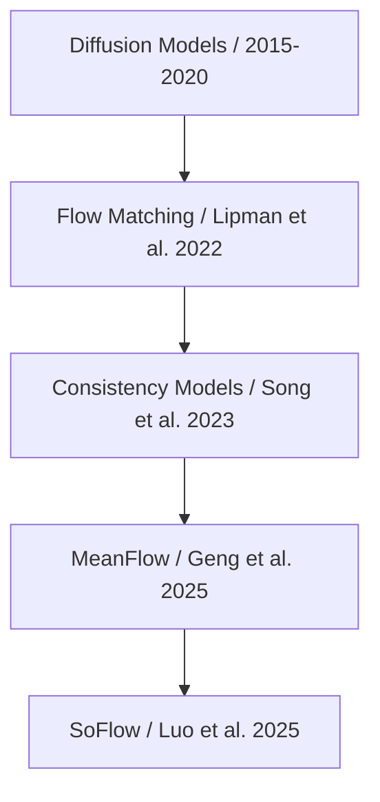

**日期**: 2025年12月22日

**編輯**: Manus AI

**摘要**: 本日報告深度解析了由Princeton大學研究團隊發表的最新論文《SoFlow: Solution Flow Models for One-Step Generative Modeling》。該研究提出了一種名為SoFlow的創新框架，旨在解決當前擴散模型和Flow Matching模型在生成效率上的瓶頸。SoFlow通過直接學習常微分方程（ODE）的解函數，實現了高質量圖像的「一步生成」，並在標準測試中顯著優於現有模型。此方法不僅提升了生成效率，還解決了訓練不穩定和計算複雜度高等關鍵挑戰，為實時生成應用開闢了新的可能性。

---

## 論文基本信息

- **論文標題**: SoFlow: Solution Flow Models for One-Step Generative Modeling [1]
- **作者**: Tianze Luo, Haotian Yuan, Zhuang Liu
- **研究單位**: Princeton University
- **發表日期**: 2025年12月17日
- **論文鏈接**: [https://arxiv.org/abs/2512.15657](https://arxiv.org/abs/2512.15657)
- **代碼實現**: [https://github.com/zlab-princeton/SoFlow](https://github.com/zlab-princeton/SoFlow)

---

## 核心貢獻與創新點

SoFlow模型的核心創新在於提出了一種全新的生成模型訓練與推理範式，旨在克服現有擴散（Diffusion）與流匹配（Flow Matching）模型依賴多步迭代採樣而導致的效率低下問題。其主要貢獻可歸納為以下幾點：

1.  **一步生成框架**：SoFlow是首個被證實能從零開始訓練、並實現高效一步（One-Step）生成的解決方案。它直接學習從噪聲到數據的映射解函數，而非傳統模型學習的去噪或速度場，從根本上簡化了生成過程。

2.  **創新的訓練目標**：論文提出了一套包含「流匹配損失」（Flow Matching Loss）和「解一致性損失」（Solution Consistency Loss）的組合訓練目標。前者確保模型能與流匹配框架兼容，並自然支持Classifier-Free Guidance（CFG）以提升圖像質量；後者則保證了模型在不同時間步之間預測的一致性。

3.  **訓練效率的顯著提升**：與近期其他追求少步生成的研究（如MeanFlow）不同，SoFlow的訓練過程完全避免了計算成本高昂且在主流深度學習框架（如PyTorch）中優化不佳的雅可比向量積（Jacobian-vector product, JVP）。這使得SoFlow的訓練過程更為高效和穩定。

4.  **卓越的性能表現**：實驗結果表明，在相同的模型架構（DiT）和訓練週期下，SoFlow在ImageNet 256x256數據集上的1-NFE（單次函數評估）FID分數全面優於作為基準的MeanFlow模型，性能提升幅度最高可達25.5%。

---

## 技術方法簡述

SoFlow的技術核心是其獨特的模型設計與訓練策略。傳統的流匹配模型學習的是一個速度場`v(x, t)`，生成樣本需要通過ODE求解器進行多步積分。SoFlow則另闢蹊徑，直接學習ODE的**解函數** `f(x_t, t, s)`，該函數能將任意時間點 `t` 的狀態 `x_t` 直接映射到另一時間點 `s` 的狀態 `x_s`。

為了有效訓練這個解函數，SoFlow設計了兩個關鍵的損失函數：

- **流匹配損失 (Flow Matching Loss)**：此損失函數使模型能夠估計速度場，從而與流匹配的理論基礎保持一致。更重要的是，這使得模型在訓練過程中就能利用Classifier-Free Guidance (CFG)，這對於提升生成樣本的多樣性和質量至關重要。

- **解一致性損失 (Solution Consistency Loss)**：這是SoFlow的關鍵創新之一。它通過在流動軌跡上選取三個時間點 `s < l < t`，強制模型對於從 `t` 到 `s` 的直接預測，應與先從 `t` 到 `l` 再從 `l` 到 `s` 的兩步預測結果保持一致。這種自洽性的約束確保了模型學習到的是一個穩定且可靠的解函數，同時巧妙地規避了對JVP的依賴。

通過這兩個損失函數的共同作用，SoFlow模型在訓練後能夠在僅需一步（即單次網絡前向傳播）的情況下，將一個從標準正態分佈中採樣的噪聲向量直接轉換為一張高質量的圖像。

---

## 實驗結果與性能指標

SoFlow在標準的圖像生成基準測試中取得了令人矚目的成績。論文在ImageNet 256x256數據集上，將SoFlow與其直接對標的SOTA模型MeanFlow進行了詳細比較。所有模型均使用相同的Diffusion Transformer (DiT)架構從頭訓練。

**ImageNet 256x256 1-NFE FID-50K 分數對比**

| 模型規模 | MeanFlow FID | SoFlow FID | 性能提升幅度 |
| :--- | :--- | :--- | :--- |
| B/2 (Base) | 6.17 | 4.85 | **21.4%** |
| M/2 (Medium) | 5.01 | 3.73 | **25.5%** |
| L/2 (Large) | 3.84 | 3.20 | **16.7%** |
| XL/2 (Extra Large) | 3.43 | 2.96 | **13.7%** |

> **FID (Fréchet Inception Distance)** 是一種廣泛用於評估生成模型質量的指標，分數越低代表生成圖像的質量和多樣性越接近真實圖像。

從上表可以看出，無論在哪種模型規模下，SoFlow的FID分數均顯著低於MeanFlow，證明其生成圖像的質量更高。這一結果充分說明，SoFlow所採用的直接學習解函數的策略，相比於MeanFlow學習平均速度場的方法，是更為有效和優越的一步生成方案。

---

## 相關研究背景

SoFlow的出現並非空中樓閣，而是建立在一系列前沿生成模型研究的基礎之上。理解其技術演進脈絡有助於把握該研究的核心定位與價值。

**技術演進脈絡**

1.  **擴散模型 (Diffusion Models)**：作為近年來生成領域的基石，擴散模型通過模擬數據加噪和去噪的過程生成高質量樣本，但其多步迭代採樣的特性導致生成速度緩慢，限制了其實時應用。

2.  **流匹配 (Flow Matching, FM)** [2]：由Yaron Lipman等人在2022年提出，它提供了一種更直接的訓練連續歸一化流（CNFs）的方法，通過回歸向量場來學習數據分佈之間的轉換。相比擴散模型，FM通常收斂更快，為後續的少步生成研究奠定了理論基礎。SoFlow正是建立在FM框架之上。

3.  **一致性模型 (Consistency Models, CMs)** [3]：由Yang Song（OpenAI）等人在2023年提出，旨在解決擴散模型的效率問題。CMs可以直接將噪聲映射到清晰的數據點，實現一步生成。然而，從頭開始訓練CMs時，穩定性和對CFG的利用成為主要挑戰。

4.  **MeanFlow** [4]：由Zhengyang Geng（師從Kaiming He）等人在2025年提出，引入了「平均速度」的概念來改進一步生成模型。它在當時達到了一步生成的SOTA性能，但也引入了對JVP計算的依賴，成為新的計算瓶頸。SoFlow在論文中將其作為主要的比較對象，並在各項指標上超越了它。

SoFlow巧妙地繼承了Flow Matching的理論框架，改進了Consistency Models的訓練穩定性問題，並通過創新的解一致性損失超越了MeanFlow的計算效率和生成質量，代表了當前一步生成模型研究的最新進展。

---

## 個人評價與意義

**學術價值**

SoFlow最大的學術貢獻在於為高效生成模型提供了一個全新的、更為優雅的理論範式——**直接學習ODE解函數**。這一思路不僅在理論上更為直接，也在實踐中被證明是有效的。它成功地繞開了困擾先前研究的JVP計算瓶頸，為後續研究指明了一條兼顧性能與效率的新路徑。論文作者團隊實力雄厚，通訊作者Zhuang Liu師從UC Berkeley的Trevor Darrell，曾在Meta AI (FAIR)任職，其高達近10萬的引用數也證明了其在學術界的影響力，這為本研究的可信度和前瞻性提供了有力背書。

**應用潛力**

一步生成技術的突破具有巨大的應用潛力。傳統擴散模型動輒數十步甚至上百步的採樣過程，使得在移動設備或實時交互系統中的部署變得極具挑戰。SoFlow將生成過程壓縮至單次網絡前向傳播，意味著：

- **實時圖像編輯與創作**：用戶可以像使用濾鏡一樣實時看到生成或編輯的效果。
- **交互式應用**：在遊戲、虛擬現實（VR）和增強現實（AR）等場景中，可以動態生成高質量的視覺內容。
- **降低算力門檻**：使得在資源受限的設備上運行高質量生成模型成為可能，極大地拓寬了AI生成技術的應用邊界。

**未來展望**

SoFlow的成功驗證了一步生成的可行性與巨大潛力。未來的研究可能會沿著以下方向進一步探索：

- **模型擴展**：將SoFlow框架應用於視頻、3D模型、音頻等其他模態的生成。
- **性能極致優化**：繼續探索如何在保持一步生成效率的同時，進一步提升生成圖像的分辨率和逼真度，挑戰多步模型的極限性能。
- **與大型語言模型結合**：探索如何將高效的生成器作為大型多模態模型的視覺「解碼器」，實現更快速、更可控的文生圖、文生視頻能力。

總體而言，SoFlow不僅是一次技術上的突破，更可能成為推動生成式AI從「可用」邁向「實用」和「普適」的關鍵里程碑。

---

## 參考文獻

[1] Luo, T., Yuan, H., & Liu, Z. (2025). *SoFlow: Solution Flow Models for One-Step Generative Modeling*. arXiv preprint arXiv:2512.15657.

[2] Lipman, Y., Chen, R. T. Q., Ben-Hamu, H., Nickel, M., & Le, T. (2022). *Flow Matching for Generative Modeling*. arXiv preprint arXiv:2210.02747.

[3] Song, Y., Dhariwal, P., Chen, M., & Sutskever, I. (2023). *Consistency Models*. In *International Conference on Machine Learning* (ICML).

[4] Geng, Z., Deng, M., Bai, X., Kolter, J. Z., & He, K. (2025). *Mean Flows for One-step Generative Modeling*. arXiv preprint arXiv:2505.13447.
