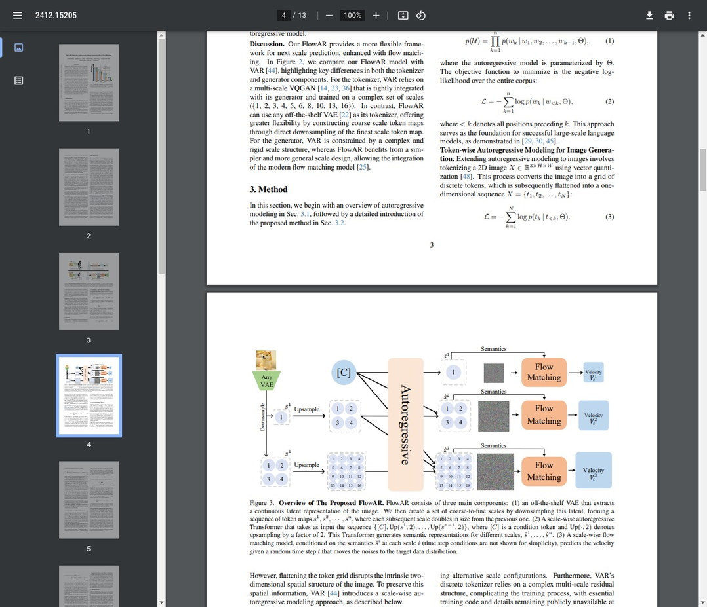

# AI Daily: FlowAR - 當尺度自回歸遇上流匹配，圖像生成的新篇章

> **論文標題**: FlowAR: Scale-wise Autoregressive Image Generation Meets Flow Matching
> **發表會議**: arXiv 2024
> **論文鏈接**: [https://arxiv.org/abs/2412.15205](https://arxiv.org/abs/2412.15205)
> **作者**: Sucheng Ren, Qihang Yu, Ju He, Xiaohui Shen, Alan Yuille, Liang-Chieh Chen
> **機構**: Johns Hopkins University, ByteDance

---

## 核心貢獻與創新點

FlowAR 是一篇旨在解決現有視覺自回歸模型（Visual Autoregressive, VAR）局限性的重要研究。VAR 模型雖然在圖像生成領域取得了巨大成功，但其複雜且僵化的尺度設計（scale design）以及對特定離散化分詞器（tokenizer）的依賴，限制了其泛化能力和模型設計的靈活性。FlowAR 針對這些痛點，提出了兩大核心創新：

1.  **簡化的尺度設計與解耦架構**：FlowAR 拋棄了 VAR 複雜的尺度序列，採用了簡單的「逐級翻倍」策略（例如 {1, 2, 4, 8, 16}）。這一設計不僅簡化了模型，更重要的是將生成器（Generator）與分詞器（Tokenizer）完全解耦。這意味著 FlowAR 可以靈活搭配任何現成的、性能更優的連續變分自編碼器（VAE），極大地增強了模型的模塊化和可擴展性。

2.  **融合流匹配（Flow Matching）**：FlowAR 首次將流匹配技術引入尺度自回歸（scale-wise autoregressive）框架。傳統的 AR 模型通常在離散的 token 空間中預測下一個 token，而 FlowAR 則利用流匹配在連續的潛在空間中直接學習從噪聲到目標圖像的變換路徑。這種結合使得模型能夠生成更高質量、更平滑的圖像細節。

3.  **空間自適應層歸一化（Spatial-adaLN）**：為了在不破壞圖像二維空間結構的前提下，將自回歸模型生成的語義信息有效地注入到流匹配模型中，FlowAR 提出了一種新穎的 **Spatially Adaptive Layer Normalization (Spatial-adaLN)** 機制。該機制能夠在保持空間位置信息的同時，實現高效的條件注入，確保了生成圖像的空間連貫性。

總體而言，FlowAR 通過簡化模型設計、融合前沿生成技術，不僅解決了 VAR 的核心瓶頸，更在 ImageNet-256 數據集上取得了 **1.65 的 FID 分數**，刷新了自回歸圖像生成領域的 SOTA 紀錄，為未來的大規模視覺生成模型提供了新的思路。

---

## 技術方法簡述

FlowAR 的核心思想是構建一個更通用、更靈活的「下一尺度預測」（next-scale prediction）框架。其整體架構主要由三個部分組成：

1.  **任意 VAE 分詞器 (Off-the-shelf VAE)**：首先，使用一個預訓練好的 VAE 將輸入圖像編碼為連續的潛在表示（latent representation）。然後，通過對該潛在表示進行不同比例的下採樣（downsampling），創建一個從粗到細的尺度序列（e.g., 16x16 -> 8x8 -> 4x4）。

2.  **尺度自回歸 Transformer (Scale-wise Autoregressive Transformer)**：一個 Transformer 模型按從粗到細的順序，依次處理每個尺度的潛在表示。在每個尺度 `i`，它會基於之前所有更粗尺度的信息，生成一個語義表示（semantics）$\hat{s}^i$。這個過程可以被形式化為：

    $$\hat{s}^i = T([C, Up(s^{i-1}, 2), ..., Up(s^1, 2^{i-1})]), \forall i=1, ..., n$$

    其中 `T` 是 Transformer，`C` 是類別條件，`Up` 是上採樣操作。

3.  **尺度流匹配模型 (Scale-wise Flow Matching Model)**：在每個尺度 `i`，流匹配模型接收自回歸 Transformer 生成的語義表示 $\hat{s}^i$ 作為條件，學習一個從標準正態分佈（噪聲）到該尺度真實潛在表示 $s^i$ 的確定性路徑。這個過程通過預測一個速度場（velocity field）$v_t$ 來實現：

    $$v_t = \frac{dF_t^i}{dt} = s^i - s_0^i$$

    其中 $F_t^i$ 是時間 $t$ 的插值潛在表示。訓練目標是最小化預測速度與真實速度之間的差異。

*圖 1: FlowAR 與其前身 VAR 在分詞器和生成器設計上的關鍵區別。FlowAR 的解耦設計允許其使用任意 VAE，並通過流匹配增強生成質量。*

#### 關鍵機制：Spatial-adaLN

為了將語義 $\hat{s}^i$ 高效地注入流匹配模型，FlowAR 設計了 Spatial-adaLN。它將語義信息轉換為縮放（scale）和偏移（shift）參數，並應用於流匹配模型內部 Transformer 塊的層歸一化（Layer Normalization）中，其數學表達式如下：

$$\alpha, \beta, \gamma = \text{MLP}(\hat{s}^i + t)$$

$$F_t' = \text{Attn}(\gamma_1 \odot \text{LN}(F_t) + \beta_1) \oplus \alpha_1$$

$$F_t'' = \text{MLP}(\gamma_2 \odot \text{LN}(F_t') + \beta_2) \oplus \alpha_2$$

這種方式使得條件信息能夠以保留空間結構的方式影響生成過程的每一步，從而提高了生成圖像的細節和連貫性。

*圖 2: FlowAR 的詳細工作流程，展示了自回歸預測與尺度流匹配如何協同工作。*

---

## 實驗結果與性能指標

FlowAR 在 ImageNet 256x256 圖像生成任務上進行了廣泛的實驗，並與當前主流的生成模型（包括 GAN、Diffusion Models 和其他自回歸模型）進行了比較。

*表 1: FlowAR 與其他 SOTA 模型在 ImageNet 上的性能對比。FlowAR-H 以 1.65 的 FID 刷新了紀錄。*

**主要發現**：

-   **性能卓越**：FlowAR 的大型版本 **FlowAR-H**（1.9B 參數）取得了 **FID 1.65** 的驚人成績，顯著優於之前的 SOTA 模型，如 LlamaGen-3B (FID 2.18) 和 DiT-XL (FID 2.27)。即使是較小的版本 **FlowAR-L**（380M 參數），其 FID (1.90) 也超過了比它大得多的 VAR-d30 (1.97)。

-   **靈活性和兼容性**：消融實驗證明，FlowAR 的簡化尺度設計和解耦架構使其能夠與多種不同的 VAE 分詞器（如 MAR-VAE 和 SD-VAE）無縫集成，並且始終能生成高質量的圖像，突顯了其設計的魯棒性和靈活性。

*圖 3: FlowAR 使用不同 VAE 分詞器生成的圖像樣本，展示了其強大的兼容性和高質量的生成效果。*

---

## 相關研究背景

FlowAR 的誕生建立在兩條重要的研究脈絡之上：

1.  **視覺自回歸模型 (VAR)**：由 Tian 等人在 NeurIPS 2024 的獲獎論文中提出的 VAR，開創性地將自回歸的「下一 token 預測」思想擴展為「下一尺度預測」，成功地將 Transformer 架構應用於保留圖像 2D 結構的生成任務中。FlowAR 直接繼承並改進了這一核心思想。

2.  **流匹配 (Flow Matching)**：作為一種新興的生成模型範式，流匹配通過學習數據點之間變換的確定性路徑（ODE），提供了一種比擴散模型更直接、採樣速度更快的生成方式。FlowAR 巧妙地將其整合進自回歸框架，利用其高質量的生成能力。

此外，FlowAR 的研究也與 **M-VAR**（解耦尺度自回歸模型）和 **VAR-CLIP**（結合 CLIP 的文本到圖像生成）等 VAR 的後續改進工作處於同一研究浪潮中，共同推動著自回歸視覺模型的發展邊界。

---

## 個人評價與意義

FlowAR 無疑是繼 VAR 之後，自回歸圖像生成領域的又一里程碑式的工作。它不僅僅是一次模型性能的提升，更重要的是，它為解決大規模生成模型設計中的核心矛盾——**複雜性與靈活性之間的權衡**——提供了一個優雅且有效的範例。

**其核心意義在於**：

-   **指明了「解耦」的設計方向**：通過將分詞器與生成器解耦，FlowAR 證明了模塊化設計的可行性與優越性。這使得未來的研究者可以獨立地優化模型的不同部分（例如，使用更強大的 VAE），從而加速整個領域的迭代速度。

-   **開創了「混合範式」的先河**：FlowAR 成功地將自回歸的序列建模能力與流匹配的連續生成能力結合起來，取長補短。這種混合模型（Hybrid Model）的思路極具啟發性，預示著未來生成模型可能會朝著更加多元和融合的方向發展。

-   **激發對生成過程的新思考**：FlowAR 的成功可能會激發研究者們重新思考，除了傳統的擴散模型和 GAN，是否存在其他更高效、更高質量的生成路徑。特別是對於追求高分辨率和長視頻生成的應用，FlowAR 所展示的效率和質量兼備的特性，使其成為一個極具潛力的研究方向。

總而言之，FlowAR 不僅是一個更強的模型，更是一種更聰明的設計哲學。它為我們揭示了在通往通用人工智能的道路上，如何通過巧妙的架構設計和技術融合，來駕馭日益複雜的模型，但潛力無限的生成模型。
