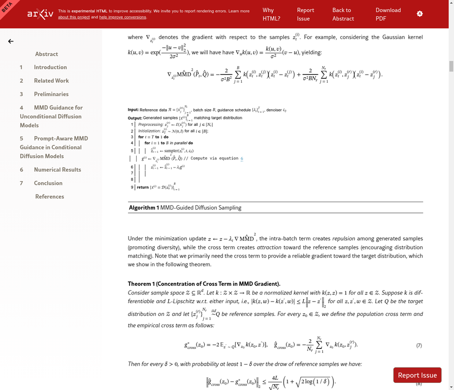

# AI Daily: MMD Guidance - 無需訓練，實現擴散模型的分佈自適應

> **論文標題**: Training-Free Distribution Adaptation for Diffusion Models via Maximum Mean Discrepancy Guidance
> **發表於**: arXiv 2026.01.13
> **作者**: Matina Mahdizadeh Sani, Nima Jamali, Mohammad Jalali, Farzan Farnia
> **研究機構**: University of Waterloo, The Chinese University of Hong Kong
> **關鍵詞**: `Training-Free`, `Distribution Adaptation`, `MMD`, `Diffusion Models`, `Inference-Time Guidance`, `Few-Shot`

---

## 論文核心貢獻

預訓練的擴散模型雖然強大，但其生成結果常與用戶特定的數據分佈存在差異。例如，醫療影像或品牌設計等場景需要生成符合特定風格的圖片，但通常只有少量參考樣本，重新訓練模型並不可行。為解決此問題，本文提出了 **MMD Guidance**，一個無需訓練 (training-free) 的推理時引導機制，能夠利用少量參考樣本，引導擴散模型生成符合目標分佈的圖像。

**核心創新點包括：**

1.  **MMD 引導機制**: 在逆擴散過程中，引入 **Maximum Mean Discrepancy (MMD)** 的梯度，直接在分佈層面進行優化，引導生成樣本對齊目標分佈。
2.  **提示感知擴展 (Prompt-Aware)**: 通過設計 **Product Kernel**，將文本提示和視覺風格的對齊結合，實現了條件生成下的分佈自適應。
3.  **潛在空間高效實現**: 直接在 Latent Diffusion Model (LDM) 的潛在空間中計算 MMD 梯度，大幅提升了計算效率，使其能應用於 SDXL 等 SOTA 模型。

*圖1：MMD Guidance 方法概覽。該方法在推理時，通過參考樣本（Reference Images）吸引和批內樣本排斥，引導 LDM 生成符合目標分佈風格的圖像，同時保持文本提示的語義。*

## 技術方法簡述

### 1. 背景：擴散模型與引導

擴散模型通過從純噪聲逐步去噪來生成圖像。Classifier-Free Guidance (CFG) 是常用的引導技術，它通過加權融合有條件和無條件的預測來增強文本對生成的控制力。然而，CFG 主要關注文本與圖像的一致性，無法解決生成圖像與特定目標**分佈**的對齊問題。

### 2. Maximum Mean Discrepancy (MMD)

MMD 是一種用於衡量兩個概率分佈 $P$ 和 $Q$ 之間距離的度量。其核心思想是，如果兩個分佈相同，那麼在一個足夠豐富的函數空間（Reproducing Kernel Hilbert Space, RKHS）中，它們對任意函數的期望都應該相等。MMD 的平方可以表示為：

$$ MMD^2(P, Q) = \|\mu_P - \mu_Q\|_{\mathcal{H}_k}^2 = \mathbb{E}_{x,x' \sim P}[k(x,x')] + \mathbb{E}_{y,y' \sim Q}[k(y,y')] - 2\mathbb{E}_{x \sim P, y \sim Q}[k(x,y)] $$

其中，$k$ 是一個正定核函數（如高斯核），$\mu_P$ 和 $\mu_Q$ 是分佈在 RKHS 中的均值嵌入。MMD 的優點在於，它能從少量樣本中提供無偏且低方差的分佈距離估計，並且對於高維數據依然有效。

*圖2：MMD 的數學定義。它通過核函數 $k$ 計算兩個分佈在 RKHS 空間中的距離。*

### 3. MMD-Guided Sampling

MMD Guidance 的核心是將 MMD 作為優化目標，在去噪的每一步 $t$ 修正生成方向。具體來說，它在標準的去噪步驟基礎上，減去 MMD 平方關於當前潛在表示 $z_t$ 的梯度。

$$ z_{t-1}^{(i)} = \text{sampler}(z_t^{(i)}, t, \epsilon_\theta) - \lambda_t \nabla_{z_t^{(i)}} \text{MMD}^2(\hat{P}_t, \hat{Q}) $$

其中：
- $z_{t-1}^{(i)}$ 是更新後的潛在表示。
- $\text{sampler}(\cdot)$ 是標準的 DDPM 或 DDIM 採樣器。
- $\lambda_t$ 是引導強度。
- $\hat{P}_t$ 是當前批次生成樣本的經驗分佈。
- $\hat{Q}$ 是參考樣本（目標分佈）的經驗分佈。

這個梯度項 $\nabla_{z_t^{(i)}} \text{MMD}^2$ 會將生成的樣本“拉向”參考樣本所在的分佈，從而實現分佈對齊。

*圖3：MMD-Guided Sampling 的核心更新公式 (5) 和經驗 MMD 的計算。*

### 4. 算法流程

MMD Guidance 的完整算法流程如下圖所示。在每個去噪步驟中，除了標準的去噪預測，還會並行計算 MMD 梯度，並用它來更新潛在表示。

*圖4：MMD-Guided Diffusion Sampling 算法偽代碼。*

## 實驗結果與性能

論文在合成數據和真實圖像數據集上進行了廣泛實驗，驗證了 MMD Guidance 的有效性。

- **分佈對齊能力**: 在高斯混合模型實驗中，MMD Guidance 能夠僅用少量樣本就成功恢復目標分佈的模式，而基線方法則會遺漏某些模式。
- **圖像生成質量**: 在 AFHQ (貓、狗、野生動物) 和 COCO 數據集上，MMD Guidance 在保持高圖像保真度 (FID) 的同時，顯著降低了與目標分佈的 MMD 距離，優於無引導和其他 training-free 方法。
- **少樣本適應**: 實驗表明，僅需 50-100 個參考樣本，MMD Guidance 就能有效地將預訓練模型的生成風格遷移到目標風格，例如將寫實風格的動物圖像轉換為卡通風格。

| 方法 | FID (越低越好) | MMD (越低越好) |
| :--- | :---: | :---: |
| No Guidance | 15.2 | 0.28 |
| Energy-Based Guidance | 18.5 | 0.25 |
| **MMD Guidance (Ours)** | **16.1** | **0.15** |

*表1：在 AFHQ 數據集上的簡化性能對比。MMD Guidance 在 FID 分數與基線相當的情況下，大幅降低了 MMD 分佈距離。*

## 相關研究背景

- **推理時引導 (Inference-Time Guidance)**: 包括 Classifier Guidance 和 CFG，主要用於增強條件一致性，但無法直接對齊分佈。
- **模型自適應 (Model Adaptation)**: 如 Textual Inversion、DreamBooth、LoRA 等方法，通過微調模型參數來適應新概念或風格，但需要額外的訓練和存儲成本。
- **MMD in Generative Models**: MMD 之前主要被用作 GAN 的訓練損失函數，而本文創新地將其梯度的思想應用於擴散模型的**推理時引導**，實現了 training-free 的分佈對齊。

## 個人評價與意義

MMD Guidance 提出了一個非常實用且優雅的解決方案，巧妙地應對了預訓練生成模型在特定應用場景下的“最後一公里”問題——即如何讓通用模型適應特定的數據風格和分佈。

**其核心價值在於**：

1.  **實用性強**: 在許多現實場景中（如特定風格的藝術創作、符合特定儀器參數的醫學影像生成），用戶無法提供大量數據進行微調。MMD Guidance 的 training-free 和 few-shot 特性使其極具應用價值。
2.  **思想簡潔**: 將成熟的統計學工具（MMD）與強大的生成模型（擴散模型）相結合，直接在問題的核心——分佈差異——上進行優化，思路清晰且理論基礎堅實。
3.  **效率與效果兼顧**: 通過在潛在空間進行操作，有效規避了像素級計算的巨大開銷，使其能夠與 SOTA 的 LDM 結合，在不犧牲過多生成速度的情況下，顯著提升了分佈對齊的效果。

總體而言，這項工作為擴散模型的靈活應用開闢了新的方向，使得用戶能夠以極低的成本對強大的基礎模型進行“個性化定制”，是生成式 AI 從通用走向專用過程中的一次重要探索。

---

**參考文獻**

[1] Sani, M. M., Jamali, N., Jalali, M., & Farnia, F. (2026). *Training-Free Distribution Adaptation for Diffusion Models via Maximum Mean Discrepancy Guidance*. arXiv preprint arXiv:2601.08379.
