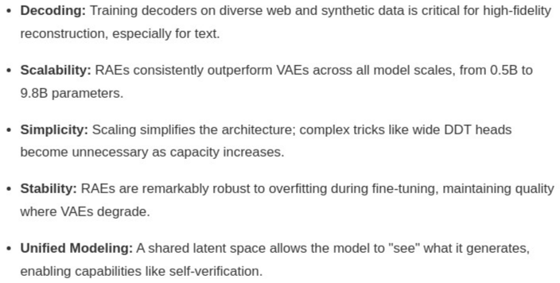

# AI Daily: RAE - 當擴散模型遇上自回歸，Yann LeCun帶隊挑戰VAE霸權

**發布日期:** 2026年1月27日

**標籤:** `Diffusion`, `Autoregressive`, `RAE`, `Scaling`, `T2I`, `Meta FAIR`, `NYU`

---

## 論文基本信息

| | |
| :--- | :--- |
| **標題** | Scaling Text-to-Image Diffusion Transformers with Representation Autoencoders [1] |
| **作者** | Shengbang Tong*, Boyang Zheng*, Ziteng Wang*, Bingda Tang, Nanye Ma, Ellis Brown, Jihan Yang, Rob Fergus, **Yann LeCun**, Saining Xie |
| **機構** | New York University (NYU), Meta FAIR |
| **發表** | arXiv, 2026年1月22日 |
| **資源** | [論文頁面](https://rae-dit.github.io/scale-rae/) / [論文PDF](https://arxiv.org/pdf/2601.16208.pdf) / [開源代碼](https://github.com/bytetriper/RAE) / [HuggingFace模型](https://huggingface.co/spaces/RAE-project/RAE) |

> *註：* 為共同第一作者。

## 核心貢獻

這篇由紐約大學與Meta FAIR合作，並由圖靈獎得主Yann LeCun參與的最新研究，旨在挑戰潛在擴散模型（Latent Diffusion Models）中長期由變分自編碼器（VAE）佔據的核心地位。研究團隊首次將**表示自編碼器（Representation Autoencoders, RAE）** 成功擴展到大規模文本到圖像（T2I）生成任務中，並證明RAE不僅在架構上更簡單，而且在收斂速度和生成質量上全面超越了傳統的VAE方法。

研究的核心亮點包括：

1.  **4倍速收斂**：RAE架構的擴散模型在訓練初期就展現出驚人的收斂速度，在GenEval和DPG-Bench兩大基準上，分別比基於VAE（FLUX）的模型快**4.0倍**和**4.6倍**，大幅縮短了模型訓練所需的計算資源和時間。

2.  **高維語義空間訓練**：與VAE將圖像壓縮到低維潛在空間不同，RAE直接在由預訓練視覺編碼器（如SigLIP-2）產生的**高維語義空間**中進行擴散學習。這種方法避免了VAE在壓縮過程中可能造成的信息損失，保留了更豐富的語義細節。

3.  **架構簡化與穩定性**：研究發現，隨著模型規模的擴大，RAE架構可以自然簡化，一些在小模型上必需的複雜技巧（如寬DDT頭）變得不再重要。此外，RAE在微調階段表現出卓越的**抗過擬合能力**，在VAE性能開始下降時仍能保持高質量輸出。

4.  **統一建模潛力**：由於RAE的生成和編碼過程共享同一個語義空間，模型能夠「看見」並理解自己生成的內容，為實現**自我驗證（self-verification）** 和更高級的統一多模態模型鋪平了道路。

*圖1：RAE（藍線）與VAE（橘線）在T2I預訓練中的收斂速度對比。RAE在GenEval和DPG-Bench上均表現出顯著的領先優勢。*

## 技術方法簡述

該研究的技術核心是構建一個圍繞RAE的T2I生成流程，完全取代傳統的VAE組件。整個流程分為兩個主要階段：

### 1. RAE解碼器訓練

此階段的目標是訓練一個能夠從高維語義表示中高保真地重建圖像的解碼器。

-   **凍結的編碼器**：研究採用了預訓練好的強大視覺編碼器，如**SigLIP-2**，將輸入圖像轉換為一系列高維度的語義tokens。
-   **解碼器架構**：解碼器採用ViT-based架構，學習將這些語義tokens逆向轉換為224x224分辨率的圖像。
-   **多元化的訓練數據**：為了確保解碼器不僅能處理自然圖像，還能精準重建文字等複雜細節，研究團隊使用了包含約7300萬張圖像的混合數據集，來源包括：
    -   **Web數據**：來自FuseDiT的大規模網絡圖像。
    -   **合成數據**：由FLUX.1-schnell等先進模型生成的合成圖像。
    -   **文本數據**：專門用於文本渲染的RenderedText數據集。

-   **複合訓練目標**：為了達到最佳重建效果，訓練目標函數結合了多種損失：

    $$ L(x, \hat{x}) = \ell_1(x, \hat{x}) + \omega_L \mathcal{L}_{\text{LPIPS}}(x, \hat{x}) + \omega_G \mathcal{L}_{\text{Gram}}(x, \hat{x}) + \omega_A \mathcal{L}_{\text{Adv}}(x, \hat{x}) $$

    其中，$x$是原始圖像，$\hat{x}$是重建圖像。該公式整合了像素級的L1損失、感知層面的LPIPS損失、風格層面的Gram損失以及用於提升真實感的對抗損失。

*圖2：不同數據集訓練下RAE解碼器的重建效果。可以看到，加入Web和文本數據後，對文字的重建質量得到顯著提升。*

### 2. RAE-DiT 統一訓練

在擁有一個強大的RAE解碼器後，研究團隊構建了一個端到端的T2I生成模型，稱為**RAE-DiT**。

-   **MetaQuery架構**：模型採用MetaQuery架構進行文本條件注入。一組可學習的**query tokens**與文本提示（prompt）一同被輸入到一個預訓練的語言模型（如Qwen-2.5）中。LLM輸出的query tokens表示隨後被一個MLP連接器投影，作為**Diffusion Transformer (DiT)** 的條件信號。
-   **Flow Matching目標**：與傳統的噪聲預測目標不同，DiT的訓練採用了更高效的**Flow Matching**目標。DiT學習的是一個直接將噪聲映射到高維語義表示的向量場，這也是其收斂速度更快的原因之一。
-   **統一的潛在空間**：最關鍵的是，DiT生成的高維語義表示與RAE編碼器產生的表示處於**同一個空間**。這意味著在推理時，DiT生成的特徵可以直接送入預訓練好的RAE解碼器，渲染成最終的圖像。這種設計不僅簡潔，也為後續的多模態理解與生成統一奠定了基礎。

## 實驗結果與分析

該研究進行了全面的實驗，系統性地驗證了RAE相對於VAE的優勢。

-   **跨尺度性能**：從0.5B到9.8B參數規模的模型，RAE在所有尺度上都穩定地優於VAE，證明了其卓越的可擴展性。
-   **數據組成的重要性**：實驗表明，解碼器的重建質量對訓練數據的組成極為敏感。僅用ImageNet訓練的解碼器無法很好地重建文本，必須引入專門的文本渲染數據集才能解決這一問題。
-   **不同編碼器的影響**：研究還比較了不同預訓練編碼器（如WebSSL-L和SigLIP-2）的效果，發現更強的視覺編碼器能帶來更好的重建性能，但即使使用稍弱的SigLIP-2，RAE的表現依然超越了廣泛使用的SDXL VAE。

| 模型家族 | 模型 | ImageNet ↓ | YFCC ↓ | Text ↓ |
| :--- | :--- | :--- | :--- | :--- |
| VAE | SDXL | 0.930 | 1.168 | 2.057 |
| | **FLUX** | **0.288** | **0.410** | **0.638** |
| RAE | WebSSL ViT-L | 0.388 | 0.558 | 1.372 |
| | SigLIP-2 ViT-So | 0.435 | 0.702 | 1.621 |

*表1：不同自編碼器在多個基準上的重建誤差（越低越好）。儘管RAE尚未超越最強的FLUX VAE，但已全面優於SDXL VAE。*

## 相關研究背景

這項工作建立在多個前沿領域的基礎之上，並對它們進行了巧妙的融合與革新。

-   **潛在擴散模型（Latent Diffusion Models）**：自Stable Diffusion以來，通過VAE將圖像壓縮到低維潛在空間已成為主流範式。然而，VAE本身的發展卻相對停滯。這篇論文直接挑戰了這一基礎，認為VAE是限制模型性能的瓶頸。
-   **表示自編碼器（RAE）**：RAE的概念在2025年10月的論文《Diffusion Transformers with Representation Autoencoders》[2]中被首次提出，當時主要在ImageNet上進行了驗證。本次工作是**首次將RAE成功應用於更複雜、規模更大的T2I生成任務**。
-   **Diffusion Transformers (DiT)**：DiT架構用Transformer取代了傳統的U-Net，被證明在擴展性上更具優勢。RAE-DiT沿用了這一強大架構。
-   **Flow Matching**：作為一種比傳統擴散目標更高效的訓練方法，Flow Matching允許模型學習從噪聲到數據的直接映射，是RAE-DiT實現快速收斂的關鍵技術之一。

## 個人評價與意義

`AI_Daily`認為，這篇論文不僅是一次成功的技術迭代，更可能是一次**範式轉移的開端**。它有力地論證了，潛在擴散模型的核心不一定非VAE不可。

**戰略意義**：
-   **打破VAE瓶頸**：長期以來，社區投入大量精力優化擴散主幹網絡，卻忽略了VAE這個「信息入口」可能帶來的限制。RAE的出現，為整個領域提供了一個全新的、可能更優的選擇。
-   **加速模型迭代**：訓練收斂速度提升4倍，意味著研究人員可以用同樣的資源進行4次實驗，或用1/4的成本完成一次訓練。這將極大地加速整個生成模型領域的創新迭代。
-   **通往統一模型的橋樑**：RAE構建的共享語義空間，讓生成模型和理解模型「說同種語言」。這對於開發能夠生成、理解、甚至編輯自身輸出的高級多模態智能體至關重要。Yann LeCun近年來一直倡導的「世界模型」概念，似乎在這項研究中找到了更堅實的落腳點。

**潛在影響**：
我們預計，未來幾個月內，社區將會湧現大量基於RAE的開源模型和微調工作。對於普通開發者和使用者而言，RAE帶來的訓練效率提升和生成質量改善，將使部署和定製先進的生成模型變得更加觸手可及。這場由RAE發起的「底層革命」，值得我們每一個人密切關注。

---

### 參考文獻

[1] Tong, S., Zheng, B., Wang, Z., et al. (2026). *Scaling Text-to-Image Diffusion Transformers with Representation Autoencoders*. arXiv:2601.16208.

[2] Zheng, B., Ma, N., Tong, S., & Xie, S. (2025). *Diffusion Transformers with Representation Autoencoders*. arXiv:2510.11690.
