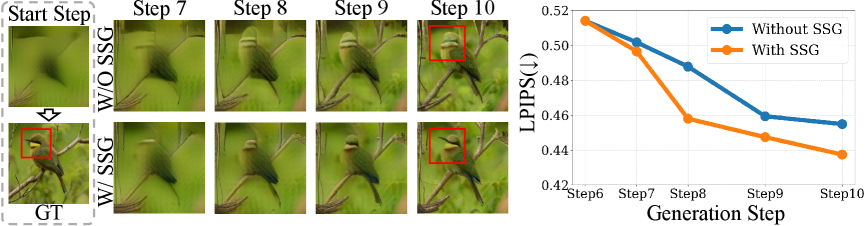
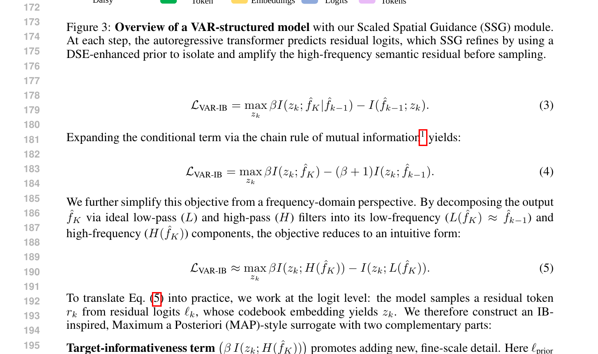
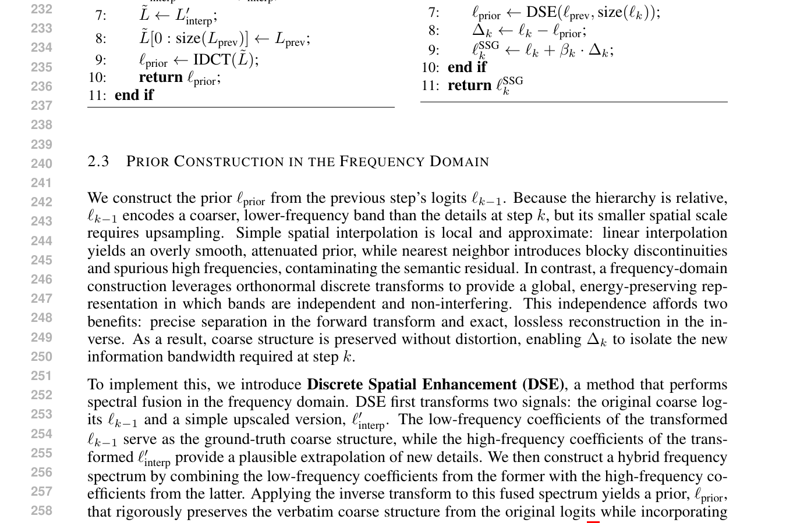
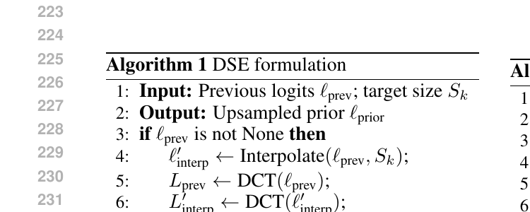
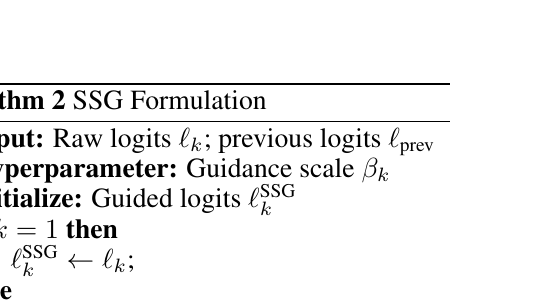
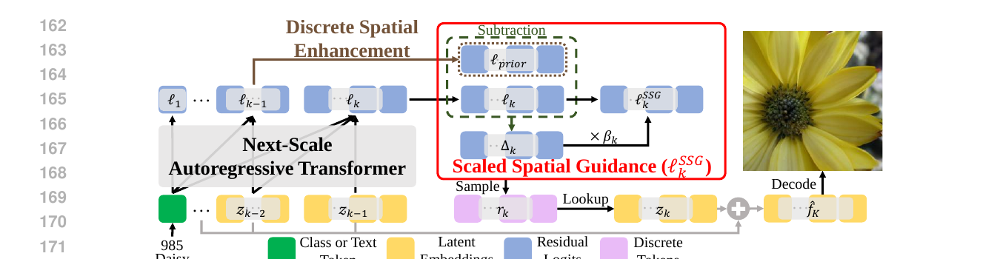

# AI Daily: SSG - 無需訓練，以縮放空間指導實現高效多尺度視覺自回歸生成 (v2)

**關鍵詞**: Training-Free, Visual Autoregressive (VAR), Inference-Time Guidance, Coarse-to-Fine, Frequency Domain, Discrete Cosine Transform (DCT)

## 論文基本資訊

| 項目 | 內容 |
| --- | --- |
| **論文標題** | SSG: Scaled Spatial Guidance for Multi-Scale Visual Autoregressive Generation |
| **作者** | Anonymous Authors |
| **發表會議** | ICLR 2026 (Under Review) |
| **論文連結** | [https://openreview.net/forum?id=S6oLw7VixT](https://openreview.net/forum?id=S6oLw7VixT) |

---

## 核心貢獻與創新點

視覺自回歸 (Visual Autoregressive, VAR) 模型透過「次尺度預測」(next-scale prediction) 的方式生成圖像，實現了從粗糙到精細 (coarse-to-fine) 的高效生成過程。然而，在實際推理過程中，由於模型容量限制和誤差累積，生成過程常會偏離這種理想的層次結構，導致細節失真。

為解決此問題，本論文提出了 **縮放空間指導 (Scaled Spatial Guidance, SSG)**，這是一種**無需訓練 (training-free)** 的推理時指導機制。SSG的核心思想是從資訊理論的角度出發，確保生成過程中的每一個尺度都能貢獻前序尺度未能捕捉到的**高頻內容**，從而校準訓練與推理之間的不一致性。

**主要創新點包括：**

1.  **無需訓練的推理時指導**: SSG 作為一個即插即用的模組，在不修改模型架構或重新訓練的情況下，顯著提升現有 VAR 模型的生成品質。
2.  **資訊理論基礎**: 首次將資訊瓶頸 (Information Bottleneck) 原理應用於分析並解決 VAR 模型的推理偏差問題，為指導機制的設計提供了堅實的理論基礎。
3.  **頻域先驗構建**: 提出了創新的**離散空間增強 (Discrete Spatial Enhancement, DSE)** 技術，在頻域中對先驗資訊進行處理，以更精確地分離和強化目標高頻語義殘差 (semantic residual)。
4.  **廣泛的適用性**: SSG 可廣泛應用於各種採用離散視覺 Token 的 VAR 模型，無論其 Tokenization 設計或條件模態為何，都展現出一致的性能提升。

*圖1: SSG 對圖像補全的影響 (VAR-d30)。上排為未使用 SSG 的基線模型，下排為使用 SSG 的結果。SSG 成功生成了鳥喙的高頻細節 (紅框處)，而基線模型則失敗了。右側圖表顯示 SSG 在整個生成過程中持續降低了 LPIPS 分數，表明生成品質更高。*

---

## 技術方法簡述

SSG 的方法論根植於對 VAR 模型生成過程的深刻理解，並巧妙地結合了資訊理論與頻域處理技術。

### 1. 基於資訊瓶頸的優化目標

作者將 VAR 的每一步採樣過程重新詮釋為一個變分優化問題。其核心思想是，每一步生成的新細節，都應該最大化與最終圖像的互信息，同時最小化與已知低頻結構的冗餘。

*圖2: 資訊瓶頸 (IB) 原理的目標函數。*

從頻域角度簡化後，這個優化目標可以直觀地理解為：

> **最大化關於高頻語義殘差 $H(f_K)$ 的信息，同時最小化與低頻先驗 $L(f_K)$ 的冗餘。**

*圖3: 從資訊瓶頸原理推導出的 SSG 核心數學公式。公式 (5) 直觀地展示了在頻域中最大化高頻信息、最小化低頻冗餘的目標。公式 (8) 給出了最終的指導 logits 計算方式。*

### 2. DSE 頻域處理技術深度解析

為了實現上述優化目標，關鍵在於如何準確定義和分離「高頻語義殘差」。為此，論文設計了 **DSE (Discrete Spatial Enhancement)** 模組。DSE 的目標是構建一個高質量的先驗 $\ell_{\text{prior}}$，它既能準確反映低頻的粗糙結構，又能合理推斷高頻細節。

*圖4: 論文 2.3 節對 DSE 技術的詳細闡述。*

DSE 的實現依賴於一種巧妙的**頻譜融合 (spectral fusion)** 技術，其背後的數學原理和實現步驟如下：

*圖5: Algorithm 1 - DSE 算法偽代碼。*

1.  **輸入**: DSE 接收兩個輸入：前一步的粗糙 logits $\ell_{\text{prev}}$ 和當前步的目標尺寸 $S_k$。

2.  **空間插值**: 首先，通過標準的空間插值方法（如雙線性插值）將粗糙的 $\ell_{\text{prev}}$ 上採樣到目標尺寸 $S_k$，得到一個初步的、平滑的先驗 $\ell'_{\text{interp}}$。這一步提供了對高頻細節的初步猜測，但可能會引入模糊和失真。

3.  **頻域變換**: 接下來，使用**離散餘弦變換 (DCT)** 將兩個 logits 張量轉換到頻域：
    -   將原始的粗糙 logits $\ell_{\text{prev}}$ 變換為其頻譜 $L_{\text{prev}} = \text{DCT}(\ell_{\text{prev}})$。
    -   將插值後的 logits $\ell'_{\text{interp}}$ 變換為其頻譜 $L'_{\text{interp}} = \text{DCT}(\ell'_{\text{interp}})$。

4.  **核心步驟：頻譜融合**: 這是 DSE 最關鍵的一步。算法創建一個新的混合頻譜 $L̃$，其融合規則是：
    -   **保留高頻**: 混合頻譜 $L̃$ 的高頻部分直接取自插值後 logits 的頻譜 $L'_{\text{interp}}$。這相當於採納了空間插值對「新細節」的合理推斷。
    -   **覆蓋低頻**: 混合頻譜 $L̃$ 的低頻部分，被強制用原始粗糙 logits 的頻譜 $L_{\text{prev}}$ 進行**覆蓋**。即 `L̃[0 : size(L_prev)] = L_prev`。

    **這一操作的數學意義在於**：它嚴格保證了最終生成的先驗 $\ell_{\text{prior}}$ 在低頻結構上與前一步的輸出 **完全一致** (verbatim coarse structure)，從而避免了誤差的累積和結構的漂移。同時，它又接納了對高頻部分的大膽猜測，為生成新細節提供了可能性。

5.  **逆變換**: 最後，對融合後的頻譜 $L̃$ 進行**逆離散餘弦變換 (IDCT)**，得到最終的增強先驗 $\ell_{\text{prior}} = \text{IDCT}(L̃)$。這個先驗既有堅實的低頻基礎，又有合理的高頻外推，為計算語義殘差提供了完美的參照物。

### 3. SSG 指導機制

有了高質量的先驗 $\ell_{\text{prior}}$，語義殘差 $\Delta_k$ 就被定義為當前原始 logits $\ell_k$ 與增強先驗 $\ell_{\text{prior}}$ 之間的差異：

$$\Delta_k = \ell_k - \ell_{\text{prior}}$$

最後，SSG 通過一個簡單的加權操作，將這個語義殘差加回到原始 logits 上，從而實現對採樣過程的指導：

$$\ell_k^{\text{SSG}} = \ell_k + \beta_k \cdot \Delta_k$$

其中 $\beta_k$ 是一個控制指導強度的超參數。整個過程被封裝在 SSG 的算法中。

*圖6: Algorithm 2 - SSG 算法偽代碼，展示瞭如何調用 DSE 並應用指導。*

*圖7: SSG 架構概覽圖。在每個自回歸步驟中，SSG (紅框部分) 利用 DSE 增強的先驗來計算語義殘差 $\Delta_k$，然後通過縮放因子 $\beta_k$ 將其應用於原始 logits，最終得到被指導的 logits $\ell_k^{\text{SSG}}$。*

---

## 個人評價與意義

在仔細研究了 DSE 的技術細節後，我對這項工作的評價更高了。它不僅僅是「在頻域做處理」，而是通過一種非常精巧的「高頻採納，低頻覆蓋」的頻譜融合策略，完美地平衡了「尊重歷史」與「探索未來」之間的關係。

-   **數學上的優雅**: DSE 的核心思想——在頻域中替換低頻分量——是一個非常優雅的解決方案。它直接在信息的根源（頻譜）上進行操作，確保了低頻結構的無損傳遞，這比在空間域進行複雜的加權或約束要簡潔和有效得多。

-   **實踐上的高效**: 由於 DCT 和 IDCT 都有非常高效的算法實現 (類似於 FFT)，DSE 引入的計算開銷極小。這使得 SSG 成為一個真正意義上的輕量級、即插即用的模組，具有極高的實用價值。

-   **思想上的啟發**: 這種在頻域中分離和重組信息的思想，對於所有涉及多尺度、層次化生成的任務都具有重要的啟發意義。它證明了，即使在無需額外訓練的情況下，僅通過對模型內部狀態的精細操作，也能極大地改善生成模型的行為和性能。

總而言之，SSG 通過其核心的 DSE 技術，為解決 VAR 模型中的訓練-推理不一致性問題提供了一個標杆式的解決方案。它不僅效果顯著，而且原理清晰、實現高效，是近期生成模型領域中非常值得關注的一項傑出工作。

---

## 參考文獻

[1] Tian, K., et al. (2024). *Visual Autoregressive Modeling: Scalable Image Generation via Next-Scale Prediction*. arXiv preprint arXiv:2404.02905.
