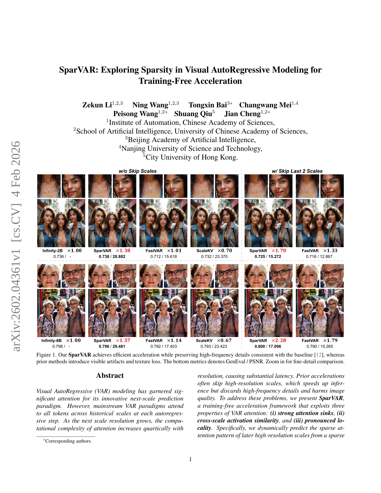
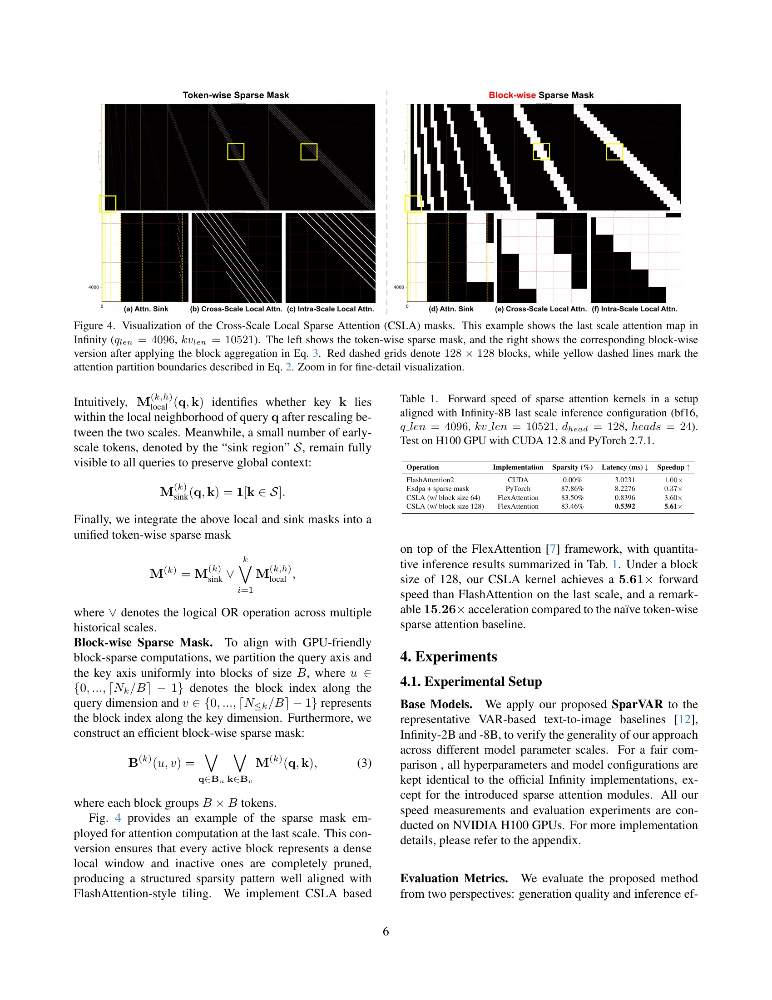

# AI Daily: SparVAR - 無需訓練，探索視覺自回歸模型中的稀疏性以實現高效加速

**作者**: KaiCobra
**日期**: 2026年02月06日

---

## 論文基本資訊

- **標題**: **SparVAR: Exploring Sparsity in Visual AutoRegressive Modeling for Training-Free Acceleration**
- **作者**: Zekun Li, Ning Wang, Tongxin Bai, Changwang Mei, Peisong Wang, Shuang Qiu, Jian Cheng
- **機構**: 中國科學院自動化研究所、中國科學院大學、北京人工智能學院、南京理工大學、香港城市大學
- **發表日期**: 2026年02月04日
- **來源**: arXiv:2602.04361 [cs.CV]
- **領域**: #VAR, #Training-Free, #Sparsity, #Acceleration, #Attention
- **代碼**: [https://github.com/CAS-CLab/SparVAR](https://github.com/CAS-CLab/SparVAR)

---

## 核心貢獻與創新點

視覺自回歸 (Visual Autoregressive, VAR) 模型因其創新的「下一尺度預測」(next-scale prediction) 範式而備受關注。然而，主流的VAR模型在每個自回歸步驟中，都需要關注 (attend to) 所有歷史尺度的詞元 (tokens)，導致其計算複雜度隨著圖像解析度的增長呈**四次方**關係 ($O(N^4)$)，這在生成高解析度圖像時會帶來巨大的延遲。

為了解決這個問題，來自中科院等機構的研究者們提出了 **SparVAR**，一個**無需訓練 (training-free)** 的VAR模型加速框架。該框架的核心思想是利用VAR模型注意力機制的內在稀疏性，在不犧牲高頻細節和圖像品質的前提下，大幅提升推理速度。

SparVAR的主要貢獻可以總結為以下幾點：

1.  **系統性地揭示了VAR模型的三大注意力稀疏特性**：
    *   **強注意力錨點 (Strong Attention Sinks)**：少數位於早期尺度的詞元會持續吸引大量的注意力權重，成為構建圖像全局結構的關鍵錨點。
    *   **跨尺度激活相似性 (Cross-Scale Activation Similarity)**：相鄰尺度間的注意力圖案 (attention patterns) 具有高度相似性，意味著高解析度尺度的注意力圖案可以由低解析度尺度的圖案預測而來。
    *   **顯著的空間局部性 (Pronounced Spatial Locality)**：隨著尺度增加，注意力越來越集中在空間上的局部鄰域內。

2.  **提出兩種即插即用的稀疏注意力模組**：
    *   **跨尺度自相似稀疏注意力 (Cross-Scale Self-Similar Sparse Attention, CS³A)**：通過在一個中間的「決策尺度」上計算一次稠密注意力，然後利用其稀疏模式，通過高效的索引映射機制 (index-mapping) 來構建後續所有高解析度尺度的稀疏注意力，從而避免了昂貴的重複計算。
    *   **跨尺度局部稀疏注意力 (Cross-Scale Local Sparse Attention, CSLA)**：利用空間局部性，為每個查詢詞元 (query token) 定義一個局部窗口，使其只關注鄰近的鍵值詞元 (key-value tokens)。

3.  **實現了高效的塊狀稀疏內核 (Block-wise Sparse Kernel)**：研究團隊為CSLA設計了一個高度優化的計算內核，其前向傳播速度比目前主流的FlashAttention還要快 **5倍以上**。

4.  **在加速效果和生成質量之間取得了卓越的平衡**：實驗證明，SparVAR能將一個8B參數的VAR模型生成1024x1024高解析度圖像的時間縮短到 **1秒以內**，且無需跳過任何尺度，與使用FlashAttention的基線模型相比，實現了 **1.57倍** 的加速，同時幾乎保留了所有的高頻細節。

---

## 技術方法簡述

SparVAR的成功基於對VAR模型中注意力行為的深刻洞察。研究者發現，與其在每個高解析度尺度上都執行完整的（稠密的）注意力計算，不如利用其內在的稀疏結構來大幅簡化計算。

*圖2：論文中展示的三種注意力稀疏特性。(a) 強注意力錨點 (b) 跨尺度激活相似性 (c) 顯著的空間局部性* 

### 1. 跨尺度自相似稀疏注意力 (CS³A)

CS³A的核心思想是「一次計算，多次復用」。它選擇一個中間尺度 $S$ 作為**稀疏決策尺度 (Sparse Decision Scale)**。在該尺度上，模型計算一次完整的稠密注意力，並從中提取出最重要的（top-k）注意力對應的索引。這些索引構成了一個稀疏模式。

對於所有後續的高解析度尺度 $k > S$，模型不再計算完整的注意力，而是通過一個簡單的線性映射，將尺度 $S$ 上的稀疏索引 `ind^(S)` 擴展到尺度 $k$ 上，得到 `ind^(k)`：

$$ \text{ind}^{(k)} = \lfloor \frac{N_k}{N_S} \times \text{ind}^{(S)} \rfloor $$

其中，$N_k$ 和 $N_S$ 分別是尺度 $k$ 和尺度 $S$ 的詞元數量。這樣，模型就可以在後續尺度上只對這些被「選中」的詞元對執行稀疏注意力計算，從而極大地降低了計算複雜度。

### 2. 跨尺度局部稀疏注意力 (CSLA)

CSLA則利用了注意力在高解析度尺度上表現出的**空間局部性**。對於一個在尺度 $k$ 上的查詢詞元 $q$，模型首先計算出它在空間網格中的坐標 $(x_q^{(k)}, y_q^{(k)})$。然後，將這個坐標映射到歷史尺度 $h$ 上，找到其對應的中心位置 $(\tilde{x}_q^{(k \to h)}, \tilde{y}_q^{(k \to h)})$：

$$ (\tilde{x}_q^{(k \to h)}, \tilde{y}_q^{(k \to h)}) = \left( \text{round}\left(\frac{x_q^{(k)}}{W_k} \cdot H_h\right), \text{round}\left(\frac{y_q^{(k)}}{W_k} \cdot W_h\right) \right) $$

接著，模型只允許詞元 $q$ 與歷史尺度 $h$ 上的一個以 $(\tilde{x}_q, \tilde{y}_q)$ 為中心、半徑為 $r_h$ 的局部窗口內的詞元進行注意力計算。這個過程可以通過一個局部稀疏掩碼 $M_{\text{local}}^{(k,h)}$ 來實現：

$$ M_{\text{local}}^{(k,h)}(q, k') = 1 \quad \text{if} \quad |\tilde{x}_q^{(k \to h)} - x_{k'}^{(h)}| \le r_h \text{ and } |\tilde{y}_q^{(k \to h)} - y_{k'}^{(h)}| \le r_h $$

為了將這種局部注意力計算實現到極致，研究者還開發了一個高效的**塊狀稀疏內核**，它將查詢和鍵值詞元劃分為塊 (blocks)，並只在對應的塊之間執行計算，完美適配現代GPU架構，實現了比FlashAttention更快的速度。

*圖4：論文中展示的CSLA掩碼。左側為傳統的詞元級稀疏掩碼，右側為SparVAR使用的更高效的塊狀稀疏掩碼。*

---

## 實驗結果與性能指標

SparVAR在多個層面都展現了其卓越的性能。

*表2：在1024x1024解析度生成任務上，SparVAR與其他加速方法的性能對比。*

從上表可以看出，在生成1024x1024解析度的圖像時：

- **w/o Skip Scales (不跳過任何尺度)**：SparVAR (Ours) 相比於基線模型 Infinity-2B，在幾乎不損失生成質量 (GenEval Score: 0.736 vs 0.738) 的情況下，將延遲從 1.38秒 降低到 0.88秒，實現了 **1.57倍** 的加速。
- **w/ Skip Last 2 Scales (跳過最後兩個尺度)**：當與現有的尺度跳過策略結合時，SparVAR的加速效果更加顯著。相比於FastVAR，SparVAR在生成質量更高 (GenEval Score: 0.891 vs 0.886) 的同時，延遲更低 (0.72s vs 0.97s)，達到了 **2.28倍** 的綜合加速。

這些結果充分證明，SparVAR不僅速度快，而且能夠很好地保留圖像的高頻細節，避免了以往加速方法帶來的質量下降問題。

---

## 相關研究背景

- **視覺自回歸模型 (VAR)**：作為繼擴散模型之後的一個新興研究方向，VAR通過多尺度、自回歸的方式生成圖像，代表性工作包括 VQGAN [12], Parti [41], VQ-VAE-2 [42] 等。它們在生成質量和可控性上展現了巨大潛力，但計算效率一直是其核心挑戰。
- **模型加速與稀疏注意力**：為了解決大型Transformer模型的計算瓶頸，學術界和工業界提出了多種加速方法。例如，**FlashAttention** [5] 通過IO感知的算法優化了標準注意力計算。而**稀疏注意力**則試圖從算法層面減少不必要的計算，例如 Block-wise Sparse Attention [6, 7, 38] 和一些無需訓練的動態稀疏方法，如 Chipmunk [39]。SparVAR 正是站在這些巨人的肩膀上，專門針對VAR模型的特性設計了更為精巧和高效的稀疏方案。

---

## 個人評價與意義

SparVAR是一項非常出色且實用的研究工作。它沒有滿足於簡單地將現有稀疏技術應用於VAR模型，而是通過深入的實證分析，精準地抓住了VAR模型注意力的核心特性，並以此為基礎設計了極具針對性的加速算法。這種「先觀察、後建模」的研究思路值得我們學習。

**這項工作的核心意義在於**：

1.  **為VAR模型的實用化鋪平了道路**：將高解析度圖像的生成時間推進到「秒級」，極大地降低了VAR模型的部署門檻，使其不再僅僅是學術界的「玩具」，而有了走向實際應用的可能。
2.  **提供了一種無需訓練的優化範式**：在當前動輒需要消耗巨大資源進行模型預訓練的背景下，SparVAR這種即插即用、無需訓練的優化方法顯得尤為可貴。它為優化現有的大型預訓練模型提供了一種低成本、高效率的解決方案。
3.  **對注意力機制的理解更進一步**：該研究揭示的「注意力錨點」、「跨尺度相似性」和「空間局部性」等特性，不僅對VAR模型有意義，也可能對其他基於Transformer的視覺任務（如檢測、分割）的優化提供了新的啟示。

總而言之，SparVAR通過精巧的算法設計，優雅地解決了VAR模型的核心效率問題，在學術創新和工程實用性上都取得了很高的成就，是近期圖像生成領域非常值得關注的一篇佳作。

---

**參考文獻**

[1] Li, Z., Wang, N., Bai, T., Mei, C., Wang, P., Qiu, S., & Cheng, J. (2026). *SparVAR: Exploring Sparsity in Visual AutoRegressive Modeling for Training-Free Acceleration*. arXiv preprint arXiv:2602.04361.
[5] Dao, T. (2022). *FlashAttention: Fast and Memory-Efficient Exact Attention with IO-Awareness*. arXiv preprint arXiv:2205.14135.
[12] Esser, P., Rombach, R., & Ommer, B. (2021). *Taming Transformers for High-Resolution Image Synthesis*. In Proceedings of the IEEE/CVF Conference on Computer Vision and Pattern Recognition (CVPR).
