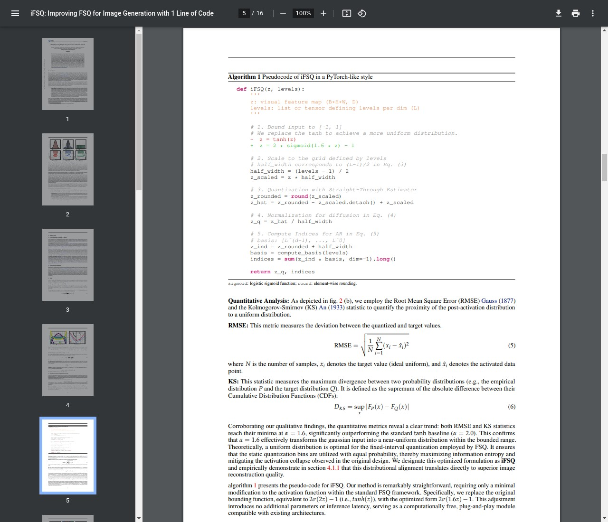
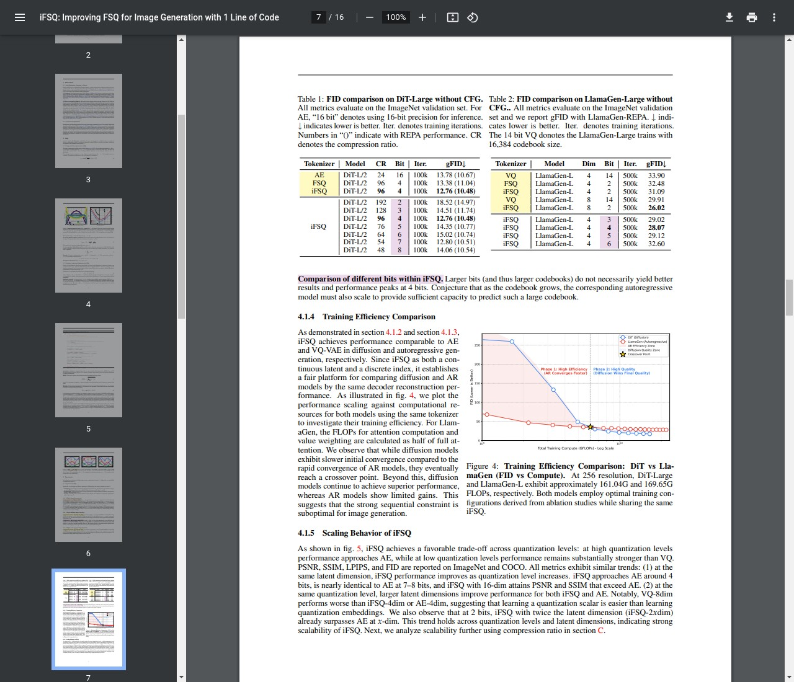

# AI Daily: iFSQ - 一行代碼統一AR與Diffusion，實現高效圖像生成

> 論文標題：iFSQ: Improving FSQ for Image Generation with 1 Line of Code
> 
> 發表單位：Peking University, Tencent Hunyuan
> 
> 論文連結：[https://arxiv.org/abs/2601.17124](https://arxiv.org/abs/2601.17124)
> 
> 開源代碼：[https://github.com/Tencent-Hunyuan/iFSQ](https://github.com/Tencent-Hunyuan/iFSQ)

## 核心貢獻：iFSQ如何解決Quantization難題

當前的圖像生成領域主要由兩大範式主導：**自回歸模型 (Autoregressive, AR)** 和 **擴散模型 (Diffusion Models)**。這兩種模型的核心差異在於其使用的視覺 tokenizer：AR 模型依賴如 VQ-VAE 的離散 token，而擴散模型則使用如 VAE 的連續 latent。這種根本性的分歧阻礙了統一模型的發展和公平的性能比較。

Finite Scalar Quantization (FSQ) 作為一種無需學習 codebook 的量化方法，理論上為統一這兩大範式提供了橋樑。然而，標準的 FSQ（vanilla FSQ）存在一個致命缺陷：其**等間隔量化 (equal-interval quantization)** 與神經網路激活值天然的**非均勻分佈（類高斯分佈）** 之間存在嚴重不匹配。這導致了所謂的「激活坍塌 (activation collapse)」，即大量激活值集中在少數幾個量化區間，使得大部分量化級別被浪費，從而不得不在**重建保真度 (reconstruction fidelity)** 和 **資訊效率 (information efficiency)** 之間做出痛苦的權衡。


*圖1：(a) Vanilla FSQ 的等間隔量化在處理類高斯分佈數據時，出現激活坍塌，利用率僅83.3%。(b) 強制等概率量化雖提升了利用率，但犧牲了保真度。(c) iFSQ 通過將輸入轉換為均勻分佈，完美實現了100%的利用率和最低的重建誤差。*

本文提出的 **iFSQ (improved FSQ)**，通過一個極其簡潔的修改，完美解決了這一難題。其核心思想是：**與其改變量化方式去適應數據，不如改變數據分佈來適應量化方式**。iFSQ 僅用一行代碼，將 FSQ 中原有的 `tanh` 激活函數替換為一個**分佈匹配映射函數**，將類高斯分佈的 latent space 轉換為均勻分佈，從而讓等間隔量化同時實現了等概率量化。這一改動在數學上保證了最佳的量化區間利用率和最高的重建精度。

## 技術方法簡述：從數學原理到一行代碼的實現

iFSQ 的實現極其優雅，其核心改動僅在於將 vanilla FSQ 中的激活函數進行替換。

原始 FSQ 使用 `tanh` 函數將輸入特徵 `z` 映射到 `[-1, 1]` 區間。然而，當輸入 `z` 服從類高斯分佈時，`tanh(z)` 的輸出會呈現一個非均勻的雙峰分佈。

iFSQ 則將其替換為以下函數：

```math
y = 2.0 \cdot \sigma(1.6x) - 1
```

其中 `σ` 是 Sigmoid 函數。作者通過實驗證明，當縮放係數 `α` 取 **1.6** 時，可以最優地將一個標準正態分佈轉換為一個在 `[-1, 1]` 區間內的均勻分佈。


*圖2：對激活函數中的超參數 α 進行的經驗性數值研究。無論是從概率密度（左圖）還是從與均勻分佈的誤差（RMSE & KS，右圖）來看，α=1.6 都是將類高斯分佈轉換為均勻分佈的最佳選擇。*

這一改動的偽代碼如下所示，凸顯了其「一行代碼」的簡潔性：


*圖3：iFSQ 的偽代碼實現。核心改動僅是將 `tanh(z)` 替換為 `2 * sigmoid(1.6 * z) - 1`。*

通過這個簡單的替換，iFSQ 構建了一個統一的 tokenizer，它既可以為擴散模型提供高質量的連續 latent `z_q`，也可以為 AR 模型提供高效率的離散索引 `indices`，從而為公平比較這兩大模型範式奠定了基礎。

## 實驗結果與分析

論文通過大量實驗，驗證了 iFSQ 的有效性，並基於此得出了一些關於生成模型的深刻洞見。


*圖4：iFSQ 在擴散模型（DiT，左表）和自回歸模型（LlamaGen，右表）上的性能比較。iFSQ 在不同設置下均表現出色。*

**關鍵實驗發現：**

1.  **iFSQ 全面優於 FSQ 和 VQ**：無論是在擴散模型（DiT）還是自回歸模型（LlamaGen）上，使用 iFSQ 作為 tokenizer 的性能均顯著優於使用 vanilla FSQ 或傳統 VQ 的模型。例如，在 DiT 上，iFSQ 在實現 3 倍壓縮率的同時，取得了比 AE（AutoEncoder）更好的生成質量（gFID 12.76 vs 13.78）。

2.  **4-bit 是最佳平衡點**：實驗表明，對於圖像生成任務，每個維度 4-bit 的量化精度是一個「甜點位 (sweet spot)」。低於 4-bit，資訊損失較大，影響生成質量；而高於 4-bit，性能提升不再顯著。這為未來生成模型的架構設計提供了重要的指導。

3.  **AR vs. Diffusion 的公平對決**：在 iFSQ 這一公平的基準下，論文比較了 AR 模型和擴散模型的訓練效率。結果顯示，AR 模型在訓練初期收斂速度更快，但擴散模型最終能達到更高的性能上限。這有力地證明了，AR 模型嚴格的序列生成順序（sequential inductive bias）可能限制了其圖像生成質量的天花板。

## 個人評價與意義

`iFSQ` 是一篇構思巧妙、實驗紮實、結論深刻的優秀作品。它不僅解決了 FSQ 在生成模型應用中的核心痛點，更重要的是，它為我們提供了一個統一且公平的視角來重新審視和比較自回歸與擴散這兩大主流生成範式。

**其核心意義在於：**

*   **大道至簡**：僅用一行代碼的修改，就解決了困擾 FSQ 的「激活坍塌」問題，實現了理論上最優的效率和保真度，充分體現了科學研究的優雅與深刻。

*   **建立公平基準**：iFSQ 作為一個統一的 tokenizer，使得在相同的重建約束下公平比較 AR 和擴散模型成為可能。論文得出的「AR 收斂快，Diffusion 上限高」的結論，對整個生成模型領域的未來發展具有重要的指導意義。

*   **激發新思路**：論文提出的「改變數據分佈以適應處理方式」的思路，以及對量化 bit 數的深入分析，都可能激發後續在模型架構、訓練策略和效率優化方面的新研究。

總而言之，iFSQ 的工作不僅是一個簡單的技術改進，它更像一把鑰匙，打開了通往統一生成模型的新大門，其簡潔而深刻的洞見必將對 AI 圖像生成領域產生深遠的影響。

## 參考文獻

[1] Lin, B., Li, Z., Niu, Y., Gong, K., Ge, Y., Lin, Y., ... & Yuan, L. (2026). iFSQ: Improving FSQ for Image Generation with 1 Line of Code. arXiv preprint arXiv:2601.17124.
