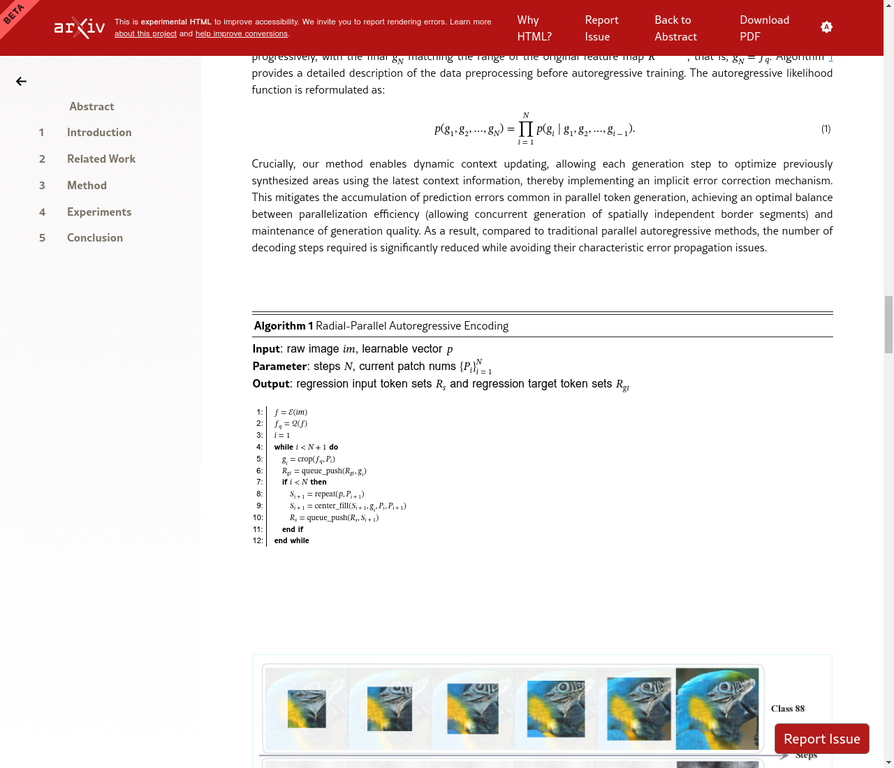
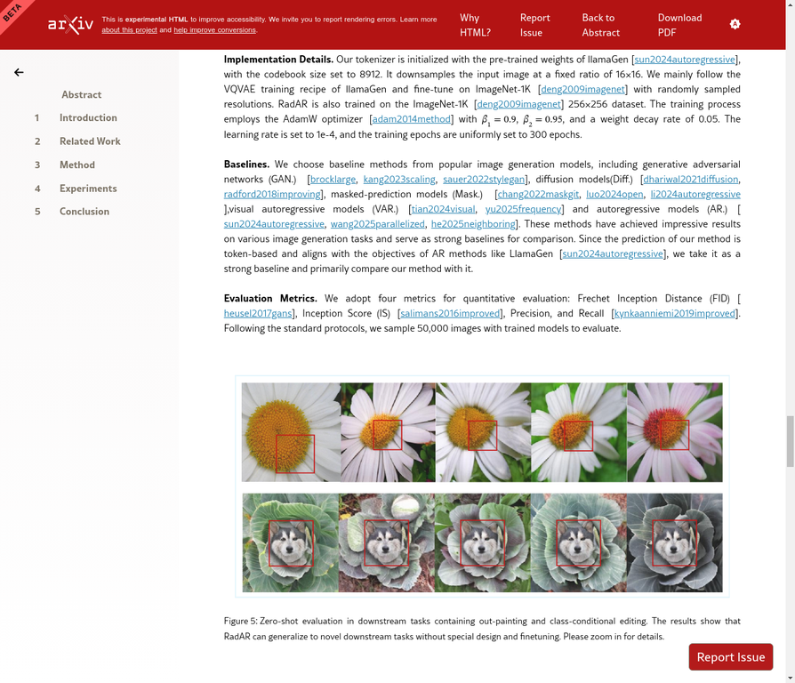

# AI Daily: RadAR - 從序列到空間，重排序自回歸實現高效視覺生成

> **論文名稱**：From Sequential to Spatial: Reordering Autoregression for Efficient Visual Generation
> **發表日期**：2025年12月31日
> **研究機構**：中國科學技術大學、華為諾亞方舟實驗室
> **論文連結**：[https://arxiv.org/abs/2512.24639](https://arxiv.org/abs/2512.24639)

---

## 總結

傳統的自回歸（Autoregressive, AR）模型在視覺生成領域取得了巨大成功，但其逐個token生成的序列化方式嚴重限制了推理速度。為了解決這個瓶頸，來自華為諾亞方舟實驗室和中國科學技術大學的研究團隊提出了 **RadAR**，一個高效且可並行化的自回歸視覺生成框架。RadAR的核心思想是將生成順序從傳統的「光柵掃描」重塑為「徑向並行」，在保持強大表征能力的同時，將ImageNet上的生成速度提升了高達 **5.6倍**，並將推理步數從256步銳減至僅13步，同時展現出卓越的Zero-Shot泛化能力。

| 論文基本資訊 | |
|---|---|
| **論文標題** | From Sequential to Spatial: Reordering Autoregression for Efficient Visual Generation |
| **作者** | Siyang Wang, Hanting Li, Wei Li, Jie Hu, Xinghao Chen, Feng Zhao |
| **研究機構** | University of Science and Technology of China, Huawei Noah’s Ark Lab |
| **發表日期** | 2025年12月31日 |
| **arXiv ID** | 2512.24639v1 |

---

## 核心貢獻與創新點

RadAR的主要貢獻在於提出了一種全新的自回歸生成範式，有效解決了效率與質量之間的權衡問題。

1.  **徑向並行生成框架 (Radial Parallel Generation)**：傳統AR模型遵循光柵掃描順序（從上到下，從左到右），這與圖像內容的二維空間局部性不符。RadAR打破了這一常規，提出以一個初始token為中心，將其他token按空間距離劃分為多個同心環。生成過程從內環向外環逐層推進，同一環內的所有token可以並行預測，從而極大地提升了並行度。

2.  **嵌套注意力機制 (Nested Attention Mechanism)**：並行生成可能導致上下文信息不足，從而產生不一致的預測。為此，RadAR引入了嵌套注意力機制，在前向傳播過程中動態修正不合理的輸出。該機制能夠有效抑制錯誤累積，防止模型在生成過程中崩潰，確保了高質量的輸出。

3.  **保持與多模態系統的兼容性**：與同樣追求效率的視覺自回歸模型（VAR）不同，VAR採用了多尺度token表示，這使其難以與基於扁平token表示（如CLIP、DINO）的現有視覺大模型兼容。RadAR通過改變生成順序而非token表示結構來提升效率，完美地保持了與主流多模態系統的互操作性。

*圖1：RadAR-XL生成的樣本，展示了其在不同寬高比和Zero-Shot圖像編輯任務（如類別條件編輯和外繪製）中的出色能力。*

---

## 技術方法簡述

RadAR的實現巧妙地結合了徑向生成順序和精細的注意力控制。

### 徑向並行自回歸建模

RadAR的生成過程可以看作是從一個中心點向外“畫圓”的過程。如圖3所示，模型從一個初始token開始，逐步向外擴展生成區域。在每一步（每一環），模型會並行預測位於同一同心環上的所有token。這種設計不僅符合圖像內容的空間局部性，還將原本需要 N×N 步的生成過程，壓縮為與半徑相關的少量步數。

*圖3：RadAR的徑向並行生成框架圖。(a)展示了模型如何從已生成的區域 O(k-1) 擴展到新的區域 Ik。(b)展示了嵌套注意力掩碼，區分了用於內容生成的藍色區域和用於錯誤修正的綠色區域。*

### 嵌套注意力機制

為了確保並行生成的一致性，RadAR設計了精巧的注意力掩碼。在生成第k環時：
- **內容生成**：新擴展區域（藍色）的token可以關注所有先前已生成環（綠色）的上下文信息，以生成新的內容。
- **錯誤修正**：已生成區域（綠色）的token則被限制，無法訪問新擴展區域的信息，其註意力集中在內部，用於修正先前步驟中可能出現的錯誤。

這種機制通過區分“生成”和“修正”兩種目的，有效地平衡了並行性與生成質量。

*圖4：RadAR的算法偽代碼，描述了徑向並行編碼的詳細過程。*

---

## 實驗結果與性能指標

RadAR在標準的ImageNet 256x256數據集上進行了廣泛評估，結果令人印象深刻。

*圖5：RadAR與其他主流生成模型在ImageNet上的性能對比。*

從上表可以看出：
- **效率與性能的雙重勝利**：RadAR (610M參數) 在僅用13步的情況下，取得了 **2.97** 的FID分數，超越了需要256步的LlamaGen-XL (FID 3.39)，並逼近了需要250步的頂級擴散模型DiT-XL/2 (FID 2.27)。
- **超越同類並行方法**：與其他並行AR方法（如PAR、NAR）相比，RadAR在更少的推理步數下實現了更優的FID分數，證明了其徑向生成策略的優越性。
- **參數效率**：在相似參數規模下（例如RadAR 310M vs. LlamaGen-L 343M），RadAR僅用13步就遠超後者256步的性能。

### Zero-Shot 泛化能力

RadAR不僅生成質量高，還展示了強大的Zero-Shot泛化能力，無需任何額外微調即可完成複雜的下游任務。

*圖6：RadAR在Zero-Shot下游任務中的表現，包括外繪製（out-painting）和類別條件編輯（class-conditional editing）。*

---

## 相關研究背景

自回歸模型在視覺生成領域的發展經歷了從像素級到token級的演變。雖然VQ-VAE等技術將圖像離散化為token，提升了效率，但傳統的AR模型仍然受限於其序列化的生成方式。為了解決這一問題，研究界主要探索了兩條路徑：

1.  **並行解碼**：如MaskGIT和PAR，通過在多個位置同時預測token來加速生成，但在質量和效率之間仍需權衡。
2.  **多尺度表示**：如VAR，通過引入層級化的token表示大幅減少生成步數，但其獨特的架構使其難以與主流的視覺編碼器（如CLIP）兼容，限制了其在多模態場景下的應用。

RadAR巧妙地避開了這兩條路徑的缺陷，通過**重排序生成過程**這一新穎視角，既實現了高效的並行解碼，又保持了與現有生態系統的完全兼容。

---

## 個人評價與意義

RadAR的提出為自回歸視覺生成領域帶來了一股清新的空氣。它不僅僅是一次模型結構的優化，更是對生成過程本身的一次深刻反思。其核心貢獻在於揭示了**生成順序**是影響效率和質量的關鍵因素，並通過優雅的徑向設計給出了一個高效的解決方案。

在我看來，RadAR最重要的意義在於其**卓越的兼容性**。在當前大模型生態日益強調互操作性的背景下，一個既高效又能無縫融入現有多模態框架的生成模型，其價值遠超單純的性能指標提升。這使得RadAR不僅是一個優秀的圖像生成器，更有潛力成為未來統一多模態大模型中的一個關鍵組件。

總而言之，RadAR通過一個看似簡單卻極其聰明的“重排序”思想，成功地在生成速度、質量和系統兼容性這三個核心指標上取得了平衡，為自回歸模型在視覺生成領域的未來發展指明了一個極具潛力的方向。

---

### 參考文獻
[1] Siyang Wang, Hanting Li, Wei Li, Jie Hu, Xinghao Chen, & Feng Zhao. (2025). From Sequential to Spatial: Reordering Autoregression for Efficient Visual Generation. *arXiv preprint arXiv:2512.24639*.
