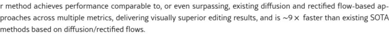

# AI Daily: AREdit - 無需訓練的VAR圖像編輯新篇章

**論文標題**: Training-Free Text-Guided Image Editing with Visual Autoregressive Model

**作者**: Yufei Wang, Lanqing Guo, Zhihao Li, Jiaxing Huang, Pichao Wang, Bihan Wen, Jian Wang

**機構**: Snap Research, Nanyang Technological University, UT Austin

**發表時間**: 2025年3月31日

**arXiv編號**: [2503.23897](https://arxiv.org/abs/2503.23897)

**代碼**: [https://github.com/wyf0912/AREdit](https://github.com/wyf0912/AREdit)

---

## 核心貢獻與創新點

AREdit是首個基於視覺自回歸模型（VAR）的**無需訓練（Training-Free）**的文字引導圖像編輯框架。它巧妙地繞過了當前主流擴散模型（Diffusion Models）和校正流（Rectified Flows）所依賴的**反演（Inversion）**過程，從而根本上解決了因反演不準確導致的錯誤傳播和保真度下降問題。相較於現有的SOTA方法，AREdit在實現高保真度、精確局部編輯的同時，推理速度提升了約**9倍**，一張1K解析度的圖片編輯最快僅需**1.2秒**。

其核心創新包含三大技術：

1.  **隨機性緩存機制（Randomness Caching）**: 不同於擴散模型需要從噪聲中反演出初始結構，AREdit通過一次前向傳播，直接緩存原始圖像的token索引和概率分佈，為後續編輯提供精確的「隨機性」指導。

2.  **自適應細粒度蒙版（Adaptive Fine-grained Masking）**: 通過計算原始提示詞和目標提示詞在token概率分佈上的差異，動態生成高精度的編輯區域蒙版，確保「指哪改哪」，避免對無關區域的意外修改。

3.  **權杖重組方法（Token Re-assembling）**: 在生成編輯內容時，巧妙地重用原始圖像的低頻特徵，同時在高頻細節上根據新提示詞進行採樣，從而兼顧了全局結構的一致性和局部編輯的靈活性與多樣性。

*圖1: AREdit能夠靈活處理多種編輯任務，包括物體增減、屬性修改和風格轉換，同時完美保留背景細節。*

---

## 技術方法簡述

AREdit建立在最新的視覺自回歸模型Infinity-2B之上。VAR模型將圖像生成視為一個序列預測問題，包含一個**視覺權杖化器（Visual Tokenizer）**和一個**Transformer**模型。

### VAR基礎模型

1.  **視覺權杖化器**: 將輸入圖像`I`編碼成一個多尺度的離散殘差圖序列 `(R₁, R₂, ..., Rₖ)`。這個過程是層層遞進的，每一層的殘差圖都包含了比前一層更豐富的細節。整個圖像的特徵可以表示為所有殘差圖的總和：

    $$ F_I = \sum_{k=1}^{K} \text{up}(R_k(h, w)) $$

    其中 `up(·)` 表示上採樣操作。

2.  **Transformer**: 接著，一個自回歸的Transformer模型會根據之前的殘差圖和文字提示 `t` 來預測下一個尺度的殘差圖 `Rₖ`：

    $$ p(R_1, ..., R_K | \Psi(t)) = \prod_{k=1}^{K} p(R_k | R_1, ..., R_{k-1}, \Psi(t)) $$

    

### AREdit核心機制

AREdit的核心思想是**繞過反演，直接利用和操控VAR模型內部的隨機性**。

*圖2: AREdit整體框架圖。*

1.  **隨機性緩存 (Randomness Caching)**

    在編輯前，AREdit對原始圖像和提示詞進行一次前向傳播，並將每一層預測的概率分佈 `P_cache` 和最終採樣的token `R_cache` 緩存下來。這一步取代了擴散模型中耗時且易出錯的DDIM反演過程。

2.  **自適應蒙版與權杖重組 (Adaptive Masking & Token Re-assembling)**

    在編輯時，模型以前`γ`層的緩存`R_cache`作為基礎（保留低頻結構），在`γ`層之後，執行以下操作：

    *   根據**目標提示詞** `t_tgt` 預測新的概率分佈 `P_tgt`。
    *   計算 `P_cache` 和 `P_tgt` 之間的**KL散度**，生成自適應蒙版 `M`。這個蒙版精確地標示出需要修改的區域。
    *   最後，通過蒙版 `M` 將緩存的token `R_cache` 和新採樣的token `R_tgt` 進行融合，生成最終的編輯結果。

    $$ R_k^{\text{final}} = M_k \odot R_k^{\text{tgt}} + (1 - M_k) \odot R_k^{\text{cache}} $$

    這種設計確保了只有語義發生變化的區域會被重新生成，而其他區域則完美保留原始信息。

---

## 實驗結果與性能指標

AREdit在多項指標上都取得了與現有頂級方法相當甚至超越的性能，尤其在**背景保持度**上表現突出。

*表1: 定量比較顯示AREdit在多項指標上優於或持平於基於擴散和流模型的SOTA方法。*

| 方法 | 基礎模型 | 結構距離↓ | PSNR↑ | SSIM↑ | LPIPS↓ | CLIP相似度 (整體/編輯區)↑ |
| :--- | :--- | :--- | :--- | :--- | :--- | :--- |
| Prompt2Prompt | Diffusion | 0.0694 | 17.87 | 0.7114 | 0.2088 | 25.01 / 22.44 |
| Pix2Pix-Zero | Diffusion | 0.0617 | 20.44 | 0.7467 | 0.0722 | 22.80 / 20.54 |
| MasaCtrl | Diffusion | 0.0284 | 22.17 | 0.7967 | 0.1066 | 23.96 / 21.16 |
| PnP | Diffusion | 0.0282 | 22.28 | 0.7905 | 0.1134 | 25.41 / 22.55 |
| PnP-Diffusion | Diffusion | 0.0243 | 22.46 | 0.7968 | 0.1061 | 25.41 / 22.62 |
| LEDits++ | Diffusion | 0.0431 | 19.64 | 0.7767 | 0.1334 | 26.42 / 23.37 |
| RF-Inversion | Flow | 0.0406 | 20.82 | 0.7192 | 0.1900 | 25.20 / 22.11 |
| **Ours (AREdit)** | **VAR** | **0.0305** | **24.19** | **0.8370** | **0.0870** | **25.42 / 22.77** |

**關鍵結論**:
- **高保真度**: 在PSNR、SSIM和LPIPS指標上顯著優於其他方法，證明其在保持未編輯區域方面做得非常出色。
- **高效率**: 推理速度極快，比基於擴散模型的方法快了近一個數量級。
- **高質量**: 在CLIP相似度上與其他方法持平，表明其編輯質量和文本對齊度同樣優秀。

---

## 相關研究背景

文字引導的圖像編輯長期以來是生成AI領域的熱點。早期方法依賴GAN Inversion，但效果和泛化性有限。近期，隨著擴散模型的興起，基於DDIM Inversion的方法（如Prompt-to-Prompt, MasaCtrl, PnP-Diffusion）成為主流。這些方法通過反演得到噪聲圖，再結合注意力機制或特徵注入來引導編輯。然而，它們普遍面臨**反演不準確**和**語義洩漏**（編輯區域影響全局）的挑戰。Rectified Flow等新範式試圖通過更直接的路徑來解決反演問題，但效率和精度仍有待提升。

AREdit的出現，標誌著圖像編輯領域開始探索**非擴散模型**的路徑。它借鑒了VAR模型在圖像生成上的強大能力，並創新性地提出了“緩存-掩碼-重組”的編輯流程，為高效、高保真的圖像編輯開闢了全新的可能性。

---

## 個人評價與意義

AREdit無疑是2025年圖像生成和編輯領域的一項**突破性進展**。它不僅在技術上提出了一個優雅且高效的解決方案，更重要的是，它挑戰了當前以擴散模型為核心的技術路徑，展示了VAR模型在精細化、可控生成任務上的巨大潛力。

**核心意義**: 

1.  **效率革命**: 對於追求實時交互和大規模應用的場景，AREdit的超高效率使其具備了其他方法難以比擬的優勢。
2.  **擺脫反演依賴**: 證明了無需複雜的反演過程，同樣可以實現高質量的結構保持和內容編輯，這可能會啟發更多繞開反演的生成模型研究。
3.  **激發VAR潛力**: 此前VAR模型更多被用於純粹的圖像生成，AREdit則成功地將其應用於複雜的編輯任務，為VAR模型的後續發展（如可控影片生成、3D生成等）提供了寶貴的思路。

總而言之，AREdit不僅是一個性能卓越的工具，更是一篇充滿啟發性的論文，它為我們思考下一代生成模型提供了新的視角，特別是在追求**速度、控制和保真度**的平衡上，邁出了堅實的一步。
