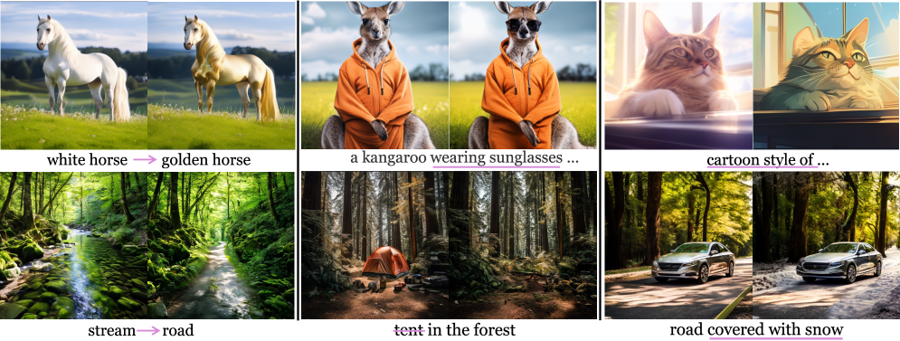
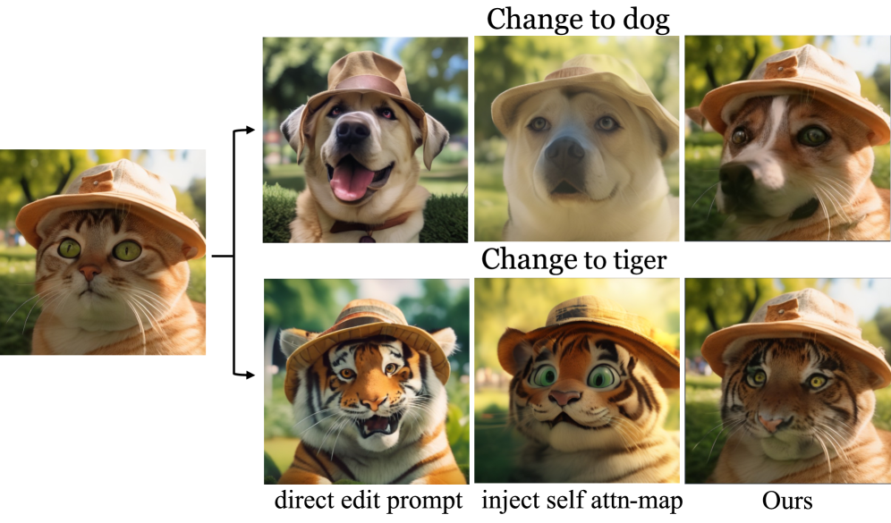

# AI Daily: Anchor Token Matching (ATM) - 突破自迴歸模型的免訓練圖像編輯瓶頸

**日期**: 2026-03-07
**論文標題**: Anchor Token Matching: Implicit Structure Locking for Training-free AR Image Editing
**作者**: Taihang Hu, Linxuan Li, Kai Wang, Yaxing Wang, Jian Yang, Ming-Ming Cheng
**機構**: 南開大學 (Nankai University), 電腦視覺中心 (CVC, UAB), 香港城市大學 (CityU)
**會議**: ICCV 2025
**論文連結**: [arXiv:2504.10434](https://arxiv.org/abs/2504.10434)
**代碼連結**: [GitHub](https://github.com/hutaiHang/ATM)

---

## 1. 核心亮點與研究動機

近年來，基於自迴歸（Autoregressive, AR）的視覺生成模型（如 LlamaGen, Emu3, Lumina-mGPT）強勢回歸，在生成質量上已能與擴散模型（Diffusion Models）匹敵。然而，在**文本引導的圖像編輯（Text-guided Image Editing）**任務上，AR 模型卻面臨著嚴峻的挑戰。

擴散模型通常透過操作交叉注意力圖（Cross-attention maps）來實現免訓練（Training-free）的圖像編輯（例如 Prompt-to-Prompt）。但作者深入研究發現，這種方法無法直接移植到 AR 模型上，主要原因有二：
1. **注意力圖的空間貧乏（Spatial Poverty）**：AR 模型中，文本到圖像的交叉注意力圖缺乏精確的結構對應關係，無法作為可靠的編輯錨點。
2. **結構誤差的序列累積（Sequential Accumulation of Structural Errors）**：AR 模型的逐 token 生成機制會導致局部修改（如將「貓」改為「狗」）引發潛在狀態的偏移，這些偏差會沿著自迴歸依賴鏈傳播，最終破壞全局結構（如物體姿態和場景佈局）。

為了解決這些問題，本文提出了 **Implicit Structure Locking (ISLock)**，這是**首個針對 AR 視覺模型的免訓練（Training-free）編輯策略**。

*圖 1：ISLock 能夠在保持原始圖像其他資訊不變的情況下，實現屬性/物體替換、添加/移除物體以及風格/狀態轉換。*

---

## 2. 關鍵技術：Anchor Token Matching (ATM)

ISLock 的核心在於 **Anchor Token Matching (ATM)** 策略。與其強行移植或注入參考圖像的注意力圖（這會破壞 AR 模型的內在注意力動態，導致語義不連貫和偽影），ATM 選擇在潛在空間（Latent Space）中進行隱式對齊。

### 2.1 隱式結構鎖定 (Implicit Structure Locking)

在自迴歸解碼過程中，ATM 不直接操作注意力權重，而是透過尋找與原始序列中「錨點 Token（Anchor Tokens）」具有最大相似度的隱藏表示（Hidden representations）來選擇性地匹配 Token。

具體流程如下：
1. **生成候選 Token**：在生成編輯序列的第 $i$ 步時，模型根據條件分佈採樣 $K$ 個候選 Token。
2. **計算距離**：計算每個候選 Token 與參考錨點 Token 在潛在空間的歐氏距離。
3. **最近鄰匹配**：選擇距離最小的候選 Token 作為輸出。

這種過程引發了**隱式的注意力對齊（Implicit attention alignment）**，使模型能夠自然地計算出既保留結構連貫性，又能適應局部語義編輯（例如將毛髮紋理從「貓」過渡到「狗」）的注意力圖。

*圖 2：(左) 直接修改目標 Token 會因結構誤差累積導致內容嚴重扭曲。(中) 簡單的注意力注入會破壞內容連貫性。(右) ISLock 透過 ATM 策略有效緩解了這些問題，實現了高質量的結構保持編輯。*

### 2.2 動態窗口與自適應約束放寬

為了適應生成過程中不同階段的結構約束需求，作者引入了兩個關鍵機制：

*   **動態窗口 (Dynamic Windows)**：在生成初期（決定全局結構），保留 100% 的候選 Token 以嚴格對齊結構；隨著生成推進（細化局部紋理），窗口線性縮小，最終只保留 40% 的候選 Token，從而將重點轉移到上下文連貫性上。
*   **自適應約束放寬 (Adaptive Constraint Relaxation, AdaCR)**：引入相似度閾值 $\tau$。當候選 Token 的最小距離大於 $\tau$ 時，放棄匹配，轉而選擇概率最大的 Token。這保證了在需要大幅度語義改變時（如添加原本不存在的物體），模型仍能保持生成自主性（Generative Autonomy）。

---

## 3. 實驗結果與優勢

作者在 PIE-Bench 數據集上進行了廣泛的實驗，涵蓋了五種基礎編輯類型：物體替換、物體添加、物體移除、風格轉換和屬性修改。

### 3.1 定量分析

與現有的擴散模型編輯方法（如 Prompt-to-Prompt, InstructPix2Pix, MGIE 等）以及 AR 模型的簡單基準（NPM, PnP-AR）相比，ISLock 展現了卓越的性能：
*   **結構保持**：Structure Distance 達到 31.79，顯著優於其他 AR 基準方法（>100），僅次於部分基於反演（Inversion-based）的擴散模型方法。
*   **背景保真度**：在 PSNR 和 SSIM 指標上，表現與領先的基於指令的擴散模型方法（如 InstructPix2Pix）相當。
*   **語義對齊**：CLIP Similarity 達到 24.19（全局）和 21.33（編輯區域），證明了其在保持結構的同時，能精確對齊目標文本提示。

### 3.2 核心優勢總結

1.  **Training-free & Zero-shot**：無需任何微調或額外訓練，即插即用。
2.  **解決 AR 編輯痛點**：成功克服了 AR 模型在圖像編輯中常見的誤差累積和注意力圖空間貧乏問題。
3.  **高度通用性**：不僅適用於 LlamaGen，也能泛化到其他 AR 基礎模型（如 Lumina-mGPT）。
4.  **平衡控制與自主性**：透過隱式鎖定而非顯式強制注入，完美平衡了「保持原始結構」與「生成新語義內容」之間的矛盾。

---

## 4. 總結與啟發

《Anchor Token Matching》這篇論文為自迴歸（AR）視覺模型的圖像編輯開闢了一條全新的道路。它深刻揭示了 AR 模型與擴散模型在結構控制機制上的根本差異，並巧妙地利用潛在空間的最近鄰匹配（ATM）來實現隱式的結構鎖定。

這項研究不僅縮小了 AR 模型與擴散模型在可控編輯任務上的差距，也為未來多模態大語言模型（MLLMs）原生支持高質量圖像編輯提供了重要的理論基礎和實踐方案。對於關注 Visual Autoregressive Models 和 Training-free 控制技術的研究者來說，這是一篇極具啟發性的必讀佳作。
