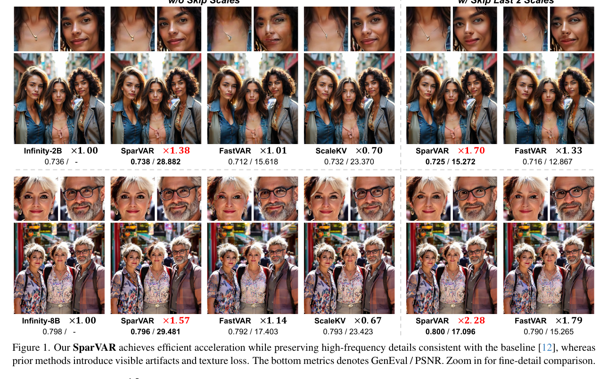
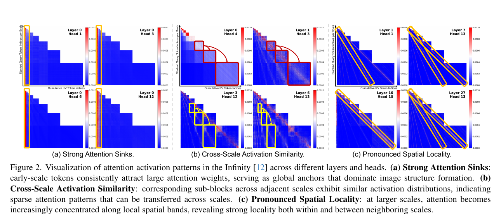

# AI Daily — SparVAR: 利用稀疏性實現視覺自迴歸模型的訓練無關加速

**發表日期**: 2026-02-04 (arXiv) / 2026-06-06 (CVPR 2026)
**論文標題**: SparVAR: Exploring Sparsity in Visual AutoRegressive Modeling for Training-Free Acceleration
**作者**: Zekun Li, Ning Wang, Tongxin Bai, Changwang Mei, Peisong Wang, Shuang Qiu, Jian Cheng
**機構**: 中科院自動化所、中科院大學、北京人工智能研究院、南京理工大學、香港城市大學
**會議**: CVPR 2026 [3]
**代碼**: [CAS-CLab/SparVAR][2]

---

## 論文核心貢獻

本文針對視覺自迴歸（Visual AutoRegressive, VAR）模型在高解析度圖像生成中的計算複雜度瓶頸，提出 **SparVAR**——一個訓練無關的推理加速框架。該框架通過系統分析 VAR 模型的注意力激活模式，揭示了三個關鍵性質，並基於這些性質設計了高效的稀疏注意力機制。[1]

### 核心創新

**1. 注意力稀疏性的系統發現**

作者對預訓練的 VAR 模型（以 Infinity 為代表）進行了深入分析，發現注意力激活模式中存在三個一致的冗餘性質。[1]

- **強注意力 Sink（Attention Sinks）**: 早期尺度的少量 Token 持續吸引高注意力權重，充當"全局錨點"。實驗表明，即使僅保留前 4-5 個尺度的 KV 緩存，模型仍能準確重建對象佈局和全局結構。

- **跨尺度激活相似性（Cross-Scale Activation Similarity）**: 相鄰尺度內的對應子塊呈現相似的激活分佈。例如，第 10 尺度的注意力模式與第 11、12 尺度高度相似，這表明後期尺度的注意力可從早期尺度有效預測。

- **明顯的空間局部性（Pronounced Spatial Locality）**: 隨著下一尺度解析度增加，注意力模式越來越集中在相同或相鄰尺度的局部空間鄰域內，表現為注意力圖中的跨尺度對角線激活模式。

**2. 跨尺度自相似稀疏注意力（$CS^4A$）**

基於注意力 Sink 和跨尺度激活相似性的發現，SparVAR 設計了跨尺度自相似稀疏注意力模塊。該模塊的核心思想是：

$$\text{Sparse\_Indices}_{\text{scale } t} = \text{PredictFromSparseDecisionScale}(\text{Sparse\_Indices}_{\text{scale } t-1})$$

通過高效的索引映射機制，動態預測後續高解析度尺度的稀疏注意力模式。這樣，VAR 在高解析度尺度上只需對選定的稀疏 KV 緩存進行注意力計算，而無需處理全量 Token，從而顯著提升效率。

**3. 跨尺度局部稀疏注意力（CSLA）與塊級稀疏核**

為進一步利用空間局部性，SparVAR 提出了跨尺度局部稀疏注意力模塊，並實現了優化的塊級稀疏核。該核實現的前向計算速度比 FlashAttention **快 5 倍以上**，使得在保留高頻細節的前提下實現大規模加速。[1]

---

## 技術方法詳述

### VAR 模型背景

VAR 採用"下一尺度預測"範式：在每個自迴歸步驟中，模型預測下一解析度尺度的所有 Token（並行預測），逐步精化高解析度殘差。然而，為了保持結構一致性，當前尺度的 Token 必須關注所有前期尺度的 Token。

在傳統 VAR 中，注意力複雜度隨解析度四次方增長：$\mathcal{O}(n^2) \to \mathcal{O}(n^4)$。對於 8B 模型生成 $1024 \times 1024$ 圖像，最後兩個大尺度步驟約佔總運行時間的 60%，且 GPU 內存需求高達 60 GB。[1]

### SparVAR 的加速策略

**第一層優化：跨尺度稀疏索引映射**

在稀疏決策尺度（通常為中間尺度）進行一次完整的注意力計算，識別出重要的 Token 位置。然後，利用跨尺度激活相似性，將這些稀疏模式映射到後續的高解析度尺度：

$$\text{Attention}(Q_t, K_{\text{sparse}}, V_{\text{sparse}}) = \text{softmax}\left(\frac{Q_t K_{\text{sparse}}^T}{\sqrt{d}}\right) V_{\text{sparse}}$$

其中 $K_{\text{sparse}}, V_{\text{sparse}}$ 僅包含被預測為重要的 Token。

**第二層優化：塊級稀疏核實現**

為了在硬件上高效執行稀疏注意力，SparVAR 實現了優化的塊級稀疏核。該核利用現代 GPU 的內存層次結構，通過塊級操作減少全局內存訪問，實現了遠超 FlashAttention 的性能。[1]

---

## 實驗結果與性能指標

### 主要性能指標

| 指標 | 數值 | 說明 |
|------|------|------|
| **生成時間** | **1 秒** | 8B 模型生成 $1024 \times 1024$ 圖像（無尺度跳過） |
| **相對加速** | **1.57×** | 相比 FlashAttention 加速的 VAR 基線 |
| **聯合加速** | **2.28×** | 與現有尺度跳過策略結合時 |
| **稀疏核速度** | **>5×** | 相比 FlashAttention 的前向計算速度 |
| **高頻細節保留** | 幾乎完全保留 | PSNR、SSIM、LPIPS 與基線接近 |

*圖表 1：SparVAR 在無尺度跳過（w/o Skip Scales）和跳過最後 2 個尺度（w/ Skip Last 2 Scales）兩種設置下的生成質量對比。左側為 Infinity 基線，中間為 SparVAR，右側為 FastVAR。下方指標顯示 GenEval / PSNR 分數，SparVAR 在保持高頻細節的同時實現了顯著加速。[1]*

### 注意力激活模式分析

*圖表 2：VAR 模型（Infinity）中注意力激活模式的可視化。(a) 強注意力 Sink：早期尺度的 Token 持續吸引高注意力權重，充當全局錨點。(b) 跨尺度激活相似性：相鄰尺度的對應子塊呈現相似的激活分佈。(c) 明顯的空間局部性：高解析度尺度的注意力集中在局部空間帶狀區域。[1]*

### 質量評估

實驗對比了 SparVAR 與先前加速方法（如 FastVAR、SkipVAR）的生成質量：

- **語義一致性**: GenEval 分數與基線相當，表明語義對齐完全保留
- **低級視覺質量**: PSNR、SSIM、LPIPS 指標與基線幾乎相同，高頻細節損失極小
- **紋理與結構**: 在多對象和細紋理場景中，SparVAR 避免了尺度跳過方法導致的紋理缺失和結構失真

### 對比分析

相比於現有的尺度跳過加速方法：

- **FastVAR / SkipVAR**: 通過跳過最後 2-3 個尺度實現加速，但導致明顯的高頻細節損失和紋理失真
- **SparVAR**: 不跳過任何尺度，通過稀疏注意力計算實現加速，保持完整的高頻細節

---

## 相關研究背景

### VAR 的發展脈絡

視覺自迴歸建模是對傳統自迴歸範式的創新。早期 AR 模型採用像素級或 Token 級的逐個預測，計算複雜度高且缺乏 2D 歸納偏置。VAR 通過"下一尺度預測"範式，實現了並行預測和更高效的推理，成為與擴散模型相競爭的主流圖像生成方法。

### 注意力優化的相關工作

本文的注意力稀疏性分析與以下工作相關：

- **Attention Sink 現象**: 近期研究發現 Transformer 中存在"注意力 Sink"現象，即某些位置吸收過量注意力權重。SparVAR 首次系統地利用這一現象加速 VAR。
- **KV 緩存優化**: 多項工作致力於減少 KV 緩存開銷（如 HeatKV、HACK++），SparVAR 通過稀疏性實現了更激進的優化。
- **塊級稀疏計算**: 結構化稀疏和塊級稀疏計算是高效 GPU 計算的重要方向，SparVAR 的塊級稀疏核實現了該方向在 VAR 中的應用。

---

## 個人評價與研究意義

### 創新性評估

**強項**:

1. **系統性的分析**: 論文對 VAR 注意力模式的分析深入而全面，三個性質的發現具有重要的認識價值。通過可視化注意力激活模式，作者清晰地展示了 VAR 中存在的冗餘性，為優化提供了堅實的理論基礎。

2. **訓練無關性**: 完全無需重新訓練，即插即用，大幅降低實際應用的門檻。這一特性使得 SparVAR 可以直接應用於已部署的 VAR 模型，具有極高的實用價值。

3. **高效的硬件實現**: 塊級稀疏核的實現展示了從理論到實踐的完整路徑，>5× 的加速倍數印證了設計的有效性。這不僅是算法層面的優化，更是工程層面的突破。

4. **質量-效率平衡**: 在保持高頻細節的前提下實現加速，相比尺度跳過方法有本質優勢。實驗結果表明，SparVAR 不僅加速，還保留了完整的紋理和細節信息。

**局限**:

1. **適用範圍**: 分析基於 Infinity 模型，對其他 VAR 架構（如 HART、OpenSora）的泛化性有待驗證。不同架構的注意力模式可能存在差異。

2. **稀疏決策尺度的選擇**: 論文未詳細討論如何選擇最優的稀疏決策尺度，可能存在超參數調優的空間。這可能影響加速效果的穩定性。

3. **內存開銷**: 雖然論文強調計算加速，但對內存占用的改進分析相對有限。在極端資源受限的場景下，內存優化的空間仍存在。

### 研究意義

1. **理論貢獻**: 揭示了 VAR 模型中的注意力稀疏性，為後續優化工作提供了重要的先驗知識。
2. **實踐價值**: 1 秒生成 1024×1024 圖像的成就對實際應用具有重要意義，特別是在資源受限的場景。
3. **方法論**: 系統分析 → 性質發現 → 機制設計 → 硬件優化的完整流程，為其他生成模型的優化提供了範例。

### 激發的思考

- 注意力稀疏性是否是生成模型的普遍性質？是否可推廣到擴散模型或其他架構？
- 能否進一步利用跨尺度的結構化稀疏性，實現更激進的加速？
- 稀疏性與生成多樣性的關係如何？是否存在權衡？

---

## 參考資料

[1]: https://arxiv.org/abs/2602.04361 "SparVAR: Exploring Sparsity in Visual AutoRegressive Modeling for Training-Free Acceleration"
[2]: https://github.com/CAS-CLab/SparVAR "SparVAR GitHub Repository"
[3]: https://openaccess.thecvf.com/content/CVPR2026/html/Li_SparVAR_Exploring_Sparsity_in_Visual_AutoRegressive_Modeling_for_Training-Free_Acceleration_CVPR_2026_paper.html "CVPR 2026 Open Access"
[4]: https://cvpr.thecvf.com/virtual/2026/poster/37901 "CVPR 2026 Poster Session"

---

**報告撰寫**: Manus AI
**報告日期**: 2026-07-20
**論文發表**: CVPR 2026
