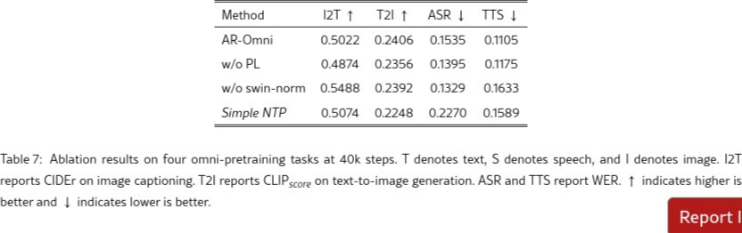

# AI Daily: AR-Omni - 邁向純自回歸的「Any-to-Any」多模態生成

> 論文標題：AR-Omni: A Unified Autoregressive Model for Any-to-Any Generation
> 
> 發表機構：香港理工大學、中國科學技術大學、哈爾濱工業大學（深圳）
> 
> 發表時間：2026年1月25日
> 
> 論文鏈接：[https://arxiv.org/abs/2601.17761](https://arxiv.org/abs/2601.17761)

## 核心貢獻：告別專家模型，擁抱純自回歸的「萬能」生成

當前，多模態大型語言模型（MLLMs）正從「能聽會看」的理解者，進化為「能說會畫」的創造者。然而，大多數「Omni」模型仍然依賴於多個獨立的專家組件（如擴散模型解碼器）來實現多模態輸出，這使得訓練和推理過程變得複雜。

**AR-Omni** 徹底顛覆了這一現狀，首次提出了一個**完全基於自回歸範式**的「Any-to-Any」統一模型。它僅使用一個 7B 參數的 Transformer 解碼器，便實現了對文本、圖像、語音三種模態的統一理解和生成，無需任何外部專家模型。這一設計不僅在概念上極其優雅，更在實踐中帶來了統一訓練和高效推理的巨大潛力。

## 技術方法：三大創新解決統一建模挑戰

AR-Omni 的核心是將所有模態數據轉換為離散的 token 序列，並在一個共享的嵌入空間中進行處理。為了應對統一建模帶來的挑戰，論文提出了三大創新解決方案：

### 1. 模態不平衡：任務感知的加權損失 (Weighted NTP)

在多模態訓練中，不同模態的 token 數量差異巨大（例如，一段語音可能對應數千個 token，而其文字描述僅有數十個）。為了解決長序列模態主導訓練的問題，AR-Omni 引入了加權的 Next-Token 預測損失。

其數學表達式為：

$$ \mathcal{L}_{\text{wNTP}} = -\frac{1}{T} \sum_{t=1}^{T} w_t \log p_\theta(x_t | x_{<t}) $$

其中，$w_t$ 是一個標量權重。在實際操作中，模型會對那些需要精確生成的模態（如文本響應）的 token 賦予更高的權重，從而確保模型在各個任務上都能得到充分的學習。

### 2. 視覺保真度：輕量級感知對齊損失 (Perceptual Loss)

傳統的交叉熵損失在預測視覺 token 時，會將所有錯誤的 token 一視同仁，忽略了它們在語義上的相似性。這會導致生成的圖像在視覺結構上不連貫。

為此，AR-Omni 引入了一個輕量級的感知損失，引導模型在生成圖像時，不僅要預測對的 token，還要使其隱藏狀態在語義上接近目標 token 的嵌入向量。

其數學表達式為：

$$ \mathcal{L}_{\text{perc}} = \frac{1}{|\mathcal{T}|} \sum_{t \in \mathcal{T}} \| W_h h_t - E[y_t] \|_2^2 $$

其中，$E$ 是固定的圖像嵌入矩陣，$h_t$ 是最後一層的隱藏狀態。這個損失函數鼓勵模型生成在視覺上更為平滑和一致的圖像。

### 3. 穩定性與創造性：有限狀態解碼機制

不同的生成任務對解碼策略有著截然不同的要求。例如，語音識別（ASR）和語音合成（TTS）需要穩定和精確的結果，而開放式的圖像或文本生成則需要更多的創造性。

AR-Omni 設計了一種有限狀態機來自動切換解碼策略：
- **對於 ASR 和 TTS 任務**：使用 **Greedy Decoding**，確保結果的確定性和準確性。
- **對於開放式生成任務**：使用 **Sampling Decoding**，鼓勵模型探索更多可能性，生成更多樣化的內容。

## 實驗結果：性能與效率的雙重勝利

AR-Omni 在多項任務上都取得了令人矚目的成績，證明了其設計的有效性。

### 性能指標

- **實時流式語音生成**：首次 token 延遲僅為 **146ms**，實時率（RTF）達到 **0.88**，實現了比實時更快的語音合成。
- **Zero-Shot TTS**：在 VCTK 數據集上取得了 **6.5** 的詞錯誤率（WER）。
- **ASR**：在 LibriSpeech test-clean 數據集上取得了 **9.4** 的詞錯誤率（WER）。

### 消融實驗

消融實驗進一步驗證了各個組件的有效性：
- **去除感知損失 (w/o PL)**：圖像生成質量（T2I）明顯下降。
- **使用簡單 NTP (Simple NTP)**：ASR 和 TTS 的性能顯著惡化，證明了加權損失的必要性。

## 相關研究與未來展望

AR-Omni 的出現，標誌著多模態生成正從依賴多個專家模型的「組合式」系統，邁向更加優雅和高效的「一體化」系統。它與 Unified-IO 2、Liquid 等研究共同推動了統一自回歸模型的發展，同時也為解決 Any-to-Any 生成中的實際挑戰提供了新的思路。

未來，AR-Omni 的思想有望與視覺自回歸模型（VAR）的多尺度預測相結合，或是在此框架下探索更多無需訓練的（Training-Free）模態平衡與質量提升策略，進一步釋放純自回歸範式在多模態生成領域的潛力。

## 個人評價與啟示

AR-Omni 最令人興奮的一點是其**設計的簡潔與純粹**。在當前模型日益複雜、依賴各種專家組件的趨勢下，AR-Omni 返璞歸真，證明了單一的自回歸模型足以勝任複雜的 Any-to-Any 生成任務。這不僅是一次技術上的突破，更為未來的多模態模型研究指明了一個極具潛力的方向。

對於追求通用人工智能（AGI）的研究者而言，AR-Omni 提供了一個極具吸引力的範本：一個能夠以統一方式處理和生成多種信息模態的智能體。這項工作激發了我們對於以下問題的思考：

1.  **VAR 與 Omni 的融合**：如何將 VAR 的高效多尺度建模能力與 Omni 的多模態統一性相結合？
2.  **Inference-Time 優化**：除了有限狀態解碼，是否還有更多無需重新訓練的策略可以應用於 Omni 模型，以提升特定任務的性能？
3.  **Attention 機制的演進**：在統一模型中，Attention 機制如何自適應地處理來自不同模態的異構信息？是否可以設計模態感知的 Attention 調製方法？

總而言之，AR-Omni 不僅是一個強大的多模態生成模型，更是一個充滿啟發性的研究框架，為我們探索下一代 AI 的無限可能打開了新的可能性。
