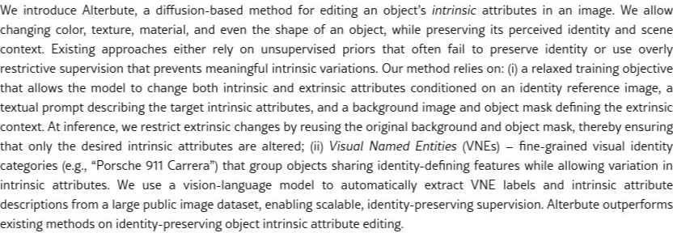

# AI Daily: Alterbute - 編輯物體內在屬性的新篇章

> **論文**: Alterbute: Editing Intrinsic Attributes of Objects in Images
> **作者**: Tal Reiss, Daniel Winter, Matan Cohen, et al.
> **機構**: Google, The Hebrew University of Jerusalem, Reichman University
> **發表**: arXiv, 2026年1月15日
> **關鍵詞**: #IntrinsicAttributeEditing #IdentityPreservation #DiffusionModel #TrainingFreeInference #VNE

---

## 概述

在圖像編輯領域，改變物體的外在屬性（如位置、光照）已取得顯著進展，但要精準修改其**內在屬性**（intrinsic attributes）——例如顏色、材質、紋理甚至形狀——同時完整保留其獨特的**身份**（identity），至今仍是一大挑戰。2026年1月15日，來自 Google 和頂尖學術機構的研究團隊發表了一篇名為 **Alterbute** 的論文 [1]，提出了一種創新的擴散模型（diffusion-based method），旨在解決這一難題。Alterbute 不僅能使用單一模型編輯物體的所有內在屬性，更引入了「視覺命名實體」（Visual Named Entities, VNEs）這一全新概念來定義和保持物體身份，為高保真度的物體屬性編輯開闢了新途徑。

*圖 1: Alterbute 能夠根據文本提示，精準編輯物體的內在屬性，如紋理、形狀、顏色和材質，同時保持其核心身份。*

---

## 核心貢獻

Alterbute 的核心貢獻在於其巧妙地克服了現有方法在內在屬性編輯上的兩大瓶頸：缺乏高質量的訓練數據和難以定義的「物體身份」。

### 1. 視覺命名實體 (Visual Named Entities, VNEs)

傳統方法對物體身份的定義過於兩極化。若使用粗粒度的類別（如「汽車」），則允許過多的變化，導致編輯後的物體失去原有的獨特性；若使用實例級別的特徵，則過於嚴格，幾乎不允許任何內在屬性的改變。Alterbute 提出了一個創新的中間方案：**視覺命名實體 (VNEs)**。

> VNEs 是指細粒度的視覺身份類別，例如「保時捷911卡雷拉」或「IKEA LACK邊桌」。這些名稱不僅對應著一個類別，更代表了一組具有共同視覺特徵和身份的物體集合。VNEs 允許物體在顏色、材質等內在屬性上有所變化，但其核心的、可被識別的身份特徵保持不變。

研究團隊利用大型視覺語言模型（VLM，如 Gemini）自動從 OpenImages 數據集中提取了超過一百萬個帶有 VNE 標籤的物體實例，構建了一個規模龐大且無需人工標註的訓練數據集。

### 2. 放鬆的訓練目標 (Relaxed Training Objective)

要訓練一個僅改變內在屬性的模型，理想情況下需要大量「場景、物體身份、外在因素完全相同，僅內在屬性不同」的圖像對，而這類數據在現實世界中幾乎不存在。Alterbute 採用了一種「先放後收」的策略：

- **訓練時放鬆**：模型被訓練來處理一個更廣泛的任務——同時改變內在和外在屬性。訓練數據包含一個身份參考圖像、一個描述目標內在屬性的文本提示，以及一個定義目標場景的背景圖和遮罩。這使得模型可以從更容易獲取的、內外在屬性都發生變化的圖像對中學習。
- **推理時約束**：在進行實際編輯時，通過重複使用原始圖像的背景和物體遮罩，將模型的編輯能力**約束**在僅改變內在屬性上。

這種設計使得監督式訓練成為可能，有效繞開了數據稀缺的難題。

*圖 2: Alterbute 的方法概覽。訓練時（左），模型學習從參考圖像、文本提示和背景中生成目標圖像；推理時（右），通過固定背景和遮罩，實現僅對內在屬性的編輯。*

---

## 技術方法簡述

Alterbute 的方法基於一個經過微調的 SDXL 擴散模型。其核心在於如何構建訓練目標和條件輸入，以實現對身份、屬性和場景的解耦控制。

### 數學模型

研究者將圖像的生成過程形式化。一張圖像 $y$ 可以看作是物體 $o$ 和場景 $s$ 在物理渲染過程 $G_{\text{physics}}$ 下的結果：

$$y = G_{\text{physics}}(o, s)$$

而物體 $o$ 的外觀由其身份 $i_d$、內在屬性 $a_{\text{int}}$ 和外在場景因素 $s$ 共同決定：

$$o = O(i_d, a_{\text{int}}, s)$$

編輯的目標是生成一張新圖像 $y_\prime$，其中物體的內在屬性變為 $a_{\text{int}}^\prime$，而身份 $i_d$ 和場景 $s$ 保持不變：

$$y_\prime = G_{\text{physics}}(O(i_d, a_{\text{int}}^\prime, s), s)$$

### 訓練架構

為了近似這個過程，Alterbute 對一個 UNet 結構的去噪網絡 $D_\theta$ 進行微調。訓練時，輸入被組織成一個 $1 \times 2$ 的網格：

- **左半部分**：包含目標圖像的噪聲潛變量、目標場景的背景圖和物體遮罩。
- **右半部分**：包含從同一 VNE 簇中隨機採樣的**身份參考圖像**。

模型通過自註意力機制（self-attention）在左右兩半之間傳播身份特徵。損失函數僅在左半部分計算，從而將學習重點放在編輯區域。其擴散損失函數如下：

$$\mathcal{L}(\theta) = \mathbb{E}_{\epsilon \sim \mathcal{N}(0,1), \tau \sim \mathcal{U}([0,T])} \left[ \sum_{i=1}^{N} \| D_\theta(\alpha_\tau y_i + \sigma_\tau \epsilon, i_d, p_i, s_i, \tau) - \epsilon \|^2 \right]$$

其中，$i_d$ 是身份參考圖像，$p_i$ 是描述內在屬性的文本提示，$s_i$ 是場景描述（背景+遮罩）。

---

## 實驗結果與分析

Alterbute 在定性和定量評估中均表現出色，顯著優於現有的通用編輯器（如 InstructPix2Pix、FlowEdit）和特定屬性編輯器（如 MaterialFusion、MimicBrush）。

- **用戶偏好研究**：在與七個基線模型的對比中，人類評估者在 76% 到 89% 的情況下更偏好 Alterbute 的結果。
- **VLM 評估**：使用 Gemini、GPT-4o 和 Claude 進行的自動評估也顯示出與人類偏好高度一致的結果。
- **消融實驗**：實驗證明，VNE 是保持身份的關鍵。若改用 DINOv2 或實例檢索特徵來定義身份，模型效果會顯著下降，因為這些方法無法提供足夠的屬性變化來進行有效學習。

---

## 相關研究與個人評價

圖像編輯領域一直在尋求更好的方式來解耦和控制生成內容的各個方面。從早期的 GAN Inversion 到基於擴散模型的 personalization 方法（如 DreamBooth、Textual Inversion），再到無需訓練的 editing-in-attention 方法，研究者們不斷探索如何在保持主體身份的同時實現靈活的編輯。

Alterbute 的貢獻在於，它沒有直接挑戰「training-free」或「zero-shot」的難題，而是通過一個巧妙的「有監督」框架，從根本上解決了數據和身份定義的問題。**VNE 概念的提出極具啟發性**，它為「物體身份」這一模糊概念提供了一個可操作、可擴展的定義，這對於需要身份保持的生成任務（不僅限於圖像編輯）都具有重要參考價值。

對於追求 VAR-based 或 training-free 方法的研究者而言，Alterbute 的思路同樣具有借鑒意義：

1.  **身份定義的遷移**：VNE 的思想可以被遷移到自回歸模型中，用於構建更具身份一致性的視覺 token 序列。
2.  **訓練策略的啟發**：「放鬆-約束」的訓練策略為解決數據稀缺問題提供了一個通用範本，這在 zero-shot 或 few-shot 學習中同樣值得探索。

總體而言，Alterbute 不僅是一個效果出色的圖像編輯工具，更是一篇在方法論上充滿創見的論文，為物體級別的生成式 AI 研究提供了新的思路和方向。

---

## 參考文獻

[1] Reiss, T., Winter, D., Cohen, M., Rav-Acha, A., Pritch, Y., Shamir, A., & Hoshen, Y. (2026). *Alterbute: Editing Intrinsic Attributes of Objects in Images*. arXiv preprint arXiv:2601.10714.
