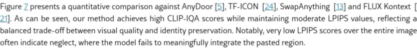

# AI Daily: LooseRoPE - 內容感知注意力操控，實現無縫語義融合

> **論文標題**: LooseRoPE: Content-aware Attention Manipulation for Semantic Harmonization
> **研究單位**: Tel Aviv University, Snap Research, Cornell University
> **發表時間**: 2026年1月8日
> **arXiv ID**: [2601.05127v1](https://arxiv.org/abs/2601.05127)
> **關鍵詞**: `Training-Free`, `Attention Modulation`, `RoPE`, `Semantic Harmonization`, `Diffusion Models`, `Image Editing`, `Zero-Shot`

---

## 核心貢獻：無需訓練的圖像語義和諧化新範式

在圖像生成領域，擴散模型（Diffusion Models）透過文字提示（text prompt）實現了直觀的圖像編輯，但這種方式往往缺乏精確的空間和視覺控制。為了解決此問題，來自以色列、美國頂尖研究機構的團隊提出了 **LooseRoPE**，一種無需訓練（training-free）的圖像編輯演算法，專注於解決「語義和諧化」（Semantic Harmonization）的挑戰。

傳統的圖像合成方法，如直接剪貼，常常導致風格、光照或語義上的不一致。LooseRoPE 的核心思想是，在不依賴任何文字提示的情況下，僅透過使用者簡單的「剪下、貼上」操作，就能將一個物件無縫地融入新的背景中，同時保持物件本身的身份特徵（identity）並與新環境達成語義上的一致性。此方法巧妙地利用並擴展了 **旋轉位置編碼（Rotary Positional Encoding, RoPE）**，透過一種顯著性引導（saliency-guided）的調變機制，動態地「放鬆」位置約束，從而連續地控制注意力機制的視野（field of view）。這種創新的注意力操控（Attention Manipulation）讓模型能夠在「忠實保留貼上內容」與「與背景和諧融合」這兩個目標之間取得絕佳的平衡。

| 創新點 | 技術細節 |
| :--- | :--- |
| **無需訓練與提示** | 完全基於預訓練的擴散模型，無需額外訓練或微調，也不需要使用者提供文字描述。 |
| **內容感知注意力操控** | 提出 LooseRoPE 機制，根據內容的顯著性動態調整 RoPE，實現對注意力範圍的精確控制。 |
| **語義和諧化** | 不僅是像素級的顏色或光照調整，更能實現語義層面的融合，例如調整物件的姿態或結構以適應新場景。 |
| **VLM 自動校準** | 整合視覺語言模型（VLM）自動檢測並修正編輯過程中的「忽略」與「壓抑」兩大失敗模式。 |

---

## 技術方法簡述：解構 LooseRoPE 的注意力魔法

LooseRoPE 的成功關鍵在於對現有擴-散模型（基於 Transformer 的 DiT 架構）中注意力機制的深刻理解與巧妙改造。其技術核心建立在對 RoPE 的擴展之上。

### 旋轉位置編碼 (RoPE) 回顧

RoPE 是 Transformer 架構中一種高效的位置編碼方式，它將 token 的絕對位置資訊以旋轉的方式編碼進 query 和 key 向量中。對於一個二維子向量 $\mathbf{v}_d$，其位置 $m$ 的編碼過程如下：

$$\mathbf{v}\'_d = e^{i(\theta_d m)} \mathbf{v}_d$$

其中，角頻率 $\theta_d$ 構成一個幾何級數，讓模型能夠捕捉相對位置關係。

### LooseRoPE 的核心機制：放鬆位置約束

LooseRoPE 引入了一個 **反向範圍因子 (inverse range factor) $r \in [0,1]$**，來動態縮放位置座標 $m$：

$$\mathbf{v}\'_d = e^{i(\theta_d r m)} \mathbf{v}_d$$

當 $r < 1$ 時，token 之間的有效空間距離被縮短，這等同於擴大了注意力機制的感受野。$r$ 的值由一個 **顯著性映射 (saliency map)** 決定，該映射透過預訓練的實例分割模型從貼上的區域中提取。

*圖一：LooseRoPE 的核心方法流程。高顯著性區域（如臉部特徵）的 $r$ 趨近於 1，以保持細節；低顯著性區域（如背景）的 $r$ 較小，以擴大注意力範圍，促進與周圍環境的融合。*

### 內容感知的注意力操控

具體來說，$r$ 的值是根據每個查詢 query 的顯著性 $S_{\text{original}}$ 動態計算的：

$$r(i) = \max\{\min\{\lambda \cdot S_{\text{original}}, 1\}, 0\}$$

其中 $\lambda$ 是一個可調整的縮放因子。這使得模型可以：
- **對於高顯著性區域** (如人臉、物件核心特徵)，$r \approx 1$，注意力變得更局部，從而精確保留物件的身份。
- **對於低顯著性區域** (如物件邊緣、背景)，$r < 1$，注意力範圍擴大，更多地參考周圍的上下文，實現平滑的語義和視覺融合。

### VLM 引導的自動校準

為了應對擴散模型編輯中常見的兩大問題——**忽略 (Neglect)**（貼上物體未被修改）和 **壓抑 (Suppression)**（貼上物體被過度修改而失去身份），LooseRoPE 引入了一個視覺語言模型（VLM）在編輯過程中進行自動診斷和校準。VLM 會評估中間生成結果，並根據判斷動態調整 $\lambda$ 值，從而自動引導模型達到最佳的融合效果。

*圖二：VLM 自動校準機制。綠色箭頭表示 VLM 檢測到「忽略」並降低 $\lambda$ 以促進融合；橘色箭頭表示檢測到「壓抑」並提高 $\lambda$ 以保留身份。*

---

## 實驗結果與性能指標

LooseRoPE 在一個包含150個多樣化場景的自建基準測試集上進行了廣泛評估，並與多個最先進的方法進行了比較，包括 TF-ICON、AnyDoor、SwapAnything 以及基礎模型 FLUX Kontext。

### 定性比較

從視覺效果上看，LooseRoPE 在各種複雜的編輯場景中都展現了卓越的性能。它能夠生成語義連貫、視覺和諧的結果，同時精確地保留了貼上物件的核心特徵。相比之下，其他方法要麼無法有效融合（Neglect），要麼過度改變了物件的外觀（Suppression）。

*圖三：與其他方法的定性比較。LooseRoPE（Ours）在身份保留和背景融合方面均表現出色。*

### 量化分析

實驗採用了 **CLIP-IQA**（評估整體圖像品質）和 **LPIPS**（評估前景和全圖的感知相似度，衡量身份保留程度）作為主要量化指標。

*圖四：量化結果分析。左圖為前景 LPIPS vs. CLIP-IQA，右圖為全圖 LPIPS vs. CLIP-IQA。LooseRoPE 在保持高圖像品質（高 IQA 分數）的同時，實現了適度的前景相似度（中等 LPIPS 分數），達成了最佳平衡。*

結果顯示，LooseRoPE 在 CLIP-IQA 分數上名列前茅，證明其生成結果具有很高的視覺品質。同時，它的 LPIPS 分數處於一個中間水平，這恰恰說明了它在「保留身份」和「適應環境」之間取得了理想的權衡——既沒有像某些方法那樣僵硬地複製貼上內容，也沒有完全抹去其原始特徵。

---

## 相關研究背景與個人評價

這項研究處於圖像和諧化（Image Harmonization）、參考引導編輯（Reference-guided Editing）和擴散模型控制（Diffusion Model Control）等多個熱門領域的交叉點。傳統的圖像和諧化方法多集中在顏色、光照等底層特徵的匹配，而難以處理語義層面的衝突。近年來，基於擴散模型的方法雖然生成能力強大，但如何精確控制其生成過程，特別是在無需文字指導的情況下，一直是一個挑戰。

LooseRoPE 的巧妙之處在於，它沒有設計複雜的新網路結構或引入耗時的訓練過程，而是深入挖掘了現有 Transformer 架構中 RoPE 的內在潛力。透過一個簡單而有效的「放鬆」操作，就實現了對強大預訓練模型的精細控制。這種「四兩撥千斤」的思路，為未來如何利用和控制大型生成模型提供了極具價值的啟發。

**個人認為，LooseRoPE 的最大意義在於它為 prompt-free 的圖像編輯提供了一個強大且直觀的解決方案。** 在許多專業應用場景中（如設計、影視後期），使用者需要的是像素級的精確控制，而非模糊的文字描述。LooseRoPE 的「剪貼即編輯」範式，完美契合了這一需求。此外，其 training-free 的特性使其能夠輕易地應用於各種先進的 DiT 架構擴散模型之上，具有極強的通用性和擴展性。這項研究不僅在技術上令人印象深刻，更為生成式 AI 的實際應用開闢了新的可能性。
