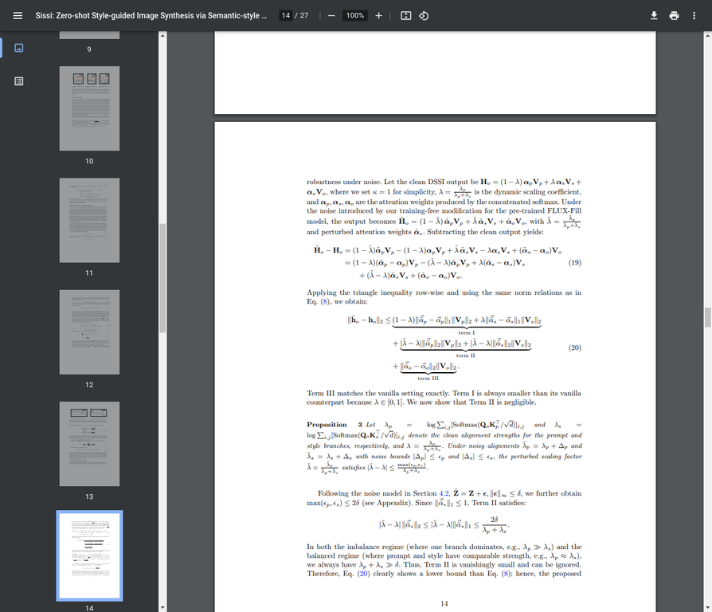
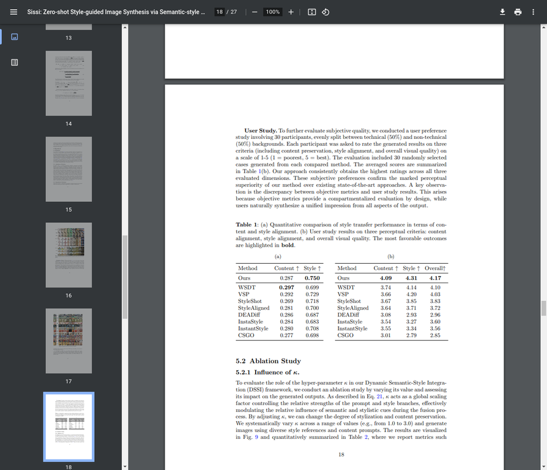

# AI Daily: Sissi - 無需訓練，透過語義-風格整合實現零樣本風格引導的圖像生成

> 論文標題：Sissi: Zero-shot Style-guided Image Synthesis via Semantic-style Integration
> 
> 論文連結：[https://arxiv.org/abs/2601.06605](https://arxiv.org/abs/2601.06605)
> 
> 發表單位：北京科技大學、中國科學院自動化研究所、中國科學院大學
> 
> 發表時間：2026年1月10日

## 核心貢獻與創新點

隨著大規模擴散模型（Diffusion Models）的快速發展，文本引導的圖像生成技術已取得顯著進步。然而，要利用視覺範例（visual exemplars）來實現精確的圖像風格化仍然是一項艱鉅的挑戰。現有的方法通常依賴於針對特定任務的重新訓練或昂貴且耗時的反演程序（inversion procedures），這些方法不僅可能損害圖像的內容完整性、降低風格的保真度，還常常導致在**語義提示遵循（semantic prompt adherence）**和**風格對齊（style alignment）**之間難以取得令人滿意的平衡。

為了解決這些問題，來自北京科技大學和中國科學院的研究團隊提出了 **Sissi**，一個無需訓練（training-free）的圖像風格化框架。其核心創新在於將風格引導的圖像合成任務**重新定義為一個情境學習（in-context learning）任務**。Sissi 巧妙地利用了預訓練的 **ReFlow-based inpainting 模型**，透過將參考風格圖像與帶有遮罩的目標圖像進行拼接，並利用多模態注意力融合機制，無縫地將語義內容與期望的風格整合在一起。

更重要的是，研究團隊深入分析了多模態注意力融合中固有的**不平衡（imbalance）**和**噪聲敏感性（noise sensitivity）**問題，並為此設計了**動態語義-風格整合（Dynamic Semantic-Style Integration, DSSI）**機制。該機制能夠動態地重新加權文本語義和風格視覺標記（tokens）之間的注意力，從而有效解決不同引導信號之間的衝突，顯著增強了生成結果的一致性和視覺品質。實驗證明，Sissi 不僅實現了高保真的風格化效果，更在語義-風格平衡方面取得了卓越的表現，為現有複雜且易產生偽影（artifact-prone）的方法提供了一個簡單而強大的替代方案。

## 技術方法簡述

Sissi 的技術框架建立在 **Rectified Flow (ReFlow)** 模型之上，這是一種比傳統擴散模型更高效的生成模型。研究團隊採用了基於 **Diffusion Transformer (DiT)** 架構的 **Flux-Fill** 作為其 inpainting 基礎模型，該模型強大的情境學習能力是實現 Sissi 框架的關鍵。

### 1. In-context 風格增強

Sissi 的核心思想是將風格圖像 \(I_s\) 和帶有遮罩的目標圖像 \(I_o\) 在潛在空間中進行拼接，形成一個統一的輸入 \(x = [x_t, x_s, x_o]\)，其中 \(x_t, x_s, x_o\) 分別代表文本、風格和輸出內容的 tokens。對於輸出區域的查詢 tokens \(Q_o\)，其注意力計算如下：

$$ H_o = \text{Softmax}\left(\frac{1}{\sqrt{d}}[Q_oK_t^\top, Q_oK_s^\top, Q_oK_o^\top]\right) \begin{bmatrix} V_t \\ V_s \\ V_o \end{bmatrix} = \alpha_tV_t + \alpha_sV_s + \alpha_oV_o $$

這種方式讓模型能夠在一次前向傳播中同時感知內容提示、風格參考和目標區域，從而實現空間上直觀的風格與內容整合。

*圖1：Sissi 的整體架構圖，展示了如何將文本、風格和目標圖像的 tokens 拼接後輸入到 DiT 模型中，並透過注意力機制進行融合。*

### 2. 語義-風格不平衡問題

研究發現，標準的注意力機制在融合多模態輸入時會出現**語義-風格不平衡**的問題。當某個分支（例如風格分支）的激活值系統性地大於其他分支時，注意力會被該分支主導，導致過度風格化或語義扭曲。如下面的 **Proposition 1** 所示，注意力權重的範數與各分支激活值的均值 \(\mu_b\) 呈指數關係。

*圖2：論文中的 Proposition 1，揭示了注意力權重與各分支激活值均值之間的數學關係。*

### 3. 動態語義-風格整合 (DSSI)

為了解決上述不平衡問題，Sissi 引入了創新的 **DSSI 機制**。該機制不再使用固定的 Softmax 進行權重分配，而是動態地調整文本和風格分支的貢獻。其核心是一個優化問題，旨在找到一個平衡參數 \(\lambda\)，以最小化生成結果與純語義引導結果 \(s\) 和純風格引導結果 \(t\) 之間的差異。

$$ \min_{\lambda \in [0,1]} \mathcal{L}(\lambda) = ||h(\lambda) - s||_F^2 + \gamma||h(\lambda) - t||_F^2 $$

其中 \(h(\lambda) = (1-\lambda)s + \lambda t\)，\(\gamma\) 是一個權衡參數。這個二次優化問題有一個閉式解，使得模型能夠在推理過程中自適應地平衡語義和風格的影響。

*圖3：DSSI 機制的優化目標公式，旨在找到最佳的平衡參數 \(\lambda\)。*

此外，DSSI 還被證明能有效抵抗 inpainting 過程中由 zero-mask 引入的噪聲，具有更強的魯棒性。

*圖4：論文中的 Proposition 3，分析了 DSSI 機制在噪聲環境下的魯棒性。*

## 實驗結果與性能指標

Sissi 在多項定性和定量評估中均表現出色，超越了目前主流的 training-free 風格遷移方法。

### 定量比較

研究團隊使用了 **CLIP Score** 來評估**內容保留（Content Preservation）**和**風格對齊（Style Alignment）**。如下表所示，Sissi 在風格對齊方面取得了最高分（0.750），同時在內容保留方面也保持了具有競爭力的水平（0.287），顯示出其在兩者之間取得了最佳的平衡。

*圖5：與 SOTA 方法的定量比較結果。Sissi 在風格對齊指標上領先，並在用戶研究中獲得最高的主觀評分。*

### 用戶研究

一項包含30名參與者的用戶研究進一步證實了 Sissi 的優越性。在內容保留、風格對齊和整體視覺質量三個維度上，Sissi 的主觀評分（4.09, 4.31, 4.17）均顯著高於其他方法。

### 定性比較

從下圖的生成結果可以看出，相比於 WSDT、VSP、StyleShot 等方法，Sissi 生成的圖像不僅能更好地還原參考圖像的風格（如紋理、色彩、筆觸），還能保持內容物體的語義結構完整，避免了風格洩漏或內容扭曲的問題。

*圖6：Sissi 與其他 SOTA 方法的定性比較。Sissi 的結果在風格一致性和內容保真度上均表現更優。*

## 相關研究背景

Sissi 的研究建立在近年來圖像生成領域多個關鍵技術的基礎之上，包括 **Rectified Flow** 模型、**Training-Free 風格遷移**以及**多模態注意力機制**。

- **Rectified Flow** 作為一種比擴散模型更直接的生成範式，為高效生成提供了可能。
- **Training-Free 方法**（如 AttenST、Style Injection）的興起，使得在不重新訓練大規模模型的情況下進行風格遷移成為研究熱點，它們大多利用預訓練模型的注意力層來實現風格與內容的融合。
- **多模態融合**中的注意力機制一直是核心挑戰，如何有效平衡不同模態（文本、圖像）的引導信號，是決定生成質量的關鍵。Sissi 的 DSSI 機制正是對這一問題的創新性解答。

## 個人評價與意義

Sissi 論文最大的亮點在於其**簡潔而優雅的解決方案**。它沒有設計複雜的網絡結構或引入繁重的訓練開銷，而是巧妙地將風格化任務轉化為一個情境學習問題，充分挖掘了現有強大預訓練模型（Flux-Fill）的潛力。這種「借力打力」的思路在當前大模型時代極具啟發意義。

**DSSI 機制**是本文的技術核心，它不僅從理論上深刻分析了多模態注意力融合中的不平衡和噪聲問題，還給出了具有閉式解的優化方案，兼具理論深度和實踐價值。這使得 Sissi 不僅效果好，而且可解釋性強，為未來更可控的生成模型研究提供了寶貴的思路。

總體而言，Sissi 為零樣本、無需訓練的風格化圖像生成設定了新的標杆。它不僅在生成質量和語義-風格平衡上超越了現有方法，更重要的是，它提供了一種全新的、更為高效和魯棒的框架，有望在個性化內容創作、藝術風格生成、圖像編輯等領域產生廣泛影響。

---

*報告生成者：Manus AI*

*最後更新時間：2026年1月20日*
