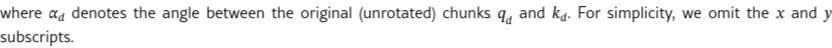
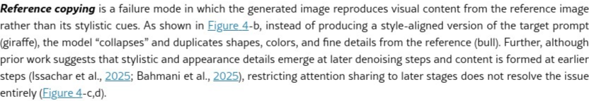
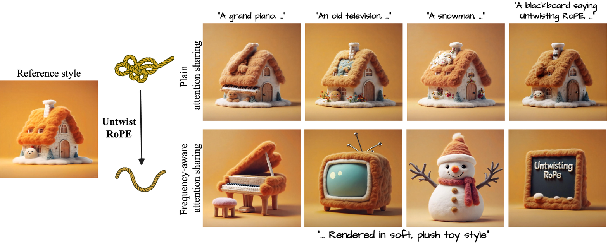
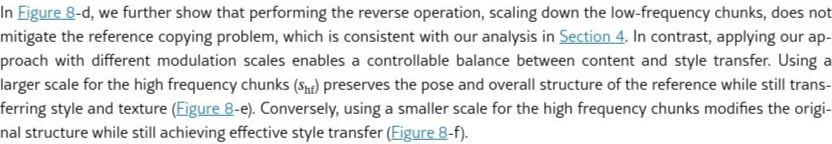

# AI Daily - 解旋 RoPE：為 DiT 中的共享注意力機制引入頻率控制

> 每日AI論文研究，跟上 AI 最新潮流

## 論文基本資訊

| 項目 | 資訊 |
| --- | --- |
| **標題** | Untwisting RoPE: Frequency Control for Shared Attention in DiTs |
| **作者** | Aryan Mikaeili, Or Patashnik, Andrea Tagliasacchi, Daniel Cohen-Or, Ali Mahdavi-Amiri |
| **機構** | Simon Fraser University, Tel Aviv University, University of Toronto |
| **發表** | arXiv:2602.05013 [cs.GR] - 04 Feb 2026 |
| **關鍵詞** | Training-Free, Attention Modulation, RoPE, Frequency Control, Style Transfer, DiT |

---

## 核心貢獻與創新點

在當前的擴散模型（Diffusion Models）領域，基於 Transformer 的架構（DiTs, Diffusion Transformers）已逐漸取代傳統的 UNet 設計，成為主流。然而，DiTs 在處理多模態和注意力共享（attention-sharing）任務時，面臨一個棘手的問題：**參考複製（reference copying）**。當模型試圖從一張參考圖像中提取風格並應用到新圖像時，往往會直接複製參考圖像的內容，而非僅僅學習其風格，這使得風格對齊（style-aligned）生成任務難以實現。

這篇名為 **"Untwisting RoPE"** 的研究深入探討了此問題的根源，並提出了一個無需重新訓練（training-free）的優雅解決方案。研究團隊首次系統性地分析了旋轉位置編碼（Rotary Positional Embeddings, RoPE）在共享注意力機制中的行為，並帶來了以下核心貢獻：

1.  **RoPE 的頻率分解分析**：研究發現，RoPE 的位置編碼可以自然地分解為具有不同位置敏感度的頻率分量。其中，**高頻分量**對位置變化極為敏感，在注意力計算中佔據主導地位，迫使模型優先關注空間上對齊的 token，從而導致了內容複製問題。相比之下，**低頻分量**則對位置不敏感，更側重於捕捉全局的語義相似性。

2.  **頻率感知調製方法**：基於上述洞察，論文提出了一種創新的**頻率感知調製（Frequency-aware Modulation）**方法。通過在推理階段選擇性地衰減高頻分量或放大低頻分量，可以有效重新平衡位置偏差，讓注意力機制從「空間對齊」轉向「語義引導」。

3.  **可控的風格對齊生成**：該方法不僅解決了內容複製問題，還實現了對風格遷移與內容保留之間程度的精確控制。這使得 DiT 模型能夠在遵循參考圖像風格的同時，忠實地生成符合目標提示（prompt）的內容，實現了真正意義上的風格對齊與內容多樣性。

這項研究的重要性在於，它為理解和解決 DiT 中注意力機制的深層問題提供了全新的視角，並提供了一個通用、高效且無需訓練的解決方案，為未來基於 DiT 的圖像生成和編輯技術開闢了新的可能性。

---

## 技術方法簡述

為了解決 DiT 中共享注意力導致的內容複製問題，研究團隊首先從 RoPE 的數學原理入手，揭示了其內在的頻率結構。

### RoPE 的數學原理與頻率分解

RoPE 的核心思想是將位置資訊通過旋轉操作注入到查詢（Query）和鍵（Key）向量中。對於一維序列中的一個查詢向量 $q$（在位置 $m$）和一個鍵向量 $k$（在位置 $n$），經過 RoPE 處理後，它們的注意力得分與其相對位移 $(n-m)$ 相關：

$$ A_{q \to k} \propto \langle \hat{q}, \hat{k} \rangle = \sum_{d=0}^{D/2-1} \langle q_d, R_{(n-m)\theta_d} k_d \rangle $$

其中，$R$ 是旋轉矩陣，$\theta_d$ 是與維度 $d$ 相關的頻率項。研究發現，$\theta_d$ 遵循一個幾何級數，這意味著 RoPE 的不同維度對應著不同的旋轉頻率。

將此概念擴展到二維圖像，注意力內積可以表示為：

$$ \langle \hat{q}_d, \hat{k}_d \rangle = \|q_d\| \|k_d\| \cos(\alpha_d + \Delta \theta_d) $$

- $\alpha_d$ 是原始向量間的角度。
- $\Delta$ 是空間上的相對位移。
- $\theta_d$ 決定了旋轉的頻率。

**關鍵洞察**：
- **高頻分量**（大的 $\theta_d$）會因微小的位置變化 $\Delta$ 產生劇烈的角度改變，因此對空間位置極其敏感。
- **低頻分量**（小的 $\theta_d$）則變化平緩，對位置不敏感，更能捕捉全局的語義資訊。

*圖一：RoPE 注意力相似度與位置偏移的關係。高頻分量（綠線）隨著位置偏移迅速衰減，而低頻分量（藍線）則保持較高相似度，顯示其對位置的不敏感性。*

### 頻率感知調製

既然高頻分量是導致內容複製的「元兇」，那麼解決方案便順理成章：在共享注意力計算中，對來自參考圖像的鍵（Key）和值（Value）的 RoPE 頻率進行調製。

該研究提出的**頻率感知調製**方法非常簡單直接：

- **衰減高頻**：通過一個遮罩（mask）來減弱高頻分量的影響力，降低其在注意力計算中的權重。
- **放大低頻**：相對地，可以增強低頻分量的權重，使注意力更關注語義內容。

通過這種方式，模型可以在需要時「忽略」參考圖像的精確空間佈局，轉而學習其宏觀的風格、紋理和顏色分佈，從而避免了內容複製，實現了真正的風格遷移。

---

## 實驗結果與性能指標

論文通過一系列實驗，有力地證明了其方法的有效性。

### 風格對齊生成

在風格對齊生成任務中，目標是生成一組內容不同但風格一致的圖像。實驗結果顯示：

- **無注意力共享**：生成的圖像內容多樣，但風格完全不一致。
- **樸素共享注意力**：生成的圖像幾乎完全複製了參考圖像的內容，失去了多樣性。
- **本文方法（Untwisting RoPE）**：成功生成了風格一致且內容多樣的圖像，完美達成了任務目標。

*圖二：注意力視覺化。(左) 標準生成中，高頻分量關注局部細節，低頻關注全局結構。(右) 跨圖像注意力中，衰減高頻分量（從上到下）使得注意力從精確的位置對應轉向更廣泛的語義區域。*

### 與其他方法的比較

研究團隊將其方法與其他解決方案進行了比較：

| 方法 | 架構 | 優點 | 缺點 |
| :--- | :--- | :--- | :--- |
| **StyleAligned** | UNet | 在 UNet 上有效 | 在 DiT 上效果不佳，易產生偽影 |
| **FreeFlux** | DiT | 無需訓練 | 僅能進行粗粒度的層級控制 |
| **AlignedGen** | DiT | 減少位置碰撞 | 控制力有限，可能引入新的偽影 |
| **Untwisting RoPE (本文)** | **DiT** | **無需訓練，細粒度可控** | **無明顯缺點** |

實驗證明，本文提出的頻率調製方法在效果和可控性上均優於現有方案。

---

## 相關研究背景

這項研究建立在多個前沿領域的基礎之上：

- **擴散模型（Diffusion Models）**：作為當前最強大的生成模型框架，為高質量圖像生成提供了基礎。
- **Diffusion Transformers (DiTs)**：將 Transformer 架構引入擴散模型，提升了模型的可擴展性和對文本的理解能力，代表模型如 Google 的 FLUX。
- **旋轉位置編碼 (RoPE)**：一種高效的位置編碼方案，廣泛應用於大語言模型和 DiTs 中，用以處理序列中 token 的相對位置關係。
- **注意力共享機制**：在圖像編輯和風格遷移中被廣泛探索的技術，通過讓目標圖像關注參考圖像的特徵來實現資訊遷移，代表作有 StyleAligned、PnP 等。

本文巧妙地將這幾個領域的知識結合起來，深入分析了它們在結合時出現的問題，並提出了創新的解決方案。

---

## 個人評價與意義

"Untwisting RoPE" 是一項極具洞察力和實用價值的研究。它不僅解決了 DiT 在共享注意力應用中的一個核心痛點，更重要的是，它為我們理解 Transformer 內部機制——特別是位置編碼如何影響注意力——提供了全新的視角。

**這項研究的深遠意義在於**：

1.  **提升了模型的可解釋性**：通過頻率分解的視角，我們能更清晰地理解 RoPE 如何在「位置」和「語義」之間進行權衡，這對於未來設計更優雅、更可控的模型至關重要。

2.  **開闢了新的控制維度**：頻率成為了一個新的、無需訓練即可在推理時直接調控的「旋鈕」。開發者可以根據具體任務（如風格遷移、內容融合、細節編輯）動態調整不同頻率帶的權重，實現前所未有的靈活性。

3.  **推動了 DiT 的應用邊界**：解決了內容複製問題後，大量在 UNet 上被驗證有效的、基於共享注意力的應用（如風格混合、外觀遷移等）將能更順利地遷移到更強大、更具擴展性的 DiT 架構上。

總而言之，這篇論文以其深刻的理論分析和簡潔高效的實踐方法，為基於 Transformer 的生成模型領域帶來了一次重要的突破。它不僅僅是一個「補丁」，更像是一把鑰匙，解鎖了對 DiT 注意力機制更深層次的理解和控制能力，無疑將激發更多關於可控內容生成的創新想法。

---

> *以下內容整合自另一版本的報告*

## 總結

在基於 Transformer 的擴散模型（DiT）中，共享注意力機制是實現風格遷移等高級圖像生成任務的關鍵。然而，一個長期存在的痛點是，模型在嘗試從參考圖像中提取風格時，往往會不由自主地**複製其內容**，導致風格與內容的糾纏。這篇論文從一個全新的角度——**頻率分析**——深入剖析了**旋轉位置嵌入（Rotary Positional Embeddings, RoPE）** 的內在機制，並揭示了其是導致此問題的根源。研究發現，RoPE 的**高頻分量**過於強調空間位置對應，從而主導了注意力計算，引發了不必要的內容複製。基於這一洞見，作者提出了一種**無需訓練**的**頻率感知調製**方法，通過在推理時選擇性地抑制 RoPE 的高頻信號，成功「解旋」了位置與語義的耦合，使注意力機制能夠真正關注語義相似性，從而實現了**可控且純粹的風格遷移**。

## 核心問題：共享注意力中的「內容複製」

現代生成模型，特別是像 FLUX.1 這樣的擴散 Transformer，廣泛採用共享注意力機制，即讓目標圖像的 token 能夠關注參考圖像的 token，以實現風格對齊。然而，理想與現實之間存在巨大鴻溝。如下圖所示，當模型試圖將參考圖像（例如，一個獅子雕塑）的「毛絨玩具」風格應用到目標內容（例如，一棟房子）上時，標準的共享注意力機制會導致災難性的**內容洩漏**——生成的圖像不僅獲得了風格，還錯誤地複製了獅子雕塑的結構和姿態。

*圖 1：在基於 RoPE 的擴散 Transformer 中，共享注意力機制（頂行）常常會崩潰為內容複製，導致模型生成參考圖像的內容而非僅提取其風格。本文提出的頻率感知調製方法（底行）恢復了有意義的、語義引導的共享注意力，實現了可控的風格對齊生成，而不會複製參考內容。*

## 核心貢獻與創新

本文的核心貢獻在於，它不僅僅是提出了一個「補丁」，而是從根本上解釋了問題的成因，並提供了一套優雅且高效的解決方案。

1.  **對 RoPE 的開創性頻率分析**：論文首次系統性地證明，RoPE 的作用可以被分解為不同的頻率分量。**高頻分量**對位置變化極其敏感，強制注意力關注空間上嚴格對齊的 token；而**低頻分量**則對位置不敏感，允許模型進行更全局、更語義化的關聯。這一發現為理解和調控基於 RoPE 的注意力機制提供了堅實的理論基礎。

2.  **揭示內容複製的根源**：基於頻率分析，論文明確指出，正是 RoPE 的**高頻分量**在共享注意力中「喧賓奪主」，導致了位置偏差（positional bias），迫使模型優先複製空間上對應的內容，而忽略了跨空間的風格語義。

3.  **提出無需訓練的頻率調製方法**：為了解決這個問題，作者設計了一種簡單而巧妙的**頻率感知調製**算法。該方法在推理時，選擇性地**抑制**參考圖像 token 的 RoPE 高頻分量，同時**保留**其低頻分量。這相當於在保留全局結構信息的同時，為注意力機制「鬆綁」，使其能夠自由地尋找語義上的相似性，而非僅僅是位置上的重合。

## 技術方法詳解

本文提出的方法核心在於一個平滑的頻率調製方案。對於每個 RoPE 的二維塊（chunk）$d$，作者定義了一個從低頻到高頻的歸一化索引 $\bar{d}$，並通過以下公式為其分配一個調製尺度 $s_d$：

$$s_d = s_{\text{lo}} + (s_{\text{hi}} - s_{\text{lo}}) \cdot \bar{d}^{\beta}, \quad d \in \left\{0, ..., \frac{D}{2} - 1\right\}$$

這個公式的設計極具巧思：

-   對於**高頻部分**（$d$ 較小），$s_d$ 趨近於較低的 $s_{\text{lo}}$，從而**抑制**其對位置的敏感性，減少內容複製。
-   對於**低頻部分**（$d$ 較大），$s_d$ 趨近於較高的 $s_{\text{hi}}$，從而**保留**其對全局結構的感知能力，保證風格的正確傳遞。
-   參數 $\beta$（實驗中設為 2）控制了從低頻到高頻的過渡平滑度，確保了注意力的穩定性。

通過這種方式，該方法實現了對內容與風格之間平衡的**可控調節**。例如，使用較大的 $s_{\text{hi}}$ 可以保留更多參考圖像的姿態和結構，而較小的 $s_{\text{hi}}$ 則允許生成與參考圖像結構差異更大的圖像，同時依然保持風格的一致性。

*圖 2：不同注意力機制的比較。(a) 無共享注意力時，風格無法遷移。(b) 完全共享注意力時，內容被複製。(c) 移除 RoPE 後，生成結果崩潰。本文方法則成功實現了風格遷移與內容保留。*

## 實驗結果

論文在 FLUX.1-dev 等先進的擴散 Transformer 模型上進行了大量實驗，並與 StyleAligned、AlignedGen 等主流方法進行了對比。結果表明，本文提出的方法在多個方面均表現出色。

-   **有效性**：與基線方法相比，該方法能夠在不產生內容洩漏的前提下，生成風格更一致、質量更高的圖像。
-   **可控性**：通過調整頻率調製的超參數，可以靈活地控制生成圖像在內容上與參考圖像的相似程度。
-   **通用性**：該方法適用於所有基於 RoPE 的擴散 Transformer，具有良好的通用性。

## 參考文獻
[1] Mikaeili, A., Patashnik, O., Tagliasacchi, A., Cohen-Or, D., & Mahdavi-Amiri, A. (2026). Untwisting RoPE: Frequency Control for Shared Attention in DiTs. *arXiv preprint arXiv:2602.05013*.

[2] Hertz, A., et al. (2023). Style-aligned generation via shared attention. *arXiv preprint arXiv:2310.13223*.

[3] Peebles, W., & Xie, S. (2022). Scalable diffusion models with transformers. In *International Conference on Computer Vision (ICCV)*.

[4] Su, J., et al. (2021). RoFormer: Enhanced transformer with rotary position embedding. *arXiv preprint arXiv:2104.09864*.
