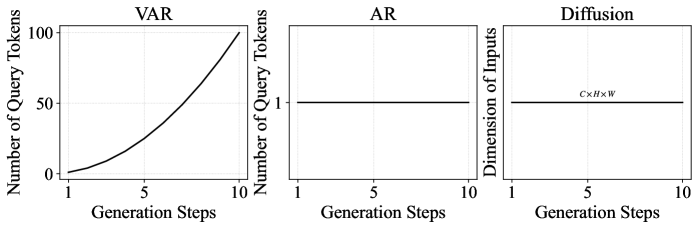
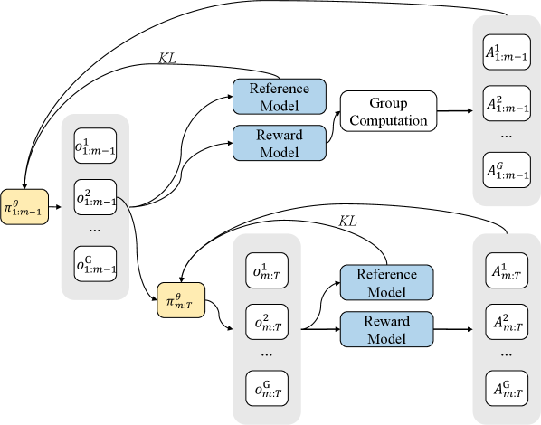
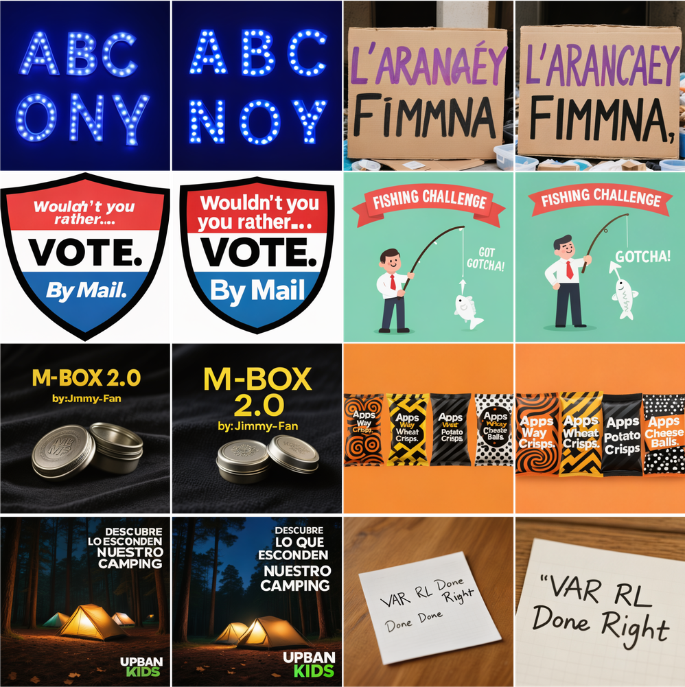

# AI Daily: VAR RL Done Right - 解決視覺自回歸生成中的異步策略衝突

> **論文名稱：** VAR RL Done Right: Tackling Asynchronous Policy Conflicts in Visual Autoregressive Generation
> **作者：** Shikun Sun, Liao Qu, Huichao Zhang, et al.
> **機構：** Tsinghua University, ByteDance
> **發表日期：** 2026年1月5日
> **論文連結：** [https://arxiv.org/abs/2601.02256](https://arxiv.org/abs/2601.02256)
> **開源項目：** [https://github.com/ByteVisionLab/NextFlow](https://github.com/ByteVisionLab/NextFlow)

---

## 核心貢獻與創新點

視覺自回歸（Visual Autoregressive, VAR）模型在圖像生成領域展現了巨大潛力，但將其與強化學習（Reinforcement Learning, RL）結合時，會面臨嚴峻的**異步策略衝突（Asynchronous Policy Conflicts）**問題。這主要是因為VAR模型在不同生成步驟中處理異構的輸入結構，導致訓練不穩定和對齊效果不佳。

本篇論文首次對文本到圖像的VAR模型進行了系統性的RL研究，並提出了一個創新的框架來解決上述挑戰。其核心貢獻可歸納為以下三點：

1.  **診斷並形式化問題**：深入分析了VAR模型在RL應用中的異步策略衝突，並將其形式化為一個確定性的馬可夫決策過程（MDP），揭示了傳統bandit-style GRPO方法在異構並行動作下變得不穩定的根本原因。

2.  **提出三大協同優化組件**：為了解決此問題，論文設計了三個協同工作的模塊，共同增強了Group Relative Policy Optimization (GRPO)的性能：
    *   **Value as Middle Return (VMR)**：一種結構保持的中間獎勵機制，為早期生成步驟提供密集、低方差的反饋，且理論上不改變最優策略。
    *   **Per-Action Normalization Weighting (PANW)**：一種動態時間步重加權方案，根據每步的token網格大小進行歸一化，以平衡不同解析度更新的影響，提高訓練穩定性。
    *   **Mask Propagation (MP)**：一種新穎的掩碼傳播算法，用於在時空維度上隔離優化效果，將信用精準分配給對最終結果貢獻最大的token。

3.  **建立首個系統性VAR RL框架**：整合上述組件，論文提出了首個針對文本到圖像VAR模型的系統性RL框架。實驗證明，該框架在GRPO基線和以擴散模型為中心的競爭者上均取得了顯著的性能提升，尤其在文本渲染等需要精細對齊的任務上表現出色。

*圖1：此圖展示了VAR、AR和Diffusion模型在RL優化過程中，查詢token數量的變化。VAR模型中token數量的劇烈波動是導致策略衝突的核心原因。*

---

## 技術方法簡述

為了解決VAR模型在RL中的核心挑戰，研究者將生成過程建模為一個MDP，並在此基礎上引入了VMR、PANW和MP三大核心技術。

### VAR序列作為MDP

*   **狀態空間 (State Space) S**：每個狀態 `s_t` 是由解析度從低到高的token網格 `(r_1, r_2, ..., r_t)` 組成的部分VAR序列。
*   **動作空間 (Action Space) A**：每個動作 `a_t` 對應生成下一個更高解析度的token網格 `r_{t+1}`。
*   **獎勵函數 (Reward Function) r**：環境僅在生成過程結束時提供一個最終回報 `R(s_T)`，這使得信用分配變得極具挑戰性。

### Value as Middle Return (VMR)

VMR的核心思想是將長序列的RL優化問題分解為一個兩階段問題。研究者在生成序列的中間步驟 `m` 處插入一個**中間軟價值函數 (intermediate soft value)**，並以分段的方式（pre-m和post-m）進行優化。這種類似於獎勵塑形（Reward Shaping）的方法，可以在不改變最優策略的前提下，為模型的早期決策提供更頻繁、更穩定的學習信號。

中間軟價值函數 `V_m` 的定義如下：

$$ V_m(s_m) = \eta \ln \mathbb{E}_{a \sim \pi_{\text{ref}}(\cdot|s_m)} [\exp(\frac{1}{\eta} Q(s_m, a))] $$

其中 `Q(s_m, a)` 是從狀態 `s_m` 開始的期望回報。通過這種方式，模型可以在生成早期就獲得關於未來可能回報的估計，從而指導策略向更優的方向調整。

*圖3：VMR通過在中間步驟引入獎勵模型和參考模型，將單一的KL散度約束分解為兩部分，從而穩定訓練過程。*

### Per-Action Normalization Weighting (PANW)

由於VAR模型在不同步驟生成的token網格大小不一（異質性），高解析度步驟的梯度更新往往會主導整個訓練過程。PANW通過對每個步驟 `t` 的損失函數進行加權來解決這個問題，權重 `k_t` 與該步驟的token網格大小 `h_t × w_t` 成反比：

$$ k_t = \frac{1}{h_t \cdot w_t} $$

這種簡單而有效的方法平衡了KL散度和梯度尺度，顯著提高了訓練的穩定性。

### Mask Propagation (MP)

MP的靈感來源於基於梯度的獎勵反饋機制。它維護一個時空掩碼，用於追蹤那些對最終獎勵有顯著貢獻的token。這個掩碼會沿著生成序列從後向前傳播，從而將中間獎勵和梯度更新的影響力集中在因果相關的區域，極大地減少了獎勵分配的方差。

---

## 實驗結果與性能指標

論文通過在極具挑戰性的文本渲染（Text Rendering）任務上進行實驗，驗證了所提出框架的有效性。實驗採用NextFlow作為基礎模型，生成1024x1024解析度的圖像。

**主要發現：**

*   **訓練穩定性顯著提升**：如下圖所示，與vanilla GRPO相比，引入VMR後的訓練曲線（特別是採用了prefix scales的曲線）顯示出更快的收斂速度和更高的最終獎勵，證明了VMR在穩定訓練和加速收斂方面的有效性。

*圖2：vanilla GRPO與帶有VMR的GRPO在不同prefix scales下的訓練曲線對比。*

*   **文本渲染質量大幅改善**：視覺結果表明，經過RL優化後，模型在生成包含複雜文本的圖像時，無論是字符的準確性、字形的清晰度，還是整體佈局的合理性，都有了質的飛躍。下圖展示了優化前後的鮮明對比。

*圖5：RL優化前後的文本渲染結果對比。左側為優化前，右側為優化後。可以看到，優化後的圖像在文本拼寫和樣式上都更加準確。*

*   **消融實驗驗證組件有效性**：論文通過詳盡的消融研究，分別驗證了VMR、PANW和MP三個組件對最終性能的貢-獻，證明了它們的協同作用是實現穩健優化的關鍵。

---

## 相關研究背景

本文的研究建立在視覺生成領域的三大主流範式之上：自回歸模型（AR）、擴散模型（Diffusion Models）和視覺自回歸模型（VAR）。

*   **自回歸模型 (AR)**：如VQ-VAE和VQGAN，將圖像離散化為token序列，並以光柵掃描（raster-scan）的順序進行生成。雖然效果不錯，但其推理速度較慢。
*   **視覺自回歸模型 (VAR)**：為了解決AR模型的效率問題，VAR採用了從粗到細（coarse-to-fine）的 next-scale 預測策略，在不同解析度層級上並行生成token，顯著提高了採樣效率和圖像保真度。
*   **強化學習用於圖像生成**：RL，特別是基於PPO的GRPO，已被成功應用於增強大型語言模型（LLM）的推理和對齊能力。近年來，這一範式也被擴展到視覺生成領域，用於提升模型的可控性和輸出質量。

然而，將RL直接應用於VAR模型的研究尚處於起步階段。本文正是在這一背景下，針對VAR模型的獨特結構挑戰，進行了開創性的探索。

---

## 個人評價與意義

`VAR RL Done Right`這篇論文不僅僅是對現有技術的簡單組合，更是對視覺自回歸模型與強化學習結合過程中遇到的核心瓶頸問題的深刻洞察和有效解決。它為如何將強大的RL優化能力賦能給高效的VAR生成模型，提供了一套完整且經過理論與實踐雙重驗證的“正確姿勢”。

**其主要意義在於：**

1.  **理論價值**：論文清晰地定義和分析了“異步策略衝突”這一關鍵障礙，並從理論上證明了其提出的VMR方法在保持最優策略不變的情況下，能夠有效穩定訓練過程。這為後續研究提供了堅實的理論基礎。

2.  **實踐價值**：該研究提供了一個即插即用的框架，可以顯著提升現有VAR模型在需要精細對齊的下游任務（如文本渲染、佈局控制等）上的表現。開源的代碼庫也極大地便利了社區的跟進和應用。

3.  **未來啟示**：這項工作打開了將RL更深入、更廣泛地應用於多尺度、多階段生成模型的新大門。未來，類似的思路有望被應用到視頻生成、3D內容創建等更複雜的領域，解決其中存在的類似的信用分配和訓練穩定性問題。

總體而言，這是一篇兼具理論深度和實踐價值的優秀論文，為VAR模型的發展和優化開闢了新的道路，非常值得相關領域的研究者和從業者深入學習。

---

### 參考文獻

[1] Sun, S., Qu, L., Zhang, H., Liu, Y., Song, Y., Li, X., ... & Jia, J. (2026). *VAR RL Done Right: Tackling Asynchronous Policy Conflicts in Visual Autoregressive Generation*. arXiv preprint arXiv:2601.02256.
