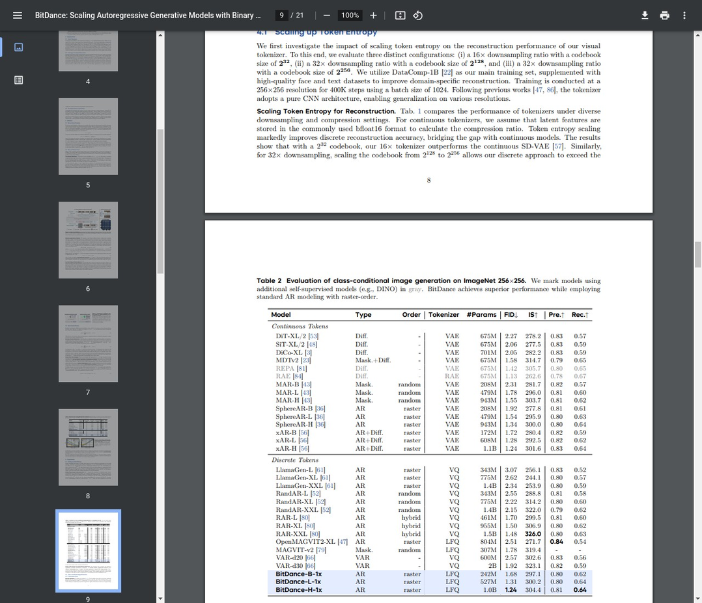

# AI Daily: BitDance - 用二元 Token 擴展自回歸生成模型的新篇章

> **論文標題**: BitDance: Scaling Autoregressive Generative Models with Binary Tokens
> **發表於**: arXiv 2026
> **作者**: Yuang Ai, Jiaming Han, Shaobin Zhuang, et al.
> **研究機構**: ByteDance, MMLab, CUHK, SJTU, CAS, NUS
> **論文連結**: [https://arxiv.org/abs/2602.14041](https://arxiv.org/abs/2602.14041)
> **代碼連結**: [https://github.com/ballsbydraws204/BitDance](https://github.com/ballsbydraws204/BitDance)

---

## 總結

自回歸（Autoregressive, AR）模型在圖像生成領域長期以來面臨著**效率**與**品質**的雙重挑戰。傳統 AR 模型逐一預測離散的視覺 Token，雖然在概念上簡單，但在處理高解析度圖像時，其序列化的生成過程導致了難以忍受的推理延遲。另一方面，為了捕捉豐富的視覺細節，模型需要一個龐大的視覺詞彙表（Visual Vocabulary），但這又會帶來巨大的參數開銷和採樣困難。

來自 **ByteDance** 的最新研究 **BitDance** [1] 為這一困境提供了全新的解決方案。該研究提出了一個**可擴展**且**高效**的自回歸圖像生成器，其核心創新在於使用**二元視覺 Token（Binary Visual Tokens）**，並結合了**二元擴散頭（Binary Diffusion Head）**和**次世代補丁擴散（Next-Patch Diffusion）**兩大關鍵技術。BitDance 不僅在生成品質上達到了 SOTA 水準（在 ImageNet 256x256 上實現了 **1.24** 的 FID），更在推理速度上取得了驚人的突破，生成 1024x1024 圖像時比先前的 AR 模型快 **30 倍**以上。這項工作為構建高效的 AR 基礎模型開闢了新的道路。

## 核心貢獻

BitDance 的成功主要歸功於三大核心創新，它們共同解決了傳統 AR 模型在擴展性、效率和生成品質上的核心痛點。

| 創新點 | 解決的問題 | 核心方法 |
| :--- | :--- | :--- |
| **二元視覺 Token** | 視覺詞彙表的表達能力與參數量的權衡 | 採用高熵的二元潛在變量，將每個 Token 的狀態空間擴展至 $2^{256}$，實現了緊湊而富有表現力的離散表示。 |
| **二元擴散頭** | 從巨大的 Token 空間中高效、精確採樣的挑戰 | 拋棄傳統的 Softmax 分類頭，轉而使用連續空間的擴散過程來生成二元 Token，有效解決了採樣瓶頸。 |
| **次世代補丁擴散** | AR 模型序列化生成導致的推理速度緩慢 | 提出一種新的並行解碼方法，能夠一次性準確預測多個 Token（一個 Patch），極大地提升了推理效率。 |

*圖說：BitDance 的整體架構。輸入圖像首先被編碼為二元潛在變量，然後展平為一維序列，遵循 Patch-wise 的光柵掃描順序。模型使用 Next-Patch Diffusion 進行訓練，並利用二元擴散頭實現高效精確的並行預測。*

## 技術方法詳解

### 1. 二元視覺 Tokenizer (Binary Visual Tokenizer)

為了增強 Token 的表達能力，BitDance 採用了**查找表無關的量化（Lookup-Free Quantization, LFQ）**技術，將視覺詞彙表的大小提升至前所未有的 $2^{256}$。這遠遠超過了傳統 VQ 方法的詞彙量，使得離散表示能夠捕捉到與連續 VAE 相媲美的重建保真度。

其二元量化過程非常直接，對於一個潛在 Token $x \in \mathbb{R}^d$，其量化結果 $x_q$ 通過符號函數獨立應用於每個通道：

$$ x_q = \text{sign}(x) $$

為了防止詞彙表崩潰並最大化信息容量，模型在訓練中引入了熵損失（Entropy Loss）。然而，標準 LFQ 在計算熵時需要比較當前 Token 與整個詞彙表，這在詞彙量達到 $2^{256}$ 時是不可行的。為此，BitDance 巧妙地採用了**分組 LFQ（Group-wise LFQ）**策略，將 $d$ 個通道劃分為多個組進行熵計算，從而在計算效率和優化精度之間取得了平衡。

### 2. 二元擴散頭 (Binary Diffusion Head)

擁有一個巨大的詞彙表帶來了新的挑戰：如何從中進行有效採樣？一個擁有 $d$ 個通道的二元 Token 意味著有 $2^d$ 個可能的離散索引。標準的分類頭需要一個大小為 $h \times 2^d$（$h$ 為隱藏層維度）的參數矩陣，這在 $d=256$ 時會導致參數量的爆炸式增長。

*圖說：(a) 標準 Token 分類頭在擴展性上存在問題；(b) 逐位分類頭雖然可擴展，但其獨立性假設損害了採樣精度；(c) BitDance 提出的二元擴散頭同時實現了擴展性和高精度採樣。*

BitDance 的**二元擴散頭**通過一種全新的範式解決了這個問題。它不再將採樣視為一個分類問題，而是將其建模為一個**連續空間中的擴散過程**。具體來說，它將二元 Token 視為一個 $d$ 維超立方體（Hypercube）的頂點，並利用**修正流（Rectified Flow）**的公式來學習從高斯噪聲到目標二元 Token 的速度場（Velocity Field）。

訓練目標如下：

$$ \mathcal{L}(z, x) = \mathbb{E}_{t,\epsilon} \|v_\theta(z_t, t, z) - v_t\|^2 $$

其中，$z_t = t\epsilon + (1-t)z$ 是在時間 $t$ 插值的帶噪聲 Token，$v_t$ 是目標速度，$v_\theta$ 是由網絡預測的速度。推理時，模型從一個隨機噪聲開始，通過多步積分學習到的速度場，最終通過一個**硬二元化約束（Hard Binarization Constraint）** $z_1 = \text{sign}(z_1)$ 投影回超立方體的頂點，得到生成的二元 Token。

### 3. 次世代補丁擴散 (Next-Patch Diffusion)

標準 AR 模型逐個生成 Token 的方式忽略了圖像中固有的空間局部性。一個局部區域（Patch）內的像素或 Token 通常高度相關。基於這一觀察，BitDance 提出了 **Next-Patch Diffusion**，將生成的基本單位從「下一個 Token」變為「下一個 Patch」。

*圖說：(a) 傳統的並行分類頭採用獨立採樣，違反了並行預測所需的內在依賴性；(b) BitDance 的二元擴散頭能夠對同時生成的 Token 的聯合分佈進行建模，實現了連貫的採樣。*

這帶來了一個關鍵的挑戰：**訓練與推理的不一致性**。如果模型在訓練時仍然是逐 Token 預測，但在推理時卻是並行生成一個 Patch，這種不匹配會嚴重損害生成品質。為了解決這個問題，BitDance 將其二元擴散頭擴展到多 Token 的聯合預測上。其損失函數被修改為對整個 Patch 的聯合速度場進行建模：

$$ \mathcal{L}_{\text{parallel}} = \mathbb{E}_{t,X,\epsilon} \|\|v_\theta(X_t, t, Z) - v_t\|\|^2 $$

其中，$X$ 代表一個 Patch 的所有 Token。這種設計使得模型在訓練時就學習了 Patch 內 Token 的聯合分佈，從而實現了高效且高保真的並行生成。

## 實驗結果

BitDance 在多個基準測試中都取得了卓越的性能，充分證明了其設計的有效性。

### 重建品質

在 ImageNet 256x256 的重建任務中，BitDance 的 Tokenizer 表現出色。即使在 32 倍下採樣的高壓縮率下，其 $2^{256}$ 詞彙表的版本在 **PSNR 和 SSIM 指標上仍然超越了連續的 VAE 模型**，展示了高熵離散表示的巨大潛力。

*圖說：在 ImageNet 256x256 驗證集上的重建性能比較。BitDance 的離散 Tokenizer 在不同壓縮率下均表現出優於連續 VAE 的性能。*

### 類別條件圖像生成

在 ImageNet 256x256 的類別條件生成任務中，BitDance-B-4x 模型取得了 **1.24 的 FID 分數**，這是目前所有已發表的 AR 模型中的最佳成績，甚至優於許多強大的擴散模型，如 DiT-XL/2。值得注意的是，BitDance 在取得這一成績的同時，其模型參數（1.0B）遠少於一些競爭對手（如 RAR-XXL 的 1.5B）。

*圖說：在 ImageNet 256x256 上的類別條件圖像生成評估。BitDance 在保持標準光柵掃描 AR 建模的同時，取得了卓越的性能。*

### 推理效率

效率是 BitDance 最亮眼的優勢之一。得益於 Next-Patch Diffusion，BitDance-B-4x 在與擁有 1.4B 參數的 SOTA 並行 AR 模型（RAR-XXL）的比較中，不僅 FID 分數更低，而且**參數減少了 5.4 倍，速度提升了 8.7 倍**。在生成 1024x1024 的高解析度圖像時，其加速效果更是達到了 **30 倍**以上。

## 相關研究背景

這項工作建立在近年來視覺生成領域多個研究方向的基礎之上：

- **視覺 Tokenizer**: 從 VAE 到 VQ，再到 LFQ 和 FSQ，研究者們一直在探索如何更有效地將連續的圖像信號離散化。
- **自回歸模型**: 從傳統的 Raster-scan 模型，到引入連續空間採樣的 MAR、NextStep-I，再到探索並行生成的 Mask-GIT、VAR、PAR 等，AR 模型正朝著更高效、更高品質的方向發展。
- **擴散模型**: 作為當前生成領域的主流範式，擴散模型以其強大的生成能力著稱。BitDance 巧妙地將擴散模型的思想融入到 AR 的解碼頭中，實現了兩者的優勢互補。

## 個人評價與意義

BitDance 無疑是自回歸圖像生成領域的一個里程碑式的工作。它不僅在理論上提出了一套新穎且自洽的框架，更在實踐中用驚人的實驗數據證明了其有效性。這項研究的意義在於：

1.  **重新定義了 AR 的可能性**：它打破了人們對 AR 模型「慢」和「難以擴展」的刻板印象，展示了 AR 模型在未來作為基礎生成模型的巨大潛力。
2.  **巧妙融合不同範式**：將擴散模型的採樣機制與 AR 模型的序列建模能力相結合，為跨範式模型融合提供了絕佳的範例。
3.  **兼顧「鐵三角」**：在**生成品質**、**推理速度**和**模型規模**這三個通常難以兼得的目標之間，BitDance 找到了一個極具吸引力的平衡點。

未來，我們有理由期待基於 BitDance 思想的更大規模、更多模態的 AR 基礎模型的出現。它可能會在影片生成、3D 內容創建等需要高效序列建模的領域中發揮重要作用。

---

## 參考文獻
[1] Ai, Y., Han, J., Zhuang, S., Mao, W., Hu, X., Yang, Z., ... & Chen, H. (2026). BitDance: Scaling Autoregressive Generative Models with Binary Tokens. *arXiv preprint arXiv:2602.14041*.
