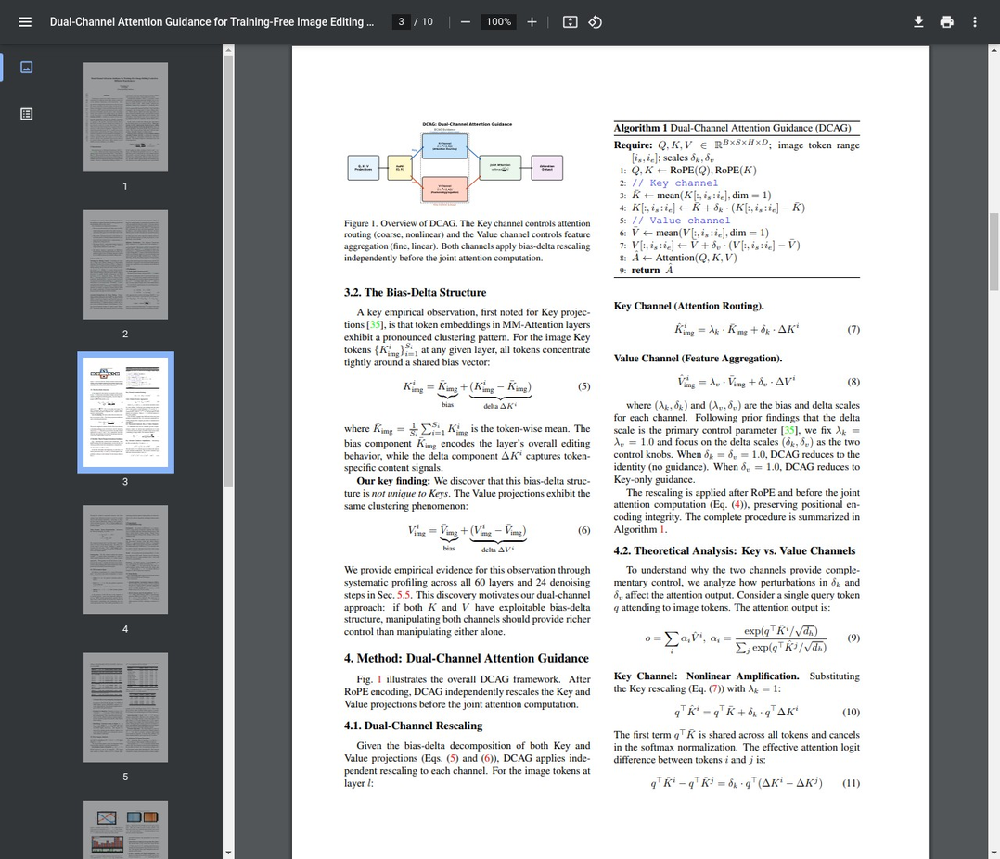
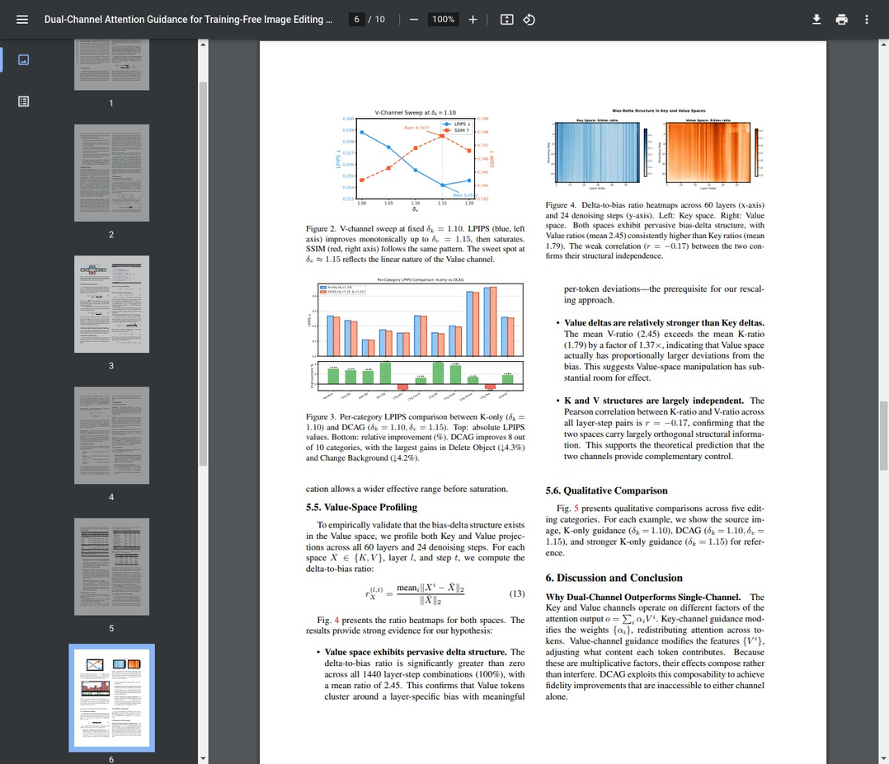

# AI Daily: DCAG - 雙通道注意力引導，實現無需訓練的DiT圖像編輯控制

> **論文名稱**：Dual-Channel Attention Guidance for Training-Free Image Editing Control in Diffusion Transformers
> 
> **論文連結**：[https://arxiv.org/abs/2602.18022](https://arxiv.org/abs/2602.18022)
> 
> **發表單位**：iFLYTEK (Guandong Li), Aegon THTF (Mengxia Ye)
> 
> **發表時間**：2026年2月20日

## 核心貢獻

這篇論文針對基於擴散模型Transformer（DiT）的圖像編輯任務，提出了一個名為**雙通道注意力引導（Dual-Channel Attention Guidance, DCAG）**的無需訓練（training-free）框架。現有的注意力操控方法（如GRAG [[2]](#references)）僅專注於Key空間，藉此調控「注意力要看哪裡」（attention routing），卻完全忽略了Value空間，也就是「聚合什麼特徵」（feature aggregation）的潛力。

DCAG的核心貢獻可以歸納為以下四點：

**第一，揭示了Value空間的「偏置-增量」結構。** 論文首次發現，不僅是Key空間，DiT多模態注意力層中的Value空間也存在顯著的「偏置-增量」（bias-delta）結構。這意味著所有token的嵌入都緊密圍繞一個與層相關的偏置向量，而各自的增量則包含了獨特的內容信息。這一發現揭示了Value空間作為一個未被開發的、獨立的控制通道的潛力。

**第二，提出雙通道注意力引導框架。** 基於上述發現，DCAG框架能夠同時操控Key和Value兩個通道，形成了一個二維的控制參數空間 (δk, δv)，從而實現比任何單通道方法更精確的編輯-保真度權衡。

**第三，理論分析了雙通道的互補特性。** 論文從理論上證明了Key和Value通道具有根本不同的控制特性：Key通道通過非線性的Softmax函數運作，如同一個**粗調旋鈕（coarse control knob）**；Value通道通過線性的加權求和運作，如同一個**微調補償（fine-grained complement）**。

**第四，在基準測試中取得顯著提升。** 在包含700張圖片和10個編輯類別的PIE-Bench基準測試上，DCAG在所有保真度指標上都持續優於僅使用Key引導的GRAG方法。尤其在局部編輯任務中，如物體刪除（LPIPS降低4.9%）和物體添加（LPIPS降低3.2%），改進最為顯著。

## 技術細節

DCAG的實現基於對DiT模型中多模態注意力層的深入理解。注意力機制的輸出可以被分解為**注意力路由（Attention Routing）**和**特徵聚合（Feature Aggregation）**兩個部分：

$$
\text{Output} = \underbrace{\text{softmax}\!\left(\frac{QK^{\top}}{\sqrt{d}}\right)}_{\text{K: attention routing}} \cdot \underbrace{V}_{\text{V: feature aggregation}}
$$

#### 1. 偏置-增量結構 (Bias-Delta Structure)

論文的核心觀察是，在DiT的MM-Attention層中，不僅是Key投射，Value投射也表現出顯著的聚類模式。對於任意一層的圖像token，其Key和Value向量都可以被分解為一個共享的**偏置（bias）**和一個獨特的**增量（delta）**：

$$
K_{\text{img}}^i = \underbrace{\bar{K}_{\text{img}}}_{\text{bias}} + \underbrace{(K_{\text{img}}^i - \bar{K}_{\text{img}})}_{\text{delta } \Delta K^i}
$$

$$
V_{\text{img}}^i = \underbrace{\bar{V}_{\text{img}}}_{\text{bias}} + \underbrace{(V_{\text{img}}^i - \bar{V}_{\text{img}})}_{\text{delta } \Delta V^i}
$$

其中，$\bar{K}$和$\bar{V}$是該層所有圖像token的Key和Value向量的平均值，代表了模型的內在編輯行為。而$\Delta K_i$和$\Delta V_i$則編碼了每個token特定的內容信號。

#### 2. 雙通道重新縮放 (Dual-Channel Rescaling)

DCAG通過引入兩個控制參數$\delta_k$和$\delta_v$來分別重新縮放Key和Value的增量部分，從而實現對編輯過程的雙重控制：

$$
\hat{K}_{\text{img}} = \bar{K}_{\text{img}} + \delta_k \cdot (K_{\text{img}} - \bar{K}_{\text{img}})
$$

$$
\hat{V}_{\text{img}} = \bar{V}_{\text{img}} + \delta_v \cdot (V_{\text{img}} - \bar{V}_{\text{img}})
$$

*圖1：DCAG框架概覽（左）和算法偽代碼（右）。Key通道控制注意力路由（粗調），Value通道控制特徵聚合（微調）。*

#### 3. 理論分析：Key vs. Value

論文的理論分析揭示了兩個通道為何能形成互補控制：

**Key通道的非線性放大效應**：對Key的擾動會通過Softmax函數的指數特性被放大。logits的差異被$\delta_k$線性縮放，但最終的注意力權重$\alpha_i$會發生非線性變化，使Key通道成為一個強大的「粗調」工具：

$$
q^\top \hat{K}^i - q^\top \hat{K}^j = \delta_k \cdot q^\top (\Delta K^i - \Delta K^j)
$$

**Value通道的線性比例效應**：對Value的擾動是線性的。最終的輸出可以表示為：

$$
o = \sum_i \alpha_i (\bar{V} + \delta_v \cdot \Delta V^i) = \bar{V} + \delta_v \sum_i \alpha_i \Delta V^i
$$

輸出由一個固定的偏置項$\bar{V}$和一個被$\delta_v$線性縮放的增量項組成。這意味著$\delta_v$的變化會產生可預測的、成比例的輸出變化，使其成為一個理想的「微調」工具。

**正交性（Orthogonality）**：Key通道修改注意力權重$\{\alpha_i\}$（哪些token被關注），而Value通道修改特徵$\{V_i\}$（聚合什麼內容）。這兩者作用於注意力輸出$o = \sum_i \alpha_i V_i$的不同因子，使它們在功能上是正交的。這一正交性通過實驗得到了驗證：K-ratio和V-ratio之間的Pearson相關係數為$r = -0.17$。

## 實驗結果

實驗在PIE-Bench [[3]](#references) 上進行，使用了Qwen-Image-Edit [[4]](#references) 作為基礎模型（一個60層的雙流DiT）。

#### 主要結果

下表展示了在完整的PIE-Bench上，DCAG與GRAG的比較。在匹配的$\delta_k$值下，DCAG通過增加$\delta_v$持續改善了保真度指標。

| Method | δk | δv | LPIPS ↓ | SSIM ↑ | PSNR ↑ | MSE ↓ |
| :--- | :--- | :--- | :--- | :--- | :--- | :--- |
| No Guidance | 1.00 | 1.00 | 0.3523 | 0.6307 | 15.56 | 3902 |
| GRAG | 1.10 | 1.00 | 0.2588 | 0.7444 | 17.93 | 2588 |
| **DCAG** | **1.10** | **1.15** | **0.2542** | **0.7477** | **17.89** | **2557** |
| GRAG | 1.15 | 1.00 | 0.1991 | 0.8066 | 19.81 | 1751 |
| **DCAG** | **1.15** | **1.15** | **0.1974** | **0.8053** | **19.60** | **1742** |

*圖2：PIE-Bench上的完整實驗結果（表1、表2、表3）。*

#### 分類別分析

DCAG在10個編輯類別中的8個都取得了改進。最大的增益出現在**物體刪除（-4.3% LPIPS）**、**背景更換（-4.2% LPIPS）**和**風格轉換（-3.7% LPIPS）**等任務中。

*圖3：V-channel sweep曲線（左）和分類別LPIPS比較（右）。*

#### Value空間剖析

為了驗證Value空間中偏置-增量結構的存在，論文對所有60層和24個去噪步驟的K和V投射進行了剖析，計算了增量-偏置比率：

$$
r_X(l, t) = \text{mean}_i \frac{\|X^i - \bar{X}\|_2}{\|\bar{X}\|_2}
$$

關鍵發現：Value空間的增量結構在所有1440個層-步驟組合中均存在（100%），平均V-ratio（2.45）比平均K-ratio（1.79）高出1.37倍，且兩者的Pearson相關係數為$r = -0.17$，確認了結構獨立性。

## 相關研究分析

DCAG建立在近期一系列關於無需訓練的注意力操控方法之上，但又有所突破。

| 方法 | 核心思路 | 局限性 |
| :--- | :--- | :--- |
| CFG [[5]](#references) | 條件/無條件預測的線性插值 | 控制粒度粗，極端值易產生偽影 |
| Prompt-to-Prompt [[6]](#references) | 注入源圖像的交叉注意力圖 | 依賴DDIM反演，需要額外計算 |
| MasaCtrl [[7]](#references) | 互自注意力控制（ICCV 2023） | 主要針對UNet架構，不直接適用於DiT |
| GRAG [[2]](#references) | Key空間偏置-增量重縮放 | 完全忽略Value空間的控制潛力 |
| **DCAG（本文）** | **Key + Value雙通道重縮放** | **Value通道效果較溫和，在強Key引導下收益遞減** |

DCAG的創新之處在於，它認識到Value空間同樣具有可利用的結構，並將其與Key空間結合，從單通道控制躍升至雙通道控制，提供了更豐富、更精確的控制維度。

## 實用建議

基於實驗分析，論文提供了以下實用配置建議：

| 場景 | 推薦配置 (δk, δv) |
| :--- | :--- |
| 默認配置（最佳整體保真度） | (1.10, 1.15) |
| 局部編輯（刪除/添加物體、更換背景） | (1.10, 1.10–1.15) |
| 全局編輯（更換動作/位置） | (1.10–1.15, 1.00) |
| 強Key引導下 | (1.15, ≤1.05) |

Value通道在$\delta_v \approx 1.15$時飽和；超過此值，特徵開始失真而非銳化。

## 個人評價

DCAG是一項非常聰明且實用的工作，它完美詮釋了「站在巨人肩膀上」的創新。它沒有提出一個全新的、複雜的架構，而是深入挖掘了現有DiT模型中被忽視的結構——Value空間的「偏置-增量」特性。

這項研究的意義在於：對於追求精確圖像編輯的任務，DCAG提供的雙通道微調能力至關重要，允許在「改得多」和「保留好」之間找到更優的平衡點。DCAG提醒我們，Value通道（即內容聚合）同樣蘊含著豐富的可操控信息，這可能激發更多探索Value空間潛力的後續研究，例如空間自適應的Value引導、甚至是對Query空間的探索。作為一個無需訓練的即插即用模塊，DCAG可以輕鬆集成到現有的DiT編輯模型中，立即提升其性能。

---

## References

[1] Guandong Li, & Mengxia Ye. (2026). *Dual-Channel Attention Guidance for Training-Free Image Editing Control in Diffusion Transformers*. arXiv:2602.18022. https://arxiv.org/abs/2602.18022

[2] Zhang, X., et al. (2025). *Group Relative Attention Guidance for Image Editing*. arXiv:2510.24657. https://arxiv.org/abs/2510.24657

[3] Ju, X., et al. (2023). *Pnp Inversion: Boosting Diffusion-based Editing with 3 Lines of Code*. ICLR 2024. https://arxiv.org/abs/2310.01506

[4] Qwen Team. (2025). *Qwen-Image-Edit Model Card*. Hugging Face. https://huggingface.co/Qwen/Qwen-Image-Edit

[5] Ho, J., & Salimans, T. (2022). *Classifier-Free Diffusion Guidance*. arXiv:2207.12598. https://arxiv.org/abs/2207.12598

[6] Hertz, A., et al. (2022). *Prompt-to-Prompt Image Editing with Cross Attention Control*. ICLR 2023. https://arxiv.org/abs/2208.01626

[7] Cao, M., et al. (2023). *MasaCtrl: Tuning-Free Mutual Self-Attention Control for Consistent Image Synthesis and Editing*. ICCV 2023. https://arxiv.org/abs/2304.08465
