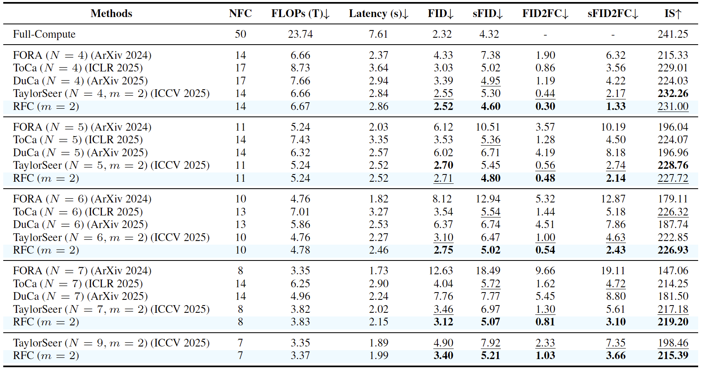

# AI Daily: RFC - 運用輸出入關係加速DiT，實現更準確的特徵快取
> **論文標題**: Relational Feature Caching for Accelerating Diffusion Transformers
> **作者**: Byunggwan Son, Jeimin Jeon, Jeongwoo Choi, Bumsub Ham
> **機構**: 延世大學 (Yonsei University), 韓國科學技術研究院 (KIST)
> **發表**: ICLR 2026
> **關鍵詞**: `Diffusion Transformers (DiT)`, `Inference Acceleration`, `Feature Caching`, `Training-Free`, `Input-Output Relationship`

---

## 核心貢獻與創新點

隨著擴散模型（Diffusion Models）在生成任務上取得巨大成功，基於Transformer架構的DiT模型因其卓越的擴展性而備受關注。然而，DiT的迭代去噪過程計算成本高昂，嚴重影響了其實用性。特徵快取（Feature Caching）技術通過儲存並重複使用中間層的特徵來加速推理，但現有的方法，特別是基於時間外推（temporal extrapolation）的預測方法，因無法應對特徵在時間步之間的不規則變化而遭遇瓶頸，導致預測誤差大，影響生成品質。

為解決此問題，來自延世大學和韓國科學技術研究院（KIST）的研究團隊提出了**關聯特徵快取（Relational Feature Caching, RFC）**，一個無需訓練的DiT加速框架。RFC的核心洞察在於：**一個模組的輸出特徵變化與其輸入特徵的變化高度相關**。拋棄了僅依賴時間維度的預測，RFC轉而利用這種穩定的輸出入關係來更精準地預測特徵，顯著降低了計算量，同時保持了高品質的生成結果。

RFC的創新包含兩大組件：

1.  **關聯特徵估計（Relational Feature Estimation, RFE）**：利用輸入特徵的變化量來預測輸出特徵的變化量。由於輸出入特徵的變化幅度高度相關，RFE能夠比傳統的時間序列預測方法更準確地估計輸出特徵，從而減少誤差累積。

2.  **關聯快取排程（Relational Cache Scheduling, RCS）**：一種動態排程策略，它通過評估**輸入特徵**的預測誤差來決定何時執行完整的計算。當輸入預測誤差較大時，意味著輸出預測也可能不可靠，此時RCS會觸發一次完整的計算以校準快取，反之則跳過，從而實現了計算資源的智慧分配。

*圖一：RFC框架的核心思想。傳統方法（如FORA, TaylorSeer）僅依賴時間維度進行特徵預測，而RFC利用了輸入與輸出特徵之間穩定的關聯性，實現了更低的預測誤差和更高的生成品質。*

## 技術方法簡述

RFC的基礎是對DiT內部特徵動態的深入分析。研究發現，雖然輸出特徵的變化（圖a）在不同時間步之間表現出高度不規則性，但它與對應輸入特徵的變化（圖b）卻保持著驚人的一致性。這意味著，與其猜測輸出特徵下一步會如何變化，不如觀察輸入特徵的變化來得更可靠。

*圖二：特徵分析比較。(a)輸出特徵在時間步之間的L2距離變化不規則；(b)輸入特徵的變化同樣不規則，但其模式與輸出特徵高度相關；(c)RFC的預測誤差（藍線）顯著低於其他方法；(d)在相似的sFID下，RFC所需的計算量（FLOPs）更少。*

#### 1. 關聯特徵估計 (RFE)

RFE的核心是定義了一個**關聯比例因子 $s_k(t-k)$**，它量化了在時間步$t$到$t-k$之間，輸出特徵變化量與輸入特徵變化量的比例：

$$s_k(t-k) = \frac{\|\Delta_k O(t-k)\|_2}{\|\Delta_k I(t-k)\|_2}$$

實驗證明，這個比例因子$s_k$在不同的時間步和模組中都表現出高度的穩定性（下圖a）。因此，RFE不再直接預測輸出特徵$O(t-k)$，而是先預測輸入特徵$I(t-k)$，然後利用穩定的$s_k$來估算輸出特徵的變化量，最終得到更準確的輸出預測值。這一步利用了輸入特徵的變化來指導輸出特徵的預測，是RFC的核心洞察。

*圖三：(a)關聯比例因子$s_k$在不同時間步的變化（RSD約為2%），表現出高度穩定性。(b)輸入特徵的預測誤差$\mathcal{E}_I(t)$與輸出特徵的預測誤差$\mathcal{E}_O(t)$高度相關，這成為RCS的理論基礎。*

#### 2. 關聯快取排程 (RCS)

RCS解決了「何時應該停止預測並執行一次完整計算」的問題。既然輸入和輸出的預測誤差高度相關（上圖b），RCS便可以通過監控**輸入特徵的預測誤差**來間接判斷輸出特徵的預測品質。RCS設定一個閾值，當輸入預測誤差超過該閾值時，就觸發一次完整的計算來刷新快取，確保生成品質不會因誤差累積而下降。這種方法避免了直接計算輸出誤差所需的高昂代價，實現了高效的動態排程。

## 實驗結果與性能指標

研究團隊在多種DiT模型（如DiT-XL/2, FLUX.1-dev）和生成任務（類別條件生成、文本到圖像、文本到影片）上進行了廣泛實驗，結果一致表明RFC的優越性。

-   **量化結果**：如下表所示，在ImageNet上的類別條件生成任務中，RFC在所有計算預算（NFC，Number of Full Computations）下都取得了最低的sFID和FID，顯著優於FORA、ToCA、TaylorSeer等先前方法。例如，在NFC為14時，RFC的sFID僅為4.60，而最接近的TaylorSeer為4.80。

*圖四：在DiT-XL/2上的量化比較結果。RFC在各種NFC設置下均達到SOTA性能。*

-   **定性結果**：定性比較也展示了RFC在生成細節和語義準確性上的優勢。下圖以「一隻貓頭鷹坐在田野裡的側視圖」為提示詞，比較了不同方法的生成結果。可以看出，FORA和TaylorSeer在較低的計算量下出現了明顯的偽影和細節丟失，而RFC生成的圖像在視覺上最接近於完整計算的結果，準確地保留了貓頭鷹的結構和紋理。

*圖五：定性結果比較。從左至右：完整計算、FORA、TaylorSeer、RFC (Ours)。RFC在x6.23的加速倍率下，生成品質最接近完整計算的結果。*

## 相關研究背景

RFC的研究建立在DiT推理加速的一系列工作之上。早期的快取方法如**DeepCache** [[2]](#references) 和 **FORA** [[3]](#references) 採用直接重用或簡單線性插值的方式，雖然能加速，但品質損失較大。隨後的**TaylorSeer** [[4]](#references) 引入泰勒展開來預測特徵變化，提高了準確性，但其假設特徵隨時間平滑變化的前提在實踐中常常不成立，導致其在不規則變化面前效果有限。RFC則另闢蹊徑，首次提出利用輸出入特徵的**關聯性**來進行預測，從而克服了先前方法僅依賴時間維度的局限性。

| 方法 | 核心思路 | 局限性 |
| :--- | :--- | :--- |
| DeepCache / FORA | 直接重用或簡單插值快取 | 誤差累積嚴重，品質下降明顯 |
| TaylorSeer | 基於泰勒展開的時間序列預測 | 依賴特徵平滑變化的假設，對不規則變化處理不佳 |
| **RFC (本文)** | **利用輸出入特徵的穩定關聯性進行預測** | **在輸入輸出關係較弱的極端情況下可能退化** |

## 個人評價與意義

RFC是一項非常聰明且實用的研究。它沒有設計複雜的模組或需要額外的訓練，而是通過對現有DiT模型進行深入的實證分析，發現並利用了被忽視的「輸出入特徵關聯性」這一內在規律。這種從模型行為本身挖掘優化潛力的思路，對於大型模型的落地應用極具啟發意義。

這項研究的價值在於：

1.  **找到了更穩定的錨點**：它揭示了在DiT中，相比於不穩定的時間序列變化，輸出入特徵之間的關係是一個更可靠的預測錨點。這一發現可能為未來更多DiT的優化工作指明了新的方向。
2.  **兼顧效率與品質**：RFC不僅實現了顯著的加速，更重要的是它在加速的同時保持了極高的生成品質，解決了以往加速方法「快但差」的痛點。
3.  **通用性與易用性**：作為一個無需訓練的即插即用框架，RFC可以輕鬆應用於各種預訓練的DiT模型，極大地降低了使用門檻，使其具備廣泛的應用潛力。

總而言之，RFC為DiT的推理加速問題提供了一個優雅而強大的新範式。它證明了，與其盲目地進行時間上的外推，不如回歸模型本身，從其內部結構和數據流動中尋找更本質的規律。這項工作無疑將推動DiT在圖像和影片生成等領域的實際部署和應用。

---

### 參考文獻
[1] Son, B., Jeon, J., Choi, J., & Ham, B. (2026). *Relational Feature Caching for Accelerating Diffusion Transformers*. In ICLR 2026. https://arxiv.org/abs/2602.19506
[2] Ma, X., et al. (2024). *DeepCache: accelerating diffusion models for free*. In CVPR 2024.
[3] Selvaraju, R., et al. (2024). *FORA: fast-forward caching in diffusion transformer acceleration*. arXiv:2407.19858.
[4] Liu, J., et al. (2025b). *From reusing to forecasting: accelerating diffusion models with taylorseers*. In ICCV 2025.
