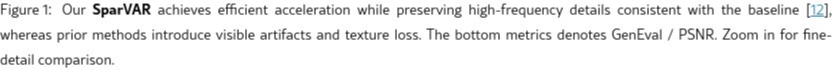

# AI Daily - SparVAR：無需訓練，探索視覺自回歸模型中的稀疏性以實現高效加速

> 論文名稱：SparVAR: Exploring Sparsity in Visual AutoRegressive Modeling for Training-Free Acceleration
> 
> 論文連結：[https://arxiv.org/abs/2602.04361](https://arxiv.org/abs/2602.04361)
> 
> 發表單位：中科院自動化所、國科大、港城大等
> 
> 發表時間：2026 年 2 月 4 日

## 論文核心貢獻

視覺自回歸（VAR）模型因其創新的「next-scale prediction」範式而備受關注，但其在生成高解析度圖像時面臨巨大的計算延遲。為解決此問題，來自中科院自動化所等機構的研究者提出了 **SparVAR**，一個**無需訓練（Training-Free）**的 VAR 推理加速框架。該框架巧妙地利用了 VAR 注意力機制中固有的三種稀疏性，在不犧牲高頻細節的前提下，實現了顯著的推理加速。

SparVAR 的主要貢-獻可歸納為以下幾點：

1.  **三大稀疏性洞察**：首次系統性地揭示了 VAR 模型中注意力的三大稀疏特性：
    *   **強注意力匯聚（Strong Attention Sinks）**：少數早期尺度的 tokens 會持續吸引大量注意力，如同「全局錨點」。
    *   **跨尺度激活相似性（Cross-Scale Activation Similarity）**：相鄰尺度間的注意力激活模式高度相似，意味著注意力模式是可預測的。
    *   **顯著的空間局部性（Pronounced Spatial Locality）**：在高解析度下，注意力會集中在相鄰的局部空間區域。

2.  **即插即用的稀疏注意力模組**：基於上述洞察，設計了兩個即插即用的高效注意力模組：
    *   **跨尺度自相似稀疏注意力（CSSSA）**：從一個稀疏的「決策尺度」動態預測後續高解析度尺度的稀疏注意力模式。
    *   **跨尺度局部稀疏注意力（CSLA）**：透過優化的塊狀稀疏核心（Block-wise Sparse Kernel）強化空間局部性，其前向傳播速度比 FlashAttention 快 **5 倍**以上。

3.  **高效能的推理加速**：實驗證明，SparVAR 能在不跳過任何尺度的情況下，將 8B 模型生成 1024x1024 圖像的時間縮短至 **1 秒**內。與 FlashAttention 加速的 VAR 基線相比，SparVAR 實現了 **1.57 倍**的加速，同時幾乎保留了所有高頻細節。若結合現有的尺度跳過策略，加速比可高達 **2.28 倍**。

*圖一：SparVAR 在保持高頻細節的同時實現了高效加速，而先前的方法則會引入可見的偽影和紋理損失。*

## 技術方法簡述

### VAR 的計算瓶頸

VAR 模型的核心在於其「next-scale prediction」機制，即在每個自回歸步驟中，模型會並行預測下一個尺度的所有 tokens。這使得模型能夠以由粗到精的方式生成圖像。其注意力機制的計算如下：

$$
\mathbf{O}_k = \text{Softmax}\left(\frac{\mathbf{Q}_k \mathbf{K}_{<k}^T}{\sqrt{d}}\right) \mathbf{V}_{<k}
$$

其中，$\mathbf{Q}_k$ 是當前尺度 $k$ 的查詢（Query），而 $\mathbf{K}_{<k}$ 和 $\mathbf{V}_{<k}$ 則是到尺度 $k$ 為止所有歷史尺度的鍵（Key）和值（Value）的串接。隨著圖像解析度的增加，tokens 的數量呈二次方增長，導致注意力計算的複雜度以驚人的 $O(n^4)$ 增長，這成為了 VAR 模型的主要性能瓶頸。

### SparVAR 的稀疏性利用

SparVAR 的核心思想是利用 VAR 注意力圖中的冗餘和稀疏性。研究者發現，注意力權重並非均勻分佈，而是呈現出高度結構化的稀疏模式。

*圖二：VAR 模型中注意力的三大稀疏特性視覺化。*

1.  **跨尺度自相似稀疏注意力 (CSSSA)**：該模組利用了「跨尺度激活相似性」這一特性。既然高解析度尺度的注意力模式與低解析度尺度相似，那麼就可以從一個計算開銷較小的「決策尺度」來預測後續尺度的稀疏注意力模式。透過一個高效的索引映射機制，CSSSA 只在預測出的稀疏位置上進行注意力計算，從而大幅減少了計算量。

2.  **跨尺度局部稀疏注意力 (CSLA)**：該模組利用了「強注意力匯聚」和「顯著空間局部性」。它將注意力計算限制在兩個區域：
    *   **注意力匯聚區**：由最初幾個尺度構成的少量 tokens，它們作為全局結構的錨點。
    *   **局部鄰域**：每個查詢 token 只關注其在歷史尺度中對應的局部鄰域內的 tokens。

透過將這兩種稀疏注意力結合，並實現為一個高效的塊狀稀疏核心，SparVAR 在不犧牲圖像質量的基礎上，實現了顯著的推理加速。

## 實驗結果與性能指標

實驗結果表明，SparVAR 在多個指標上均取得了優異的表現。在生成 1024x1024 解析度的圖像時，SparVAR 不僅將 8B 模型的生成時間從數十秒縮短至 1 秒，其圖像質量（以 PSNR 和 GenEval 分數衡量）也與未經加速的基線模型相當，遠優於其他跳過尺度的加速方法（如 FastVAR 和 SkipVAR）。

| 方法 | 加速比 (Speedup) | GenEval / PSNR | 備註 |
| :--- | :--- | :--- | :--- |
| Infinity-8B (Baseline) | 1.00x | 0.796 / 29.481 | 未加速的基線模型 |
| **SparVAR (Ours)** | **1.57x** | **0.796 / 29.481** | **無損加速** |
| FastVAR | 1.14x | 0.792 / 17.403 | 質量下降明顯 |
| **SparVAR + Skip Last 2 Scales** | **2.28x** | **0.800 / 17.096** | **結合跳過尺度策略** |

## 相關研究背景

對 VAR 模型的加速研究主要分為兩類：

1.  **尺度跳過（Scale Skipping）**：如 FastVAR 和 SkipVAR，透過跳過最後幾個高解析度尺度來減少計算量。雖然速度快，但會導致高頻細節丟失和圖像質量下降。
2.  **KV Cache 壓縮**：如 ScaleKV 和 HACK，透過壓縮 KV Cache 來降低記憶體佔用，但由於昂貴的鍵值選擇過程，實際的運行時增益有限。

與這些方法不同，SparVAR 是一個**無需訓練**的推理時優化框架，它不跳過任何尺度，而是利用注意力的內在稀疏性來實現加速，從而做到了速度與質量的兼顧。

## 個人評價與意義

SparVAR 的提出為解決大型生成模型（特別是 VAR 模型）的推理效率問題提供了一個極具前景的新思路。其最大的亮點在於 **Training-Free** 的特性，這意味著它可以作為一個即插即用的模組，直接應用於現有的預訓練 VAR 模型，而無需任何額外的訓練成本。

論文中對 VAR 注意力稀疏性的系統性分析和洞察，不僅為 SparVAR 的設計提供了堅實的理論基礎，也為未來設計更高效的視覺生成模型架構開闢了新的方向。在當前追求更大、更強模型的趨勢下，如何平衡模型的性能與效率是一個至關重要的問題。SparVAR 的成功表明，深入挖掘和利用模型內在的結構特性，是實現「無損加速」的一條有效路徑。這項工作無疑將激發更多關於高效推理、模型壓縮和注意力機制優化的研究。
