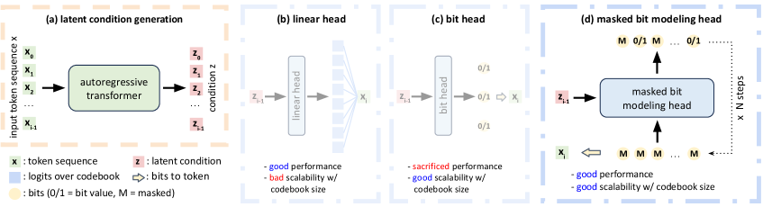
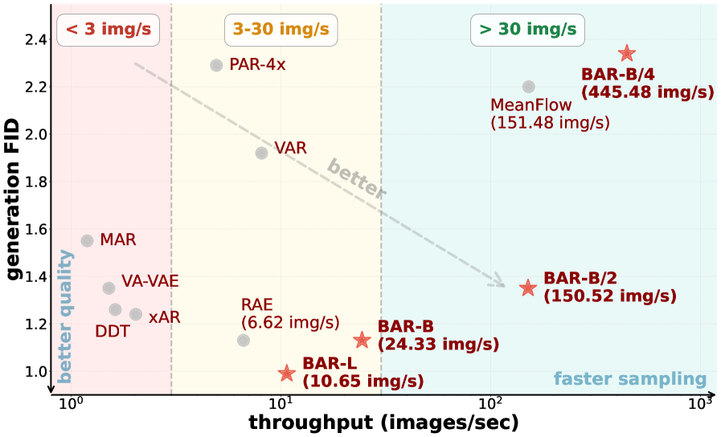
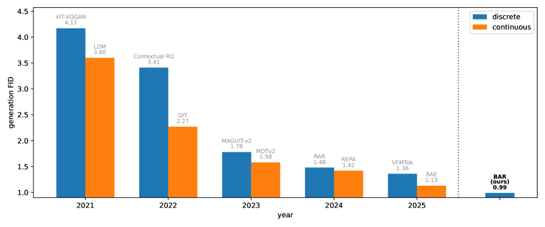
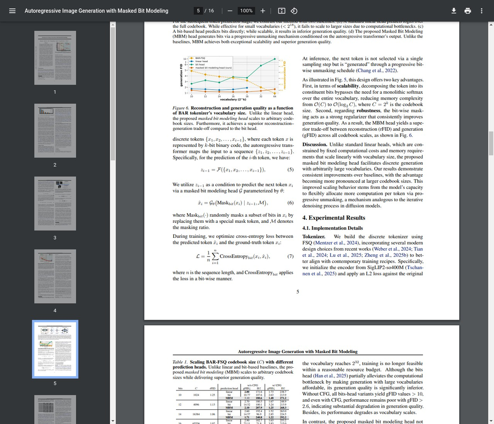
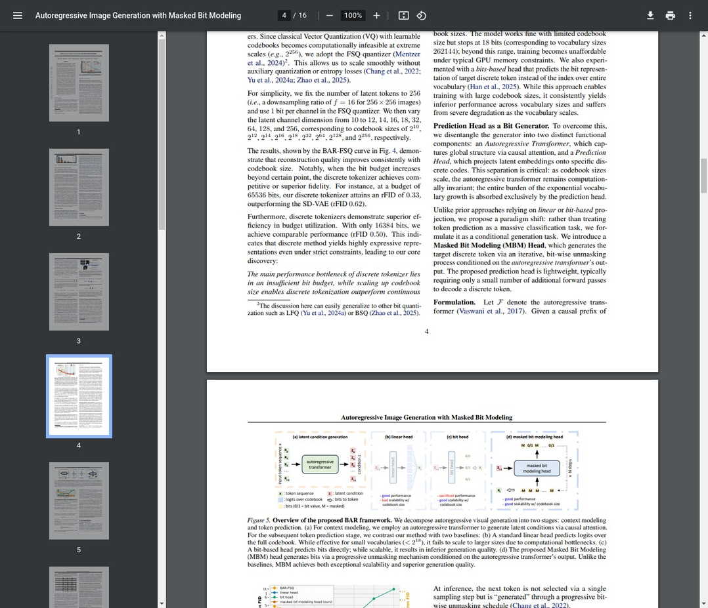
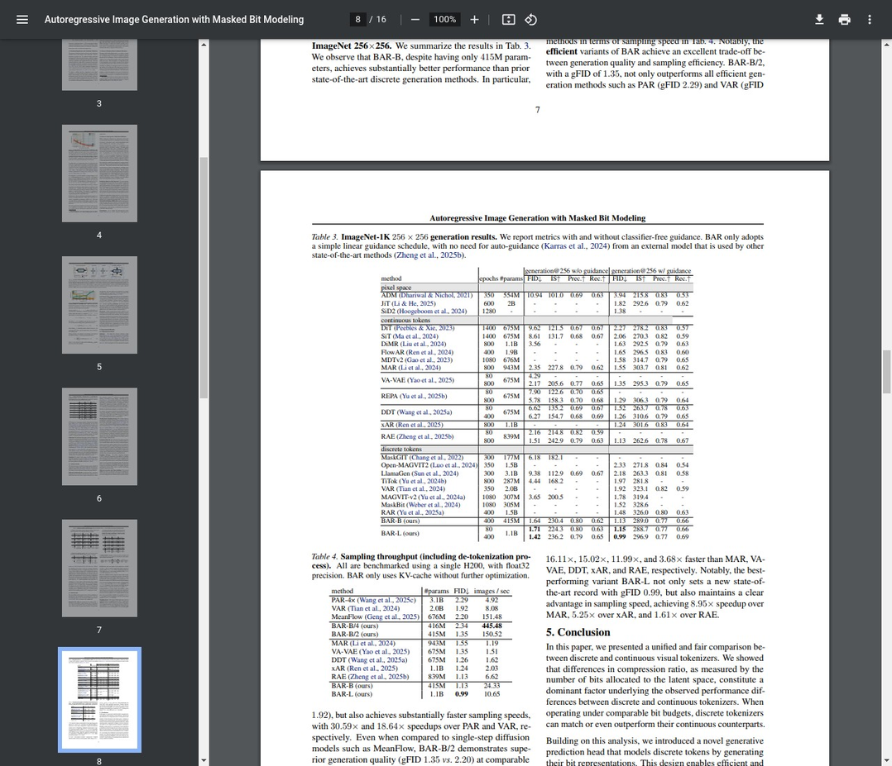
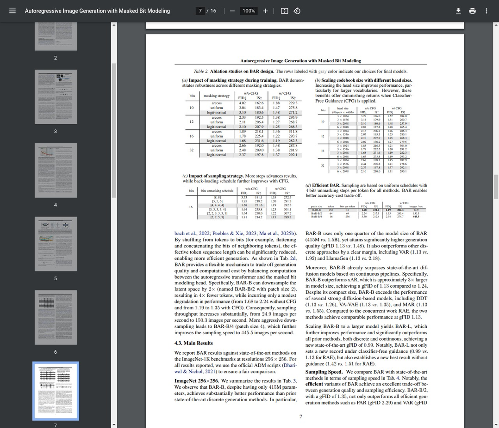

# AI Daily: Autoregressive Image Generation with Masked Bit Modeling (BAR) 論文深度解析

**論文標題:** Autoregressive Image Generation with Masked Bit Modeling
**作者:** Qihang Yu, Qihao Liu, Ju He, Xinyang Zhang, Yang Liu, Liang-Chieh Chen, Xi Chen
**發表單位:** Google
**發表日期:** 2026年2月9日
**論文連結:** [https://arxiv.org/abs/2602.09024](https://arxiv.org/abs/2602.09024)

---

## 核心貢獻與創新點

這篇論文挑戰了目前由連續性方法（如擴散模型）主導的視覺生成領域，提出了一個名為 **masked Bit AutoRegressive modeling (BAR)** 的全新框架。其核心貢獻在於系統性地解決了離散自回歸模型在擴展性與性能上的瓶頸，並證明了離散方法不僅能與連續方法匹敵，甚至在特定條件下能夠超越它們。

主要的創新點包括：

1.  **統一的性能評估框架：** 論文提出以「位元預算」（Bit Budget）作為統一的度量標準，公平地比較離散與連續 tokenizer 的性能。研究發現，過去離散 tokenizer 性能較差的主要原因並非其本質缺陷，而是因為其在潛在空間中分配的位元數（即壓縮率）遠低於連續方法。

2.  **可擴展的離散生成框架 (BAR)：** 為了突破傳統離散模型在擴大 codebook size 時遇到的計算與記憶體瓶頸，論文設計了 BAR 框架。此框架能夠支援任意大小的 codebook，從根本上解決了擴展性問題。

3.  **遮罩位元建模 (Masked Bit Modeling, MBM) Head：** 這是 BAR 框架的關鍵技術。它將傳統的「單次分類預測」轉變為一個「漸進式位元生成」的過程。MBM head 不再直接預測整個 codebook 中的 token 索引，而是透過逐步 unmasking 的方式生成構成該 token 的位元序列。這種設計不僅大幅降低了計算複雜度，也提高了生成品質。

4.  **達到 SOTA 的性能：** BAR 在 ImageNet-256 數據集上取得了 **0.99 的 gFID**，超越了現有的所有離散和連續模型，同時在採樣速度上比領先的連續模型快 **3.68 倍**，展現了卓越的性能與效率。

*圖一：BAR 框架概覽。它將自回歸生成分為上下文建模和 token 預測兩個階段，並引入 MBM head 來實現高效且可擴展的 token 生成。*

---

## 技術方法簡述

### 1. Bit Budget：一個公平的比較基準

為了公平比較不同類型的 tokenizer，論文引入了 Bit Budget ($B$) 的概念，它量化了潛在空間的總資訊容量。對於一個輸入圖像 $I \in \mathbb{R}^{H \times W \times 3}$，經過下採樣因子為 $f$ 的 tokenizer 處理後：

-   **離散 Tokenizer** (codebook size 為 $C$) 的 Bit Budget 為：
    $$ B_{\text{discrete}} = \frac{H}{f} \times \frac{W}{f} \times \lceil \log_2 C \rceil $$

-   **連續 Tokenizer** (潛在維度為 $D$) 的 Bit Budget 為：
    $$ B_{\text{continuous}} = \frac{H}{f} \times \frac{W}{f} \times 16D $$
    （其中 16 代表混合精度訓練中每個潛在維度使用 16 位元）

透過這個統一的度量，論文發現只要給予足夠的 Bit Budget（即擴大 codebook size），離散 tokenizer 的重建品質就能夠追上甚至超越連續 tokenizer。

### 2. Masked Bit Modeling (MBM) Head

傳統自回歸模型在預測下一個 token 時，通常使用一個線性 head 在整個詞彙表上進行 softmax 分類。當詞彙表（codebook size）變得極大時（例如 $2^{32}$），這種方法的計算和記憶體開銷變得無法承受。

MBM head 巧妙地避開了這個問題。它將預測一個 $k$-bit token 的任務分解為一個條件生成任務。給定自回歸 transformer $\mathcal{F}$ 輸出的條件特徵 $z_{i-1}$，MBM head $\mathcal{G}$ 透過一個漸進式的 unmasking 過程來生成下一個 token $x_i$ 的位元。

其核心公式可以表示為：
$$ \hat{x}_i = \mathcal{G}_\theta(\text{Mask}_{\text{bit}}(x_i) | z_{i-1}, \mathcal{M}) $$

其中，$\text{Mask}_{\text{bit}}(\cdot)$ 隨機遮罩 $x_i$ 的一部分位元，$\mathcal{M}$ 是遮罩比例。在推理時，模型透過多次迭代，逐步預測並填補被遮罩的位元，最終生成完整的 token。這種設計的記憶體複雜度從 $\mathcal{O}(C)$ 降低到 $\mathcal{O}(\log_2 C)$，實現了對任意 codebook size 的擴展。

---

## 實驗結果與性能指標

BAR 模型在多項指標上都展現了其優越性。

-   **生成品質與效率的權衡：** 如下圖所示，BAR 在生成品質（generation FID，越低越好）和採樣速度（throughput，越高越好）之間取得了極佳的平衡。特別是 BAR-B/2 和 BAR-B/4 模型，在保持高生成品質的同時，實現了非常高的採樣速度。

    
    *圖二：BAR 在 ImageNet-256 上的質量-成本權衡。BAR 模型（紅色星號）在 FID 和吞吐量上均優於其他方法。*

-   **與 SOTA 模型的比較：** BAR (gFID 0.99) 首次在 ImageNet-256 上將 gFID 推向 1.0 以下，超越了包括 DiT、RAE、MeanFlow 在內的所有頂尖模型，無論是離散還是連續方法。

    
    *圖三：最佳離散與連續生成器比較。BAR 在 2025 年的表現超越了所有先前的方法。*

-   **擴展性驗證：** 實驗證明，隨著 codebook size 從 $2^{10}$ 擴展到 $2^{64}$，MBM head 的性能穩定優於傳統的線性 head 和 bit-based head，後兩者在 codebook size 增大時會出現性能急劇下降或記憶體溢出（OOM）的問題。

---

## 相關研究背景

本研究建立在多個領域的基礎之上：

-   **視覺自回歸模型 (Visual Autoregressive Models, VAR)：** 如 VQ-GAN、VAR 等，它們將圖像 token 化並以自回歸的方式生成，是離散生成方法的基礎。
-   **擴散模型 (Diffusion Models)：** 如 LDM、DiT 等，是目前主流的連續生成方法，以其高生成品質著稱，但採樣速度較慢。
-   **量化技術 (Quantization)：** 如 VQ、FSQ、BSQ 等，是將連續特徵轉換為離散 token 的核心技術。本研究採用 FSQ，因其無需學習 codebook，易於擴展。
-   **遮罩圖像建模 (Masked Image Modeling, MIM)：** 如 MaskGIT，其思想啟發了 MBM head 的設計，即透過預測被遮罩的部分來生成內容。

---

## 個人評價與意義

`Autoregressive Image Generation with Masked Bit Modeling` 是一項具有里程碑意義的研究。它不僅為離散生成模型「正名」，證明了其潛力不亞於連續模型，更重要的是，它提供了一條清晰、可行的技術路徑來釋放這種潛力。

**激發的想法：**

1.  **Tokenizer 的再思考：** 這篇論文的核心洞見在於「Bit Budget」。這啟示我們，未來在設計和評估 tokenizer 時，不應僅僅關注其架構，更應量化其資訊容量。這對於 VAR-based 模型尤其重要，因為 token 的品質直接決定了生成的上限。

2.  **生成範式的融合：** MBM head 的設計巧妙地融合了自回歸的「序列性」和類似擴散模型的「漸進式」生成思想。這種「一步預測，多步求精」的模式或許可以應用到其他生成任務中，例如 training-free 的風格遷移或 zero-shot 編輯，透過在 bit 層面進行微調來實現更精細的控制。

3.  **注意力機制的潛力：** 雖然論文本身沒有過多著墨於 attention modulation，但 MBM head 的條件生成過程為注意力調控提供了新的作用點。我們可以在生成每個 bit 的過程中，動態地調控注意力，使其關注於不同的圖像區域或語義特徵，從而實現更精準的 zero-shot 內容生成或編輯。

總體而言，BAR 框架的提出，很可能引領一波新的研究熱潮，推動學術界重新審視和發展基於離散 token 的生成模型。它在性能、效率和擴展性上的突破，使其在未來的多模態大模型、高效內容創作等領域具有巨大的應用潛力。

---

> *以下內容整合自另一版本的報告*

## 核心貢獻：離散方法的逆襲，gFID 0.99 刷新 SOTA

長期以來，視覺生成領域一直由連續管道（如擴散模型、GAN）主導，而離散方法（如自回歸模型）則因其在重建品質和擴展性上的限制而處於次要地位。然而，來自 Google 的最新研究 **BAR (masked Bit AutoRegressive modeling)** 徹底顛覆了這一局面。該論文不僅系統性地揭示了離散與連續方法性能差距的根源，更提出了一種創新的 **遮罩位元建模 (Masked Bit Modeling, MBM)** 框架，**首次在 ImageNet-256 上實現了 0.99 的 gFID 分數**，超越了所有已知的連續和離散生成模型，為自回歸圖像生成開闢了新的篇章。

研究的核心洞察在於，離散 tokenizer 的性能瓶頸並非其內在缺陷，而是**潛在空間中分配的總位元數（Bit Budget）不足**所致。透過擴大 codebook 的大小（即增加位元預算），離散方法完全有能力匹敵甚至超越連續方法。然而，傳統的自回歸模型在處理大詞彙時會面臨「詞彙擴展問題」，導致訓練成本過高或性能下降。BAR 提出的 MBM head 巧妙地繞過了這個問題，透過**漸進式生成 token 的組成位元**，實現了對任意大小 codebook 的可擴展支援，同時顯著降低了採樣成本並加快了收斂速度。

## 技術方法：遮罩位元建模 (Masked Bit Modeling)

BAR 的核心是其創新的預測頭設計，它將傳統的單步 token 預測轉化為一個多步的位元生成過程。這使得模型能夠在不犧牲性能的情況下，處理極大規模的離散詞彙表。

### 1. 問題根源：位元預算 (Bit Budget) 決定性能上限

論文首先建立了一個統一的比較框架，用「位元預算」來衡量 tokenizer 的資訊容量。對於一個將圖像壓縮到 $\frac{H}{f} \times \frac{W}{f}$ 潛在空間的 tokenizer，其位元預算計算方式如下：

- **離散 Tokenizer (codebook 大小為 C)**：
  $$B_{discrete} = \frac{H}{f} \times \frac{W}{f} \times \log_2 C$$

- **連續 Tokenizer (潛在維度為 D)**：
  $$B_{continuous} = \frac{H}{f} \times \frac{W}{f} \times 16D$$

實驗證明，一旦給予足夠的位元預算，離散 tokenizer 的重建品質就能超越連續方法（如 SD-VAE），這也揭示了擴大 codebook 的重要性。

*圖1：隨著位元預算的增加，離散 tokenizer (BAR-FSQ) 的重建誤差持續下降，並最終超越了連續方法。*

### 2. 解決方案：Masked Bit Modeling (MBM) Head

傳統自回歸模型直接預測下一個 token 的索引，當 codebook 很大時（例如 $2^{32}$），這相當於一個有數十億類別的分類問題，計算上不可行。BAR 則將這個過程分解，不再預測整個 token，而是預測組成該 token 的位元。

MBM Head 的工作流程如下圖所示：

*圖2：BAR 框架概覽。(a) 自回歸 Transformer 負責上下文建模；(b) 傳統線性頭在小詞彙下有效，但無法擴展；(c) 直接預測位元的 bit head 雖然可擴展，但性能較差；(d) 提出的 MBM head 透過漸進式 unmasking 生成位元，兼顧了可擴展性和生成品質。*

其核心公式如下：

1.  **上下文建模**：自回歸 Transformer $\mathcal{F}$ 根據之前的 tokens $\{x_1, ..., x_{i-1}\}$ 生成上下文表示 $z_{i-1}$。
    $$z_{i-1} = \mathcal{F}(x_1, x_2, ..., x_{i-1})$$

2.  **位元生成**：MBM Head $G_\theta$ 以 $z_{i-1}$ 為條件，透過一個漸進式的 unmasking 過程來預測下一個 token $x_i$ 的所有位元。
    $$\hat{x}_i = G_\theta(\text{Mask}_{M}(x_i) \mid z_{i-1}, M)$$

    其中 $\text{Mask}_{M}$ 是一個遮罩函數，它會隨機隱藏一部分位元，讓模型來預測它們。這個過程類似於 BERT 中的遮罩語言模型，但在位元層級上操作。

3.  **訓練目標**：優化預測位元與真實位元之間的交叉熵損失。
    $$\mathcal{L} = \frac{1}{n} \sum_{i=1}^{n} \text{CrossEntropy}_{bit}(x_i, \hat{x}_i)$$

這種設計將一個巨大的分類問題分解為一系列小的二元分類問題，極大地提高了訓練的穩定性和效率，使得模型能夠輕鬆擴展到極大的 codebook 尺寸。

## 實驗結果：全面超越 SOTA

BAR 在 ImageNet 256x256 的生成任務上進行了廣泛評估，結果令人驚艷。

### 1. 生成品質：gFID 0.99

如下表所示，BAR-L 模型在僅使用 1.4B 參數的情況下，達到了 **0.99 的 gFID**，不僅超越了所有離散自回歸模型（如 VAR, RAR），也擊敗了所有頂級的擴散模型和流匹配模型（如 DiT, RAE, MDT）。

*表1：在 ImageNet 256x256 上的生成結果比較。BAR-L 在 gFID 指標上刷新了紀錄，達到了 0.99。*

### 2. 採樣效率

除了生成品質，BAR 在採樣速度上也表現出色。高效的 BAR-B/2 變體在保持高品質（gFID 1.35）的同時，採樣速度達到了 **150.52 images/sec**，遠超其他同類模型。即使是最高品質的 BAR-L 模型，其速度也比 RAE 等頂級擴散模型快了近一倍。

### 3. 消融研究

論文進行了詳細的消融實驗，驗證了 MBM head 設計的優越性。實驗表明，相較於傳統的線性頭或直接預測位元的 bit head，MBM head 在各種 codebook 尺寸下都能實現最佳的性能與可擴展性權衡。

*圖3：消融研究結果。MBM head 在 masking 策略、head 尺寸和採樣策略等多方面都展現出其設計的魯棒性和優越性。*

