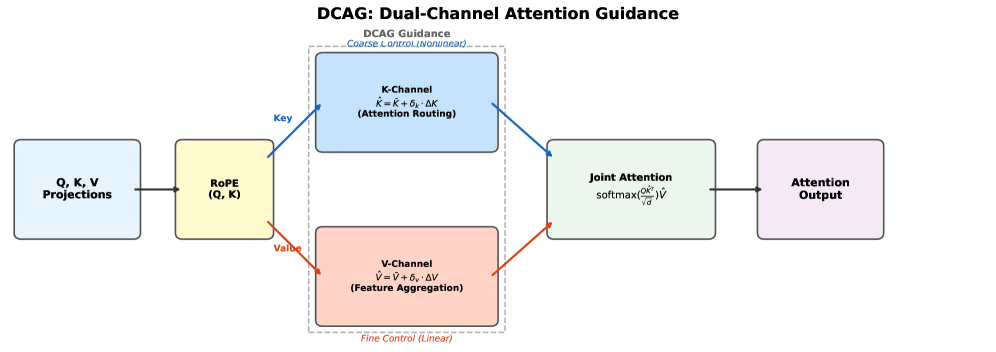
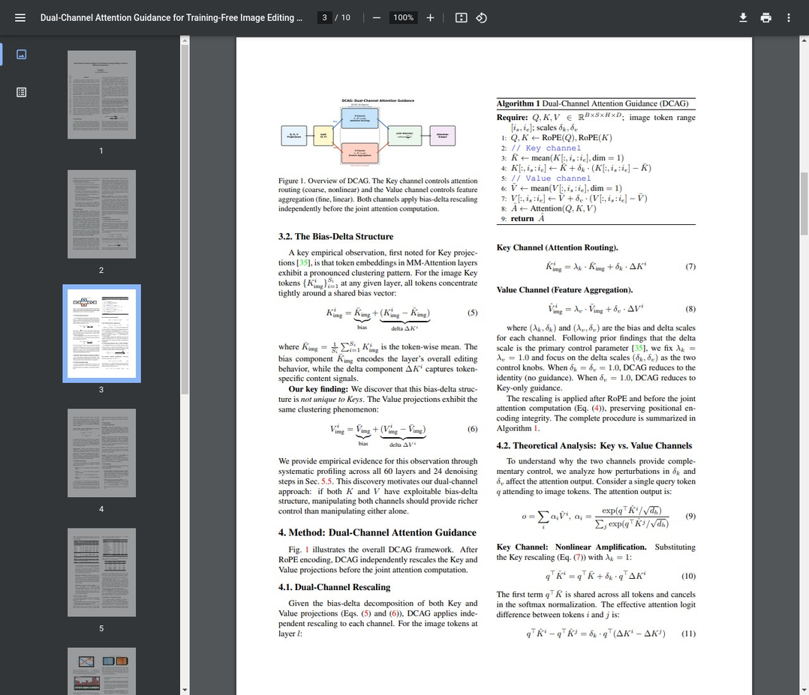
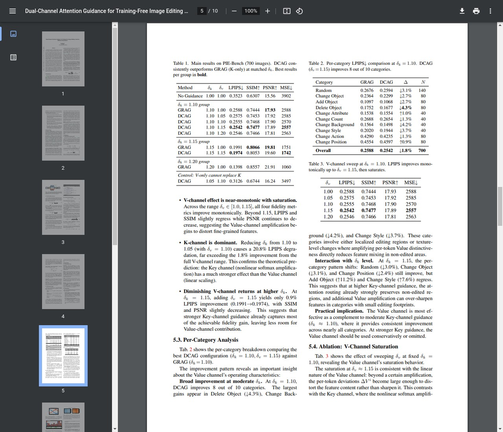
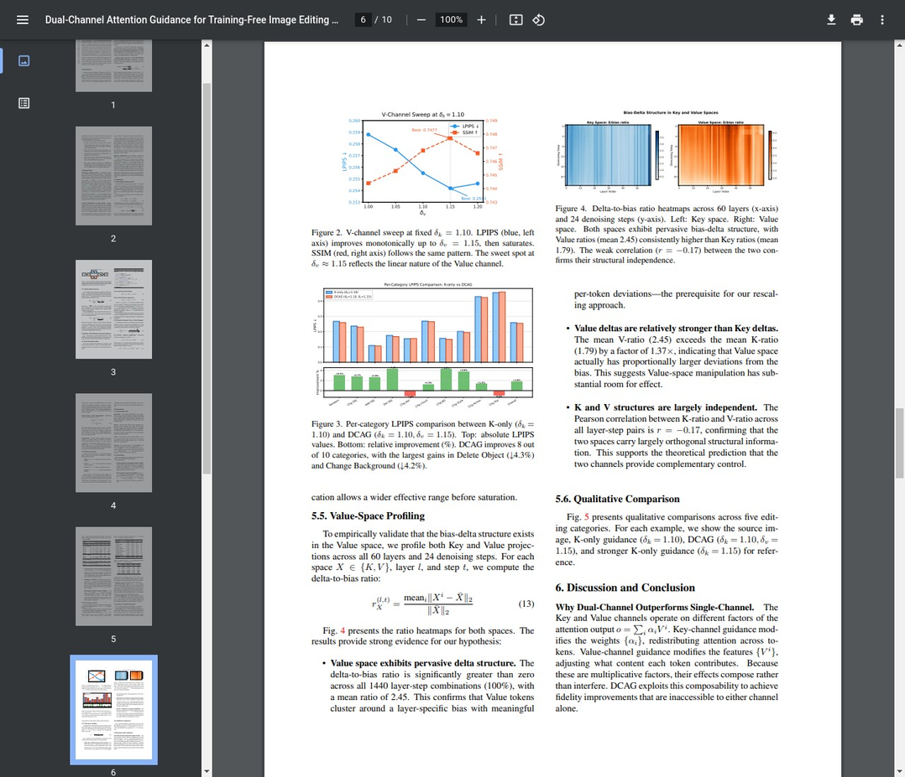
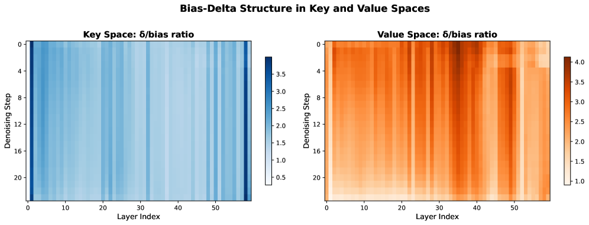
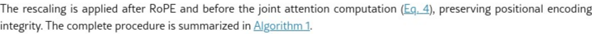

<<<<<<< HEAD
# AI Daily：雙通道注意力引導，實現無需訓練的圖像編輯

**日期：** 2026年2月24日
**作者：** Manus AI
=======
# AI Daily: DCAG - 雙通道注意力引導，實現無需訓練的DiT圖像編輯控制

> **論文名稱**：Dual-Channel Attention Guidance for Training-Free Image Editing Control in Diffusion Transformers
> 
> **論文連結**：[https://arxiv.org/abs/2602.18022](https://arxiv.org/abs/2602.18022)
> 
> **發表單位**：iFLYTEK (Guandong Li), Aegon THTF (Mengxia Ye)
> 
> **發表時間**：2026年2月20日
>>>>>>> 628e3cd5f692b9fa59997b67988c2b248d2d95ff

<<<<<<< HEAD
### 1. 簡介

今天的焦點論文是 **"Dual-Channel Attention Guidance for Training-Free Image Editing Control in Diffusion Transformers"**（中譯：用於擴散變換器中無需訓練的圖像編輯控制的雙通道注意力引導），由 Guandong Li (科大訊飛) 和 Mengxia Ye (同方全球人壽) 撰寫，於2026年2月20日發表在 arXiv 上 [1]。這項研究提出了一個名為 **雙通道注意力引導 (DCAG)** 的新型、無需訓練的框架，旨在實現擴散變換器 (DiT) 架構內精確的圖像編輯控制。隨著指令引導的圖像編輯模型日益強大，一個關鍵挑戰是如何精細地平衡編輯指令的強度與保留無關內容之間的關係。現有方法通常操縱注意力機制的 Key 空間，該空間控制模型關注的*位置*。而這篇論文做出了一個關鍵發現：控制*聚合內容*的 Value 空間同樣擁有可控的結構，為細粒度編輯提供了一個新的維度。

### 2. 核心思想：Key 與 Value 空間中的「偏置-偏差」結構

DCAG 的核心貢獻在於發現並利用了 DiT 多模態注意力層中 Key (K) 和 Value (V) 投影*兩者*的「偏置-偏差」(bias-delta) 結構。先前的工作，如 GRAG [2]，已在 Key 空間中識別出此結構，其中所有 token 嵌入都緊密圍繞一個共享的偏置向量聚集。每個 token 與此偏置的偏差（delta）捕捉了特定於 token 的內容信號。

DCAG 的作者揭示了這種現象並非 Key 獨有；Value 投影也表現出同樣明顯的聚類現象。這一洞察至關重要，因為它揭示了 Value 空間是一個先前被忽視的編輯控制通道。

> **關鍵發現：** 我們發現這種偏置-偏差結構並非 Key 空間所獨有。Value 投影也表現出相同的聚類現象。這一發現啟發了我們的雙通道方法：如果 K 和 V 都具有可利用的偏置-偏差結構，那麼同時操縱兩個通道應該能比單獨操縱任一通道提供更豐富的控制。 [1]

K 和 V 的偏置-偏差分解可以寫成：

$$K_{img}^i = \underbrace{\bar{K}_{img}}_{\text{偏置}} + \underbrace{(K_{img}^i - \bar{K}_{img})}_{\text{偏差 } \Delta K^i}$$

$$V_{img}^i = \underbrace{\bar{V}_{img}}_{\text{偏置}} + \underbrace{(V_{img}^i - \bar{V}_{img})}_{\text{偏差 } \Delta V^i}$$

這種雙通道方法允許同時操縱：

| 通道 | 角色 | 控制類型 |
|---|---|---|
| **Key 通道** | 控制模型關注的*位置*（注意力路由） | 粗粒度、非線性（透過 softmax） |
| **Value 通道** | 控制*聚合*的特徵內容 | 細粒度、線性（成比例） |

### 3. 方法論：雙通道重縮放與引導

基於這一發現，DCAG 提出了一種簡單而有效的方法，在進行聯合注意力計算之前，獨立地重縮放 Key 和 Value 投影的偏差分量。這創建了一個二維參數空間 (δk, δv)，以實現更細緻的控制。

重縮放的公式如下，其中修改後的 Key 和 Value 投影是透過將其偏差分量分別乘以因子 δk 和 δv 來計算的：
=======
## 核心貢獻

這篇論文針對基於擴散模型Transformer（DiT）的圖像編輯任務，提出了一個名為**雙通道注意力引導（Dual-Channel Attention Guidance, DCAG）**的無需訓練（training-free）框架。現有的注意力操控方法（如GRAG [[2]](#references)）僅專注於Key空間，藉此調控「注意力要看哪裡」（attention routing），卻完全忽略了Value空間，也就是「聚合什麼特徵」（feature aggregation）的潛力。

DCAG的核心貢獻可以歸納為以下四點：

**第一，揭示了Value空間的「偏置-增量」結構。** 論文首次發現，不僅是Key空間，DiT多模態注意力層中的Value空間也存在顯著的「偏置-增量」（bias-delta）結構。這意味著所有token的嵌入都緊密圍繞一個與層相關的偏置向量，而各自的增量則包含了獨特的內容信息。這一發現揭示了Value空間作為一個未被開發的、獨立的控制通道的潛力。

**第二，提出雙通道注意力引導框架。** 基於上述發現，DCAG框架能夠同時操控Key和Value兩個通道，形成了一個二維的控制參數空間 (δk, δv)，從而實現比任何單通道方法更精確的編輯-保真度權衡。

**第三，理論分析了雙通道的互補特性。** 論文從理論上證明了Key和Value通道具有根本不同的控制特性：Key通道通過非線性的Softmax函數運作，如同一個**粗調旋鈕（coarse control knob）**；Value通道通過線性的加權求和運作，如同一個**微調補償（fine-grained complement）**。

**第四，在基準測試中取得顯著提升。** 在包含700張圖片和10個編輯類別的PIE-Bench基準測試上，DCAG在所有保真度指標上都持續優於僅使用Key引導的GRAG方法。尤其在局部編輯任務中，如物體刪除（LPIPS降低4.9%）和物體添加（LPIPS降低3.2%），改進最為顯著。

## 技術細節

DCAG的實現基於對DiT模型中多模態注意力層的深入理解。注意力機制的輸出可以被分解為**注意力路由（Attention Routing）**和**特徵聚合（Feature Aggregation）**兩個部分：

$$
\text{Output} = \underbrace{\text{softmax}\!\left(\frac{QK^{\top}}{\sqrt{d}}\right)}_{\text{K: attention routing}} \cdot \underbrace{V}_{\text{V: feature aggregation}}
$$

#### 1. 偏置-增量結構 (Bias-Delta Structure)

論文的核心觀察是，在DiT的MM-Attention層中，不僅是Key投射，Value投射也表現出顯著的聚類模式。對於任意一層的圖像token，其Key和Value向量都可以被分解為一個共享的**偏置（bias）**和一個獨特的**增量（delta）**：

$$
K_{\text{img}}^i = \underbrace{\bar{K}_{\text{img}}}_{\text{bias}} + \underbrace{(K_{\text{img}}^i - \bar{K}_{\text{img}})}_{\text{delta } \Delta K^i}
$$

$$
V_{\text{img}}^i = \underbrace{\bar{V}_{\text{img}}}_{\text{bias}} + \underbrace{(V_{\text{img}}^i - \bar{V}_{\text{img}})}_{\text{delta } \Delta V^i}
$$

其中，$\bar{K}$和$\bar{V}$是該層所有圖像token的Key和Value向量的平均值，代表了模型的內在編輯行為。而$\Delta K_i$和$\Delta V_i$則編碼了每個token特定的內容信號。
>>>>>>> 628e3cd5f692b9fa59997b67988c2b248d2d95ff

#### 2. 雙通道重新縮放 (Dual-Channel Rescaling)

DCAG通過引入兩個控制參數$\delta_k$和$\delta_v$來分別重新縮放Key和Value的增量部分，從而實現對編輯過程的雙重控制：

<<<<<<< HEAD
完整的程序（演算法1）在 RoPE 編碼之後、主要注意力計算之前應用。該演算法計算圖像 token 的平均偏置，然後在將 K 和 V 通道傳遞給標準注意力函數之前，獨立地重縮放它們的偏差。

#### 理論分析：粗粒度 vs. 細粒度控制

該論文為這兩個通道為何提供互補的控制形式提供了令人信服的理論分析。

**Key 通道（粗粒度控制）。** Key 通道透過非線性的 `softmax` 函數運作。當 Key 偏差按 δk 縮放時，token i 和 j 之間的有效注意力 logit 差異變為：
=======
$$
\hat{K}_{\text{img}} = \bar{K}_{\text{img}} + \delta_k \cdot (K_{\text{img}} - \bar{K}_{\text{img}})
$$

$$
\hat{V}_{\text{img}} = \bar{V}_{\text{img}} + \delta_v \cdot (V_{\text{img}} - \bar{V}_{\text{img}})
$$

*圖1：DCAG框架概覽（左）和算法偽代碼（右）。Key通道控制注意力路由（粗調），Value通道控制特徵聚合（微調）。*

#### 3. 理論分析：Key vs. Value
>>>>>>> 628e3cd5f692b9fa59997b67988c2b248d2d95ff

論文的理論分析揭示了兩個通道為何能形成互補控制：

<<<<<<< HEAD
透過 softmax 的指數函數，這種 logit 差異的線性縮放對注意力分佈產生了*非線性的、放大的*效果。δk 的微小變化可以極大地重新分配注意力權重，使其成為一個強大但粗粒度的控制旋鈕。

**Value 通道（細粒度控制）。** Value 通道透過線性加權求和運作。輸出可分解為：
=======
**Key通道的非線性放大效應**：對Key的擾動會通過Softmax函數的指數特性被放大。logits的差異被$\delta_k$線性縮放，但最終的注意力權重$\alpha_i$會發生非線性變化，使Key通道成為一個強大的「粗調」工具：

$$
q^\top \hat{K}^i - q^\top \hat{K}^j = \delta_k \cdot q^\top (\Delta K^i - \Delta K^j)
$$
>>>>>>> 628e3cd5f692b9fa59997b67988c2b248d2d95ff

**Value通道的線性比例效應**：對Value的擾動是線性的。最終的輸出可以表示為：

<<<<<<< HEAD
δv 對輸出的影響是*嚴格線性*的：將 δv 加倍會使與均值的偏差加倍。這使其成為一個可預測的、細粒度的控制機制，非常適合在不改變注意力分佈的情況下對特徵進行微調。

**正交性。** Key 通道修改注意力權重 {αi}（關注哪些 token），而 Value 通道修改特徵 {Vi}（聚合什麼內容）。它們作用於注意力輸出 o = Σ αi Vi 的不同因子上，使其在功能上是正交的。這種正交性得到了經驗驗證：在所有 1440 個層-步驟對中，K-ratio 和 V-ratio 之間的皮爾森相關係數為 r = -0.17。

### 4. 實驗與結果

DCAG 在 **PIE-Bench** [3] 上進行了廣泛評估，這是一個包含 700 張圖像、橫跨 10 個編輯類別的綜合性指令圖像編輯基準測試，並使用 **Qwen-Image-Edit** 模型 [4]（一個 60 層的雙流 DiT）。結果表明，DCAG 在各種保真度指標上始終優於僅使用 Key 的基線（GRAG）。

#### PIE-Bench 上的主要結果

| 方法 | δk | δv | LPIPS ↓ | SSIM ↑ | PSNR ↑ | MSE ↓ |
|---|---|---|---|---|---|---|
| 無引導 | 1.00 | 1.00 | 0.3523 | 0.6307 | 15.56 | 3902 |
=======
$$
o = \sum_i \alpha_i (\bar{V} + \delta_v \cdot \Delta V^i) = \bar{V} + \delta_v \sum_i \alpha_i \Delta V^i
$$

輸出由一個固定的偏置項$\bar{V}$和一個被$\delta_v$線性縮放的增量項組成。這意味著$\delta_v$的變化會產生可預測的、成比例的輸出變化，使其成為一個理想的「微調」工具。

**正交性（Orthogonality）**：Key通道修改注意力權重$\{\alpha_i\}$（哪些token被關注），而Value通道修改特徵$\{V_i\}$（聚合什麼內容）。這兩者作用於注意力輸出$o = \sum_i \alpha_i V_i$的不同因子，使它們在功能上是正交的。這一正交性通過實驗得到了驗證：K-ratio和V-ratio之間的Pearson相關係數為$r = -0.17$。

## 實驗結果

實驗在PIE-Bench [[3]](#references) 上進行，使用了Qwen-Image-Edit [[4]](#references) 作為基礎模型（一個60層的雙流DiT）。

#### 主要結果

下表展示了在完整的PIE-Bench上，DCAG與GRAG的比較。在匹配的$\delta_k$值下，DCAG通過增加$\delta_v$持續改善了保真度指標。

| Method | δk | δv | LPIPS ↓ | SSIM ↑ | PSNR ↑ | MSE ↓ |
| :--- | :--- | :--- | :--- | :--- | :--- | :--- |
| No Guidance | 1.00 | 1.00 | 0.3523 | 0.6307 | 15.56 | 3902 |
>>>>>>> 628e3cd5f692b9fa59997b67988c2b248d2d95ff
| GRAG | 1.10 | 1.00 | 0.2588 | 0.7444 | 17.93 | 2588 |
| **DCAG** | **1.10** | **1.15** | **0.2542** | **0.7477** | **17.89** | **2557** |
| GRAG | 1.15 | 1.00 | 0.1991 | 0.8066 | 19.81 | 1751 |
| **DCAG** | **1.15** | **1.15** | **0.1974** | **0.8053** | **19.60** | **1742** |

<<<<<<< HEAD
#### 各類別 LPIPS 分析

改進模式顯示，Value 通道對於局部編輯任務最為有效：

| 類別 | GRAG (δk=1.10) | DCAG (δk=1.10, δv=1.15) | 變化量 Δ |
|---|---|---|---|
| 刪除物體 | 0.1752 | 0.1677 | **↓ 4.3%** |
| 改變背景 | 0.1564 | 0.1498 | **↓ 4.2%** |
| 改變風格 | 0.2020 | 0.1944 | **↓ 3.7%** |
| 隨機 | 0.2676 | 0.2594 | ↓ 3.1% |
| 改變物體 | 0.2364 | 0.2299 | ↓ 2.7% |
| 新增物體 | 0.1097 | 0.1068 | ↓ 2.7% |
| **總體** | **0.2588** | **0.2542** | **↓ 1.8%** |

最大的增益出現在「刪除物體」（↓4.3%）、「改變背景」（↓4.2%）和「改變風格」（↓4.3%）中。這些類別涉及局部編輯區域或紋理級別的變化，在這些情況下，放大每個 token 的 Value 獨特性可直接減少非編輯區域的特徵混合。

#### Value 空間剖析

為了經驗性地驗證 Value 空間中的偏置-偏差結構，作者對所有 60 個層和 24 個去噪步驟的 K 和 V 投影進行了剖析。偏差與偏置的比率定義為：
=======

*圖2：PIE-Bench上的完整實驗結果（表1、表2、表3）。*

#### 分類別分析

DCAG在10個編輯類別中的8個都取得了改進。最大的增益出現在**物體刪除（-4.3% LPIPS）**、**背景更換（-4.2% LPIPS）**和**風格轉換（-3.7% LPIPS）**等任務中。

*圖3：V-channel sweep曲線（左）和分類別LPIPS比較（右）。*

#### Value空間剖析

為了驗證Value空間中偏置-增量結構的存在，論文對所有60層和24個去噪步驟的K和V投射進行了剖析，計算了增量-偏置比率：
>>>>>>> 628e3cd5f692b9fa59997b67988c2b248d2d95ff

$$
r_X(l, t) = \text{mean}_i \frac{\|X^i - \bar{X}\|_2}{\|\bar{X}\|_2}
$$

<<<<<<< HEAD
此剖析的主要發現：
- 在 Value 空間的所有 1440 個層-步驟組合中，偏差結構 **100%** 存在。
- 平均 V-ratio (2.45) 超過平均 K-ratio (1.79) 達 1.37 倍，表明 Value 空間實際上具有相對更大的偏置偏差。
- K-ratio 和 V-ratio 之間的皮爾森相關係數為 r = -0.17，證實了結構上的獨立性。

### 5. 實踐指南

根據實驗分析，作者推薦以下配置：

| 場景 | 推薦的 (δk, δv) |
|---|---|
| 預設（最佳整體保真度） | (1.10, 1.15) |
| 局部編輯（刪除/新增物體、改變背景） | (1.10, 1.10–1.15) |
| 全局編輯（改變動作/位置） | (1.10–1.15, 1.00) |
| 強 Key 引導 | (1.15, ≤1.05) |

Value 通道在 δv ≈ 1.15 時達到飽和；超過此值，由於通道的線性特性，特徵開始扭曲而非銳化。

### 6. 結論與個人反思

DCAG 為提升無需訓練的擴散變換器圖像編輯的可控性提供了一個優雅且直觀的框架。透過識別並利用 Value 空間內的潛在控制結構，作者為微調編輯過程開啟了一個新的維度。Key 通道的粗粒度、非線性控制與 Value 通道的細粒度、線性控制之間的清晰理論區分，是一項重要的概念性貢獻。

實證結果有力地支持了這一論點：雙通道方法能夠在編輯準確性與背景保留之間實現更有利的權衡。這項工作是追求完全可控和直觀的生成式 AI 工具過程中的一個顯著進步，從單通道操縱走向對注意力機制更全面的理解。

作者建議的未來方向包括空間自適應 DCAG（其中 δk 和 δv 根據編輯相關性對每個 token 進行變化）、Query 空間引導以及影片編輯應用。

---

### 參考文獻
=======
關鍵發現：Value空間的增量結構在所有1440個層-步驟組合中均存在（100%），平均V-ratio（2.45）比平均K-ratio（1.79）高出1.37倍，且兩者的Pearson相關係數為$r = -0.17$，確認了結構獨立性。

## 相關研究分析

DCAG建立在近期一系列關於無需訓練的注意力操控方法之上，但又有所突破。

| 方法 | 核心思路 | 局限性 |
| :--- | :--- | :--- |
| CFG [[5]](#references) | 條件/無條件預測的線性插值 | 控制粒度粗，極端值易產生偽影 |
| Prompt-to-Prompt [[6]](#references) | 注入源圖像的交叉注意力圖 | 依賴DDIM反演，需要額外計算 |
| MasaCtrl [[7]](#references) | 互自注意力控制（ICCV 2023） | 主要針對UNet架構，不直接適用於DiT |
| GRAG [[2]](#references) | Key空間偏置-增量重縮放 | 完全忽略Value空間的控制潛力 |
| **DCAG（本文）** | **Key + Value雙通道重縮放** | **Value通道效果較溫和，在強Key引導下收益遞減** |

DCAG的創新之處在於，它認識到Value空間同樣具有可利用的結構，並將其與Key空間結合，從單通道控制躍升至雙通道控制，提供了更豐富、更精確的控制維度。

## 實用建議

基於實驗分析，論文提供了以下實用配置建議：

| 場景 | 推薦配置 (δk, δv) |
| :--- | :--- |
| 默認配置（最佳整體保真度） | (1.10, 1.15) |
| 局部編輯（刪除/添加物體、更換背景） | (1.10, 1.10–1.15) |
| 全局編輯（更換動作/位置） | (1.10–1.15, 1.00) |
| 強Key引導下 | (1.15, ≤1.05) |

Value通道在$\delta_v \approx 1.15$時飽和；超過此值，特徵開始失真而非銳化。

## 個人評價

DCAG是一項非常聰明且實用的工作，它完美詮釋了「站在巨人肩膀上」的創新。它沒有提出一個全新的、複雜的架構，而是深入挖掘了現有DiT模型中被忽視的結構——Value空間的「偏置-增量」特性。

這項研究的意義在於：對於追求精確圖像編輯的任務，DCAG提供的雙通道微調能力至關重要，允許在「改得多」和「保留好」之間找到更優的平衡點。DCAG提醒我們，Value通道（即內容聚合）同樣蘊含著豐富的可操控信息，這可能激發更多探索Value空間潛力的後續研究，例如空間自適應的Value引導、甚至是對Query空間的探索。作為一個無需訓練的即插即用模塊，DCAG可以輕鬆集成到現有的DiT編輯模型中，立即提升其性能。

---

## References
>>>>>>> 628e3cd5f692b9fa59997b67988c2b248d2d95ff

[1] Guandong Li, & Mengxia Ye. (2026). *Dual-Channel Attention Guidance for Training-Free Image Editing Control in Diffusion Transformers*. arXiv:2602.18022. https://arxiv.org/abs/2602.18022

[2] Zhang, X., et al. (2025). *Group Relative Attention Guidance for Image Editing*. arXiv:2510.24657. https://arxiv.org/abs/2510.24657

[3] Ju, X., et al. (2023). *Pnp Inversion: Boosting Diffusion-based Editing with 3 Lines of Code*. ICLR 2024. https://arxiv.org/abs/2310.01506

[4] Qwen Team. (2025). *Qwen-Image-Edit Model Card*. Hugging Face. https://huggingface.co/Qwen/Qwen-Image-Edit

[5] Ho, J., & Salimans, T. (2022). *Classifier-Free Diffusion Guidance*. arXiv:2207.12598. https://arxiv.org/abs/2207.12598

[6] Hertz, A., et al. (2022). *Prompt-to-Prompt Image Editing with Cross Attention Control*. ICLR 2023. https://arxiv.org/abs/2208.01626

[7] Cao, M., et al. (2023). *MasaCtrl: Tuning-Free Mutual Self-Attention Control for Consistent Image Synthesis and Editing*. ICCV 2023. https://arxiv.org/abs/2304.08465

---

> *以下內容整合自另一版本的報告*

## 總結

這篇論文提出了一種名為**雙通道注意力引導（Dual-Channel Attention Guidance, DCAG）**的免訓練（training-free）框架，專為基於擴散模型轉換器（Diffusion Transformers, DiT）的圖像編輯提供更精細的控制。現有的注意力操控方法主要集中在Key空間，以調整注意力路由，但忽略了負責特徵聚合的Value空間。DCAG的核心貢獻在於，它首次揭示並利用了DiT多模態注意力層中，Key和Value兩個空間皆存在的**偏置-增量結構（bias-delta structure）**。

基於此發現，DCAG建立了一個二維參數空間，透過同時操控Key通道（控制注意力要「看哪裡」）和Value通道（控制要「聚合什麼」），實現了比單通道方法更精確的編輯-保真度權衡。理論分析表明，Key通道提供非線性的粗粒度控制，而Value通道則提供線性的細粒度控制，兩者形成功能互補。在PIE-Bench基準測試上的大量實驗證明，DCAG在多種編輯任務中，尤其是在物體刪除等局部編輯上，顯著優於僅使用Key引導的SOTA方法。

---

## 核心概念與方法

DCAG的基石是對DiT多模態注意力層中Key和Value投射的結構性洞察。研究者發現，這兩個空間中的token嵌入都圍繞著一個共享的、僅與層相關的偏置向量（bias vector）緊密聚集。

### 偏置-增量結構 (Bias-Delta Structure)

此結構首先在Key投射中被前人工作GRAG [1]所觀察到，但DCAG將此發現擴展到了Value投射。對於圖像token，其在Key和Value空間的表示可以分解為一個共享的**偏置（bias）**和一個token特定的**增量（delta）**：

*   **偏置 (Bias)**: 代表了模型在該層的整體、固有的編輯行為或風格。
*   **增量 (Delta)**: 編碼了每個token獨特的、與內容相關的編輯信號。

*圖：Key和Value空間的偏置-增量結構熱圖。兩者皆呈現出顯著的結構，且彼此間的相關性很低 (r = -0.17)，證明了其結構的獨立性，為雙通道控制提供了理論基礎。*

### 雙通道縮放 (Dual-Channel Rescaling)

基於偏置-增量結構，DCAG引入了兩個控制旋鈕 (control knobs)，(δk, δv)，分別獨立地縮放Key和Value空間中的增量部分，從而實現對編輯過程的精細調控。

*圖：DCAG框架概覽。在RoPE編碼後，DCAG在進入聯合注意力計算之前，獨立地對Key和Value通道的增量進行縮放。*

其核心演算法如下：

*圖：DCAG演算法偽代碼。*

- **Key通道 (Attention Routing)**: 透過調整δk > 1.0，放大Key增量的影響力。這會銳化注意力分佈，使其更集中於高相關性的token。由於softmax的指數特性，微小的δk變化就能產生顯著的非線性、粗粒度控制效果。
- **Value通道 (Feature Aggregation)**: 透過調整δv > 1.0，線性地放大Value增量的特徵。這增強了每個token的特徵獨特性，而不改變注意力權重分佈，從而實現了對輸出特徵的精細、線性控制。

這種雙通道設計將編輯控制分解為兩個正交的維度，提供了一個二維參數空間，讓使用者可以更靈活地在「編輯強度」與「內容保真度」之間進行權衡。

---

## 討論與結論

DCAG的成功證明了在DiT的注意力機制中，Value通道是一個被低估但極具價值的控制維度。透過將Key和Value通道的控制解耦，DCAG為免訓練圖像編輯提供了一個更強大、更靈活的工具。

**實踐指南**:
- **預設配置**: (δk=1.10, δv=1.15) 在多數情況下能取得最佳的整體保真度。
- **局部編輯**: Value通道在「刪除/添加物體」等局部編輯中效益最大。
- **全域編輯**: 對於「改變動作/位置」等全域編輯，Value通道效果有限，應主要依賴Key通道。

**侷限性**:
- Value通道的影響本質上比Key通道更溫和，因此整體改進幅度有限（約1.8% LPIPS）。
- 在強Key引導下（δk≥1.15），Value通道的增益會減小，甚至可能導致某些類別的性能下降。

**未來方向**:
- 空間自適應的DCAG，根據編輯相關性為每個token動態調整(δk, δv)。
- 將偏置-增量框架擴展到Query空間。
- 應用於影片編輯，解決時間一致性問題。

總之，DCAG透過其創新的雙通道注意力引導框架，為DiT中的免訓練圖像編輯設立了新的SOTA，並為未來的研究開闢了新的方向。

---

## 參考文獻

[1] Zhang, X., Niu, X., Chen, R., Song, D., Zeng, J., Du, P., ... & Liu, A. (2025). Group Relative Attention Guidance for Image Editing. *arXiv preprint arXiv:2510.24657*.

[2] Hertz, A., Mokady, R., Tenenbaum, J., Aberman, K., Pritch, Y., & Cohen-Or, D. (2022). Prompt-to-prompt image editing with cross attention control. *arXiv preprint arXiv:2208.01626*.

[3] Cao, M., Wang, X., Qi, Z., Shan, Y., Qie, X., & Zheng, Y. (2023). Masactrl: tuning-free mutual self-attention control for consistent image synthesis and editing. In *Proceedings of the IEEE/CVF international conference on computer vision* (pp. 22560-22570).
