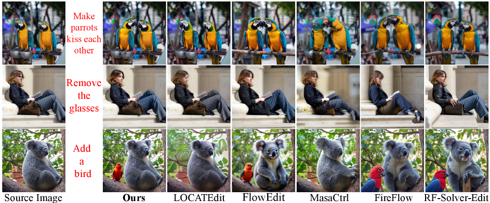
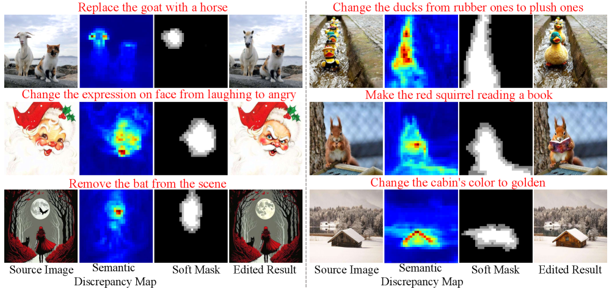
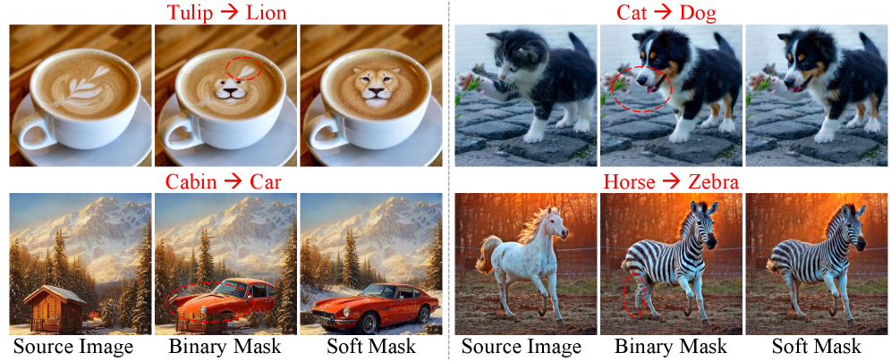

# AI Daily: FusionEdit - 無需訓練，實現語義融合與注意力調製的圖像編輯新境界

> 論文標題：FusionEdit: Semantic Fusion and Attention Modulation for Training-Free Image Editing
> 
> 論文連結：[https://arxiv.org/abs/2602.08725](https://arxiv.org/abs/2602.08725)
> 
> 代碼連結：[https://github.com/Yvan1001/FusionEdit](https://github.com/Yvan1001/FusionEdit)
> 
> 發表單位：廣東基礎與應用基礎研究基金會支持項目
> 
> 發表時間：2026年2月9日

## 論文核心貢獻

在文本引導的圖像編輯領域，如何在精確修改特定區域的同時，完美保留原始圖像的其餘內容，一直是個極具挑戰性的課題。現有方法大多依賴生硬的二元遮罩（binary mask）來限制編輯範圍，但這往往會在邊界處產生不自然的視覺瑕疵，並限制了編輯的靈活性。

為了解決這些痛點，研究人員提出了 **FusionEdit**，一個**無需訓練（training-free）** 的圖像編輯框架。它巧妙地結合了**語義融合（Semantic Fusion）**與**注意力調製（Attention Modulation）**，實現了前所未有的精準與可控性。其核心貢獻可歸納為兩點：

1.  **自適應軟遮罩生成 (Adaptive Soft Mask Generation)**：FusionEdit 能夠自動識別需要編輯的區域。它透過計算來源提示（source prompt）與目標提示（target prompt）之間的**語義差異（semantic discrepancies）**來定位編輯區。接著，它採用**距離感知潛在融合（distance-aware latent fusion）**技術，並結合**總變分損失（total variation loss）**，在區域邊界生成平滑過渡的軟遮罩。這項技術有效避免了硬邊界所帶來的突兀感和瑕疵，讓編輯結果更加自然。

2.  **差異感知注意力調製 (Disparity-Aware Attention Modulation, DAM)**：為了在提升編輯效果的同時，保持與原始圖像的全局一致性，FusionEdit 設計了 DAM 模組。此模組基於 **AdaIN (Adaptive Instance Normalization)**，在 DiT（Diffusion Transformer）的注意力層中進行統計上的注意力融合。它能將原始圖像的全局外觀統計資訊注入到編輯過程中，從而增強了編輯區域的可控性，同時確保整體風格與來源圖像保持一致。

*圖1：FusionEdit 流程概覽。從來源與目標提示生成語義差異圖，進而產生自適應軟遮罩；同時，DAM 模組將全局外觀統計資訊注入編輯路徑，實現精準且一致的圖像編輯。*

## 技術方法簡述

FusionEdit 的技術實現主要基於 **Rectified Flow (RF)** 模型，並在此基礎上進行了兩項關鍵創新。

### 1. Rectified Flow (RF) 基礎

RF 模型透過一個常微分方程（ODE）將圖像數據分佈 $X$ 與高斯先驗分佈 $\mathcal{N}(0, I)$ 建立起連續映射：

$$ d\mathbf{X}_t = \mathbf{v}_\theta(\mathbf{X}_t, t, C) dt $$

其中 $\mathbf{v}_\theta$ 是預訓練的速度場，$t$ 是時間步，$C$ 是條件文本。在圖像編輯中，模型透過計算來源與目標提示之間的**語義位移場 (Semantic Displacement Field)** $\delta\mathbf{V}_t$ 來引導圖像的轉化過程：

$$ \delta\mathbf{V}_t = \mathbf{v}_\theta(\mathbf{Z}_t^{\text{tar}}, t, C^{\text{tar}}) - \mathbf{v}_\theta(\mathbf{Z}_t^{\text{src}}, t, C^{\text{src}}) $$

### 2. 自適應軟遮罩生成 (Adaptive Soft Mask Generation)

此過程分為三個步驟：

*   **區域提取**：透過計算在中間時間步 $T'$ 時，目標條件與來源條件下的速度場之間的 L2 距離，得到一個**語義差異圖 (Semantic Discrepancy Map)** $S$。
    $$ S = \|\mathbf{v}_\theta(\mathbf{Z}_{T'}^{\text{src}}, T', C^{\text{tar}}) - \mathbf{v}_\theta(\mathbf{Z}_{T'}^{\text{src}}, T', C^{\text{src}})\|_2 $$
    這個差異圖能準確地標示出需要編輯的區域。

*   **軟邊界細化**：將二元遮罩 $M_R$ 轉換為軟遮罩 $M_S$，在邊界區域使用 Sigmoid 函數創建平滑過渡。
    $$ M_S(i,j) = \begin{cases} \frac{1}{1 + \exp(k(D(i,j) - d_{\max}/2))} & \text{if } D(i,j) \le d_{\max} \\ M_R(i,j) & \text{if } D(i,j) > d_{\max} \end{cases} $$
    其中 $D(i,j)$ 是像素到邊界的距離，$d_{\max}$ 控制過渡帶寬度。

*   **總變分損失 (Total Variation Loss)**：最後，透過最小化一個 TV loss 來優化融合過程，進一步消除邊界瑕疵，確保空間的平滑性。
    $$ \mathcal{L}_{TV} = \sum_{(i,j) \in \Omega_b} \|\nabla \mathbf{X}_t^M(i,j)\|_2 + \lambda \sum_{(i,j) \in \Omega_b} \|\mathbf{X}_t^M(i,j) - \hat{\mathbf{X}}_t^M(i,j)\|_2 $$

*圖2：語義差異圖（中）能準確捕捉需要修改的區域（如將山羊換成馬），並生成平滑的軟遮罩（右），實現無縫編輯。*

### 3. 差異感知注意力調製 (Disparity-Aware Attention Modulation, DAM)

為了避免遮罩操作帶來的全局信息損失，DAM 模組被引入。它透過 **AdaIN** 將一個無遮罩限制的參考路徑（reference path）中的全局特徵統計資訊（均值和標準差）傳遞到被遮罩的編輯路徑中。

$$ \mathbf{V}'_l = \alpha \cdot \text{AdaIN}(\mathbf{V}_l, \mathbf{V}_l^r) + (1 - \alpha) \cdot \mathbf{V}_l $$

其中，融合強度 $\alpha$ 是自適應的，它會根據語義差異的大小和當前的時間步 $t$ 動態調整，確保在需要時增強細節，在語義變化較大時則抑制融合。

*圖3：在沒有 DAM 的情況下（中），編輯結果可能不完整或不協調。加入 DAM 後（右），編輯（如改變貓的眼睛、改變髮色）變得語義準確且全局一致。*

## 實驗結果與性能指標

FusionEdit 在 PIE-Bench 這個全面的基準測試集上進行了評估，並與多個 SOTA 方法進行了比較。

### 量化比較

如下表所示，FusionEdit 在多項關鍵指標上均取得了最佳或次佳的成績。特別是在**背景保留**相關的指標（如 PSNR, LPIPS, SSIM）上，FusionEdit 顯著優於其他方法，證明其在精準編輯的同時，對非編輯區域的保護能力極強。在**文本對齊**方面（CLIP Similarity），也達到了頂尖水平。

*表1：量化結果顯示 FusionEdit 在多項指標上超越了現有的 SOTA 方法。*

### 視覺化比較

從視覺效果上看，FusionEdit 的優越性更加直觀。無論是物體替換、屬性修改還是風格轉換，它都能生成高度逼真且符合語義的結果，同時完美保留背景細節。

*圖4：與其他 SOTA 方法相比，FusionEdit（Ours）的編輯結果在語義準確性和背景保真度上都更勝一籌。*

### 消融實驗 (Ablation Study)

消融實驗進一步驗證了 **自適應軟遮罩** 和 **DAM** 模組的有效性。移除軟遮罩會導致背景保留指標顯著下降，並在邊界產生瑕疵。而移除 DAM 則會導致編輯不一致或效果受限。

*圖5：與傳統的二元硬遮罩（Binary Mask）相比，FusionEdit 的軟遮罩（Soft Mask）能產生更平滑、無瑕疵的邊界過渡。*

## 相關研究背景

文本引導的圖像編輯是生成式 AI 的一個重要分支。早期的方法如 Prompt-to-Prompt (P2P) 透過交叉注意力控制來實現編輯，但往往會影響非編輯區域。後續工作如 MasaCtrl、LOCATEdit 等引入了遮罩來進行空間約束，但硬遮罩的問題隨之而來。FusionEdit 正是在這個背景下，針對硬遮罩的缺陷，提出以軟遮罩和注意力調製相結合的創新解決方案，推動了無需訓練的圖像編輯技術的發展。

## 個人評價與意義

FusionEdit 最大的亮點在於其**無需訓練**的特性，這意味著它可以靈活地應用於各種預訓練的擴散模型或流模型（如本研究中使用的 FLUX），而無需進行成本高昂的微調。這大大降低了技術應用的門檻。

其次，**自適應軟遮罩**的設計非常巧妙。它不再依賴外部的分割模型或手動繪製遮罩，而是從文本本身的語義差異出發，自動、精準地定位編輯區域，並確保邊界的自然過渡。這不僅提升了自動化程度，也顯著改善了生成圖像的質量。

最後，**DAM 模組**為解決“戴著鐐銬跳舞”的難題提供了新思路。在進行局部編輯時，如何保留全局的風格和一致性是一個核心矛盾。DAM 透過注入全局統計資訊的方式，為局部編輯提供了必要的上下文，使得編輯既精準又協調。

總體而言，FusionEdit 是一個非常實用且具有啟發性的工作。它不僅在技術上超越了現有的 SOTA 方法，更為未來無需訓練的、高可控性的圖像編輯研究指明了一個清晰的方向。我們可以期待，基於 FusionEdit 的理念，未來將會出現更多強大且易於使用的圖像編輯工具。
