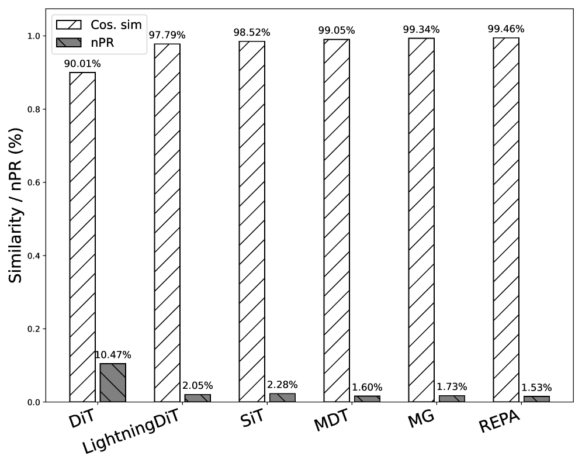
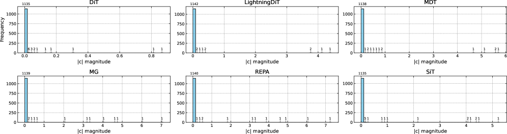

# AI Daily: DiT條件嵌入中的隱藏語義瓶頸 (ICLR 2026)

> **論文名稱**：A Hidden Semantic Bottleneck in Conditional Embeddings of Diffusion Transformers
> 
> **論文連結**：[https://arxiv.org/abs/2602.21596](https://arxiv.org/abs/2602.21596)
> 
> **發表單位**：KAIST (韓國科學技術院)
> 
> **發表時間**：2026年2月25日 (ICLR 2026)

## 核心貢獻

這篇論文首次系統性地研究了**Diffusion Transformers (DiT)** 中條件嵌入（conditional embeddings）的內部結構，並揭示了兩個驚人的「湧現特性」（emergent properties）：

1.  **極端的角度相似性 (Extreme Angular Similarity)**：無論是類別條件（如ImageNet）還是連續條件（如姿勢引導），DiT模型學到的條件嵌入向量在不同類別/樣本間的**餘弦相似度驚人地高**，在ImageNet上超過 **99%**，在連續任務上甚至超過 **99.9%**。這意味著所有條件都被編碼到一個極其狹窄的錐形空間中。

2.  **高度的維度稀疏性 (High Dimensional Sparsity)**：語義資訊不成比例地集中在嵌入向量的一小部分「頭部」維度中，而絕大多數「尾部」維度幾乎不包含資訊，其貢獻極小。論文的量化分析顯示，有效維度（用nPR衡量）僅佔總維度的 **1-2%**。

基於這兩個發現，論文證明了DiT條件嵌入存在巨大的**冗餘性**。通過一個簡單的**剪枝（pruning）**操作——移除掉最多**三分之二**的低幅度「尾部」維度——模型的生成品質不僅沒有下降，在某些情況下甚至有所**提升**。這揭示了DiT中存在一個「**隱藏的語義瓶頸**」，為設計更高效的條件注入機制提供了全新的視角。

## 技術方法詳解

論文的研究方法主要基於對預訓練好的SOTA DiT模型（如DiT, MDT, SiT, REPA, LightningDiT等）進行深入剖析，而非提出新模型。

#### 1. 條件嵌入的構成

在DiT中，條件向量 $\vec{c}$ 通常由**類別/條件嵌入** $\vec{y}$ 和**時間步嵌入** $\vec{t}$ 相加而成，然後通過**自適應層歸一化 (Adaptive Layer Normalization, AdaLN)** 注入到Transformer的每一個塊中，調節其仿射變換的尺度（scale, $\gamma$）和偏移（shift, $\beta$）。

$$\vec{c} = \vec{y} + \vec{t}$$

$$\text{AdaLN}(\vec{h} | \vec{c}) = \gamma(\vec{c}) \odot \frac{\vec{h} - \mu(\vec{h})}{\sigma(\vec{h})} + \beta(\vec{c})$$

其中 $\gamma(\vec{c}) = W_\gamma \vec{c}$，$\beta(\vec{c}) = W_\beta \vec{c}$。

與U-Net在多個空間尺度注入條件不同，DiT的AdaLN是一個**全局**機制，這被認為是導致語義瓶頸的關鍵結構因素。

#### 2. 相似性與稀疏性的量化

**餘弦相似度分析**：直接計算不同類別/樣本的條件嵌入向量 $\vec{c}$ 之間的 pairwise cosine similarity。結果顯示，在ImageNet-1K上，REPA-XL的1000個類別的條件嵌入之間的相似度幾乎全部超過99%。

**參與率 (Participation Ratio, PR)**：用來估算有效承載資訊的維度數量。對於一個向量 $\vec{v}$，其PR定義為：

$$\alpha = \text{PR}(\vec{v}) = \frac{(\sum_{i=1}^{d} |v_i|)^2}{\sum_{i=1}^{d} v_i^2}, \quad \alpha_\text{norm} = \frac{\alpha}{d}$$

論文進一步將其歸一化得到 **nPR**（`PR / dimension`），用以衡量有效維度的佔比。

| 模型 | DiT | SiT | MDT | LightningDiT | MG | REPA | X-MDPT | MDSGen |
| :--- | :---: | :---: | :---: | :---: | :---: | :---: | :---: | :---: |
| 條件維度 $d$ | 1152 | 1152 | 1152 | 1152 | 1152 | 1152 | 1024 | 768 |
| PR ($\alpha$) | 120.69 | 26.25 | 18.45 | 23.70 | 19.98 | 17.67 | 495.75 | 104.22 |
| **nPR** ($\alpha_\text{norm}$) | **10.47%** | **2.28%** | **1.60%** | **2.05%** | **1.73%** | **1.53%** | **48.42%** | **13.57%** |
| 餘弦相似度 | 0.9001 | 0.9852 | 0.9905 | 0.9779 | 0.9934 | 0.9946 | 0.9998 | 0.9999 |

*表1：各SOTA模型的條件嵌入指標。MDT, LightningDiT, MG, REPA等模型的有效維度佔比不足2%，而連續任務（X-MDPT, MDSGen）的nPR雖然更高，但餘弦相似度反而更接近1。*

#### 3. 剪枝實驗 (Pruning)

論文的核心實驗是剪枝。他們設定一個幅度閾值 $\tau$，將條件向量 $\vec{c}$ 中所有絕對值小於 $\tau$ 的維度直接設為0，然後再送入模型進行推理。

稀疏率定義為：

$$s_\text{tail}(\tau) = \frac{1}{d} \#\{i : |c_i| < \tau\}$$

實驗發現，即使剪掉超過66%的維度（$\tau=0.02$），生成的圖像品質（以FID和CLIP分數衡量）幾乎不受影響，甚至略有改善。

| 剪枝策略 | 移除維度數 | FID ↓ | IS ↑ | CLIP ↑ |
| :--- | :--- | :--- | :--- | :--- |
| Baseline (無剪枝) | 0 (0%) | 7.1694 | 176.02 | 29.746 |
| Tail $\tau=0.01$ ($t_0$) | 448 (38.94%) | **7.1690** | 175.97 | **29.807** |
| Tail $\tau=0.01$ ($t_{n-k,n}$) | 448 (38.94%) | **7.1598** | 175.49 | 29.805 |
| Tail $\tau=0.02$ ($t_i$) | 762 (66.21%) | 9.2202 | 125.15 | 29.221 |
| Head $\tau=5.0$ ($t_i$) | 2 (0.20%) | 7.8478 | 164.15 | 29.555 |
| Head $\tau=1.0$ ($t_i$) | 8 (0.69%) | **523.7637** | 1.95 | 22.690 |

*表2：在REPA-XL模型上對條件嵌入進行剪枝的實驗結果。剪掉尾部大量維度影響甚微，而剪掉頭部少量維度則會導致性能崩潰。*

## 核心發現的解釋

為什麼會出現這種極端相似和稀疏的現象，且剪枝後性能不降反升？論文提出了幾個關鍵假設：

**高餘弦相似性的成因**：DiT的訓練動態使模型傾向於學習能在所有時間步提供穩定、魯棒信號的嵌入，從而導致全局對齊。儘管嵌入向量在角度上高度相似，但它們之間微小的、非零的差異（主要存在於頭部維度）在擴散模型的**迭代去噪**過程中被逐步放大，足以引導模型生成正確的內容。

**剪枝的噪聲抑制作用**：那些低幅度的「尾部」維度更像是噪聲而非有效信號。在去噪的後期階段，這些噪聲可能會干擾精確的生成。剪掉它們相當於做了一次**噪聲抑制**，因此有時反而能提升生成品質。

$$\vec{c} = \vec{c}_\text{head} + \vec{c}_\text{tail}, \quad \|\vec{c}_\text{head}\| \gg \|\vec{c}_\text{tail}\|$$

## 相關研究背景

這項工作與以下幾個領域密切相關：

**DiT架構系列**：論文以 **DiT** [1]（ICCV 2023, FAIR）作為研究起點，同時分析了 **SiT** [2]（ECCV 2024）、**LightningDiT** [3]（CVPR 2025）、**MDT**、**MG** [4] 等多個SOTA模型，展示了語義瓶頸現象的普遍性。

**REPA（表示對齊）**：**REPA** [5]（ICLR 2025 Oral）是本次研究中表現最突出的分析對象，其nPR僅1.53%，餘弦相似度高達99.46%，語義瓶頸效應最為顯著。REPA通過將DiT的中間表示與預訓練視覺編碼器（如DINOv2）對齊來加速訓練，但這種對齊可能進一步加劇了條件嵌入的壓縮。

**表示學習中的坍塌 (Representation Collapse)**：在對比學習（如SimCLR, BYOL, VICReg）中，表示坍塌通常是有害的，需要特殊機制來避免。而DiT似乎天然地利用了這種「坍塌」後的微小差異，這是一個有趣的對比。

**資訊瓶頸理論 (Information Bottleneck Theory)** [6]：該理論認為神經網絡在學習過程中會壓縮輸入資訊，只保留與任務最相關的核心部分。DiT的條件嵌入稀疏性可以看作是該理論的一個實例——AdaLN的線性映射放大了少數主導維度，使其餘維度變得冗餘。

## 個人評價與意義

這篇論文是一項非常出色的分析工作，它沒有提出一個新模型，卻通過對現有SOTA模型深刻的洞察，揭示了DiT內部運作的一個根本機制。這項發現具有重要的理論和實踐意義：

**理論上**，它加深了我們對DiT這類生成模型如何編碼和使用條件資訊的理解，挑戰了「嵌入向量差異越大，語義差異越大」的直觀假設。論文還揭示了一個有趣的現象：高餘弦相似性在Transformer中普遍存在，但在U-Net中（不含時間步嵌入時）並不出現，這指向了AdaLN作為全局注入機制的獨特性。

**實踐上**，它直接指明了DiT條件機制存在巨大的**計算冗餘**。既然三分之二的維度可以被安全移除，未來的模型設計完全可以採用更小、更高效的條件嵌入空間，或者設計新的、非冗餘的注入機制，從而**降低模型大小和計算成本**。這對於大規模DiT模型的部署具有直接的實用價值。

**對圖像編輯研究的啟示**：這項發現對於 training-free 的圖像編輯方法（如之前介紹的DCAG）也有重要啟示。如果條件嵌入的語義資訊主要集中在少數頭部維度，那麼基於注意力操控的編輯方法可能可以更精確地針對這些關鍵維度進行干預，從而實現更高效、更精確的編輯效果。

這項工作也為未來的研究開闢了許多可能性，例如：能否主動引導模型學習更稀疏、更解耦的條件表示？這種瓶頸現象是否存在於其他類型的生成模型（如GANs, VAEs, Autoregressive models）中？總而言之，這是一篇能引發深入思考並指導未來模型設計的優秀論文。

---

### 參考文獻

[1] Peebles, W., & Xie, S. (2023). [Scalable Diffusion Models with Transformers](https://arxiv.org/abs/2212.09748). In *Proceedings of the IEEE/CVF International Conference on Computer Vision (ICCV)* (pp. 4195-4205).

[2] Ma, N., et al. (2024). [SiT: Exploring Flow and Diffusion-based Generative Models with Scalable Interpolant Transformers](https://arxiv.org/abs/2401.08740). In *European Conference on Computer Vision (ECCV)*.

[3] Yao, J., et al. (2025). [Reconstruction vs. Generation: Taming Optimization Dilemma in Latent Diffusion Models](https://arxiv.org/abs/2501.01423). In *CVPR 2025*.

[4] Tang, Z., et al. (2025). [Diffusion Models without Classifier-free Guidance](https://arxiv.org/abs/2502.12154). In *ICLR 2025*.

[5] Yu, S., et al. (2025). [Representation Alignment for Generation: Training Diffusion Transformers Is Easier Than You Think](https://arxiv.org/abs/2410.06940). In *ICLR 2025 (Oral)*.

[6] Tishby, N., Pereira, F. C., & Bialek, W. (2000). [The information bottleneck method](https://arxiv.org/abs/physics/0004057). In *Proceedings of the 37th Annual Allerton Conference on Communication, Control, and Computing* (pp. 368-377).
