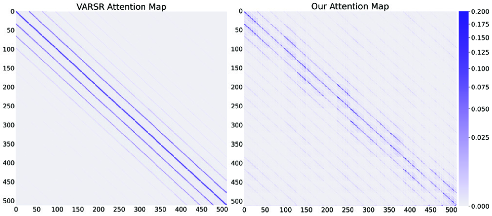
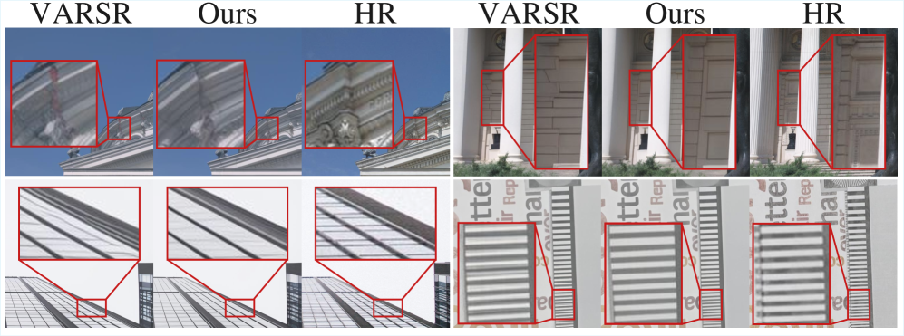
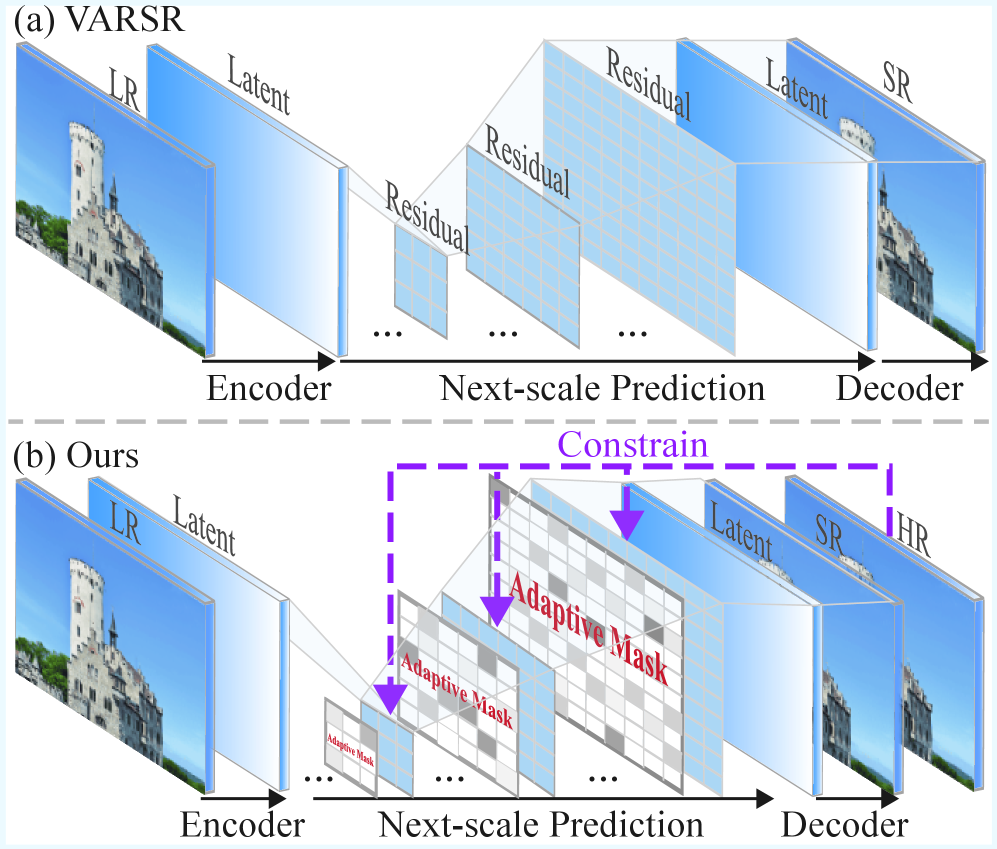
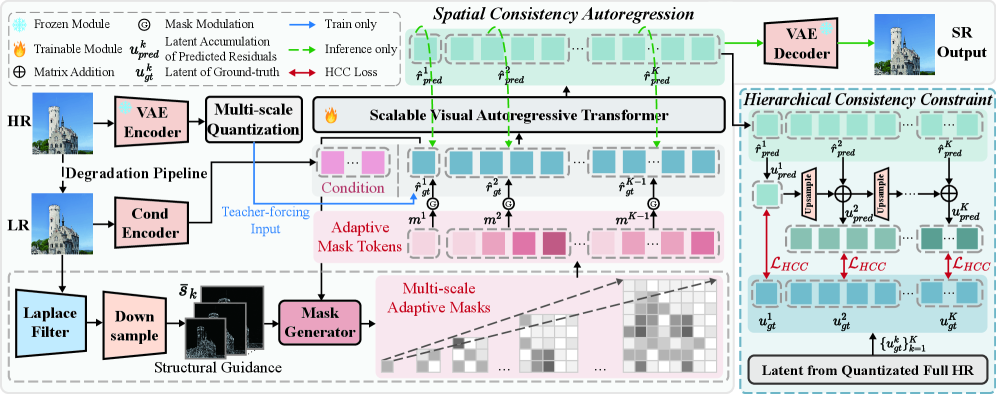

# AI Daily：AlignVAR - 實現全域一致性的視覺自回歸圖像超解析度

**日期：** 2026年03月06日

**論文標題：** AlignVAR: Towards Globally Consistent Visual Autoregression for Image Super-Resolution

**作者：** Cencen Liu, Dongyang Zhang, Wen Yin, Jielei Wang, Tianyu Li, Ji Guo, Wenbo Jiang, Guoqing Wang, Guoming Lu

**來源：** CVPR 2026 Findings

**連結：** [https://arxiv.org/abs/2603.00589](https://arxiv.org/abs/2603.00589)

---

### 論文摘要

視覺自回歸（Visual Autoregressive, VAR）模型作為一種新興的圖像生成方法，透過「次級尺度預測」（next-scale prediction）實現了穩定的訓練過程、非迭代式的快速推理以及高保真度的圖像合成，在圖像生成領域展現了巨大潛力。這也促使研究者們開始探索將VAR模型應用於圖像超解析度（Image Super-Resolution, ISR）任務。然而，將VAR直接應用於ISR面臨兩大挑戰：首先是**局部偏向的注意力機制（locality-biased attention）**，這會導致生成圖像的空間結構破碎；其次是**僅依賴殘差的監督訊號（residual-only supervision）**，這會讓誤差在不同尺度間累積，嚴重損害重建影像的全域一致性。

為了解決這些問題，本文提出了**AlignVAR**，一個專為ISR設計、旨在實現全域一致性的視覺自回歸框架。AlignVAR包含兩個關鍵元件：

1.  **空間一致性自回歸（Spatial Consistency Autoregression, SCA）**：此模組透過一個自適應遮罩（adaptive mask）來重新加權注意力，使其更關注與結構相關的區域，從而減輕過度的局部性偏好，並增強長距離依賴關係。
2.  **層級一致性約束（Hierarchical Consistency Constraint, HCC）**：此模組在每個尺度上都增加對完整重建結果的監督，而不僅僅是殘差。這有助於及早發現並修正跨尺度累積的偏差，從而穩定由粗到精的細化過程。

大量的實驗證明，AlignVAR能夠持續提升重建影像的結構連貫性與感知真實度。與主流的基於擴散模型的方法相比，AlignVAR在推理速度上提升了超過10倍，參數數量也減少了近50%，為高效的圖像超解析度任務建立了一個新的典範。

---

### 核心創新

AlignVAR的核心在於解決了現有VAR模型應用於ISR時的兩大根本性矛盾：**空間不一致性（Spatial Inconsistency）**和**層級不一致性（Hierarchical Inconsistency）**。

#### 1. 空間一致性自回歸 (SCA)

傳統VAR模型中的自注意力機制有強烈的局部偏好，注意力權重幾乎完全集中在相鄰區域（如下圖Figure 2所示），限制了模型整合全域上下文的能力，導致空間上不連續的偽影，例如破碎的紋理和結構扭曲。

*Figure 2: VARSR（左）與AlignVAR（右）的注意力分佈比較。VARSR的注意力高度局部化，而AlignVAR透過SCA捕捉了更廣泛的上下文依賴。*

SCA透過引入一個**結構感知（structure-aware）**的調節機制來解決這個問題。它利用從低解析度輸入中提取的結構線索（如邊緣），生成一個自適應遮罩，引導模型關注結構上相關的遠距離區域，而不僅僅是局部鄰域。這使得模型能夠聚合長距離上下文，保持空間連續性。

*Figure 3: 空間不一致性導致的紋理不連續與結構扭曲問題。*

#### 2. 層級一致性約束 (HCC)

VAR模型的「次級尺度預測」範式中，每個尺度的預測都基於前一個（較粗糙）尺度的不完美輸出。這種僅依賴殘差的監督方式，會讓微小的預測誤差在尺度間傳播並被放大，導致最終重建影像出現顏色偏移和結構錯位等問題（如下圖Figure 4所示）。

*Figure 4: 層級不一致性導致的顏色偏移與結構錯位問題。*

HCC透過在每個尺度上增加對**完整潛在表示（full-scale latent representation）**的監督來解決這個問題，而不僅僅是監督殘差。這種方式讓模型在每個尺度都能校準與真實影像的偏差，從而抑制誤差的累積，穩定整個由粗到精的生成過程。

---

### 方法論

AlignVAR的整體架構如下圖所示。它由SCA和HCC兩個互補的元件組成，協同工作以提升生成影像的品質。

*Figure 5: AlignVAR整體架構圖。*

1.  **SCA模組**：首先，使用拉普拉斯濾波器從低解析度影像中提取結構引導（Structural Guidance）。然後，一個輕量級的遮罩生成器（Mask Generator）會結合自回歸的徵與結構引導，預測出一個空間調製場（spatial modulation field）。這個調製場會被用來重新加權特徵，使得模型能夠關注結構上重要的區域。

2.  **HCC模組**：在訓練過程中，除了計算預測殘差與真實殘差之間的交叉熵損失（CE Loss）外，HCC還會計算每個尺度下累積預測的潛在表示與真實潛在表示之間的L2損失（HCC Loss）。這迫使模型在每個層級都與真實影像保持一致。

總的訓練目標是這兩個損失的加權和：

`L_total = L_CE + λ * L_HCC`

透過這種聯合優化，AlignVAR能夠在每個尺度上生成空間上連貫的預測，並在整個重建過程中保持層級上的一致性。

---

### 實驗結果

AlignVAR在多個合成與真實世界的數據集上進行了評估，並與多種基於GAN和擴散模型的SOTA方法進行了比較。結果顯示，AlignVAR在多個感知指標（如LPIPS, DISTS, FID, MANIQA, CLIPIQA, MUSIQ）上都取得了領先或具有競爭力的表現，尤其是在FID（Fréchet Inception Distance）指標上，顯著優於其他方法，證明其生成的影像在分佈上與真實影像更為接近。

| **方法** | **PSNR ↑** | **SSIM ↑** | **LPIPS ↓** | **FID ↓** | **MANIQA ↑** |
| :--- | :--- | :--- | :--- | :--- | :--- |
| BSRGAN | 24.42 | 0.6164 | 0.3511 | 50.99 | 0.3547 |
| Real-ESRGAN | 24.30 | 0.6324 | 0.3267 | 44.34 | 0.3756 |
| SwinIR | 23.77 | 0.6186 | 0.3910 | 44.45 | 0.3411 |
| StableSR | 23.26 | 0.5670 | 0.3228 | 28.32 | 0.4173 |
| DiffBIR | 23.49 | 0.5568 | 0.3638 | 34.55 | 0.4598 |
| VARSR | 24.41 | 0.6189 | 0.2985 | 28.64 | 0.4137 |
| **AlignVAR** | **24.35** | **0.6021** | **0.2955** | **25.71** | **0.4665** |

*Table 1: 在DIV2K-Val數據集上的量化比較。AlignVAR在多個感知指標上表現出色。*

更重要的是，AlignVAR在保持高品質生成的同時，其推理速度遠超基於擴散模型的方法，參數效率也更高，這使其在實際應用中極具潛力。

---

### 結論

AlignVAR透過引入**空間一致性自回歸（SCA）**和**層級一致性約束（HCC）**，成功地解決了現有視覺自回歸模型在應用於圖像超解析度任務時所面臨的空間與層級不一致性問題。該框架不僅顯著提升了重建影像的結構連貫性和感知品質，還保持了VAR模型高效推理的優點。AlignVAR的提出，為開發高效且高品質的生成式圖像超解析度模型提供了一個全新的、有前景的研究方向。

---

### 參考文獻

[1] Tian, K., Jiang, Y., Yuan, Z., Peng, B., Luan, F., & Liu, Z. (2024). Visual Autoregressive Modeling: Scalable Image Generation via Next-Scale Prediction. In *Advances in Neural Information Processing Systems*.

[2] Qu, Y., Chen, J., Wang, Z., Liu, J., & Lu, T. (2025). Visual Autoregressive Modeling for Image Super-Resolution. *arXiv preprint arXiv:2501.18993*.

[3] Chen, C., et al. (2025). Adversarial Diffusion Compression for Real-World Image Super-Resolution. In *CVPR*.

[4] Wang, Z., et al. (2023). SeeSR: Towards Semantics-Aware Real-World Image Super-Resolution. *arXiv preprint arXiv:2311.16518*.
