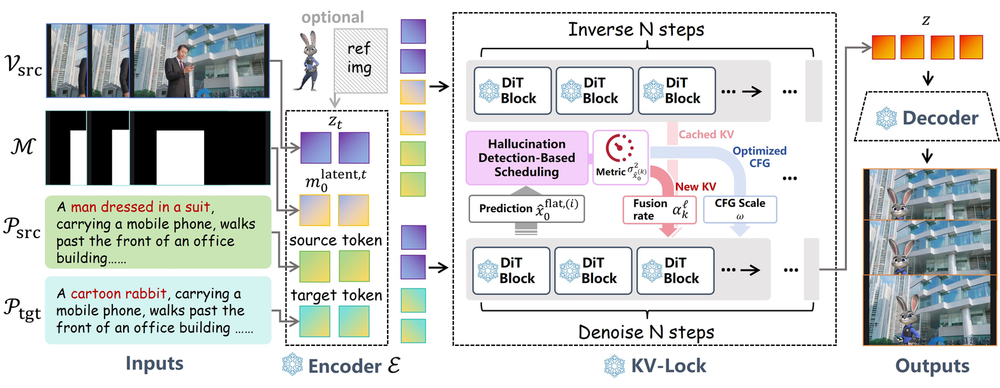
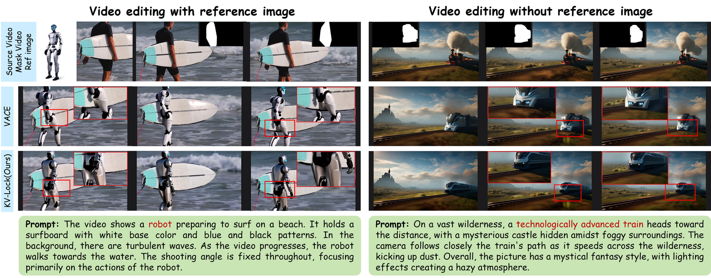
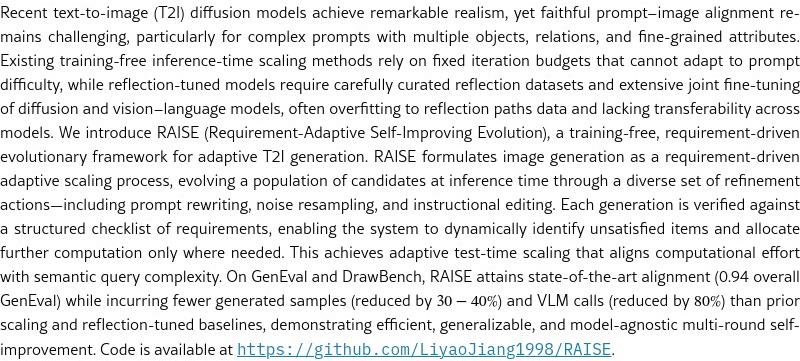

# AI Daily: 2026-03-12 論文研讀報告

**日期**: 2026年3月12日
**主題**: 圖像與影片生成中的免訓練控制與對齊 (Training-Free Control and Alignment in Image/Video Generation)
**重點領域**: 免訓練 (Training-Free)、注意力調變 (Attention Modulation)、文本到圖像對齊 (Text-to-Image Alignment)、影片編輯 (Video Editing)

---

## 1. When to Lock Attention: Training-Free KV Control in Video Diffusion (KV-Lock)

**論文連結**: [arXiv:2603.09657](https://arxiv.org/abs/2603.09657)
**提交日期**: 2026年3月10日
**研究機構**: 清華大學 (Tsinghua University)、德州大學奧斯汀分校 (UT Austin) 等

### 1.1 核心問題與挑戰
在影片編輯任務中，如何在**提升前景生成品質**的同時**保持背景的一致性**，一直是一個核心挑戰。
*   **全圖像資訊注入 (Full-image information injection)**：通常會導致背景出現偽影 (artifacts)。
*   **嚴格的背景鎖定 (Rigid background locking)**：會嚴重限制模型生成前景內容的能力，導致前景生成品質下降或出現幻覺 (hallucinations)。

### 1.2 創新解決方案：KV-Lock
為了解決上述困境，作者提出了一個名為 **KV-Lock** 的免訓練 (training-free) 框架，專為基於 DiT (Diffusion Transformer) 的影片擴散模型設計。

KV-Lock 的核心洞見在於：**幻覺指標 (hallucination metric)**，即去噪預測的變異數 (variance of denoising prediction)，可以直接量化生成的多樣性，而這與**無分類器引導 (Classifier-Free Guidance, CFG) 的尺度**有著內在的聯繫。

基於此，KV-Lock 利用**擴散幻覺檢測 (diffusion hallucination detection)** 來動態排程 (dynamically schedule) 兩個關鍵組件：
1.  **KV 融合比例 (Fusion Ratio)**：在快取的背景 Key-Values (KVs) 和新生成的 KVs 之間的融合比例。
2.  **CFG 尺度 (CFG Scale)**：用於控制條件引導的強度。

### 1.3 運作機制
*   **幻覺檢測**：在反向擴散過程中，追蹤預測的乾淨潛在變數 $\hat{x}_0$ 的局部變異數。當變異數超過閾值時，即標記為存在幻覺風險。
*   **動態排程**：
    *   當檢測到幻覺風險時，KV-Lock 會**增強背景 KV 的鎖定** (提高快取 KV 的權重)，以確保背景的穩定性。
    *   同時，它會**放大前景生成的條件引導 (CFG scale)**，以增強條件對齊，從而減輕幻覺並提高生成保真度。

*圖 1：KV-Lock 框架概覽。透過幻覺檢測動態融合新生成的 KV 與快取的 KV，並動態調整 CFG。*

### 1.4 實驗結果與優勢
*   **免訓練且隨插即用**：作為一個免訓練的模組，KV-Lock 可以輕鬆整合到任何預訓練的 DiT 模型中。
*   **卓越的性能**：在 VBench 等基準測試中，KV-Lock 在背景一致性 (Background Consistency) 和前景品質 (Foreground Quality) 方面均優於現有的免訓練方法 (如 VACE, ProEdit, TokenFlow 等)。
*   **視覺效果**：在有參考圖像和無參考圖像的影片編輯任務中，KV-Lock 都能生成更自然、物理上更合理且無偽影的結果。

*圖 2：KV-Lock 在影片編輯任務中的表現，顯著優於 VACE。*

---

## 2. RAISE: Requirement-Adaptive Evolutionary Refinement for Training-Free Text-to-Image Alignment

**論文連結**: [arXiv:2603.00483](https://arxiv.org/abs/2603.00483)
**會議**: CVPR 2026
**研究機構**: 阿爾伯塔大學 (University of Alberta)、華為技術 (Huawei Technologies)

### 2.1 核心問題與挑戰
儘管近期的文本到圖像 (T2I) 擴散模型達到了驚人的逼真度，但**忠實的提示詞-圖像對齊 (prompt-image alignment)** 仍然具有挑戰性，特別是對於包含多個物件、關係和細粒度屬性的複雜提示詞。
*   **現有的免訓練推論時擴展 (inference-time scaling) 方法**：依賴固定的迭代預算，無法適應提示詞的難度。
*   **基於反射微調 (reflection-tuned) 的模型**：需要精心策劃的反射資料集，並對擴散模型和視覺語言模型 (VLM) 進行廣泛的聯合微調，容易對反射路徑資料過擬合，且缺乏跨模型的遷移能力。

### 2.2 創新解決方案：RAISE
作者提出了 **RAISE (Requirement-Adaptive Self-Improving Evolution)**，這是一個免訓練、需求驅動的演化框架，用於自適應的 T2I 生成。

RAISE 將圖像生成公式化為一個**需求驅動的自適應擴展過程 (requirement-driven adaptive scaling process)**。它在推論時透過多樣化的細化動作 (refinement actions) 來演化候選群體。

### 2.3 運作機制 (多代理系統)
RAISE 作為一個由三個代理 (Agents) 組成的多代理系統運作，共享一個 VLM 骨幹：
1.  **分析器 (Analyzer)**：執行需求分析。它從使用者提示詞中提取結構化的需求清單 (包括物件存在、屬性和空間關係)，並根據驗證反饋動態識別未滿足的需求。
2.  **重寫器 (Rewriter)**：執行多動作突變細化 (Multi-Action Mutational Refinement)。它並行探索互補的細化策略，包括：
    *   **提示詞重寫 (Prompt rewriting)**
    *   **噪聲重採樣 (Noise resampling)**
    *   **指令式編輯 (Instructional editing)**
3.  **驗證器 (Verifier)**：執行結構化的工具基礎驗證 (Structured Tool-Grounded Verification)。它利用視覺工具 (如標註、檢測和深度估計) 提取物件級實體、屬性和空間關係作為證據，對生成的候選者進行細粒度的需求檢查。

*圖 3：RAISE 框架在處理複雜提示詞 "McDonald's Church" 時的多輪自我改進過程。*

### 2.4 實驗結果與優勢
*   **自適應計算分配**：系統動態識別未滿足的項目，並僅在需要的地方分配進一步的計算。這實現了自適應的測試時擴展，使計算工作量與語義查詢複雜度保持一致。
*   **SOTA 對齊性能**：在 GenEval 和 DrawBench 基準測試上，RAISE 達到了最先進的對齊效果 (GenEval 總分 0.94)。
*   **極高的效率**：與先前的擴展和反射微調基準相比，RAISE 產生的生成樣本更少 (減少 30-40%)，VLM 呼叫次數更少 (減少 80%)。
*   **模型無關**：展示了高效、可泛化且與模型無關的多輪自我改進能力。

---

## 總結與洞見

今天的兩篇論文都聚焦於**免訓練 (Training-Free)** 的推論時優化技術，這反映了當前生成式 AI 領域的一個重要趨勢：在不重新訓練龐大基礎模型的前提下，透過巧妙的演算法設計來榨取模型的最大潛力。

1.  **KV-Lock** 巧妙地將「幻覺檢測 (變異數)」與「注意力機制 (KV Cache)」和「引導尺度 (CFG)」結合，解決了影片編輯中前景與背景的拉扯問題。這為 DiT 架構的精細控制提供了一個非常優雅的數學與工程結合的範例。
2.  **RAISE** 則將 LLM Agent 的思維引入了圖像生成。透過「分析-重寫-驗證」的閉環，以及結合視覺工具的 Grounding，它讓 T2I 模型具備了類似人類的「審稿與修改」能力。其自適應的計算分配機制，更是解決了傳統 inference-time scaling 效率低下的痛點。

這兩項研究都強烈依賴於對模型內部機制 (如 Diffusion 軌跡的變異數) 或外部工具 (如 VLM 和 Detection models) 的深刻理解與整合，為未來的 Zero-shot 控制和對齊指明了方向。
