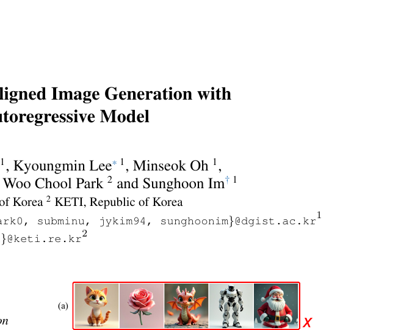
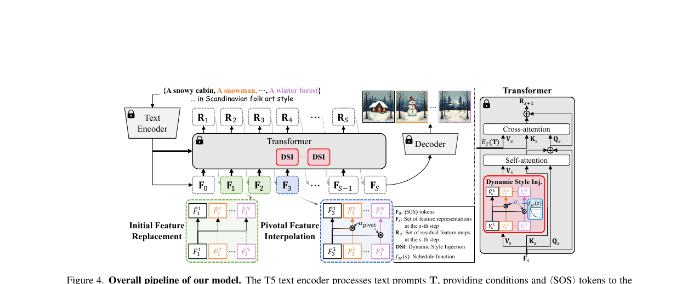
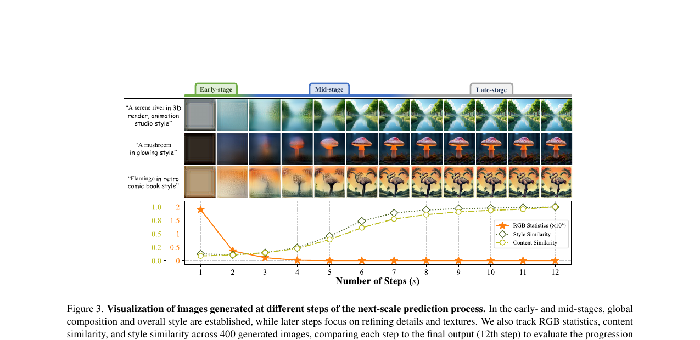
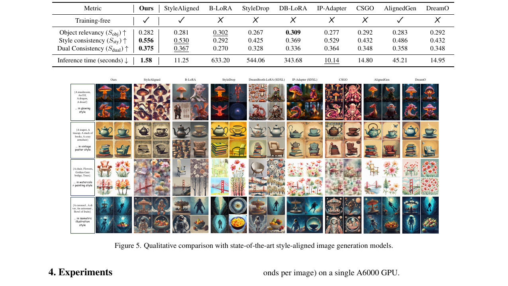

# AI Daily

## A Training-Free Style-aligned Image Generation with Scale-wise Autoregressive Model

**發布日期**: 2025-11-23 (v2)
**作者**: Jihun Park, Jongmin Gim, Kyoungmin Lee, Minseok Oh, Minwoo Choi, Jaeyeul Kim, Woo Chool Park, Sunghoon Im
**機構**: DGIST, KETI (Republic of Korea)
**論文連結**: [arXiv:2504.06144](https://arxiv.org/abs/2504.06144)

### 核心亮點

本研究提出了一種**免訓練 (Training-Free)** 的風格對齊圖像生成方法，該方法基於**尺度自迴歸模型 (Scale-wise Autoregressive Model, VAR)**。相較於傳統基於擴散模型 (Diffusion Models) 的方法，本方法在保持高質量生成的同時，顯著解決了風格不一致的問題，並且推理速度比最快的風格對齊模型快了 **6倍以上**。

這篇論文完美契合了當前圖像生成領域的幾個重要趨勢：
1. **VAR (Visual AutoRegressive) 架構**：利用 Next-scale prediction 進行由粗到細的生成。
2. **Training-Free**：無需像 LoRA 那樣進行額外的微調，大幅降低計算成本。
3. **Attention Modulation**：透過在生成過程中動態調整特徵和注意力機制來控制風格。

*圖 1：標準文本到圖像模型（風格未對齊）與本方法（風格對齊）的比較。本方法能夠在不同提示詞下保持高度一致的視覺風格。*

### 技術方法

作者對尺度自迴歸模型的生成過程進行了深入分析，發現了不同生成階段的特性：
*   **早期階段 (Early-stage)**：主要決定圖像的整體 RGB 統計特徵。
*   **中期階段 (Mid-stage)**：內容和風格逐漸演變並增加細節。
*   **晚期階段 (Late-stage)**：特徵趨於穩定，主要進行細節和紋理的優化。

基於這些觀察，作者提出了三個關鍵組件來實現風格對齊：

*圖 2：整體架構圖。包含初始特徵替換、關鍵特徵插值和動態風格注入三個核心模組。*

#### 1. 初始特徵替換 (Initial Feature Replacement)
在生成的最初幾個步驟（第1和第2步），將批次中所有圖像的特徵替換為第一張圖像的特徵。這確保了所有生成的圖像具有一致的 RGB 統計基礎，為後續的風格對齊奠定基礎。

#### 2. 關鍵特徵插值 (Pivotal Feature Interpolation)
在中期階段的特定步驟（例如第3步），將批次中其他圖像的特徵與第一張圖像的特徵進行平滑插值。這有助於對齊對象的放置位置和整體的空間連貫性。

#### 3. 動態風格注入 (Dynamic Style Injection)
這是一種增強的注意力調變 (Attention Modulation) 技術。在中期階段（第3到第7步），透過一個精心設計的**調度函數 (Schedule Function)**，動態地將第一張圖像的 Value 特徵注入到其他圖像的自注意力模組中。調度函數呈現 S 型衰減，在早期給予較強的風格引導，隨後逐漸減弱，以在保持風格一致性的同時保留各個圖像獨特的內容細節。

*圖 3：不同生成步驟的視覺化分析。展示了 RGB 統計、內容相似度和風格相似度在生成過程中的變化趨勢。*

### 實驗結果

實驗結果表明，該方法在對象相關性 (Object Relevancy) 和風格一致性 (Style Consistency) 之間取得了最佳平衡，同時在推理速度上具有壓倒性優勢。

| 方法 | 雙一致性 (Dual Consistency) ↑ | 推理時間 (秒/張) ↓ |
| :--- | :--- | :--- |
| **Ours (Training-free)** | **0.375** | **1.58** |
| StyleAligned (Training-free) | 0.367 | 11.25 |
| AlignedGen (Training-free) | 0.358 | 45.21 |
| IP-Adapter (Training-free) | 0.364 | 10.14 |
| B-LoRA (Tuning required) | 0.270 | 633.20 |
| DB-LoRA (Tuning required) | 0.336 | 343.68 |

*表 1：與最先進的風格對齊圖像生成模型的定量比較。本方法在雙一致性上取得最高分，且推理時間極短。*

*圖 4：與其他最先進方法的定性比較。本方法在保持對象結構和風格統一性方面表現最為穩定。*

### 總結

這篇論文展示了尺度自迴歸模型 (Scale-wise Autoregressive Models) 在風格控制方面的巨大潛力。透過深入理解生成過程的內部機制，並巧妙地應用特徵替換和注意力調變，實現了高效且高質量的免訓練風格對齊生成。這為未來進一步提升自迴歸 T2I 模型的可控性和效率提供了重要的參考方向。
