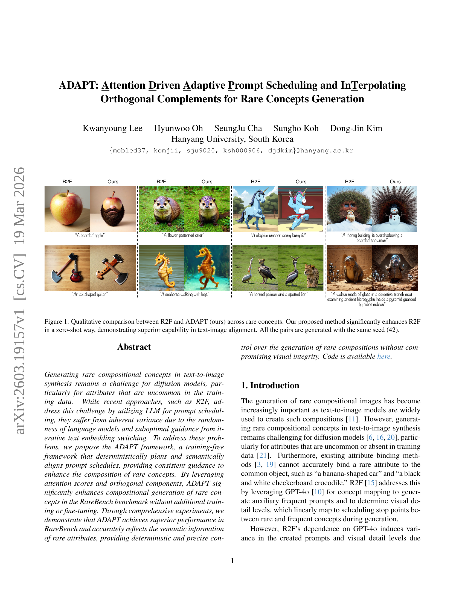
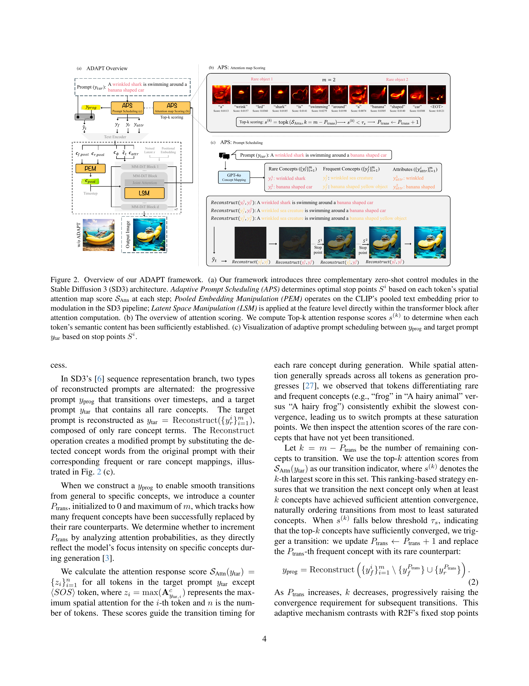
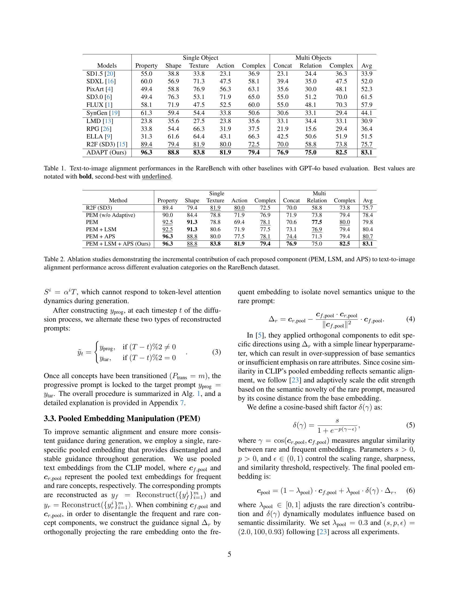

# AI Daily

## 論文基本資訊
- **標題**：ADAPT: Attention Driven Adaptive Prompt Scheduling and InTerpolating Orthogonal Complements for Rare Concepts Generation
- **作者**：Kwanyoung Lee, Hyunwoo Oh, SeungJu Cha, Sungho Koh, Dong-Jin Kim (Hanyang University)
- **會議**：CVPR 2026 (Findings)
- **領域**：Computer Vision and Pattern Recognition (cs.CV)
- **論文連結**：[arXiv:2603.19157](https://arxiv.org/abs/2603.19157)
- **代碼開源**：[GitHub](https://github.com/mobled37/ADAPT)

## 核心亮點與貢獻

在文本到圖像（Text-to-Image, T2I）生成領域，擴散模型（Diffusion Models）雖然在生成常見物體上表現卓越，但在處理「稀有組合概念」（Rare Compositional Concepts）時往往力不從心。例如，當要求模型生成「香蕉形狀的汽車」或「黑白棋盤格紋的鱷魚」時，模型經常無法正確綁定屬性與主體。

先前的研究如 R2F (Rare-to-Frequent) 提出了一種無需訓練（Training-free）的解決方案，利用大型語言模型（LLM）將稀有概念映射為常見概念，並在生成過程中進行提示詞調度（Prompt Scheduling）。然而，R2F 依賴 GPT-4o 來決定調度的停止點，這引入了語言模型固有的隨機性，導致生成結果不穩定。此外，R2F 在稀有和常見提示詞之間反覆切換文本嵌入，難以提供語義上精確且一致的引導。

為了解決這些痛點，本文提出了 **ADAPT** 框架。這是一個完全無需訓練的方法，通過注意力驅動的自適應提示詞調度和正交補空間插值，實現了對稀有概念生成的精確控制。

ADAPT 的三大核心貢獻包括：
1.  **自適應提示詞調度（Adaptive Prompt Scheduling, APS）**：利用空間注意力分數（Spatial Attention Scores）來決定提示詞調度的最佳停止點，徹底消除了對 GPT-4o 的依賴，並實現了與文本 Token 級別的語義對齊。
2.  **池化嵌入操作（Pooled Embedding Manipulation, PEM）**：通過將稀有概念的池化文本嵌入投影到常見概念的正交補空間上，提取出解耦的稀有語義方向，並結合自適應加權策略，提供一致且精確的全局引導。
3.  **潛在空間操作（Latent Space Manipulation, LSM）**：針對屬性差異極大的情況，在注意力層的輸出特徵上施加正交引導，實現細粒度的屬性控制。

*圖 1：ADAPT 與 R2F 在稀有概念生成上的定性比較。ADAPT 在零樣本（Zero-shot）設定下顯著提升了文本與圖像的對齊度。*

## 方法解析

ADAPT 框架專為多模態擴散 Transformer（如 Stable Diffusion 3.0）設計，其架構包含三個互補的零樣本控制模組。

*圖 2：ADAPT 框架概覽。包含 APS、PEM 和 LSM 三個核心模組。*

### 1. 自適應提示詞調度 (APS)

在生成過程中，模型需要從「常見概念」（如「有毛的動物」）平滑過渡到「稀有概念」（如「有毛的青蛙」）。APS 的核心洞察是：**空間注意力的收斂程度可以作為語義特徵飽和的指標**。

具體而言，APS 在每個去噪步驟中計算目標提示詞（Target Prompt）中每個 Token 的最大空間注意力分數。當區分稀有與常見概念的關鍵 Token（例如「青蛙」）的注意力分數低於特定閾值（$\tau_s = 0.025$）時，表示該概念的語義已經充分建立，此時系統會自動觸發提示詞的轉換。這種基於排名的動態調度策略，確保了轉換時機完全由模型內部的注意力動態決定，而非外部的固定啟發式規則。

### 2. 池化嵌入操作 (PEM)

為了在整個生成過程中提供一致的引導，PEM 放棄了 R2F 中反覆切換文本嵌入的做法，轉而構建一個融合的池化嵌入（Pooled Embedding）。

PEM 首先計算稀有概念嵌入在常見概念嵌入上的正交投影，從而分離出純粹代表「稀有屬性」的語義方向（$\Delta_r$）。接著，PEM 引入了一種基於 CLIP 嵌入空間餘弦相似度的自適應加權策略。如果稀有概念與常見概念的語義差異較大，系統會自動增加正交分量的權重，確保稀有屬性得到充分強調，同時不會過度壓制基礎語義。

### 3. 潛在空間操作 (LSM)

當稀有提示詞與常見提示詞在語義上存在巨大鴻溝時（例如「金屬人形」與「鋼鐵製成的小丑」），僅靠全局的池化嵌入難以實現精確控制。LSM 通過修改 LLM 的指令，提取出具體的屬性文本（如「鋼鐵製成的」），並在 Transformer 模塊的注意力計算之後，直接在特徵層面（Latent Space）注入正交的引導向量。這種細粒度的操作進一步增強了模型對特定屬性的刻畫能力。

## 實驗結果

研究團隊在 RareBench 基準測試上對 ADAPT 進行了全面評估。實驗結果表明，ADAPT 在所有評估類別中均顯著超越了前作 R2F 及其他基準模型。

| 方法 | Single Property | Single Shape | Multi Relation | Multi Complex | 平均得分 |
| :--- | :--- | :--- | :--- | :--- | :--- |
| SD3.0 | 49.4 | 76.3 | 51.2 | 70.0 | 61.5 |
| R2F (SD3) | 89.4 | 79.4 | 58.8 | 73.8 | 75.7 |
| **ADAPT (Ours)** | **96.3** | **88.8** | **75.0** | **82.5** | **83.1** |

*表 1：RareBench 上的文本-圖像對齊性能比較（節錄）。ADAPT 在單一物體形狀和多物體關係上提升尤為顯著。*

在消融實驗中，PEM 模組對整體性能的提升貢獻最大，而 APS 則在屬性（Property）和動作（Action）類別中展現了關鍵作用。此外，在人類偏好指標（PickScore 和 ImageReward）上，ADAPT 也取得了最高分，證明其生成的圖像不僅語義準確，且視覺質量優異。

*圖 3：在 RareBench 上的定性比較。ADAPT 能夠準確生成如「長角的鵜鶘」等極具挑戰性的稀有組合。*

## 相關研究與技術脈絡

ADAPT 的設計深受近期幾項重要研究的啟發，並在它們的基礎上進行了創新：

1.  **Rare-to-Frequent (R2F)** [1]：ADAPT 的直接前作，提出了利用 LLM 進行概念映射的框架。ADAPT 解決了 R2F 依賴 LLM 進行調度所帶來的不穩定性。
2.  **Attend-and-Excite** [2]：這項經典工作證明了在推理時干預交叉注意力（Cross-attention）可以改善語義綁定。ADAPT 借鑒了注意力分數的概念，但將其創新性地應用於提示詞調度的時機判斷。
3.  **FluxSpace** [3]：該研究展示了在 Rectified Flow Transformers 中利用注意力層輸出進行語義解耦編輯的潛力。ADAPT 的 PEM 和 LSM 模組正是基於這種正交投影思想，實現了對稀有屬性的精確控制。

值得一提的是，ADAPT 的作者團隊在同期的 CVPR 2026 Main Track 中也發表了另一篇相關論文 **AAPB (Adaptive Auxiliary Prompt Blending)**，該文從理論層面（Tweedie's identity）探討了自適應提示詞混合的機制，與 ADAPT 在實踐框架上形成了良好的互補。

## 總結與評價

ADAPT 提出了一個優雅且強大的無需訓練框架，巧妙地結合了模型內部的注意力動態與正交補空間的幾何特性。它不僅解決了前作 R2F 的穩定性問題，更將擴散模型在「稀有組合概念」上的生成能力推向了新的高度。

對於關注 Attention Modulation 和 Zero-shot 生成控制的研究者而言，ADAPT 展示了如何將粗粒度的提示詞調度與細粒度的特徵空間操作相結合，為未來的可控圖像生成提供了一個極具參考價值的範式。

## 參考文獻
[1] Park, D., et al. (2024). Rare-to-frequent: Unlocking compositional generation power of diffusion models on rare concepts with llm guidance. arXiv preprint arXiv:2410.22376.
[2] Chefer, H., et al. (2023). Attend-and-excite: Attention-based semantic guidance for text-to-image diffusion models. ACM Transactions on Graphics (TOG).
[3] Dalva, Y., et al. (2024). FluxSpace: Disentangled semantic editing in rectified flow transformers. arXiv preprint arXiv:2412.09611.
