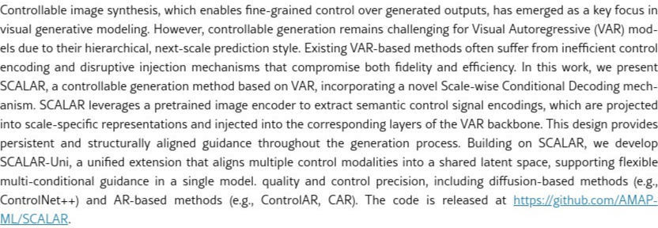
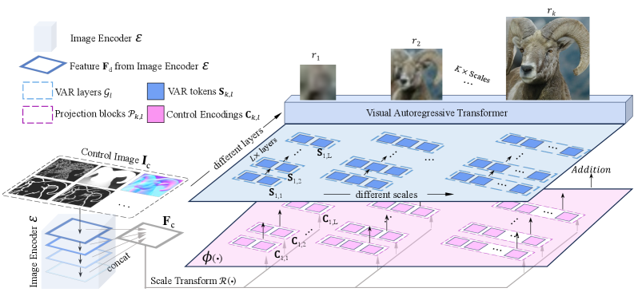
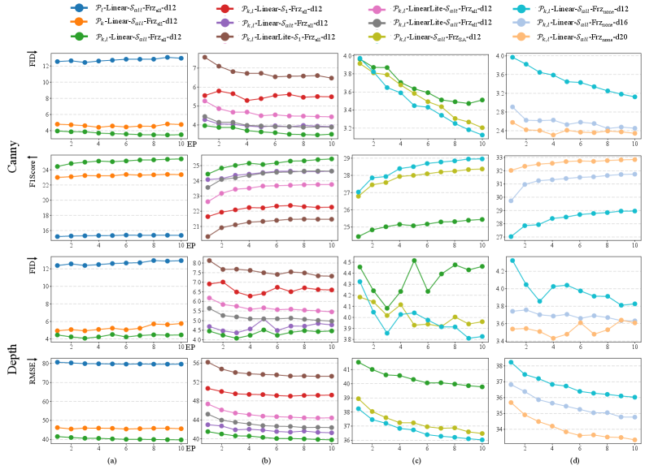
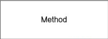

# AI Daily: SCALAR - 解鎖VAR模型的可控生成，注入尺度感知新思路

**論文標題**: SCALAR: Scale-wise Controllable Visual Autoregressive Learning
**機構**: Amap, Alibaba Group
**作者**: Ryan Xu, Dongyang Jin, Yancheng Bai, Rui Lan, Xu Duan, Lei Sun, Xiangxiang Chu
**會議**: AAAI 2026
**論文連結**: [https://arxiv.org/abs/2507.19946](https://arxiv.org/abs/2507.19946)
**GitHub Repo**: [https://github.com/AMAP-ML/SCALAR](https://github.com/AMAP-ML/SCALAR)

---

## 核心思想與貢獻

Visual Autoregressive (VAR) 模型因其卓越的生成品質和與大型語言模型（LLM）架構的天然相容性，已成為繼擴散模型之後，圖像生成領域的另一大主流範式 [1]。然而，如何對 VAR 模型進行精細的條件控制（controllable generation），一直是該領域的巨大挑戰。現有的方法（如 ControlVAR [2], CAR [3]）往往因為控制信號注入方式的低效與粗暴，導致生成品質和控制精度雙雙下降。

針對此痛點，阿里巴巴的研究團隊提出了 **SCALAR**，一種專為 VAR 模型設計的高效、精準的可控生成框架。其核心貢獻在於提出了一種全新的 **尺度感知條件解碼機制 (Scale-wise Conditional Decoding)**。SCALAR 摒棄了以往複雜的並行分支或聯合建模方案，轉而採用一種更為優雅和高效的「注入式」策略：

1.  **強大的語意提取**: 利用預訓練的視覺基礎模型（如 DINOv2 [4]）作為通用的控制信號編碼器，從條件圖像（如 Canny 邊緣圖、深度圖）中提取蘊含豐富空間語意的特徵。
2.  **尺度感知注入**: 將提取出的通用特徵，通過一組**尺度專用（scale-specific）** 的輕量級投影塊，轉換為與 VAR 模型內部不同生成尺度相對應的「控制信號編碼」，並在解碼器的每一層直接注入。這種設計確保了控制信號能夠在整個由粗到精的生成過程中，持續、穩定且結構對齊地發揮引導作用。
3.  **統一多條件控制 (SCALAR-Uni)**: 在 SCALAR 的基礎上，團隊進一步提出了 SCALAR-Uni，通過一個巧妙的**統一控制對齊 (Unified Control Alignment)** 過程，將來自不同模態（如 Canny、深度、HED）的控制特徵映射到一個共享的潛在空間中，從而使單一模型就能靈活應對多種條件的混合引導，甚至實現了零樣本的混合條件生成。

*圖1：SCALAR 在多種控制條件下的卓越生成效果，並展示了其在零樣本修復任務和多條件控制上的強大泛化能力。*

實驗結果表明，SCALAR 在多項可控生成任務上，無論是生成圖像的保真度（FID/IS）還是條件控制的精確度，都**顯著超越**了包括 ControlNet++ 和其他 VAR 控制方法在內的現有 SOTA 模型，為 VAR 生態的可控性發展鋪平了道路。

---

## 技術方法簡述

SCALAR 的整體架構極為簡潔高效，其核心創新點在於「如何將外部的控制信號，以最適合 VAR 模型『胃口』的方式餵給它」。

*圖2：SCALAR 框架圖，清晰地展示了其尺度感知的條件解碼機制。*

其技術流程可以分解為以下幾個步驟：

1.  **控制特徵提取**: 給定一張控制條件圖 $I_c$（例如一張 Canny 邊緣圖），一個**凍結**的預訓練視覺編碼器 $\mathcal{E}$（論文中選用 DINOv2）會從中提取多層次的特徵圖。這些特徵圖被拼接起來，形成一個包含豐富語意和結構資訊的、尺度無關的控制表徵 $F_c$。

2.  **尺度感知投影**: 這是 SCALAR 的核心。$F_c$ 會被送入一組**尺度專用**的投影塊 $\phi_{k,l}$。這裡的關鍵在於，每一個生成尺度 $k$ 和解碼器層級 $l$ 都擁有自己獨立的投影塊。該投影塊首先將 $F_c$ 的空間尺寸調整至與當前生成尺度 $(h_k, w_k)$ 匹配，然後通過一個線性層將其投影為最終的控制信號編碼 $C_{k,l}$。
    $$ C_{k,l} = \phi_{k,l}(F_c) = \mathcal{P}_{k,l}(\mathcal{R}_{h_k, w_k}(F_c)) $$
    這種不共享權重的設計，使得模型可以為不同尺度學習到最適合的控制表達方式，是實現精準控制的關鍵。

3.  **直接注入解碼器**: 得到的控制信號 $C_{k,l}$ 會以極其簡單的方式——直接加法，注入到 VAR 解碼器 $\mathcal{G}_l$ 的輸入隱狀態 $S_{k,l}$ 中：
    $$ S'_{k,l} = \mathcal{G}_l(S_{k,l} + C_{k,l}) $$
    這種直接注入的方式避免了複雜的網絡結構修改，最大限度地保留了預訓練 VAR 模型強大的生成能力，同時保證了訓練和推理的高效率。

4.  **統一控制對齊 (針對 SCALAR-Uni)**: 為了讓單一模型處理多種控制條件，SCALAR-Uni 引入了一個額外的對齊損失 $\mathcal{L}_{\text{align}}$。它通過一個輕量級的線性層 $\mathcal{F}_{\text{align}}$，將不同模態的控制特徵 $F_c$ 都投影到原始圖像的特徵空間中，並最小化它們與真實圖像特徵 $F_{\text{img}}$ 之間的 L2 距離。這相當於為所有控制模態找到了「通用語言」，使得模型能夠理解並融合它們。

*圖3：消融實驗證明，採用尺度和層級專用的投影塊（Pk,l）、注入所有層（S_all）以及不凍結骨幹網絡（Frz_none）的組合，能達到最佳性能。*

---

## 實驗結果與性能指標

SCALAR 在 ImageNet 256x256 數據集上進行了廣泛的類別條件圖像生成（class-to-image）實驗，並與多種主流方法進行了比較。

*表1：SCALAR 與其他 SOTA 方法在 ImageNet 上的定量比較。SCALAR 在 FID 和 IS 指標上取得了壓倒性優勢。*

從上表中可以清晰地看到：

-   **性能全面領先**: SCALAR 在所有控制條件下（Canny, Depth, Normal, HED, Sketch），其 FID 和 IS 分數都遠超先前的 VAR 方法（ControlVAR, CAR）和基於光柵掃描的 AR 方法（ControlAR）。值得注意的是，即便是最小的 SCALAR-d12 模型，其性能也超過了使用更大骨幹網絡 LlamaGen-L 的 ControlAR。
-   **強大的可擴展性**: 隨著 VAR 骨幹網絡的深度從 d12 增加到 d24，SCALAR 的性能也隨之穩定提升，證明了該框架優秀的可擴展性。
-   **統一模型的有效性**: SCALAR-Uni 作為一個統一模型，雖然相比單任務的 SCALAR 有輕微的性能下降，但其綜合性能依然遠超所有其他對手，證明了其統一控制對齊策略的成功。

此外，論文還展示了 SCALAR 強大的**零樣本泛化能力**。無需任何額外訓練，SCALAR 就能直接應用於圖像修復（inpainting）和擴展（outpainting）任務。更令人驚喜的是，SCALAR-Uni 甚至可以實現**零樣本的混合條件控制**，例如同時輸入一張深度圖和一張 Sketch 圖，生成兼具兩者特徵的圖像，這充分展現了其通用潛在空間的強大能力。

---

## 相關研究背景

可控生成一直是生成模型走向實用化的關鍵瓶頸。在擴散模型領域，**ControlNet** [5] 的出現是一個里程碑，它通過一個並行的「鎖定-注入」分支，成功地為預訓練的擴散模型添加了精細的空間控制能力。

然而，在自回歸模型領域，可控性的探索則相對緩慢。傳統的 AR 模型（如 LlamaGen）採用光柵掃描（raster-scan）的順序生成像素，雖然 **ControlAR** [6] 等工作嘗試為其引入控制，但其串行特性限制了效率和全局結構的把握。**視覺自回歸模型 (VAR)** [1] 的提出改變了這一局面，它採用「下一尺度預測」（next-scale prediction）的層級式生成方式，極大地提升了生成效率和質量，成為 AR 路線的集大成者。

在 SCALAR 之前，針對 VAR 的可控生成探索主要有 **ControlVAR** [2] 和 **CAR** [3] 兩種。ControlVAR 嘗試將控制信號與圖像 token 一同建模，但这種聯合建模的方式破壞了預訓練模型的結構，導致性能下降。CAR 則借鑒了 ControlNet 的思路，為 VAR 添加了並行分支，但這又引入了巨大的計算複雜度。SCALAR 正是吸取了這些前人工作的經驗教訓，找到了一種更為原生、高效且與 VAR 的層級式生成過程完美契合的控制信號注入方式，最終脫穎而出。

---

## 個人評價與意義

SCALAR 這篇論文給我最大的感受是**大道至簡**。它沒有設計花哨複雜的網絡結構，而是回歸到問題的本質：如何讓控制信號在 VAR 的多尺度生成過程中「被最有效地理解」。它給出的答案——**尺度感知的直接注入**——既簡單又極其有效。

我認為 SCALAR 的成功，關鍵在於它深刻洞察了 VAR 模型的工作原理，並將控制機制與其內在的層級結構進行了**深度對齊**。相比於 ControlNet 暴力地複製整個 U-Net 骨幹作為控制分支，SCALAR 僅僅通過一組輕量級的線性投影層就實現了更優的控制效果，這在計算效率和模型優雅性上都是巨大的進步。

更重要的是，SCALAR-Uni 所展示的**統一多條件控制能力**，尤其是零樣本混合條件生成，揭示了 VAR 模型在構建通用視覺生成基礎模型上的巨大潛力。當不同的控制模態可以被映射到一個統一的語意空間時，我們離「用自然語言和多種輔助條件自由創作」的目標又近了一步。

總而言之，SCALAR 不僅為 VAR 模型補上了「可控性」這塊關鍵的拼圖，也為未來更通用的生成模型設計提供了寶貴的思路。它證明了，有時最簡單的方案，只要抓住了問題的核心，就能爆發出最強大的力量。這項工作無疑會成為 VAR 生態發展中的一個重要節點，並激發更多關於高效、精準生成控制的研究。

## 參考文獻
[1] Tian, K., et al. (2024). Scalable Image Generation via Next-Scale Prediction. *arXiv preprint arXiv:2404.02905*.
[2] Li, X., et al. (2024). ControlVAR: Exploring Controllable Visual Autoregressive Modeling. *arXiv preprint arXiv:2406.09750*.
[3] Yao, Z., et al. (2024). Controllable Autoregressive Modeling for Visual Generation. *arXiv preprint arXiv:2410.04671*.
[4] Oquab, M., et al. (2023). DINOv2: Learning Robust Visual Features without Supervision. *arXiv preprint arXiv:2304.07193*.
[5] Zhang, L., & Agrawala, M. (2023). Adding Conditional Control to Text-to-Image Diffusion Models. *In Proceedings of the IEEE/CVF International Conference on Computer Vision (pp. 3836-3847)*.
[6] Li, Z., et al. (2024). Controllable Image Generation with Autoregressive Models. *arXiv preprint arXiv:2410.02705*.
