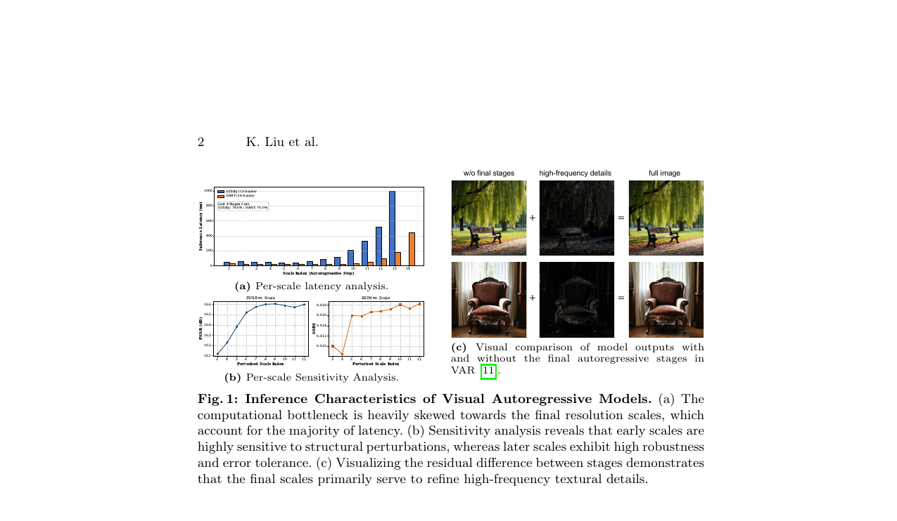
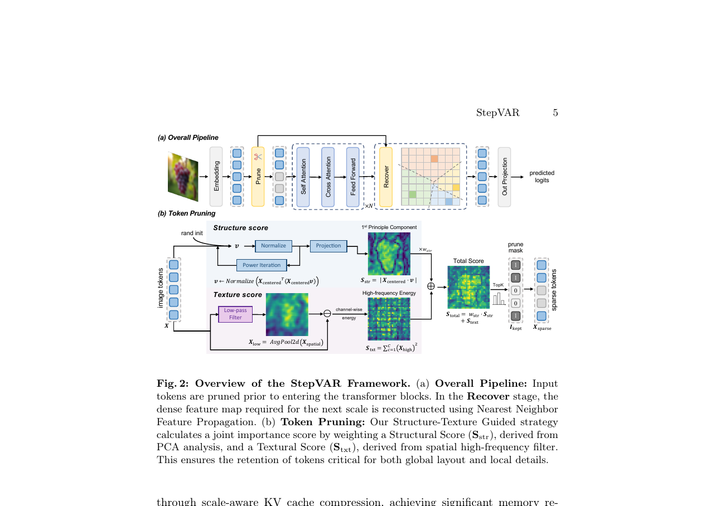
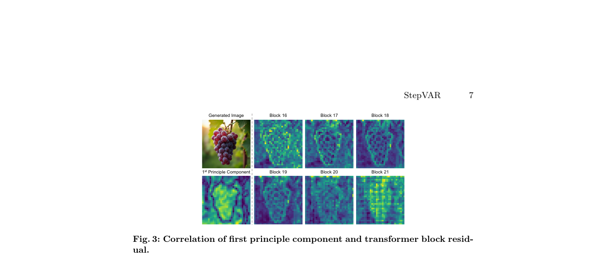

# AI Daily - StepVAR: 無需訓練，用結構與紋理引導VAR模型剪枝，實現高效推理

> 論文：[StepVAR: Structure-Texture Guided Pruning for Visual Autoregressive Models](https://arxiv.org/abs/2603.01757)
> 
> 作者：Keli Liu, Zhendong Wang, Wengang Zhou, Houqiang Li
> 
> 單位：中國科學技術大學 (USTC)
> 
> ArXiv：2603.01757 (cs.CV) | 2026年3月2日

## 論文核心貢獻

視覺自回歸模型 (Visual Autoregressive, VAR) 在高解析度圖像生成中，後期尺度（refine details）的計算成本佔了總推理時間的75%以上，成為效能瓶頸。現有的剪枝方法多僅關注高頻紋理，忽略了全局結構的重要性，導致語義失真。

為此，**StepVAR** 提出了一個**無需訓練 (training-free)** 的Token剪枝框架，其核心創新在於**雙標準重要性評估**：

1.  **結構引導 (Structure-Guided)**：利用**主成分分析 (PCA)** 識別對全局結構至關重要的Token，保護圖像的整體佈局與語義一致性。
2.  **紋理引導 (Texture-Guided)**：透過輕量級的**高通濾波器**保留高頻紋理細節，確保生成圖像的清晰度與真實感。

此外，StepVAR還引入了**最近鄰特徵傳播 (Nearest Neighbor Feature Propagation)** 策略，從保留的稀疏Token中重建密集的特徵圖，以維持下一尺度預測的有效性。這個框架在不犧牲生成品質的前提下，顯著提升了VAR模型的推理速度。

*圖1：VAR模型的推理特性分析。**(a)** 顯示後期尺度佔據了大部分推理延遲。**(b)** 敏感性分析表明早期尺度對結構至關重要。**(c)** 視覺比較顯示後期尺度主要精煉高頻細節。*

## 技術方法簡述

StepVAR的加速流程包含兩個核心步驟：**雙標準Token剪枝**和**最近鄰特徵傳播**。

*圖2：StepVAR框架總覽。**(a)** 整體流程顯示在Transformer塊之前進行剪枝，並在之後進行特徵恢復。**(b)** Token剪枝模塊結合了結構分數與紋理分數。*

### 1. 結構與紋理引導的Token剪枝 (Structure-Texture Guided Token Pruning)

StepVAR認為，一個全面的剪枝策略應同時保留**結構完整性**和**紋理精細度**。

#### 結構重要性分數 ($S_{\text{str}}$)

為了保護全局語義，必須保留那些維持圖像整體佈局的Token。研究發現，Transformer塊中特徵修改最劇烈的區域，與特徵主成分投影量高的區域有強相關性。因此，保留PCA分數高的Token，等同於保留了網絡最想處理的特徵。

由於SVD計算成本過高，StepVAR採用**冪迭代法 (Power Iteration)** 來近似計算第一主成分向量 $\mathbf{v}$。對於中心化的特徵 $\mathbf{X}_{\text{centered}}$，迭代更新 $\mathbf{v}$：

$$
\mathbf{v} \leftarrow \frac{\mathbf{X}_{\text{centered}}^T (\mathbf{X}_{\text{centered}} \mathbf{v})}{\|\mathbf{X}_{\text{centered}}^T (\mathbf{X}_{\text{centered}} \mathbf{v})\|_2}
$$

結構重要性分數即為每個Token在主成分向量上的投影大小：

$$
S_{\text{str}} = |\mathbf{X}_{\text{centered}} \cdot \mathbf{v}|
$$

*圖3：第一主成分與Transformer塊殘差的相關性。圖中顯示，特徵主成分值較高的區域（右下）與Transformer塊中特徵變化較大的區域（中上至中下）高度相關。*

#### 紋理重要性分數 ($S_{\text{txt}}$)

為了捕捉邊緣、圖案等高頻細節，StepVAR採用一種高效的空間近似方法。它假設高頻Token會顯著偏離其局部鄰域的平均值。首先，使用一個 $3 \times 3$ 的平均池化 (Average Pooling) 來計算低頻近似 $\mathbf{X}_{\text{low}}$：

$$
\mathbf{X}_{\text{low}} = \text{AvgPool2d}(\mathbf{X}_{\text{spatial}})
$$

高頻成分即為原始信號與平滑版本的殘差：

$$
\mathbf{X}_{\text{high}} = \mathbf{X}_{\text{spatial}} - \mathbf{X}_{\text{low}}
$$

紋理重要性分數由高頻成分的能量（$L_2$範數）定義：

$$
S_{\text{txt}} = \sum_{c=1}^{C} (\mathbf{X}_{\text{high}}^{(c)})^2
$$

#### 聯合選擇

最終的重要性分數是結構與紋理分數的加權和。根據剪枝率 $r$ 選出分數最高的Top-k個Token。

$$
S_{\text{total}} = w_{\text{str}} \cdot S_{\text{str}} + S_{\text{txt}}
$$

### 2. 最近鄰特徵傳播 (Nearest Neighbor Feature Propagation)

在稀疏Token經過Transformer塊處理後，需要重建一個密集的特徵圖以供下一尺度使用。StepVAR利用特徵的空間冗餘性，將被剪枝位置的特徵值，用其**空間上最近的保留Token**的特徵值來填充。

對於每個被剪枝的位置 $p_i$，找到最近的保留位置 $p_j$：

$$
j^* = \arg\min_j \|p_i - p_j\|_2
$$

重建的特徵即為：

$$
\mathbf{X}_{\text{rec}}[i] = \mathbf{X}_{\text{sparse}}^{\prime}[j^*]
$$

這種方法確保了重建的特徵圖在語義上與當前尺度保持一致，避免了從前一尺度複製特徵所帶來的語義鴻溝。

## 實驗結果與性能指標

StepVAR在多個SOTA的文生圖（HART, Infinity）和文生視頻（InfinityStar）模型上進行了評估，並與FastVAR、SparseVAR等方法進行了比較。

- **文生圖品質**：在GenEval和DPG等複雜語義評測上，StepVAR在取得1.4x至2.0x加速的同時，性能全面超越或持平現有方法。在MJHQ-30K數據集上，StepVAR在FID指標上甚至優於原始模型，證明其在保持高保真度的同時有效去除了噪聲。
- **文生視頻品質**：在VBench評測上，StepVAR在為InfinityStar帶來1.4x加速的同時，整體得分僅從83.88微降至83.35，展現了其在時序任務上的泛化能力。
- **消融研究**：實驗證明，結合PCA的雙標準策略顯著優於單獨使用高頻或L2範數的方法。同時，最近鄰傳播策略在語義一致性上優於從緩存或固定錨點恢復的方法。

| 方法 (基於HART) | 加速比 | GenEval (Overall) ↑ | DPG (Overall) ↑ | FID (Overall) ↓ |
|:---|:---:|:---:|:---:|:---:|
| Baseline | 1.0× | 0.51 | 74.87 | 11.00 |
| + FastVAR | 1.4× | 0.51 | 74.18 | 10.52 |
| + SparseVAR | 1.4× | 0.50 | 74.45 | - |
| **+ StepVAR (Ours)** | **1.4×** | **0.51** | **74.58** | **10.28** |

## 相關研究背景

- **視覺自回歸模型 (VAR)**：如[VAR](https://arxiv.org/abs/2306.05319)、[Infinity](https://arxiv.org/abs/2402.08268)、[HART](https://arxiv.org/abs/2401.05503)等，採用由粗到細的下一尺度預測策略，實現了並行生成，但高解析度下的計算瓶頸依然存在。
- **生成模型加速**：針對擴散模型，有DPM-Solver、知識蒸餾等方法。針對VAR模型，有CoDe、FreqExit等方法，但大多依賴單一指標（如頻率）或需要額外訓練。
- **Token剪枝**：FastVAR和SparseVAR是針對VAR模型的無需訓練剪枝方法，但它們主要依賴高頻檢測，可能損害全局結構。

## 個人評價與意義

StepVAR精準地抓住了VAR模型推理過程中的核心痛點——後期尺度的高度冗餘性與計算密集性。其提出的**結構-紋理雙標準剪枝**策略，是我認為最亮眼的創新。僅僅依賴高頻信息來決定Token去留，顯然過於草率，容易導致「只見樹木，不見森林」的問題，生成缺乏全局一致性的圖像。StepVAR通過引入PCA來保護**統計上重要**的結構Token，無論其頻率高低，都確保了生成圖像的「骨架」穩固，這是一個非常深刻且有效的洞察。

此外，**最近鄰特徵傳播**也是一個巧妙的設計。它避免了從過時的緩存中複製特徵所帶來的語義不一致問題，確保了信息在當前處理尺度內的流動，維持了特徵圖的空間連續性。

最重要的是，StepVAR是一個**無需訓練、即插即用**的框架，這大大降低了其應用門檻，使其可以輕鬆地應用於各種現有的VAR模型（包括圖像和視頻），展現了極佳的通用性和實用價值。對於追求高效高質量生成的研究者和開發者來說，StepVAR無疑提供了一個極具吸引力的解決方案，也為未來VAR模型的優化指明了一個新的方向：**在保留關鍵結構的同時，精簡紋理細節的計算**。
