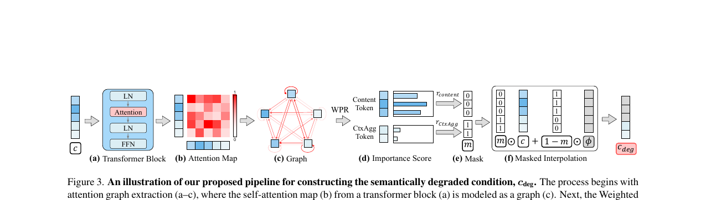
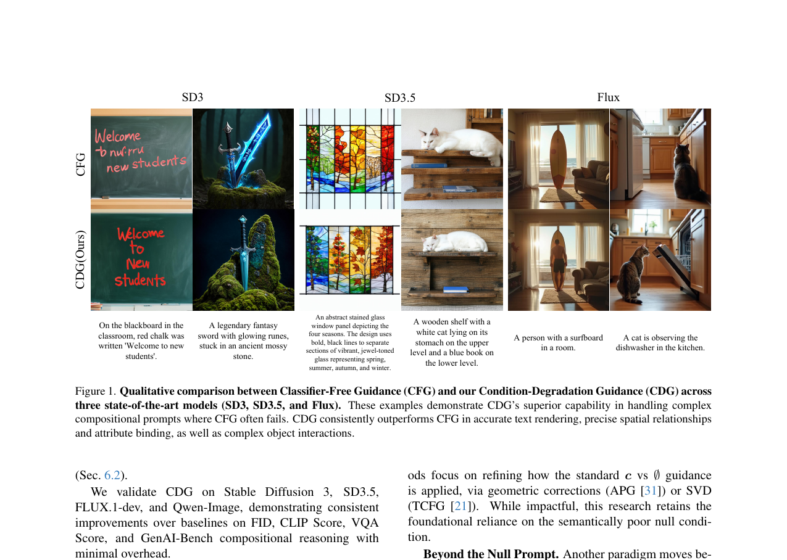

# AI Daily

## 論文標題：Guiding Diffusion Models with Semantically Degraded Conditions (CDG)

**發表時間**：2026-03-11 (Accepted to CVPR 2026)
**作者**：Shilong Han, Yuming Zhang, Hongxia Wang (National University of Defense Technology)
**論文連結**：[arXiv:2603.10780](https://arxiv.org/abs/2603.10780)
**程式碼**：[GitHub](https://github.com/Ming-321/Classifier-Degradation-Guidance)

---

### 1. 研究背景與問題

在當前的文本到圖像生成模型中，**無分類器引導 (Classifier-Free Guidance, CFG)** 是一項核心技術。CFG 透過將無條件預測外推至有條件預測，引導生成過程朝向目標語義靠攏。然而，CFG 存在一個根本性的缺陷：它依賴一個語義空洞的「空提示 (null prompt, $\varnothing$)」作為負樣本，這導致引導信號容易發生幾何糾纏，在處理複雜的組合任務（如文本渲染、複雜屬性綁定、空間關係）時經常失敗。

現有的改進方法大致分為兩類：一類是「過程修正方法」（如 APG、TCFG），保留原有的 $\boldsymbol{c}$ vs. $\varnothing$ 對比，但在後處理中進行幾何校正；另一類是「負樣本重構方法」（如 Autoguidance、PAG、CADS），嘗試以弱模型、隨機擾動或 VLM 生成的負提示來取代空提示。然而，這些方法要麼需要額外的外部模型，要麼對 prompt 本身的語義結構缺乏利用。

### 2. 核心創新：條件降級引導 (CDG)

本論文提出了 **條件降級引導 (Condition-Degradation Guidance, CDG)**，其核心思路是：與其使用語義空洞的 $\varnothing$，不如使用一個「幾乎好」的降級條件 $\boldsymbol{c}_{\text{deg}}$ 作為負樣本，從而將引導從粗糙的「好 vs. 空」對比，轉變為更精細的「好 vs. 幾乎好」的區分。

CDG 的數學形式如下：

$$\boldsymbol{D}_\theta^{\text{CDG}}(\boldsymbol{x}_\sigma; \sigma, \boldsymbol{c}) = \boldsymbol{D}_\theta(\boldsymbol{x}_\sigma; \sigma, \boldsymbol{c}) + (w-1)(\boldsymbol{D}_\theta(\boldsymbol{x}_\sigma; \sigma, \boldsymbol{c}) - \boldsymbol{D}_\theta(\boldsymbol{x}_\sigma; \sigma, \boldsymbol{c}_{\text{deg}}))$$

**關鍵發現**：作者透過對 Transformer 文本編碼器的分析，發現 token 嵌入自然分為兩種功能角色：
- **內容 token (Content Tokens)**：編碼物件的具體語義（如 "minecraft"、"cooking"、"man"）。
- **上下文聚合 token (Context-Aggregating Tokens)**：包含 padding token 和特殊 token，雖然本身缺乏語義，但透過注意力機制吸收了全局上下文信息。

CDG 的「分層降級策略 (Stratified Degradation)」正是利用了這一結構：選擇性地降級內容 token，同時保留上下文聚合 token，從而構建出一個保留全局語義骨架、但失去細粒度細節的降級條件 $\boldsymbol{c}_{\text{deg}}$。

### 3. 方法流程

*圖 1：CDG 構建語義降級條件 $\boldsymbol{c}_{\text{deg}}$ 的完整流程。*

CDG 的完整流程包含以下步驟：

**步驟一：注意力圖提取與圖構建**。從指定的 Transformer 模塊中提取自注意力圖 $A \in \mathbb{R}^{N \times N}$，並將 token 作為圖的節點，注意力權重作為邊的權重，構建一個注意力加權圖。

**步驟二：加權 PageRank (WPR) 評分**。對上述注意力圖應用加權 PageRank 算法，計算每個 token 的重要性分數向量 $\boldsymbol{s} \in \mathbb{R}^N$。WPR 的迭代更新公式為：

$$\boldsymbol{s}^{(k+1)} = \frac{A^T \boldsymbol{s}^{(k)}}{\|A^T \boldsymbol{s}^{(k)}\|_1}$$

**步驟三：分層降級**。引入統一的降級比例 $R_{\text{deg}} \in [0, 2]$，映射到各類型 token 的替換比例：

$$r_{\text{content}} = \min(R_{\text{deg}}, 1.0), \quad r_{\text{CtxAgg}} = \max(R_{\text{deg}} - 1.0, 0)$$

這確保了語義重要的內容 token 優先被降級。$R_{\text{deg}} = 1.0$ 是一個自然的「語義邊界」，此時所有內容 token 均被降級，無需 WPR 計算，計算效率最高。

**步驟四：掩碼插值**。生成二值掩碼 $\boldsymbol{m}$，並透過掩碼插值構建最終的降級條件：

$$\boldsymbol{c}_{\text{deg}} = \boldsymbol{m} \odot \boldsymbol{c} + (1 - \boldsymbol{m}) \odot \varnothing$$

### 4. 幾何視角的理論分析

作者從流形假說出發，對 CDG 的優越性提供了幾何層面的解釋。他們引入兩個指標：**幾何解耦 (Geometric Decoupling)** 衡量引導信號與主去噪子空間的正交性，**干擾能量比 (Interference Energy Ratio)** 衡量引導信號投影到去噪方向的能量比例。

實驗結果顯示，CDG 在整個生成過程中始終保持近乎完美的正交性（幾何解耦接近 1.0），而 CFG 在早期去噪階段存在嚴重的糾纏。這種優勢源於 CDG 的「共模抑制效應 (Common-Mode Rejection Effect)」：由於 $\boldsymbol{c}$ 和 $\boldsymbol{c}_{\text{deg}}$ 是語義鄰居，它們的差值 $\Delta\boldsymbol{\varepsilon}_{\text{CDG}}$ 消除了共享的法向分量，僅保留純粹的語義修正信號。

### 5. 實驗結果

*圖 2：CFG 與 CDG 在 SD3、SD3.5 和 Flux 上的定性比較。CDG 在文本渲染、空間關係和屬性綁定上全面超越 CFG。*

作者在 SD3、SD3.5、FLUX.1-dev 和 Qwen-Image 四個主流架構上進行了全面評估，使用 MS-COCO 2017 驗證集的 5,000 條 caption 進行測試。

**MS-COCO 定量結果（SD3 為例）：**

| 方法 | FID ↓ | CLIP Score ↑ | Aesthetic Score ↑ | VQA Score ↑ |
|------|-------|-------------|-------------------|-------------|
| CFG | 35.69 | 31.73 | 5.66 | 91.44 |
| CADS | 36.16 | 31.72 | 5.65 | 91.44 |
| PAG | 50.60 | 30.15 | 5.52 | 81.27 |
| SEG | 41.90 | 30.28 | 5.56 | 84.15 |
| DNP | 34.68 | 31.30 | 5.51 | 89.65 |
| **CDG (Ours)** | **34.05** | **32.00** | **5.70** | **92.40** |

**GenAI-Bench 組合推理結果（SD3.5 為例）：**

| 方法 | Spatial ↑ | Comparison ↑ | Differentiation ↑ | Universal ↑ |
|------|-----------|-------------|-------------------|-------------|
| CFG | 79.66 | 73.70 | 75.10 | 72.21 |
| CADS | 79.58 | 73.54 | 75.08 | 71.94 |
| PAG | 75.64 | 71.02 | 72.38 | 66.17 |
| **CDG (Ours)** | **80.69** | **76.06** | **78.74** | **73.13** |

CDG 在 Differentiation（+3.64）和 Comparison（+2.36）任務上取得了最大提升，這正是「好 vs. 幾乎好」範式最能發揮優勢的場景。

### 6. 總結與點評

這是一篇非常優雅且實用的論文（已被 CVPR 2026 接收）。它深刻指出了 CFG 依賴空提示的根本缺陷，並巧妙地利用 Transformer 內部的注意力機制，提出了一種無需訓練的解決方案。

**亮點：**

第一，**直擊痛點**：解決了擴散模型在複雜 prompt 下容易出現的語義混淆和屬性洩漏問題，特別是在文本渲染和空間關係這兩個 CFG 的傳統弱點上取得了顯著改善。

第二，**方法優雅**：不需要引入額外的 VLM 或進行微調，純粹透過分析 token 的注意力圖來實現「精準打擊」。分層降級的設計思路清晰，且有嚴格的理論支撐（WPR 揭示的 token 二分性、幾何解耦分析）。

第三，**通用性強**：在 SD3、SD3.5、FLUX.1-dev 和 Qwen-Image 等最新架構上均有顯著效果，且對 Qwen-Image 使用特殊 token 而非 padding token 的情況也能泛化，證明了該方法的普適性。

對於關注圖像生成、Training-free 方法以及 Attention Modulation 的研究者來說，這是一篇必讀的佳作。其「好 vs. 幾乎好」的對比思路，也為未來的引導機制設計提供了新的啟發。

---
*報告生成時間：2026-03-19*
