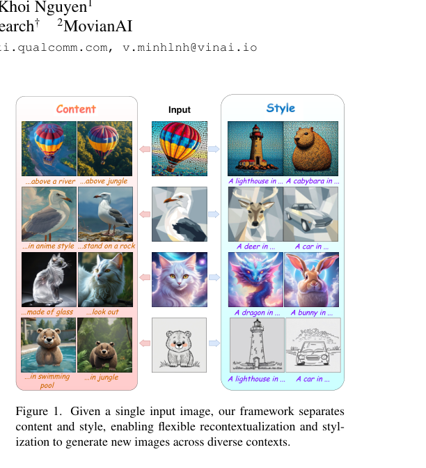
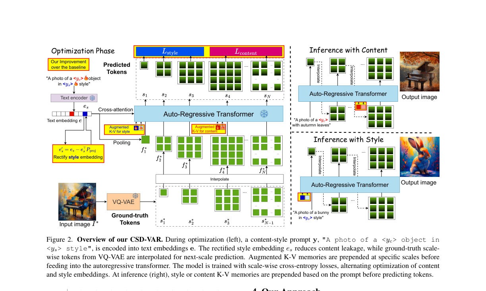
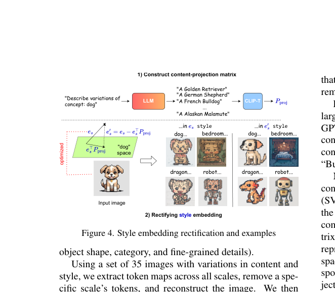
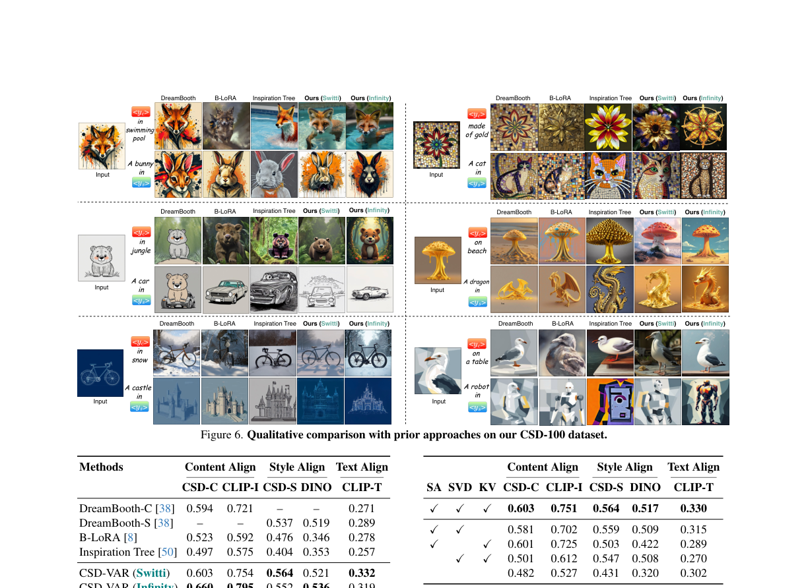

# AI Daily

## 今日閱讀

### [CSD-VAR: Content-Style Decomposition in Visual Autoregressive Models](https://arxiv.org/abs/2507.13984) — 2026-03-18：首個基於 VAR 的內容-風格分解框架 (ICCV 2025)

**作者**：Quang-Binh Nguyen, Minh Luu, Quang Nguyen, Anh Tran, Khoi Nguyen
**機構**：Qualcomm AI Research, MovianAI
**發表**：ICCV 2025 / arXiv 2026-03-15 (v2)

本文提出 **CSD-VAR**，這是首個將**內容-風格分解（Content-Style Decomposition, CSD）**應用於**視覺自回歸模型（Visual Autoregressive Models, VAR）**的框架。過去的個性化與風格分解方法（如 B-LoRA、UnZipLoRA）大多專為 Diffusion Models 設計，而 CSD-VAR 則充分利用了 VAR「逐尺度（next-scale prediction）」的生成特性，實現了更優異的內容與風格解耦。

*圖 1：給定單一輸入圖像，CSD-VAR 能夠分離內容與風格，實現靈活的重構（Recontextualization）與風格化（Stylization）。*

---

### 核心貢獻與創新點

CSD-VAR 的核心洞見在於：在 VAR 的多尺度生成過程中，**早期尺度（Early scales）主要編碼風格資訊，而後期尺度（Later scales）則捕捉內容結構**。基於此，論文提出了三個關鍵創新：

1. **尺度感知交替優化（Scale-aware Alternating Optimization）**：根據尺度特性，將內容與風格的優化過程分離，避免梯度混合。
2. **基於 SVD 的風格嵌入校正（SVD-based Style Embedding Rectification）**：透過奇異值分解（SVD）構建內容子空間，並將風格嵌入投影以去除殘留的內容資訊，防止「內容洩漏（Content Leakage）」。
3. **增強型鍵值記憶體（Augmented K-V Memories）**：在 Transformer 區塊中引入額外的 K-V 矩陣，以捕捉單純文本嵌入難以涵蓋的複雜細節，增強主體身份保留。
4. **CSD-100 資料集**：提出了一個專門用於評估內容-風格分解的基準資料集，包含 100 張涵蓋多樣主體與風格的圖像。

---

### 技術方法簡述

#### 1. 尺度感知交替優化 (Scale-aware Alternating Optimization)

作者觀察到，移除小尺度（$k \in \{1, 2, 3\}$）和最終尺度（$k=10$）的 token 會顯著影響風格。因此，將尺度分為**風格相關組** $S_{\text{style}} = \{1, 2, 3, 10\}$ 和**內容相關組** $S_{\text{content}} = \{4, \dots, 9\}$。

優化風格嵌入 $y_s$ 和內容嵌入 $y_c$ 的損失函數分別為：

$$\mathcal{L}_{\text{style}} = \sum_{k \in S_{\text{style}}} \mathcal{L}_k + \alpha \sum_{k' \in S_{\text{content}}} \mathcal{L}_{k'}$$

$$\mathcal{L}_{\text{content}} = \sum_{k \in S_{\text{content}}} \mathcal{L}_k$$

其中 $\alpha \in (0, 1)$ 控制大尺度 token 對風格的影響（實驗中設為 $\alpha = 0.1$）。透過交替迭代優化這兩個損失，確保了更清晰的表示分離，防止梯度混合（Gradient Mixing）。

#### 2. 基於 SVD 的風格嵌入校正 (SVD-based Style Embedding Rectification)

為了防止內容資訊洩漏到風格嵌入中，CSD-VAR 利用 LLM（如 Llama 或 ChatGPT）生成目標概念的子概念（如「狗」的子概念為「黃金獵犬」、「德國牧羊犬」、「鬥牛犬」等），並使用 CLIP 提取文本嵌入矩陣 $M \in \mathbb{R}^{Q \times d}$。

對 $M$ 進行 SVD 分解 $M = U \Sigma V^T$，選取前 $r$ 個主成分構建投影矩陣：

$$P_{\text{proj}} = V_r^T V_r$$

然後，將原始風格嵌入 $e_s = \text{CLIP}(y_s)$ 投影並減去內容相關資訊，得到純淨的風格嵌入 $e_s'$：

$$e_s' = e_s - e_s^T P_{\text{proj}}$$

這確保了 $e_s'$ 與內容變化保持正交（Orthogonal），有效防止了風格表示中出現不期望的主體外觀。實驗表明，選取前 $r=10$ 個奇異向量效果最佳。

*圖 2：CSD-VAR 架構圖。在優化階段（左），結合了 SVD 校正的風格嵌入（$e_s' = e_s - e_s^T P_{\text{proj}}$）與增強型 K-V 記憶體，並透過尺度感知的交叉熵損失進行交替訓練。在推理階段（右），根據提示選擇性地注入風格或內容的 K-V 記憶體。*

#### 3. 增強型鍵值記憶體 (Augmented K-V Memories)

對於複雜概念，單純的文本嵌入可能不足以捕捉所有細節。CSD-VAR 在自回歸 Transformer 的特定區塊（風格在尺度 $k=1$，內容在尺度 $k=4$）的自注意力層前，附加了 $O$ 對可學習的 K-V 記憶體（$\tilde{K}, \tilde{V}$），使用 Xavier 均勻初始化：

$$\text{Attn}(Q, K, V; \tilde{K}, \tilde{V}) = \text{Attn}\left(Q, \begin{bmatrix} \tilde{K} \\ K \end{bmatrix}, \begin{bmatrix} \tilde{V} \\ V \end{bmatrix}\right)$$

消融實驗顯示，僅在第一個 Transformer 區塊應用 K-V 記憶體（7K 參數）即可達到最佳效率-性能平衡，增加更多區塊雖略有提升但會降低文本對齊度（可能導致過擬合）。

*圖 4：SVD 風格嵌入校正示意圖。透過 LLM 生成子概念，構建內容投影矩陣 $P_{\text{proj}}$，並從風格嵌入中減去內容相關方向，有效消除內容洩漏。*

---

### 實驗結果與性能指標

在 CSD-100 資料集上（100 張圖像，50 個推理提示，每提示生成 10 張，共 50,000 張評估圖像），CSD-VAR 與 DreamBooth、B-LoRA、Inspiration Tree 等方法進行了全面比較。

| Methods | CSD-C ↑ | CLIP-I ↑ | CSD-S ↑ | DINO ↑ | CLIP-T ↑ |
| :--- | :---: | :---: | :---: | :---: | :---: |
| DreamBooth-C | 0.594 | 0.721 | — | — | 0.271 |
| DreamBooth-S | — | — | 0.537 | 0.519 | 0.289 |
| B-LoRA | 0.523 | 0.592 | 0.476 | 0.346 | 0.278 |
| Inspiration Tree | 0.497 | 0.575 | 0.404 | 0.353 | 0.257 |
| **CSD-VAR (Switti)** | 0.603 | 0.754 | **0.564** | 0.521 | **0.332** |
| **CSD-VAR (Infinity)** | **0.660** | **0.795** | 0.552 | **0.536** | 0.319 |

**結果分析**：

CSD-VAR 在**內容對齊（Content Align）**和**風格對齊（Style Align）**上均取得最高分，證明了其卓越的身份保留與風格化能力。在**文本對齊（Text Align）**上，CSD-VAR 也顯著優於其他方法，表明其在遵循文本提示方面具有更好的泛化能力，而不會像 DreamBooth 那樣嚴重過擬合於輸入圖像。使用者研究（100 名參與者，7,500 份回應）進一步確認了 CSD-VAR 在圖像品質、提示遵循、內容對齊、風格對齊和整體品質五個維度上的全面優勢。

*圖 5：與現有方法的定性比較。CSD-VAR 在將內容重構到新環境（如「in swimming pool」、「in jungle」）以及將風格應用於新主體時，展現了極高的保真度，且沒有明顯的內容洩漏。*

---

### 相關研究背景

**Visual Autoregressive Modeling (VAR)** 由 Tian et al. 提出，引入了「Next-scale prediction」範式，有別於傳統的 Next-token prediction。VAR 從 $1 \times 1$ 的 token map 開始，逐步擴展到 $2 \times 2, 4 \times 4, \dots$ 等多尺度 token map，在保持高效率的同時實現了媲美 Diffusion Models 的生成品質。CSD-VAR 的骨幹網路 **Switti** 和 **Infinity** 均是基於此範式的文本到圖像 VAR 模型。

**Content-Style Decomposition (CSD)** 的先前代表性工作包括：
- **B-LoRA**（ECCV 2024）：利用 Stable Diffusion 的 UNet 中特定 LoRA 區塊隱式分離內容與風格。
- **UnZipLoRA**：聯合學習兩個 LoRA 模組，分別對應內容與風格，並使用 Prompt Separation 和 Block-wise Sensitivity Analysis。

兩者均為 Diffusion-based 方法，CSD-VAR 是首個將此任務引入 VAR 框架的研究。

---

### 個人評價與意義

CSD-VAR 是一篇非常具有啟發性的工作。它不僅證明了 VAR 模型在細粒度控制和概念解耦上的潛力，更巧妙地利用了 VAR 獨有的**多尺度生成特性**——早期尺度定風格、後期尺度定內容——這種物理意義清晰的尺度語義，為設計優化策略提供了非常優雅的先驗知識。

此外，論文提出的 **SVD-based Rectification** 是一個非常實用且輕量的技巧，能有效解決風格遷移中常見的「內容洩漏」痛點。對於近期關注 VAR-based、Attention Modulation 以及 Zero-shot/Training-free 生成控制的研究者來說，CSD-VAR 提供了一個全新的視角：**在 VAR 中，尺度（Scale）本身就是一種強大的語義控制維度**，不同尺度對應不同層次的視覺語義，這一特性值得在更多下游任務（如圖像編輯、條件生成）中深入探索。

**可能的延伸方向**：
- 將 Scale-aware 的思路應用於 VAR-based 圖像編輯（如 AREdit），在特定尺度上注入編輯信號。
- 結合 Training-free 的 Attention Modulation 技術，實現無需優化的 Zero-shot CSD。
- 探索更多尺度語義的應用，例如在 VAR 的特定尺度上進行 Spatial Layout Control。
