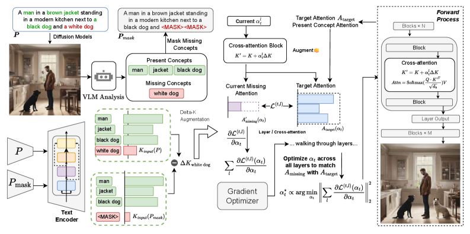
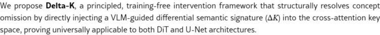

# AI Daily

## Delta-K: Boosting Multi-Instance Generation via Cross-Attention Augmentation

**論文標題**：Delta-K: Boosting Multi-Instance Generation via Cross-Attention Augmentation
**作者**：Zitong Wang, Zijun Shen, Haohao Xu, Zhengjie Luo, Weibin Wu (Sun Yat-sen University, Nanjing University, Tianjin University)
**發表日期**：2026-03-10 (arXiv)
**論文連結**：[arXiv:2603.10210](https://arxiv.org/abs/2603.10210)

---

### 1. 論文核心貢獻和創新點

在文本到圖像（Text-to-Image）生成中，當面對包含多個實例（Multi-Instance）和複雜屬性的提示詞時，現有的擴散模型（Diffusion Models）經常會出現**概念遺漏（Concept Omission）**和屬性綁定錯誤的問題。現有的免訓練（Training-free）方法通常透過重新縮放注意力圖（Attention Maps）來解決此問題，但這往往只會加劇非結構化噪聲，而無法建立連貫的語義表示。

為了解決這個問題，本文提出了 **Delta-K**，這是一個與主幹網路無關（Backbone-agnostic）且隨插即用（Plug-and-play）的推理框架。其核心創新點包括：

1.  **全新的失敗視角**：指出概念遺漏並非單純的激活不足，而是發生在擴散採樣早期語義規劃階段的**表示層級語義匹配失敗**。
2.  **直接在 Key 空間干預**：Delta-K 不依賴啟發式的注意力圖重加權，而是透過視覺語言模型（VLM）提取缺失概念的差異語義特徵（Differential Key, $\Delta K$），並將其直接注入到交叉注意力（Cross-Attention）的 Key 空間中。
3.  **動態調度機制**：引入了一種線上優化機制，動態調整注入強度（$\alpha_t$），確保缺失概念能夠穩定接地（Grounding），同時利用 Key 空間的自然正交性保留已存在的實例。
4.  **廣泛的適用性**：無需額外訓練、空間遮罩或架構修改，即可在現代 DiT 模型（如 SD3.5）和經典 U-Net 架構（如 SDXL）上顯著提升組合對齊能力。

---

### 2. 技術方法簡述

Delta-K 的核心思想是計算一個差異鍵向量 $\Delta K$，該向量隔離了由 VLM 從文本中識別出的缺失概念的語義信息。在每個推理步驟中，根據動態強度調度將 $\Delta K$ 注入到 `to_k` 模組的輸入中，迫使模型在圖像生成過程中關注這些先前被忽略的概念。

*圖 1：Delta-K 框架概覽。VLM 首先從基準生成中分離出存在和缺失的概念。透過對比原始提示和遮罩提示，獲得差異鍵向量 $\Delta K$，在採樣期間動態注入交叉注意力鍵中。*

#### 2.1 識別缺失概念與 Delta-K 增強

給定文本提示 $P$，首先透過標準擴散過程生成基準圖像 $I_{base}$。然後使用視覺語言模型 $\mathcal{F}_{vlm}$ 返回兩組概念：
$$ (C_{present}, C_{missing}) = \mathcal{F}_{vlm}(P, I_{base}) $$

接著，透過將 $C_{missing}$ 替換為 `[MASK]` 來構建遮罩提示 $P_{mask}$。在推理過程中捕獲 $P_{mask}$ 和原始提示 $P$ 輸入到 `to_k` 模組的特徵，它們的差異 $\Delta K$ 即代表了缺失概念的語義表示：
$$ \Delta K \triangleq K_{input}(P) - K_{input}(P_{mask}) $$

在推理過程中，對於每個層和步驟 $t$，將預先計算的 $\Delta K$ 注入到當前步驟的鍵向量中，並計算注意力：
$$ K' = K + \alpha_t \cdot \Delta K, \quad \text{Attn}' = \text{Softmax}\left(\frac{Q \cdot K'^T}{\sqrt{d_k}}\right)V $$

#### 2.2 動態調度 (Dynamic Scheduling)

為了控制增強強度 $\alpha_t$，Delta-K 引入了動態調度方法。目標是引導缺失概念接收到的注意力模式與成功生成的概念的注意力模式相匹配。

定義 $A_{target}$ 為基準生成中成功生成的概念 $C_{present}$ 接收到的平均注意力。為了鼓勵缺失概念的注意力分佈與目標分佈匹配，最小化以下目標函數：
$$ \mathcal{L}^{(t,l)}(\alpha_t) = \| A_{missing}'^{(t,l)}(\alpha_t) - A_{target}^{(t,l)} \|_2^2 $$

由於損失函數對增強強度 $\alpha_t$ 是可微的，因此在每個去噪步驟 $t$ 執行線上優化（使用 Adam 優化器）。最佳係數透過最小化跨層的聚合梯度幅度來獲得：
$$ \alpha_t^* = \lambda \cdot \arg\min_{\alpha_t} \left\| \sum_l \frac{\partial \mathcal{L}^{(t,l)}(\alpha_t)}{\partial \alpha_t} \right\|_2^2 $$

這種動態優化允許增強強度適應生成過程，穩定缺失概念的注意力信號，並將嘈雜的注意力模式轉化為連貫的語義表示。

*圖 2：SD3.5 中的注意力時空動態。缺失概念在早期表現出高度的空間不穩定性（高 CV 值），Delta-K 透過早期干預將其轉化為穩定的結構錨點。*

---

### 3. 實驗結果和性能指標

Delta-K 在多個最先進的擴散主幹網路上進行了評估，包括 Stable Diffusion XL (SDXL)、Stable Diffusion 3.5-medium (SD3.5-M) 和 Flux-dev。評估基準包括 T2I-CompBench、GenEval 和 ConceptMix。

**主要結果亮點：**

| 模型 | T2I-CompBench (Complex $\uparrow$) | T2I-CompBench (Spatial $\uparrow$) | GenEval (Overall $\uparrow$) |
| :--- | :---: | :---: | :---: |
| SDXL Baseline | 0.3230 | 0.2111 | 0.55 |
| SDXL + A&E | 0.3401 | 0.2212 | - |
| **SDXL + Delta-K (Ours)** | **0.3532** (+0.0302) | **0.2466** (+0.0355) | **0.58** (+0.03) |
| SD3.5-M Baseline | 0.3050 | 0.3053 | - |
| **SD3.5-M + Delta-K (Ours)** | **0.3410** (+0.0360) | **0.3487** (+0.0434) | - |

1.  **顯著提升組合對齊能力**：在 T2I-CompBench 上，Delta-K 在 SDXL 上的 Complex 分數提升了 0.0302，Spatial 分數提升了 0.0355。在 SD3.5-M 上，Spatial 指標更是大幅提升了 0.0434。
2.  **保持推理效率與圖像質量**：Delta-K 在提升多實例生成能力的同時，幾乎不增加計算負擔，且在 LAION-AES、CLIPScore 等美學和質量指標上與基準模型保持一致。
3.  **架構無關性**：無論是基於 U-Net 的 SDXL 還是基於 DiT 的 SD3.5 和 FLUX，Delta-K 都能穩定發揮作用。

---

### 4. 相關研究背景

*   **多實例生成 (Multi-Instance Generation)**：為了解決多實例生成失敗，現有方法通常引入結構或語義引導。結構感知方法（如 GLIGEN、BoxDiff）引入外部適配器或佈局先驗，但需要額外的空間註釋。
*   **免訓練注意力干預 (Training-free Attention Intervention)**：如 Attend-and-Excite (A&E)、SynGen 等方法提供了靈活性，但它們通常依賴於事後啟發式地縮放注意力圖。當提示複雜度增加時，這種表面的重加權無法提供足夠的表示控制。Delta-K 透過直接在交叉注意力 Key 空間中操作，從特徵層面動態注入遺漏的語義，從根本上克服了這一限制。

---

### 5. 個人評價和意義

Delta-K 是一篇非常具有啟發性的論文，特別是在 **Training-free** 和 **Attention Modulation** 領域。它跳出了以往「發現注意力不足就放大注意力分數」的直觀思維，深入到交叉注意力的底層機制（$Q \cdot K^T$），指出概念遺漏本質上是 Key 空間中缺乏穩定的語義錨點。

**亮點與啟發：**
1.  **精準的病因分析**：論文透過分析注意力圖的變異係數（CV），證明了缺失概念在早期表現為「散亂的噪聲」而非單純的「信號微弱」。這解釋了為什麼以前的重加權方法往往只會放大噪聲。
2.  **優雅的數學直覺**：利用 Key 空間的自然正交性，透過 $\Delta K$ 注入缺失語義，既能增強目標概念，又不會干擾已存在的實例，這種設計非常巧妙且無需複雜的空間 Mask。
3.  **Zero-shot 與 Plug-and-play**：結合 VLM 進行閉環的反饋控制，完全不需要重新訓練模型，這對於快速迭代和應用於各種開源大模型（如 FLUX, SD3.5）具有極高的實用價值。

這項研究為未來的免訓練圖像編輯和可控生成提供了一個強大的新範式：**與其在結果端（Attention Map）修修補補，不如在特徵輸入端（Key Space）對症下藥。**
