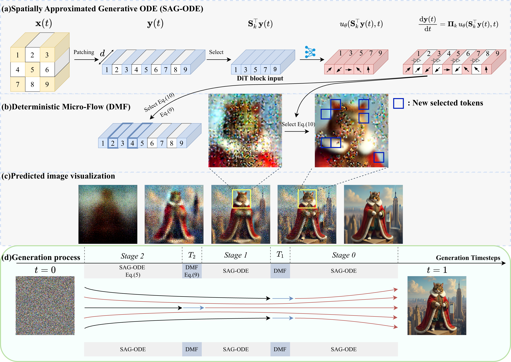
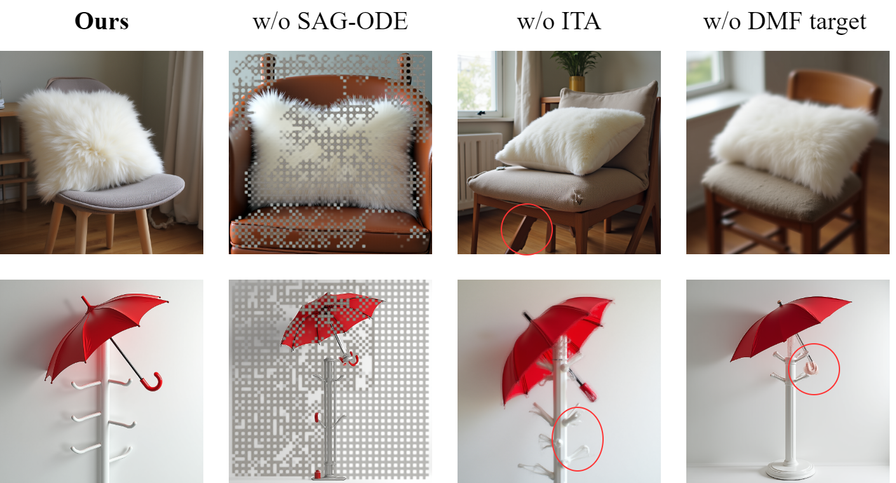

# AI Daily: Just-in-Time (JiT) - 免訓練的 Diffusion Transformers 空間加速框架

## 論文基本信息
- **論文標題**：Just-in-Time: Training-Free Spatial Acceleration for Diffusion Transformers
- **作者**：Wenhao Sun, Ji Li, Zhaoqiang Liu
- **研究機構**：電子科技大學 (UESTC), 首都師範大學
- **發表會議/期刊**：CVPR 2026
- **論文連結**：[arXiv:2603.10744](https://arxiv.org/abs/2603.10744)
- **代碼開源**：即將開源

## 核心貢獻與創新點

Diffusion Transformers (DiT) 憑藉其強大的擴展性和高分辨率對齊能力，已成為高保真文本到圖像生成的主流架構（如 FLUX.1）。然而，DiT 中密集空間 token 的二次方自注意力計算導致了極高的推理延遲。現有的加速方法大多集中在**時間域**（減少採樣步數或緩存特徵），卻忽略了生成過程中巨大的**空間冗餘**——圖像的全局結構在早期就已形成，而細節則在後期才逐漸完善。對所有空間區域進行均等的計算處理是一種嚴重的效率浪費。

為了解決這一問題，本文提出了 **Just-in-Time (JiT)**，這是一個**免訓練（Training-Free）**的空間加速框架。其核心創新點包括：

1. **空間近似生成 ODE (SAG-ODE)**：通過動態選擇的稀疏「錨點 token (anchor tokens)」子集進行計算，並推斷出完整的速度場（velocity field）來驅動整個潛在狀態的演化。
2. **確定性微流 (Deterministic Micro-Flow, DMF)**：在引入新 token 以擴展潛在狀態維度時，設計了一個簡單有效的有限時間 ODE，確保結構連貫性和統計正確性，實現無縫過渡。
3. **重要性引導的 Token 激活 (ITA)**：基於速度場的局部方差，動態優先分配計算資源到信息密度高（變化劇烈）的區域。

在 FLUX.1-dev 模型上的實驗表明，JiT 實現了高達 **7倍** 的加速，同時保持了幾乎無損的生成質量，顯著超越了現有的加速方法。

*圖 1：JiT 框架在 FLUX.1-dev 上的生成效果展示。即使在 4x 和 7x 的高加速比下，依然能生成高保真、視覺震撼的圖像。*

## 技術方法簡述

JiT 的核心思想是將計算資源集中在最需要的空間區域，並隨著生成過程的推進逐步擴大計算範圍。

*圖 2：JiT 框架概覽。包含 SAG-ODE 驅動稀疏 token 演化，以及 DMF 處理新 token 激活的無縫過渡。*

### 1. 空間近似生成 ODE (SAG-ODE)

在標準的 Flow Matching 中，ODE 控制著 token 化表示 $\mathbf{y}(t)$ 的動態：
$$ \frac{\mathrm{d}\mathbf{y}(t)}{\mathrm{d}t} = \mathbf{u}_\theta(\mathbf{y}(t), t), \quad t \in [0, 1] $$

JiT 構建了一個嵌套的 token 子集鏈 $\Omega_K \subset \Omega_{K-1} \subset \dots \subset \Omega_0 = \{1, 2, \dots, N\}$。在階段 $k$，只有 $\Omega_k$ 中的 anchor tokens 被送入 Transformer 進行計算。SAG-ODE 定義為：
$$ \frac{\mathrm{d}\mathbf{y}(t)}{\mathrm{d}t} = \mathbf{\Pi}_k \mathbf{u}_\theta(\mathbf{S}_k^\top \mathbf{y}(t), t) = \mathbf{v}_t $$

其中，$\mathbf{\Pi}_k$ 是增強的提升算子（Augmented Lifter Operator），它包含兩部分：
$$ \mathbf{\Pi}_k \mathbf{u}_\theta := \mathbf{S}_k \mathbf{u}_\theta + \mathcal{I}_k(\mathbf{u}_\theta) $$
- $\mathbf{S}_k \mathbf{u}_\theta$：將計算出的精確速度放回 anchor tokens 的對應位置。
- $\mathcal{I}_k(\mathbf{u}_\theta)$：通過空間插值，為未激活的 token 近似計算速度。

這種設計保證了 anchor tokens 上的計算誤差為零，同時為整個空間提供了結構感知的速度場。

### 2. 確定性微流 (Deterministic Micro-Flow, DMF)

當從階段 $k$ 過渡到 $k-1$ 時，需要激活新的 token。直接注入狀態會導致空間不連續和統計不匹配（產生 artifacts）。DMF 通過構建一個目標狀態 $\mathbf{y}_k^\star$ 來解決這個問題：
$$ \mathbf{y}_k^\star = \mathbf{Q}_k \left( T_k \Phi_k(\mathbf{S}_k^\top \hat{\mathbf{y}}^{(1)}) + (1 - T_k)\epsilon \right) $$
這裡結合了 Tweedie 公式預測的乾淨圖像結構 $\hat{\mathbf{y}}^{(1)}$ 和正確的噪聲水平 $\epsilon$。

然後，新激活的 token $\mathbf{Q}_k \mathbf{y}(t)$ 通過一個有限時間的 ODE 在極短時間 $[T_k-\delta, T_k]$ 內演化到目標狀態：
$$ \mathbf{Q}_k \dot{\mathbf{y}}(t) = \frac{\mathbf{y}_k^\star - \mathbf{Q}_k \mathbf{y}(t)}{T_k - t} $$
這確保了潛在空間軌跡的平滑連續。

### 3. 重要性引導的 Token 激活 (ITA)

JiT 不是靜態地激活 token，而是計算速度場的局部方差來評估每個區域的「動態活躍度」：
$$ \mathbf{I}(t) = \mathbb{E}_{\mathcal{W}}[\mathbf{u}_\theta \odot \mathbf{u}_\theta] - (\mathbb{E}_{\mathcal{W}}[\mathbf{u}_\theta]) \odot (\mathbb{E}_{\mathcal{W}}[\mathbf{u}_\theta]) $$
方差越大的區域（通常是高頻細節、邊緣），越優先被選為下一階段的 anchor tokens。

## 實驗結果與性能指標

JiT 在 FLUX.1-dev 模型上進行了廣泛的評估，並與 RALU、Bottleneck Sampling（空間域方法）以及 TaylorSeer、TeaCache（緩存方法）進行了對比。

### 定量分析

| 方法 | NFE | 延遲 (s) | 加速比 | CLIP-IQA ↑ | ImageReward ↑ | HPSv2.1 ↑ | T2I-Comp ↑ |
|------|-----|----------|--------|------------|---------------|-----------|------------|
| FLUX.1-dev (基準) | 50 | 25.25 | 1.00x | 0.6139 | 1.004 | 30.39 | 0.4836 |
| FLUX.1-dev | 12 | 6.21 | 4.10x | 0.5341 | 0.9435 | 29.43 | 0.4843 |
| RALU | 18 | 6.23 | 4.13x | 0.5493 | 0.8560 | 29.83 | 0.4620 |
| Teacache | 28 | 6.98 | 4.10x | 0.6003 | 0.9638 | 29.68 | 0.4849 |
| **JiT (Ours)** | 18 | **6.02** | **4.24x** | **0.6166** | **1.017** | 29.77 | **0.4991** |
| FLUX.1-dev | 7 | 3.80 | 6.93x | 0.4134 | 0.7474 | 27.72 | 0.4635 |
| Taylorseer | 28 | 5.20 | 6.92x | 0.4164 | 0.7995 | 28.46 | 0.4583 |
| **JiT (Ours)** | 11 | **3.67** | **7.07x** | 0.5397 | **0.9746** | **29.02** | **0.4961** |

如表所示，JiT 在 4x 和 7x 加速下均取得了 SOTA 的表現。特別是在 7x 加速（僅需 3.67 秒）時，ImageReward 和 HPSv2.1 分數遠超其他對比方法，甚至在某些指標上接近 50 步的基準模型。

### 定性分析與消融實驗

*圖 3：與其他加速方法的定性比較。在 7x 加速下，其他方法出現了嚴重的語義錯誤、細節丟失和結構偽影，而 JiT 依然保持了極高的保真度和文本渲染能力。*

*圖 4：消融實驗。移除 SAG-ODE 會導致未激活區域變成噪聲；移除 ITA 會導致高頻細節（如傘柄）模糊；移除 DMF 目標會導致噪聲不匹配的偽影。*

## 相關研究背景

- **時間域加速**：如 DPM-Solver、UniPC 等高階求解器，以及 LCM、PCM 等蒸餾方法。近年來，TeaCache 和 TaylorSeer 通過緩存相鄰步的特徵來減少計算。
- **空間域加速**：早期的 RALU 和 Bottleneck Sampling 採用金字塔或層次化策略，生成低分辨率潛在變量並逐步上採樣。然而，顯式的上採樣操作容易引入信息丟失或混疊偽影（aliasing artifacts）。JiT 借鑒了 Subspace Diffusion 的概念，完全避免了容易出錯的上採樣和事後校正過程。

## 個人評價與意義

**Just-in-Time (JiT)** 是一篇非常優雅且實用的 CVPR 2026 論文。它精準地抓住了圖像生成「先全局、後細節」的本質特徵，將加速的視角從擁擠的「時間域」轉向了潛力巨大的「空間域」。

這篇論文最讓我驚豔的設計是 **SAG-ODE** 和 **DMF** 的結合。傳統的空間加速方法（如先生成小圖再放大）往往會因為分辨率切換而產生明顯的割裂感和偽影。JiT 通過數學上嚴謹的微流（Micro-Flow）設計，讓新加入的 token 能夠平滑地融入當前的生成軌跡中，這是一種非常「Soft」且「Training-free」的處理方式。

對於關注 **VAR (Visual Autoregressive)**、**Attention Modulation** 和 **Zero-shot** 領域的研究者來說，JiT 提供了很好的啟發：
1. **空間計算資源的非均勻分配**：不僅可以用於加速，或許也可以用於引導（Guidance）或編輯（Editing），例如將更多的計算資源鎖定在需要修改的特定區域。
2. **免訓練的子空間操作**：通過操作 token 的子空間來改變生成軌跡，這與許多 Training-free 的注意力控制方法有異曲同工之妙，但 JiT 將其提升到了 ODE 動態系統的高度。

總體而言，JiT 為高分辨率 DiT 模型的落地部署提供了一個極具競爭力的解決方案，其代碼開源後非常值得進一步研究和應用。
