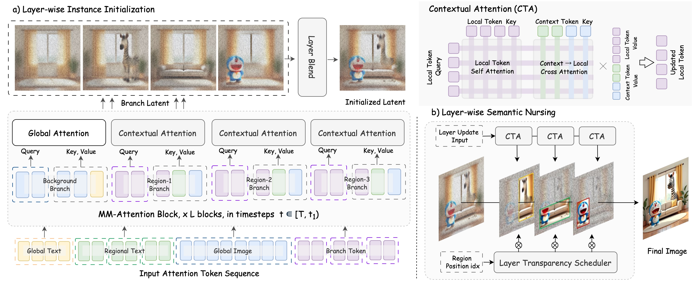

# AI Daily: Layer-wise Instance Binding for Regional and Occlusion Control in Text-to-Image Diffusion Transformers

## 論文基本信息
- **論文標題**: Layer-wise Instance Binding for Regional and Occlusion Control in Text-to-Image Diffusion Transformers
- **作者**: Ruidong Chen, Yancheng Bai, Xuanpu Zhang, Jianhao Zeng, Lanjun Wang, Dan Song, Lei Sun, Xiangxiang Chu, Anan Liu (Tianjin University, Independent Researcher)
- **發表會議/期刊**: CVPR 2026 (Accepted)
- **論文連結**: [arXiv:2603.05769](https://arxiv.org/abs/2603.05769)
- **項目主頁**: [LayerBind Project Page](https://littlefatshiba.github.io/layerbind-page)
- **研究領域**: Image Generation, Diffusion Transformers (DiT), Training-Free Control, Attention Modulation

## 核心貢獻與創新點
在文本到圖像（Text-to-Image, T2I）生成中，基於區域指令的佈局控制（Region-instructed layout control）具有極高的實用價值。然而，現有方法面臨兩大挑戰：一是基於訓練的方法會引入數據偏差並降低圖像質量；二是現有技術難以處理**遮擋順序（Occlusion order）**，限制了其實際應用。

為解決這些問題，本文提出了 **LayerBind**，這是一個**免訓練（Training-free）**且**即插即用（Plug-and-play）**的控制器，專為 Diffusion Transformers (DiTs) 設計。其核心創新點包括：
1. **基於去噪動力學的早期綁定策略**：作者觀察到空間佈局和遮擋關係在去噪的極早期階段就已確立。因此，LayerBind 將控制過程解耦為兩個階段：早期的「實例初始化（Instance Initialization）」和後續的「語義護理（Semantic Nursing）」。
2. **上下文共享的區域分支機制**：利用多模態聯合注意力（MM-Attention）的上下文共享特性，為每個區域創建獨立的實例分支，使其在關注自身區域的同時錨定共享背景。
3. **層級注意力增強與透明度調度**：在語義護理階段，通過層級局部注意力增強和透明度調度器，強化區域細節並嚴格維持遮擋順序。
4. **支持可編輯生成**：其區域分支設計天然支持靈活的修改，如更改特定區域的實例、重新排列可見順序，甚至進行合成圖像編輯。

*圖 1：LayerBind 的 Pipeline 架構圖。展示了 Layer-wise Instance Initialization 和 Layer-wise Semantic Nursing 兩個核心階段。*

## 技術方法簡述
LayerBind 的方法基於 Rectified Flow 模型和 Multimodal Diffusion Transformers (MM-DiT) 的架構特性。其核心在於通過修改注意力機制（Attention Modulation）來實現控制。

### 1. Contextual Attention (上下文注意力)
LayerBind 定義了一種「上下文注意力」操作 $\mathcal{A}_{\text{update}}$，允許局部 token（$e_{\text{local}}$）作為 Query，同時將局部 token 和上下文 token（$e_{\text{context}}$）拼接作為 Key 和 Value：
$$ \mathcal{A}_{\text{update}}(Q_{\text{local}}, [K_{\text{local}} \oplus K_{\text{context}}], [V_{\text{local}} \oplus V_{\text{context}}]) $$

### 2. Phase 1: Layer-wise Instance Initialization (層級實例初始化)
在去噪的早期階段 $t \in [T, t_1)$，模型構建獨立的實例分支 $B^{(i)}$。
- **分支更新**：每個實例分支 $e_{B^{(i)}}$ 與其對應的區域文本 $e_{T_{\text{reg}}^{(i)}}$ 進行雙向綁定，同時以共享的視覺背景 $e_{I_{\text{bg}}^{(i)}}$ 作為上下文：
  $$ \hat{e}_{B^{(i)}} \leftarrow \mathcal{A}_{\text{update}}(e_{B^{(i)}}, [e_{I_{\text{bg}}^{(i)}}, e_{T_{\text{reg}}^{(i)}}]) $$
- **硬綁定與反向適應 (Hard Binding and Reverse Adaptation)**：為了解決「模態競爭」導致小物件被忽略的問題，在文本響應強烈的層中，強制實例分支僅從自身和引導文本更新，並讓背景區域適應分支區域（為其「騰出空間」）。
- **層級分支融合 (Layer-wise Branch Blending)**：在 $t_1$ 步，根據遮擋順序將分支融合回全局潛在變量中，對於遮擋層使用可選的前景 alpha 遮罩 $\alpha_f^{(i)}$ 進行合成：
  $$ I[idx^{(i)}] \leftarrow \alpha_f^{(i)} \cdot B^{(i)} + (1 - \alpha_f^{(i)}) \cdot I[idx^{(i)}] $$

### 3. Phase 2: Layer-wise Semantic Nursing (層級語義護理)
在後續階段 $t \in (t_1, t_2]$，模型維護已建立的佈局並強化細節。
- **局部注意力增強**：計算全局注意力的同時，為每一層 $i$ 計算局部注意力增強 $\hat{e}_{\text{local}}^{(i)}$。
- **透明度調度器 (Layer Transparency Scheduler)**：按照遮擋順序（從底層到頂層），通過迭代更新將局部增強融合到全局結果中：
  $$ \hat{e}_{\text{comp}}^{(i)} = (1 - \alpha_o^{(i)}) \cdot \hat{e}_{\text{comp}}^{(i-1)} + \alpha_o^{(i)} \cdot \hat{e}_{\text{local}}^{(i)} $$
  其中 $\alpha_o^{(i)} = \beta \cdot M^{(i)}$，$\beta$ 為不透明度因子。這確保了頂層語義在重疊區域能穩健地覆蓋底層。

## 實驗結果和性能指標
LayerBind 在 FLUX.1-dev 和 SD3.5 Large 兩個主流 DiT 模型上進行了評估。

1. **遮擋控制能力**：在 T2ICompBench-3D 數據集上，LayerBind 在深度關係（UniDet）、圖文對齊（CLIP-G/L）、佈局對齊（LAcc/VQA）和遮擋感知得分（OVQA）上均達到 SOTA。
2. **複雜遮擋處理**：作者構建了包含 3-5 個對象複雜遮擋的 **BindBench** 數據集。在該數據集上，多數現有方法性能急劇下降，而 LayerBind 依然保持穩健（FLUX 版本 VQAScore 達 52.55，遠超 CreatiLayout 的 43.62 和 LaRender 的 17.72）。
3. **圖像質量**：作為免訓練方法，LayerBind 完美保留了基礎模型的生成質量，HPS 得分最高（FLUX 版本達 29.66）。
4. **推理速度**：相比於其他區域劃分生成方法（如 HybridLayout 增加 240% 耗時），LayerBind 的局部注意力機制極為高效，僅增加約 30% 的推理時間。

*圖 2：與現有方法的視覺化比較。LayerBind 在處理複雜遮擋和維持圖像質量方面表現卓越。*

## 相關研究背景
- **Layout-to-Image Generation**: 早期方法多針對 U-Net 架構（如 Stable Diffusion 1.5），包括訓練基礎模型（GLIGEN）、潛在優化和種子控制等。
- **DiT-native Controllers**: 隨著 DiT 成為主流，出現了基於訓練的適配器（如 CreatiLayout, InstanceAssemble）和免訓練的區域提示方法（如 RAGD）。但這些方法在處理對象遮擋時往往會出現「概念混合（Concept Blending）」或實例丟失。
- **Layer-wise Generation**: LaRender 是近期關注遮擋控制的方法，採用類似 NeRF 的渲染過程，但對層級提示要求嚴苛，容易導致對象缺失。LayerBind 通過上下文共享機制克服了這一缺陷。

## 個人評價和意義
LayerBind 是一篇極具啟發性的工作，特別契合當前 **Training-Free** 和 **Attention Modulation** 的研究熱點。

1. **深刻的物理直覺**：將生成過程與去噪動力學（Denoising Dynamics）結合，認識到「佈局在早期確立，細節在後期完善」，這種基於模型內在特性的設計比強行施加外部約束更加優雅且有效。
2. **解決痛點問題**：遮擋（Occlusion）一直是佈局控制中的難點。LayerBind 巧妙地將其轉化為層級（Layer-wise）的注意力調度和融合問題，不僅解決了遮擋，還順帶實現了圖層級別的可編輯性（如更改圖層順序）。
3. **對 VAR/Zero-shot 研究的啟發**：
   - **Zero-shot 遷移性**：LayerBind 作為即插即用的模塊，展現了強大的 Zero-shot 控制能力。這種通過修改 Attention 權重和信息流向（Contextual Attention）來實現控制的思路，完全可以借鑒到 Visual Autoregressive (VAR) 模型中。
   - **VAR 模型的佈局控制**：在 VAR 模型中，token 是按尺度（Scale）或空間順序生成的。借鑒 LayerBind 的思想，或許可以在 VAR 的早期尺度（Low-resolution scales）引入類似的「實例分支」進行佈局初始化，然後在後續高分辨率尺度進行「語義護理」，從而實現 VAR 架構下的免訓練佈局與遮擋控制。

總之，LayerBind 在理論洞察和工程實現上都非常出色，為 DiT 時代的可控生成提供了一個強大且靈活的新範式。
