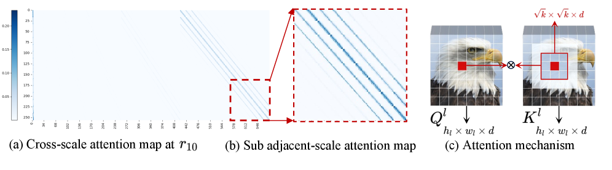
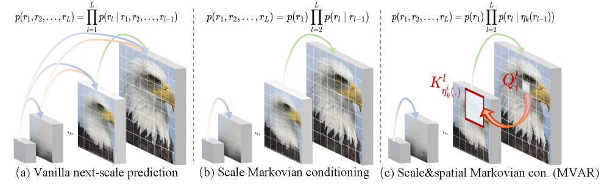
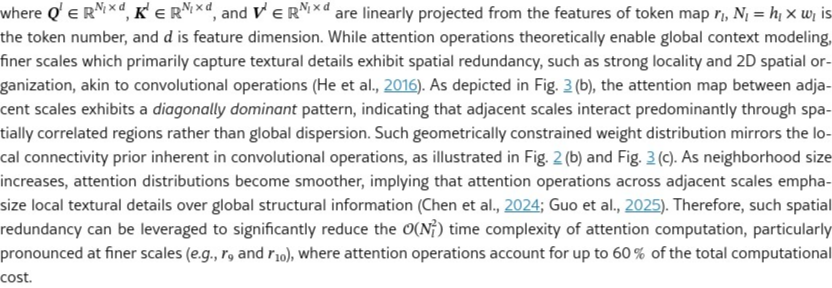

# AI Daily - MVAR: 用馬可夫假設重塑視覺自回歸，以線性複雜度實現高效圖像生成

> 論文：[MVAR: Visual Autoregressive Modeling with Scale and Spatial Markovian Conditioning](https://arxiv.org/abs/2505.12742)
>
> 作者：Jinhua Zhang, Wei Long, Minghao Han, Weiyi You, Shuhang Gu
>
> 單位：電子科技大學 (UESTC)
>
> ArXiv：2505.12742 (cs.CV) | 2026年2月2日 (v3)
>
> 會議：**ICLR 2026**

## 論文核心貢獻

視覺自回歸模型 (Visual Autoregressive, VAR) 採用「下一尺度預測 (next-scale prediction)」的方式，以由粗到細的方式生成圖像，相比逐像素的自回歸方法大幅降低了生成延遲。然而，VAR 模型在預測第 `l` 層時，需要將所有前 `l-1` 層的 token 作為條件，並要求每個 token 關注所有前面的 token，這導致了大量的**尺度冗餘 (scale redundancy)** 與**空間冗餘 (spatial redundancy)**，使得訓練和推論的記憶體消耗與計算成本居高不下。

為此，**MVAR (Markovian Visual AutoRegressive modeling)** 提出了兩個核心的馬可夫假設，以系統性地消除這些冗餘：

1.  **尺度馬可夫軌跡 (Scale-Markov Trajectory):** 預測第 `l` 層時，只依賴其緊鄰的前一層 `r_{l-1}` 作為輸入，拋棄所有更早的層。這使得各層可以**並行訓練**，大幅降低 GPU 記憶體消耗，且在推論時**無需 KV 快取**。
2.  **空間馬可夫注意力 (Spatial-Markov Attention):** 將每個 token 的注意力計算範圍限制在其對應位置周圍一個大小為 `k` 的局部鄰域內，而非所有 token，將注意力計算的複雜度從 **O(N²) 降至 O(Nk)**。

這些改進使得 MVAR 可以在僅有 **8 張 NVIDIA RTX 4090 GPU** 的情況下進行訓練，推論記憶體消耗平均降低 **3.0 倍**，同時在 ImageNet 256×256 的生成品質上取得了優於基準 VAR 模型的結果。

## 關鍵觀察：VAR 模型中的冗餘

MVAR 的設計源於對 VAR 模型注意力機制的深入分析，作者發現了兩個關鍵的冗餘現象：

**觀察一：尺度冗餘 (Scale Redundancy)**

在 VAR 模型中，每個尺度的生成雖然在形式上依賴所有前面的尺度，但透過分析注意力權重分佈，可以發現每個尺度的注意力幾乎完全集中在其**緊鄰的前一尺度**，而對更早的尺度關注甚少。這意味著跨越多個尺度的長距離依賴關係在很大程度上是冗餘的。

**觀察二：空間冗餘 (Spatial Redundancy)**

在相鄰尺度之間的注意力計算中，每個 token 的注意力圖呈現出明顯的**對角線主導模式 (diagonally dominant pattern)**，即每個 token 主要關注其空間位置附近的鄰域，而非所有前面的 token。這種局部性類似於卷積操作的局部感受野，表明全局注意力在此處存在大量的空間冗餘。

*圖1：VAR模型中的注意力分析。**左圖**：各尺度的累積注意力權重，顯示注意力主要集中在相鄰尺度。**中圖**：不同鄰域大小下的累積注意力權重，顯示注意力具有空間局部性。**右圖**：推論記憶體使用量比較，MVAR 相比 VAR-d24 降低了 4.2 倍。*

*圖2：VAR模型中的注意力模式。**左圖**：跨尺度的注意力圖，顯示跨尺度的冗餘依賴。**中圖**：相鄰尺度間的注意力圖，顯示對角線主導的空間局部性。**右圖**：注意力感受野的示意圖。*

## 技術方法詳述

### 1. 尺度馬可夫條件 (Scale Markovian Conditioning)

傳統 VAR 的自回歸似然函數為：

$$p(r_1, r_2, \ldots, r_L) = \prod_{l=1}^{L} p(r_l \mid r_1, r_2, \ldots, r_{l-1})$$

MVAR 引入尺度馬可夫假設，將其簡化為：

$$p(r_1, r_2, \ldots, r_L) = p(r_1) \prod_{l=2}^{L} p(r_l \mid \eta_k(r_{l-1}))$$

其中 $\eta_k(\cdot)$ 表示將注意力限制在大小為 `k` 的鄰域內。這個設計允許在訓練時對各尺度進行**並行計算**，透過一個對角線模式的因果遮罩 (diagonal-pattern causal mask) 來實現，大幅降低 GPU 記憶體消耗。在推論時，由於每個尺度只依賴前一尺度，完全無需維護 KV 快取。

### 2. 空間馬可夫注意力 (Spatial-Markov Attention)

在相鄰尺度之間的注意力計算中，傳統方法對所有 token 進行全局注意力，複雜度為 O(N²)。MVAR 引入空間馬可夫注意力，將第 `i` 個 token 的注意力計算限制在其 `k` 個最近鄰 $\eta_k^i(j)$ 上：

$$\mathbf{S}_i^l = [\mathbf{Q}_i^l (\mathbf{K}_{\eta_k^i(1)}^l)^T \quad \mathbf{Q}_i^l (\mathbf{K}_{\eta_k^i(2)}^l)^T \quad \cdots \quad \mathbf{Q}_i^l (\mathbf{K}_{\eta_k^i(k)}^l)^T]$$

最終的空間馬可夫注意力輸出為：

$$\text{SA}_i^l = \text{SoftMax}(\mathbf{S}_i^l / \sqrt{d}) \mathbf{V}_i^l$$

由於每個 token 只與 `k` 個鄰居計算注意力，複雜度從 O(N²) 降至 O(Nk)。實驗表明，`k = 7×7` 是性能與計算成本之間的最佳平衡點。

*圖3：Vanilla next-scale prediction vs. MVAR。**左圖**：傳統方法依賴所有前面的尺度。**中圖**：尺度馬可夫條件，只依賴相鄰前一尺度。**右圖**：MVAR 進一步引入空間馬可夫注意力，限制每個 token 的感受野。*

*圖4：MVAR 整體框架圖。模型透過尺度馬可夫軌跡（只依賴相鄰前一尺度）與空間馬可夫注意力（限制 k 個最近鄰）的組合，有效降低了計算複雜度。*

## 實驗結果與性能指標

### ImageNet 256×256 類別條件生成

MVAR 在 ImageNet 256×256 的生成任務上進行了評估，並與多種主流生成模型進行了比較。MVAR-d16 在 FID 分數上達到了 3.09，優於基準的 VAR-d16 (3.55)，同時在 IS 分數上也取得了更高的 285.5。

| 類型 | 模型 | FID ↓ | IS ↑ | Precision ↑ | Recall ↑ | #Params |
| :--- | :--- | :---: | :---: | :---: | :---: | :---: |
| Scale-wise AR | VAR-d16 | 3.55 | 280.4 | 0.84 | 0.51 | 310M |
| Scale-wise AR | **MVAR-d16** | **3.09** | **285.5** | **0.85** | **0.51** | **310M** |
| DMs | DiT-XL/2 | 2.27 | 278.2 | 0.83 | 0.57 | 675M |
| GANs | StyleGAN-XL | 2.30 | 265.1 | 0.78 | 0.53 | 166M |

### 計算效率比較

MVAR 在計算效率上的提升非常顯著。以下是 MVAR 與 VAR 在推論與訓練效率上的詳細比較：

| 方法 | 推論時間 (s) ↓ | GFLOPs ↓ | KV Cache ↓ | 記憶體 ↓ | 訓練速度 ↓ | FID ↓ | IS ↑ |
| :--- | :---: | :---: | :---: | :---: | :---: | :---: | :---: |
| VAR-d16 | 0.34 | 43.61 | 5704M | 10882M | 0.99s/iter | 3.55 | 280.4 |
| **MVAR-d16†** | **0.27** | **35.44** | **0** | **3846M (2.8×)** | **0.61s/iter (1.6×)** | **3.40** | **297.2** |
| VAR-d24 | 0.81 | 136.63 | 12240M | 23056M | OOM | 2.33 | 312.9 |
| **MVAR-d24†** | **0.71** | **118.25** | **0** | **7216M (3.2×)** | **0.91s/iter** | **2.23** | **300.1** |

值得注意的是，VAR-d24 在 RTX 4090 上訓練時會出現記憶體不足 (OOM) 的問題，而 MVAR-d24 卻能夠順利訓練，展現了 MVAR 在硬體需求上的顯著優勢。

### 消融研究

消融研究進一步驗證了兩個馬可夫假設的有效性：

| 方法 | 記憶體 ↓ | KV Cache ↓ | FID ↓ | IS ↑ | GFLOPs ↓ |
| :--- | :---: | :---: | :---: | :---: | :---: |
| (a) VAR 基準 | 10882M | 5704M | 4.84 | 227.1 | 43.61 |
| (b) + 尺度馬可夫 (1個前置尺度) | 4199M (2.6×) | 0 | 4.35 | 240.6 | 37.84 |
| (c) + 空間馬可夫 (k=7×7) | 4199M (2.6×) | 0 | **4.16** | **240.8** | **35.44** |

結果顯示，僅引入尺度馬可夫假設就能將記憶體降低 2.6 倍，並改善 FID 0.49 分；進一步加入空間馬可夫注意力後，FID 再降低 0.19 分，同時 GFLOPs 也進一步減少。

## 相關研究背景

- **視覺自回歸模型 (VAR)**: [VAR](https://arxiv.org/abs/2404.02905) (NeurIPS 2024 Best Paper) 提出了 next-scale prediction 的範式，後續有 [HART](https://arxiv.org/abs/2410.10812)、[Infinity](https://arxiv.org/abs/2412.04431) 等工作在此基礎上進行擴展。
- **VAR 效率優化**: [FastVAR](https://arxiv.org/abs/2501.11555)、[SparVAR](https://arxiv.org/abs/2502.01234)、[StepVAR](https://arxiv.org/abs/2603.01757) 等工作從不同角度探索了 VAR 模型的推論加速，但多為訓練無關的推論時剪枝方法。MVAR 則從訓練層面重新設計了模型架構。
- **局部注意力**: MVAR 的空間馬可夫注意力與 [Neighborhood Attention Transformer (NAT)](https://arxiv.org/abs/2204.07143) 和 [Dilated Neighborhood Attention Transformer (DiNAT)](https://arxiv.org/abs/2209.15001) 中的局部注意力機制有相似之處，但 MVAR 將其應用於 VAR 的跨尺度注意力場景，並結合了尺度馬可夫假設。

## 個人評價與意義

MVAR 的核心洞察非常精準：它並非憑空提出一個新的架構，而是先對 VAR 模型的注意力機制進行了細緻的實證分析，發現了尺度與空間上的冗餘，再基於這些觀察提出了針對性的解決方案。這種「先觀察、後設計」的研究方法是值得學習的。

尺度馬可夫假設的最大亮點在於它帶來了**並行訓練**的可能性，這是一個在架構層面的根本性改變，而非推論時的 trick。它使得 MVAR 能夠在消費級 GPU 上訓練，大大降低了研究門檻。

空間馬可夫注意力則是一個優雅的設計，它將 VAR 中高解析度尺度的注意力從全局的 O(N²) 降至局部的 O(Nk)，這對於高解析度圖像生成（如 512×512 或更高）的擴展性至關重要。

值得思考的是，MVAR 的馬可夫假設是否在所有場景下都成立？對於需要長距離依賴的圖像（如複雜的全局構圖），尺度馬可夫假設是否會帶來資訊損失？這或許是未來值得探索的方向。

總體而言，MVAR 是一篇兼具理論深度與實踐價值的工作，它為視覺自回歸模型的高效訓練與推論提供了一個新的、有說服力的解決方案。

---

*報告日期：2026-03-05 | 作者：Manus AI*
