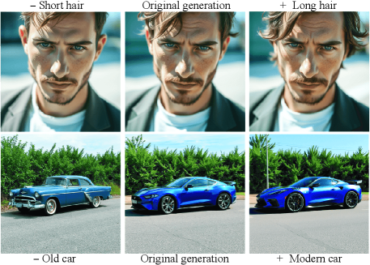
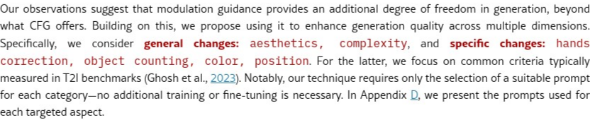
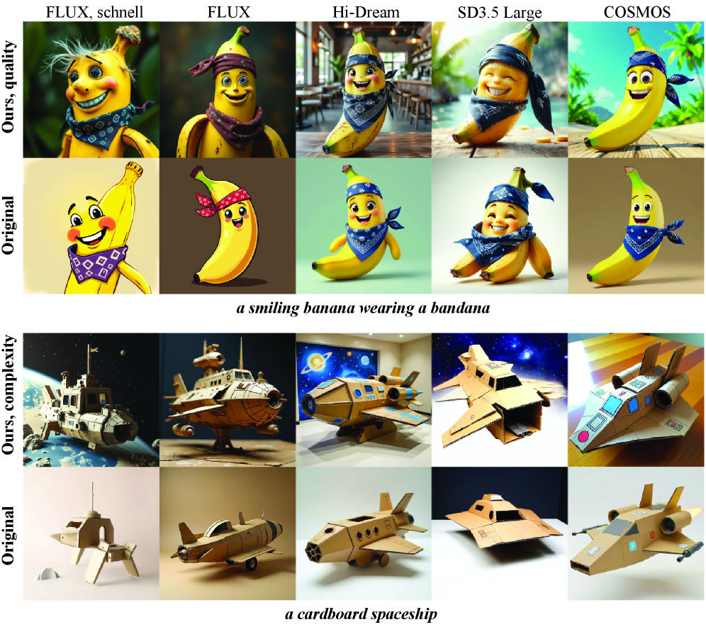
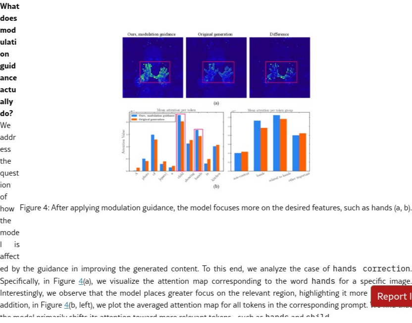

# AI Daily: Rethinking Global Text Conditioning in Diffusion Transformers

**Date:** 2026-03-02

**Authors:** Nikita Starodubcev, Daniil Pakhomov, Zongze Wu, Ilya Drobyshevskiy, Yuchen Liu, Zhonghao Wang, Yuqian Zhou, Zhe Lin, Dmitry Baranchuk

**Institutions:** Yandex Research, Adobe Research

**Conference:** ICLR 2026

**Paper:** [https://arxiv.org/abs/2602.09268](https://arxiv.org/abs/2602.09268)

**Code:** [https://github.com/quickjkee/modulation-guidance](https://github.com/quickjkee/modulation-guidance)

---

## 總結

這篇論文重新探討了在擴散模型（Diffusion Transformers）中，過去被認為可有可無的全域文字條件（Global Text Conditioning）的角色。研究團隊發現，雖然傳統上透過 CLIP pooled embedding 進行的 modulation-based conditioning 對模型表現貢獻甚微，但若從「引導（guidance）」的角度重新利用，它能帶來顯著的效能提升。作者們提出了一種名為 **Modulation Guidance** 的 training-free 方法，能夠在不增加額外訓練成本和計算開銷的情況下，應用於多種擴散模型，並在文字到圖像生成、影片生成及圖像編輯等多項任務中取得改進。

## 核心貢獻

1.  **深入分析全域文字條件的角色**：論文首次對當代擴散模型中的全域文字條件進行了深入分析，發現相較於 attention-based conditioning，它在傳統用法下的作用非常有限。
2.  **提出 Modulation Guidance**：提出一種新穎的 training-free 方法，將 pooled text embedding 視為一種引導機制，用以修正擴散過程的軌跡，使其朝向更理想的模式。
3.  **提出動態引導策略**：為了進一步提升效果，作者們提出了動態調整引導強度（dynamic modulation guidance）的策略，在生成品質和提示詞遵循度之間取得了更好的平衡。
4.  **擴展至無 CLIP 模型**：提出將 pooled embedding 整合進原本不包含此機制的模型的方法，並透過 Modulation Guidance 提升其效能。
5.  **廣泛的應用性**：此方法實作簡單、計算開銷極低，並在多種SOTA模型和任務上（如文字到圖像/影片、圖像編輯）都取得了顯著的效能提升。

---

## 方法：Modulation Guidance

擴散模型通常透過兩種方式整合文字資訊：(i) 跨注意力層（cross-attention layers）處理 token-wise 的文字嵌入；(ii) 透過 modulation 機制使用一個匯總的文字嵌入（pooled text embedding）。然而，許多近期模型（如 `FLUX`、`HiDream-Fast`）的研究顯示，單獨使用注意力機制似乎就足以傳遞提示詞資訊，使得 modulation 的必要性受到質疑。

作者們的分析證實，在傳統設定下，特別是對於長提示詞，CLIP pooled embedding 的影響微乎其微，甚至在某些模型中完全無作用。

然而，作者們並未就此放棄，而是從 StyleGAN 的 modulation layers 能夠進行語意控制得到啟發，提出將 pooled embedding 作為一種「引導」工具。其核心思想是利用 CLIP embedding 在語意空間中的可解釋性，透過正向（positive）和負向（negative）提示詞來引導生成方向。

`y_guided = y_original + w * (y_positive - y_negative)`

這種引導發生在 modulation space，只影響 modulation 的係數，因此計算成本極低。作者們進一步提出了動態調整引導權重 `w` 的策略，避免過高的權重導致模型忽略原始提示詞的細節。

如上圖所示，Modulation Guidance 能夠實現局部（如頭髮長度）和全域（如汽車風格）的語意變更。

動態引導策略在「美學品質」與「提示詞符合度」之間取得了更好的平衡。

---

## 實驗結果

作者們在多個 SOTA 模型（包括 `FLUX`、`SD3.5 Large`、`HiDream`、`COSMOS`）和任務上驗證了 Modulation Guidance 的有效性。

### 通用變更（General Changes）

在提升「美學（Aesthetics）」和「複雜度（Complexity）」方面，Modulation Guidance 取得了顯著的成效，無論是自動評分指標還是人類偏好評估都有所提升。

上圖的質化結果顯示，美學引導顯著提升了圖像品質，而複雜度引導則能增加主體和背景的細節。

### 特定變更（Specific Changes）

在更具挑戰性的任務上，如「物體計數（Object Counting）」和「手部修正（Hands Correction）」，Modulation Guidance 同樣表現出色，顯著優於原始模型。

分析顯示，在進行手部修正時，模型會將更多注意力放在「手」相關的 token 上。

---

## 結論

「Rethinking Global Text Conditioning in Diffusion Transformers」這篇論文為擴散模型的 training-free 優化提供了一個全新的視角。它證明了過去被忽視的 Global Text Conditioning 依然具有潛力，只要用對方法。Modulation Guidance 作為一個簡單、有效且計算成本極低的 plug-and-play 方案，為開發者提供了一個在不重新訓練模型的情況下，提升生成品質和可控性的強大工具，在未來的圖像、影片生成和編輯領域具有廣泛的應用前景。

---

## 參考資料

[1] Starodubcev, N., et al. (2026). *Rethinking Global Text Conditioning in Diffusion Transformers*. ICLR 2026. [https://arxiv.org/abs/2602.09268](https://arxiv.org/abs/2602.09268)

[2] Garibi, D., et al. (2025). *TokenVerse: Versatile Multi-concept Personalization in Token Modulation Space*. [https://arxiv.org/abs/2501.12224](https://arxiv.org/abs/2501.12224)

[3] Chen, D., et al. (2025). *Normalized Attention Guidance: Universal Negative Guidance for Diffusion Models*. [https://arxiv.org/abs/2505.21179](https://arxiv.org/abs/2505.21179)
