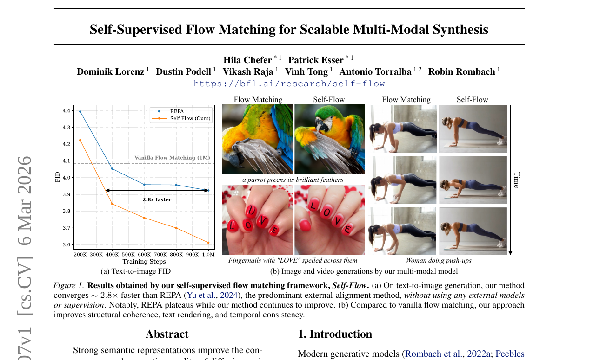
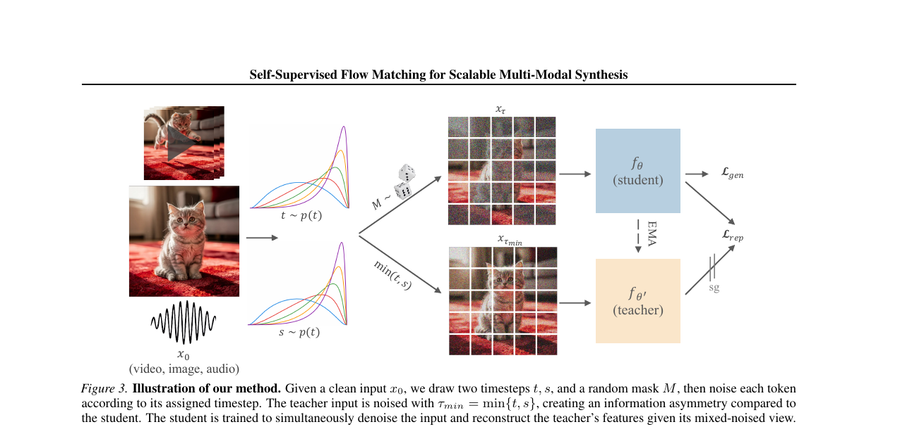
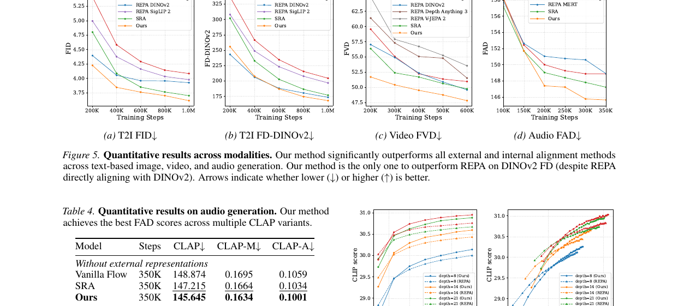

# AI Daily: Self-Supervised Flow Matching for Scalable Multi-Modal Synthesis

## 論文基本信息

| 欄位 | 內容 |
|------|------|
| **論文標題** | Self-Supervised Flow Matching for Scalable Multi-Modal Synthesis |
| **作者** | Hila Chefer\*, Patrick Esser\*, Dominik Lorenz, Dustin Podell, Vikash Raja, Vinh Tong, Antonio Torralba, Robin Rombach |
| **研究機構** | Black Forest Labs, MIT |
| **發表時間** | 2026年3月6日 (arXiv) |
| **論文鏈接** | [arXiv:2603.06507](https://arxiv.org/abs/2603.06507) |
| **項目主頁** | [bfl.ai/research/self-flow](https://bfl.ai/research/self-flow) |

## 核心貢獻與創新點

在當前的生成模型研究中，為了提升生成質量和收斂速度，許多研究（如 REPA）依賴於外部預訓練模型（如 DINOv2）來對齊內部特徵。然而，這種依賴外部模型的方法存在三個根本性限制：需要獨立訓練且目標不一致、出現意外的縮放行為（更強的編碼器反而導致生成質量下降），以及難以跨模態泛化。

為了解決這些問題，Black Forest Labs（FLUX 系列的創作者）與 MIT 的研究團隊提出了 **Self-Flow**。這是一個全新的自監督 Flow Matching 範式，其核心創新在於將表示學習（Representation Learning）直接整合到生成框架內部，完全無需外部監督。

| 貢獻 | 說明 |
|------|------|
| **Dual-Timestep Scheduling** | 對不同 token 應用異構噪聲水平，創造信息不對稱，迫使模型從較乾淨的 token 中推斷被嚴重破壞的 token 信息 |
| **統一多模態框架** | 自然推廣到圖像、視頻和音頻等多種模態，支持聯合多模態訓練 |
| **符合預期的 Scaling Laws** | 隨著模型規模增加，性能呈現穩定的線性提升，無需外部對齊 |

*圖 1：Self-Flow 框架在文本到圖像生成上的收斂速度比依賴外部對齊的 REPA 快約 2.8 倍，且在結構一致性、文字渲染和時間一致性上顯著優於標準 Flow Matching。*

## 技術方法簡述

### Flow Matching 基礎
Flow Matching 模型通過建模連續時間概率路徑，學習將簡單噪聲分佈傳輸到數據分佈。給定乾淨數據 $x_0 \in \mathbb{R}^{N \times C}$ 和噪聲 $x_1 \sim \mathcal{N}(0, \mathbf{I})$，定義插值路徑為：
$$ x_t = (1 - t)x_0 + t x_1, \quad t \in [0, 1] $$
模型 $f_\theta(x_t, t)$ 被訓練來預測速度場 $v_t = x_1 - x_0$，其生成損失為：
$$ \mathcal{L}_{gen} = \mathbb{E}_{x_0, x_1, t} \| f_\theta(x_t, t) - (x_1 - x_0) \|^2 $$

### Dual-Timestep Scheduling（核心創新）

標準的 Flow Matching 對所有 token 應用均勻的噪聲，這通常會退化為一個可以通過局部相關性解決的去噪任務。為了鼓勵模型學習更強的全局表示，作者引入了 **Dual-Timestep Scheduling**。

具體步驟如下：

1. 從噪聲分佈中採樣兩個時間步：$t, s \sim p(t)$
2. 採樣一個掩碼 $M = \{i \in \{1, \ldots, N\} \mid u_i < \mathcal{R}_M\}$，其中 $u_i \overset{\text{iid}}{\sim} \mathcal{U}(0,1)$，掩碼比例 $\mathcal{R}_M \leq 0.5$
3. 構建雙時間步向量 $\tau \in \mathbb{R}^N$：

$$\tau^i = \begin{cases} s & \text{if } i \in M \\ t & \text{otherwise} \end{cases}$$

4. 生成異構噪聲輸入：$x_\tau = \text{diag}(\mathbf{1} - \tau) x_0 + \text{diag}(\tau) x_1$

這種機制創造了**信息不對稱**：較高噪聲的 token 需要依賴較低噪聲（更乾淨）的 token 來推斷信息，從而促使模型建立超越局部性的全局連接。

### Self-Flow 完整框架

基於上述調度，Self-Flow 維護兩個網絡：學生網絡 $f_\theta$ 接收異構噪聲輸入 $x_\tau$，EMA 教師網絡 $f_{\theta'}$ 則接收更乾淨的輸入 $x_{\tau_{min}}$（其中 $\tau_{min} = \min(t, s)$）。

表示對齊損失定義為學生與教師特徵之間的餘弦相似度（選擇 $l < k$）：

$$\mathcal{L}_{rep} = -\mathbb{E}_{x_0, x_1, \tau} \cos\left( h_\theta^{(l)}(x_\tau, \tau),\ f_{\theta'}^{(k)}(x_{\tau_{min}}, \tau_{min}) \right)$$

最終的總損失為生成損失與表示對齊損失的加權和：

$$\mathcal{L} = \mathcal{L}_{gen} + \gamma \cdot \mathcal{L}_{rep}$$

*圖 2：Self-Flow 方法示意圖。通過 Dual-Timestep Scheduling 創造信息不對稱，學生網絡在去噪的同時，還需要重建教師網絡在更乾淨視角下的特徵。*

## 實驗結果與性能指標

研究團隊在 ImageNet（類別條件）、文本到圖像（T2I）、文本到視頻（T2V）和文本到音頻（T2A）等多個任務上進行了廣泛評估，使用 ~625M 參數的 FLUX.2 骨幹網絡。

### ImageNet 256×256 類別條件生成

| 模型 | Steps | FID↓ | sFID↓ | IS↑ | Pre.↑ | Rec.↑ |
|------|-------|------|-------|-----|-------|-------|
| SiT-XL/2 | 7M | 8.3 | 6.30 | 130.57 | 0.69 | 0.67 |
| SRA | 4M | 7.27 | 5.87 | 143.06 | 0.69 | 0.68 |
| **Ours** | **4M** | **5.70** | **4.97** | **151.40** | **0.72** | 0.67 |
| REPA | 4M | 5.89 | 5.73 | 157.66 | 0.70 | **0.69** |

### 文本到圖像生成 (T2I, FLUX.2 骨幹)

在 1M 訓練步時，Self-Flow 達到了 **3.61 的 FID**，顯著優於標準 Flow Matching (4.08) 和依賴 DINOv2 的 REPA (3.92)。更重要的是，Self-Flow 的收斂速度比 REPA 快約 2.8 倍。

| 模型 | Steps | FID↓ | FD-DINO↓ | CLIP↑ |
|------|-------|------|----------|-------|
| Vanilla Flow | 1M | 4.08 | 204.49 | 30.66 |
| SRA | 1M | 3.70 | 176.79 | 30.78 |
| **Ours** | **1M** | **3.61** | **167.98** | **30.88** |
| REPA | 1M | 3.92 | 173.35 | 30.67 |

### 跨模態與 Scaling 表現

視頻生成方面，在 FVD 指標上，Self-Flow (47.81) 大幅領先於標準 Flow Matching (50.95) 和 REPA (49.59)。音頻生成方面，在 FAD 指標上同樣取得了最佳表現。Scaling 行為方面，隨著模型參數從 290M 增加到 1B，Self-Flow 的性能呈現穩定的線性提升，而 REPA 則出現了收益遞減的現象——625M 參數的 Self-Flow 模型甚至超越了 1B 參數的 REPA 模型。

*圖 3：跨模態定量評估結果。Self-Flow 在圖像、視頻和音頻生成任務上均顯著優於所有外部和內部對齊方法。*

## 相關研究背景

近年來，提升擴散模型和 Flow Matching 模型生成質量的主要途徑之一是**特徵對齊（Feature Alignment）**。代表性工作如 **REPA** (Yu et al., 2024) 提出將擴散模型的內部特徵與預訓練的 DINOv2 特徵進行對齊。然而，這類方法高度依賴於外部編碼器的質量和領域。例如，DINOv2 在 ImageNet 上表現優異，但在視頻或音頻領域則難以發揮作用，甚至可能損害性能。

Self-Flow 的提出，標誌著從「依賴外部先驗」向「模型內部自監督學習」的重要轉變，這與大語言模型（LLM）中通過 Next-token prediction 自然湧現出強大表示能力的理念不謀而合。

## 個人評價與意義

Self-Flow 是一篇極具啟發性的重量級論文，來自 FLUX 系列的創作者 Black Forest Labs，作者陣容包括 Stable Diffusion 的核心作者 Robin Rombach 和 MIT 的 Antonio Torralba。它直擊了當前生成模型依賴外部特徵對齊的痛點，提出了一種優雅且極具通用性的解決方案。

**對 Training-free 研究的啟發：** 雖然 Self-Flow 本身是一個訓練框架，但它實現了對「外部監督信號」的免除——不再需要訓練或維護外部 Encoder，大大簡化了多模態基礎模型的訓練流程。這種「通過設計訓練目標來隱式引導模型行為」的思路，可以啟發我們在 Training-free 推理階段設計類似的 Attention 操作。

**對 Attention Modulation 的啟發：** Dual-Timestep Scheduling 通過創造信息不對稱，本質上是在引導 Attention 機制——迫使高噪聲 token 的 Attention 權重集中在低噪聲 token 上，從而隱式地實現了強大的全局上下文建模。這與 Attention Modulation 的目標高度一致：通過控制 Attention 的流向來控制生成過程。

**對 VAR 和 Zero-shot 研究的啟發：** 這種通過掩碼和異構噪聲構建自監督信號的思路，完全可以借鑒到 Visual Autoregressive (VAR) 模型中。在 VAR 的多尺度預測中，可以人為構造尺度間的信息不對稱（例如，讓粗粒度尺度的 token 觀察更少的噪聲，而細粒度尺度的 token 觀察更多的噪聲），進一步增強 VAR 模型的 Zero-shot 泛化能力和表示學習能力。

這項工作證明了，只要設計出合適的自監督目標（如 Dual-Timestep），生成模型完全有能力在內部湧現出超越專門判別模型的語義表示能力。這無疑為下一代多模態基礎模型（如 FLUX 的後續版本）指明了方向。

---

*Report generated on 2026-03-09 | [Back to Index](../../../../README.md)*
