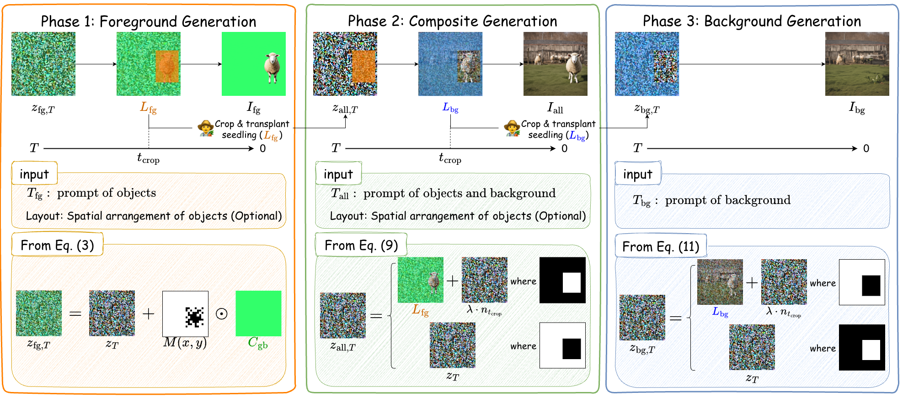

# AI Daily

## TAUE: Training-free Noise Transplant and Cultivation Diffusion Model

**Authors:** Daichi Nagai, Ryugo Morita, Shunsuke Kitada, Hitoshi Iyatomi (Hosei University, RPTU Kaiserslautern-Landau & DFKI GmbH)
**Conference:** CVPR 2026 Findings
**Paper Link:** [arXiv:2511.02580](https://arxiv.org/abs/2511.02580)

### 1. 核心發現與總結

TAUE (Training-free Noise Transplantation and Cultivation Diffusion Model) 是一個創新的**免訓練 (training-free)** 層次化圖像生成框架。傳統的文本到圖像擴散模型通常只能生成單層的扁平圖像，這在需要層次控制的專業應用（如設計、動畫）中是一個重大瓶頸。現有的解決方案大多依賴於使用大型專有數據集進行微調，或者僅能生成孤立的前景而無法生成完整的場景。

TAUE 透過在擴散過程中重用中間潛在變量（intermediate latents）來解決這個問題。它將前景生成過程中的中間噪聲「移植 (transplant)」到後續的生成過程中，從而保持層次間的結構連續性。同時，TAUE 引入了**跨層注意力共享 (cross-layer attention sharing)** 機制，使前景和背景之間能夠交換語義信息，確保場景級別的連貫性和上下文對齊。實驗證明，TAUE 在免訓練方法中達到了最先進的性能，其圖像質量可與微調模型媲美，並支持佈局感知編輯、多對象組合和背景替換等實際應用。

### 2. 關鍵技術與方法

TAUE 的生成過程分為三個階段：

1.  **前景生成 (Foreground Generation):**
    首先根據前景提示詞生成孤立的前景對象。在此過程中，模型會在特定的去噪步數（例如總步數的 50%）提取中間潛在變量 $L_{fg}$，這個變量編碼了對象的幾何和語義結構。為了更好地控制佈局，TAUE 引入了概率佈局掩碼 (probabilistic layout mask)，避免了傳統二值掩碼帶來的邊緣偽影。

2.  **複合生成 (Composite Generation):**
    將提取的 $L_{fg}$ 移植到新的初始噪聲中。為了實現前景和背景的語義連貫，TAUE 使用了**跨層注意力共享 (Cross-Attention Shearing)**。具體來說，前景提示詞僅應用於對象區域，而背景提示詞應用於其餘區域。通過像素級的凸組合，混合跨注意力張量 $A_{mix}$，確保前景和背景在各自區域內佔主導地位。此外，還應用了拉普拉斯高斯濾波器 (Laplacian high-pass filter) 來增強空間細節。

3.  **背景生成 (Background Generation):**
    此階段與複合生成類似，但反轉了對象掩碼。將複合生成階段提取的背景潛在變量 $L_{bg}$ 移植到互補區域，並應用相同的噪聲控制方案來生成與複合層一致的背景。在此階段，背景交叉注意力 $A_{bg}$ 應用於所有空間位置，以全局優化整個場景的光照、顏色和上下文和諧度。

*圖 1: 跨層注意力共享機制示意圖。前景提示詞應用於對象區域，背景提示詞應用於非對象區域，確保前景與背景的無縫融合。*

### 3. 實驗結果與應用

TAUE 在 MS-COCO 數據集的子集上進行了評估，並與微調模型 LayerDiffuse 和免訓練模型 Alfie 進行了比較。

*   **定量結果:** TAUE 在所有免訓練方法中取得了最佳的圖像質量（FID 60.53, CLIP-S 0.323）。在整體質量上，它甚至在 FID 和 CLIP-S 指標上超越了微調的 LayerDiffuse 模型。在層次重建方面，TAUE 實現了最高的前景準確度（PSNR 20.46, SSIM 0.901）。
*   **定性結果:** 與 Alfie 相比，TAUE 避免了前景特徵滲入背景的問題；與 LayerDiffuse 相比，TAUE 展現了更好的語義協調性和更少的光照/陰影不一致。

**實際應用場景:**
1.  **佈局與尺寸控制 (Layout and Size Control):** 通過注入邊界框約束，用戶可以精確指定前景對象的位置和比例。
2.  **解耦的多對象生成 (Disentangled Multi-Object Generation):** 將種子噪聲移植到潛在空間的多個位置，可以在單次去噪過程中同時生成多個語義獨立且組合連貫的對象，避免了屬性糾纏。
3.  **背景替換 (Background Replacement):** 由於前景和背景生成是解耦的，保留前景的種子噪聲即可獨立合成新背景，而不會改變前景的外觀和佈局。

### 4. 結論

TAUE 提供了一個優雅且高效的免訓練解決方案，用於層次化圖像生成。通過噪聲移植和跨層注意力共享，它在不依賴額外數據或微調的情況下，實現了高質量的多層次圖像合成。這項技術為擴散模型在專業創意工作流程中的應用開闢了新的可能性，特別是在需要精細佈局控制和層次編輯的場景中。

### References
[1] Daichi Nagai, Ryugo Morita, Shunsuke Kitada, Hitoshi Iyatomi. "TAUE: Training-free Noise Transplant and Cultivation Diffusion Model". arXiv preprint arXiv:2511.02580 (2026). [Link](https://arxiv.org/abs/2511.02580)
