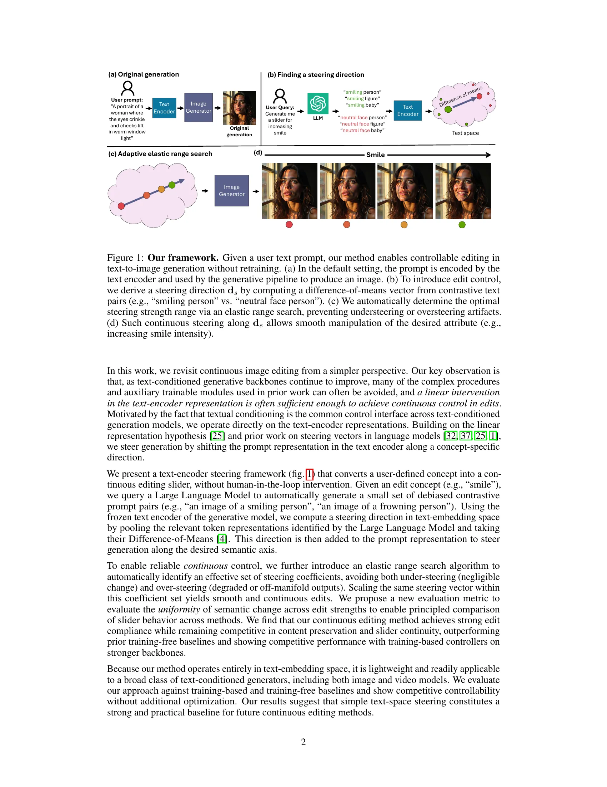
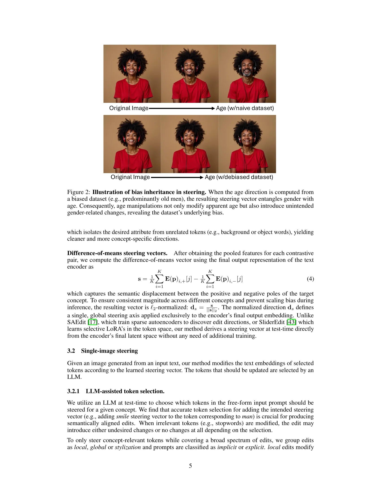
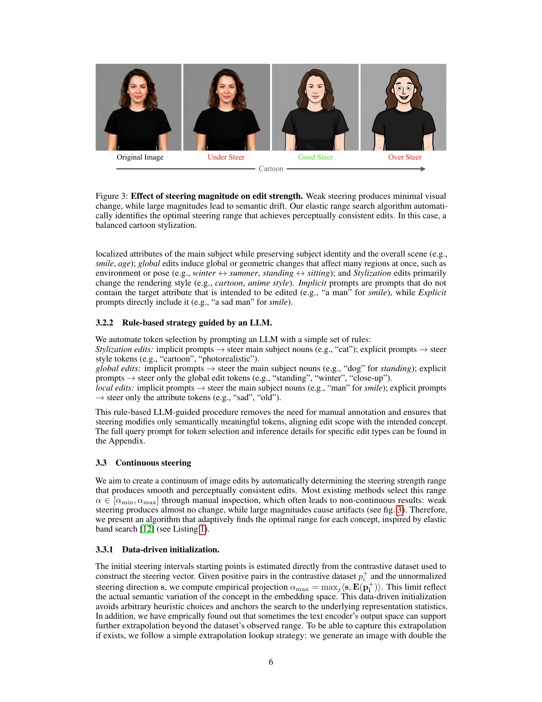
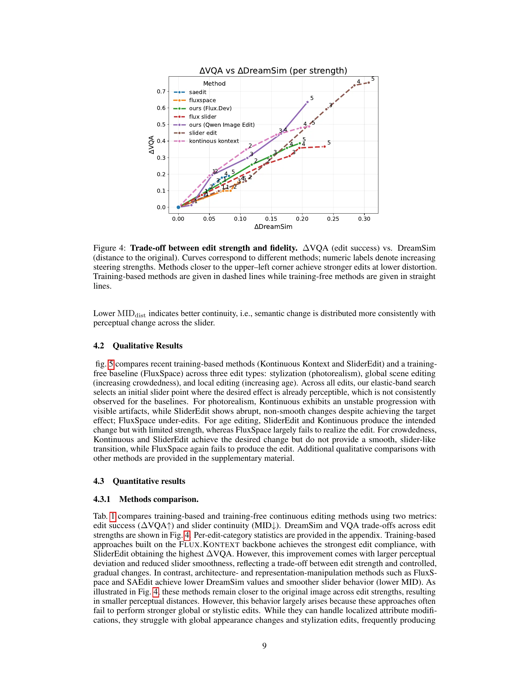
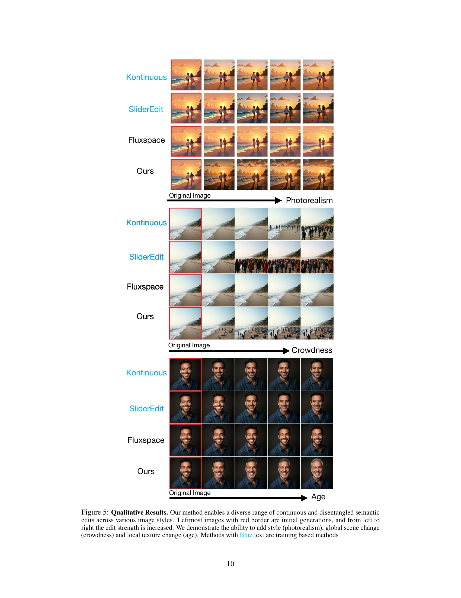

# AI Daily: The Unreasonable Effectiveness of Text Embedding Interpolation for Continuous Image Steering

**日期**: 2026-03-21
**主題**: Training-Free Continuous Image Editing, Text Embedding Steering, Flow Matching
**論文**: [The Unreasonable Effectiveness of Text Embedding Interpolation for Continuous Image Steering](https://arxiv.org/abs/2603.17998)
**作者**: Yiğit Ekin, Yossi Gandelsman (Reve)

---

## 1. 核心洞察與總結

在文本條件圖像生成（Text-to-Image Generation）領域，實現精細且連續的圖像編輯（如：逐漸增加笑容、改變年齡、調整風格強度）一直是一個挑戰。過去的方法通常依賴於複雜的架構修改、額外的可訓練模組（如 LoRA 或 Sparse Autoencoders），或是針對特定模型的內部激活（activations）進行干預。

這篇來自 Reve（由前 UC Berkeley 研究員 Yossi Gandelsman 參與）的最新論文提出了一個極具啟發性的核心洞察：**隨著文本條件生成模型（如 Flux, Qwen-Image）的持續進化，我們可能不再需要那些複雜的訓練或架構干預。僅僅在文本編碼器（Text Encoder）的表示空間中進行簡單的線性插值（Linear Interpolation），就足以實現平滑、連續且解耦的圖像編輯控制。**

這項工作將大型語言模型（LLM）領域中廣泛應用的「線性表示假說」（Linear Representation Hypothesis）和「轉向向量」（Steering Vectors）概念，優雅地遷移到了視覺生成領域。透過一個完全免訓練（Training-Free）的自動化管線，該方法不僅在編輯效果上媲美甚至超越了需要訓練的基準模型，還展現了極佳的跨模態泛化能力（可直接應用於影片生成模型）。

## 2. 方法解析：完全自動化的 Steering 管線

該論文提出了一個無需人工介入的自動化框架，主要包含三個關鍵步驟：尋找轉向方向、單圖轉向控制，以及彈性範圍搜尋。

*圖 1：自動化文本嵌入轉向框架。透過 LLM 生成對比提示詞對，計算差異均值向量作為轉向方向，並透過彈性範圍搜尋自動確定最佳的編輯強度區間。*

### 2.1 尋找轉向方向 (Finding a Steering Direction)

受到 LLM 中概念可由激活空間中的線性方向表示的啟發，作者透過計算對比提示詞對（Contrastive Prompt Pairs）的差異均值（Difference-of-Means）來提取特定概念的轉向向量。

為了避免手動構建數據集帶來的偏差（Bias），作者利用 LLM 自動生成 $K$ 個對比提示詞對（例如：「一個悲傷的人的肖像」與「一個快樂的人的肖像」）。更重要的是，為了防止屬性糾纏（例如：年齡與性別的糾纏），方法中引入了 **Style-Token Pooling** 機制。在計算特徵時，僅對與概念直接相關的 token 進行平均，從而隔離出純粹的目標屬性，獲得更乾淨的轉向方向。

*圖 2：去偏（Debiasing）機制的效果。若使用帶有偏差的數據集（上排），年齡的改變會意外引入性別的變化；透過 Style-Token Pooling（下排），可以實現解耦的純粹年齡編輯。*

### 2.2 單圖轉向控制 (Single-Image Steering)

在獲得轉向向量 $\mathbf{d}_s$ 後，如何將其應用於用戶輸入的自由形式提示詞中是另一個關鍵。作者發現，將轉向向量添加到錯誤的 token（如停用詞）會導致編輯失敗或產生意外變化。

為此，他們設計了一個基於規則並由 LLM 輔助的 Token 選擇策略。根據編輯類型（局部、全局、風格化）和提示詞類型（隱式、顯式），LLM 會精準選擇需要被修改的 token。例如，對於隱式提示詞「一個男人」進行笑容編輯，轉向向量會被添加到「男人」這個主體名詞上；而對於顯式提示詞「一個悲傷的男人」，則會添加到「悲傷」這個屬性 token 上。

### 2.3 連續轉向：彈性範圍搜尋 (Elastic Range Search)

為了實現類似滑桿（Slider）的連續編輯體驗，必須確定合適的轉向強度區間 $[\alpha_{\min}, \alpha_{\max}]$。過弱的強度沒有效果，過強則會導致語義漂移（Semantic Drift）和偽影。

作者提出了一種創新的 **Elastic Range Search** 演算法。該演算法首先從對比數據集中進行數據驅動的初始化，然後將區間等分為多個控制點。透過迭代執行 `MOVE`（調整內部點以均等化相鄰生成圖像間的感知距離）和 `EXPAND`（在感知差距過大處插入新點）操作，演算法能夠自適應地找到產生平滑且感知一致編輯的最佳強度範圍。

*圖 3：轉向強度的影響。Elastic Range Search 能夠自動識別出既能產生明顯視覺變化又不會導致語義漂移的最佳編輯區間。*

## 3. 實驗結果與比較

作者在 Flux.dev 和 Qwen-Image-Edit 等強大的生成骨幹網路上評估了該方法，並與多個需要訓練（如 SliderEdit, Kontinuous Kontext）和免訓練（如 FluxSpace, SAEdit）的基準模型進行了比較。

### 3.1 定量分析：編輯強度與保真度的權衡

為了評估連續編輯的平滑度，作者提出了一個新的指標：**單調增量偏差 (Monotonic Increment Deviation, MID)**，用於衡量語義變化在編輯強度上的分佈均勻性。

| 方法類型 | 方法名稱 | $\Delta$VQA $\uparrow$ (編輯成功率) | MID $\downarrow$ (滑桿平滑度) |
| :--- | :--- | :--- | :--- |
| **Training-based** | SAEdit | 0.18 | 0.36 |
| | Flux Slider | 0.36 | 0.41 |
| | SliderEdit | 0.75 | 0.50 |
| | Kontinuous Kontext | 0.48 | 0.45 |
| **Training-free** | FluxSpace | 0.15 | 0.33 |
| | **Ours (Flux.Dev)** | 0.38 | 0.39 |
| | **Ours (Qwen)** | **0.63** | **0.42** |

*表 1：不同連續編輯方法的定量比較。*

結果顯示，基於強大骨幹網路（Qwen）的免訓練轉向方法，在編輯成功率（$\Delta$VQA = 0.63）上大幅超越了其他免訓練方法，並逼近了需要複雜訓練的 SliderEdit（0.75），同時保持了更好的滑桿平滑度（MID = 0.42 vs 0.50）。

*圖 4：編輯強度（$\Delta$VQA）與圖像失真（DreamSim）之間的權衡。越靠近左上角表示在較低失真下實現了更強的編輯。*

### 3.2 定性分析與跨模態泛化

在定性比較中，該方法在風格化（如添加照片寫實感）、全局場景變化（如增加擁擠度）和局部紋理變化（如年齡增長）上都展現了卓越的連續性和解耦能力。相比之下，一些基準模型要麼編輯強度不足（FluxSpace），要麼在過渡過程中出現突變或偽影（Kontinuous Kontext）。

*圖 5：不同方法在照片寫實感、擁擠度和年齡編輯上的定性比較。*

更令人振奮的是，由於該方法完全在文本編碼器空間中運作，它**天然具備跨模態的泛化能力**。作者展示了將相同的轉向向量直接應用於 Wan2.1 影片生成模型，成功實現了對影片風格和表情的連續控制，這在依賴特定架構內部激活的方法中是難以實現的。

## 4. 相關研究脈絡與趨勢探討

這篇論文的出現，標誌著視覺生成控制領域的一個重要趨勢：**從「重度干預」向「輕量級引導」的回歸**。

1. **從 LLM 到 Vision 的概念遷移**：
   在 LLM 領域，Linear Representation Hypothesis 和 Steering Vectors（如 ActAdd, Refusal Direction）已經被證明是控制模型行為的強大工具。本文成功地證明了，隨著視覺生成模型的文本理解能力（如 T5 編碼器的引入）大幅提升，這些在 LLM 中行之有效的輕量級控制技術，可以直接遷移到視覺領域。

2. **Training-Free 控制的演進**：
   早期的連續控制往往需要訓練特定的 LoRA 適配器（如 **Concept Sliders** [ECCV 2024]）或修改損失函數（如 **SliderEdit**）。隨後出現了如 **FluxSpace** 和 **Stable Flow** [CVPR 2025] 等免訓練方法，但它們通常需要深入模型架構，尋找並操作特定的「關鍵層」（Vital Layers）或內部激活。
   本文的方法則更進一步，將干預點推到了最前端的文本嵌入空間。這不僅極大地簡化了管線，也使得方法具有完美的模型無關性（Model-Agnostic），只要共享相同的文本編碼器，控制向量就可以跨模型甚至跨模態復用。

## 5. 結論

"The Unreasonable Effectiveness of Text Embedding Interpolation" 是一篇極具實用價值和啟發性的工作。它提醒我們，在追求複雜的架構設計和訓練策略之前，我們應該首先充分挖掘強大基礎模型本身所蘊含的表示能力。透過一個優雅的自動化管線，簡單的文本空間線性插值就能實現令人驚豔的連續圖像編輯。這不僅為未來的可控生成研究提供了一個強大的免訓練基準，也為實際的創意工作流程帶來了極大的便利。

---
*撰寫：Manus AI*
