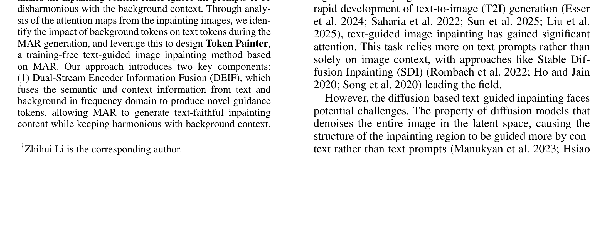
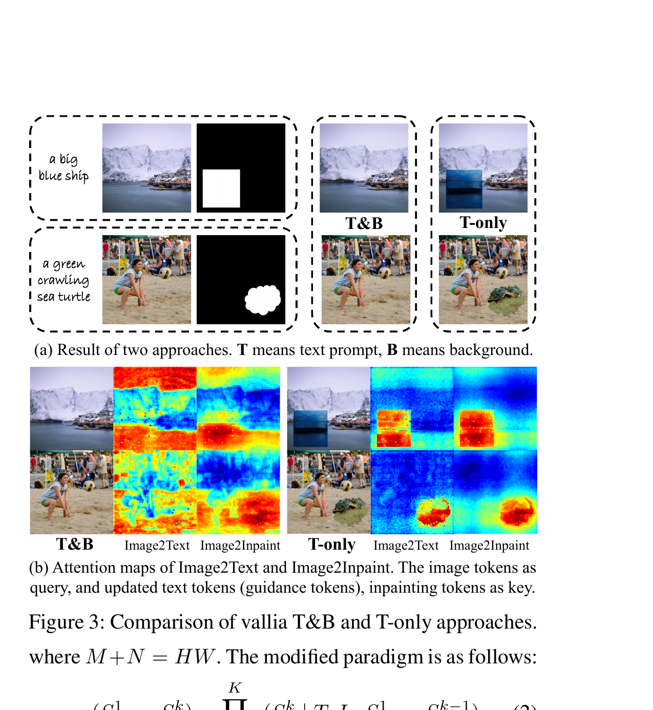
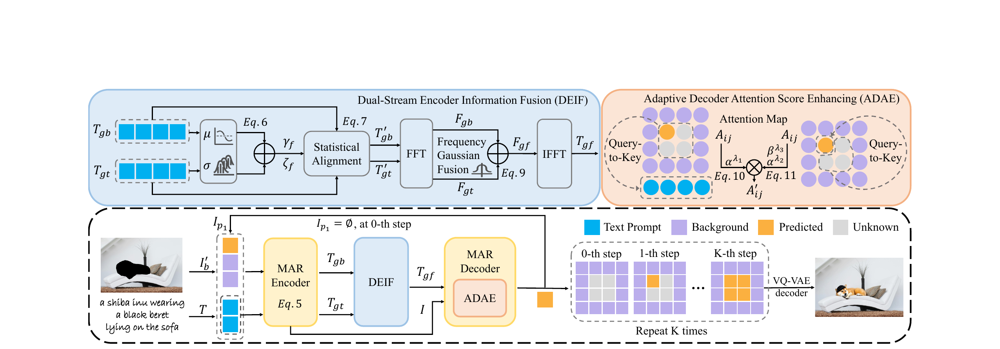
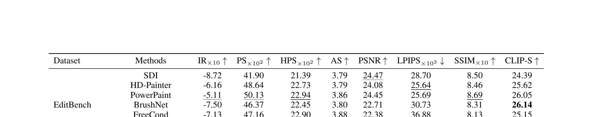
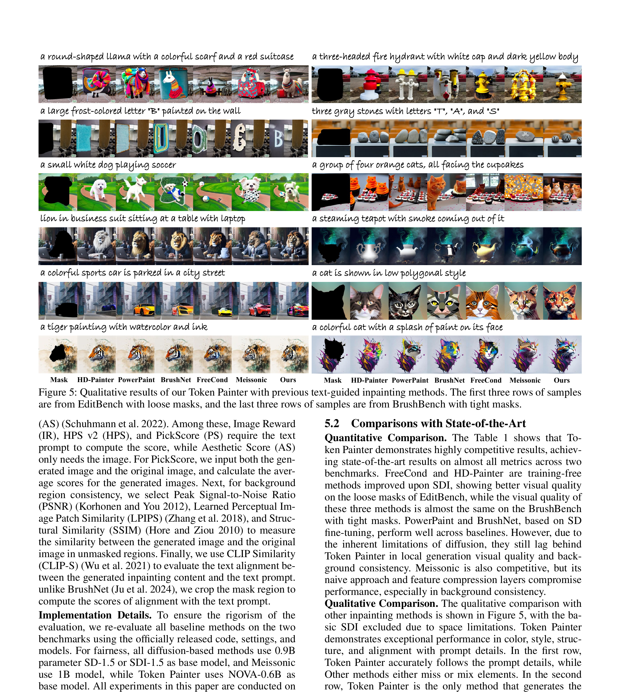

# AI Daily

> **論文標題**: Token Painter: Training-Free Text-Guided Image Inpainting via Mask Autoregressive Models
> **發表於**: AAAI 2026 (arXiv 2025.09)
> **作者**: Longtao Jiang, Jie Huang, Mingfei Han, Lei Chen, Yongqiang Yu, Feng Zhao, Xiaojun Chang, Zhihui Li
> **研究機構**: University of Science and Technology of China (USTC), Mohamed bin Zayed University of Artificial Intelligence (MBZUAI)
> **關鍵詞**: `Training-Free`, `Image Inpainting`, `Mask Autoregressive (MAR)`, `Attention Modulation`, `Text-Guided`

---

## 核心貢獻與創新點

文本引導的圖像修復（Text-guided image inpainting）旨在根據文本提示修復圖像的遮罩區域，同時保持背景的連貫性。儘管基於擴散模型（Diffusion Models）的方法目前佔據主導地位，但其在潛在空間中對整張圖像進行聯合去噪的特性，使得生成結果難以精確對齊提示細節，且容易破壞背景的一致性。

為了解決這些問題，本文探索了**掩碼自回歸模型（Mask AutoRegressive, MAR）**在該任務中的應用。MAR 通過生成對應於遮罩區域的潛在 token，天然支持圖像修復，能夠在不改變背景的情況下提供更好的局部可控性。然而，直接將 MAR 應用於此任務會導致修復內容要麼忽略提示，要麼與背景上下文不協調。

**核心創新點包括：**

1. **深入分析 MAR 修復機制**: 首次將 MAR 模型（基於 NOVA 架構）應用於文本引導的圖像修復，並通過注意力圖分析，揭示了背景 token 在 MAR 生成過程中對文本 token 語義信息的干擾機制。
2. **雙流編碼器信息融合 (DEIF)**: 提出 Dual-Stream Encoder Information Fusion 模塊，在頻域中融合來自文本和背景的語義與上下文信息，生成全新的引導 token，使 MAR 能夠生成忠實於文本且與背景和諧的修復內容。
3. **自適應解碼器注意力分數增強 (ADAE)**: 提出 Adaptive Decoder Attention Score Enhancing 模塊，自適應地增強對引導 token 和修復 token 的注意力分數，進一步提升提示細節的對齊度和內容的視覺質量。
4. **Training-Free SOTA 性能**: 作為一種無需訓練的方法，Token Painter 在多個基準測試（EditBench, BrushBench）上超越了現有的 SOTA 方法，甚至優於那些在修復數據集上微調過的擴散模型。

*圖1：Token Painter 生成的文本引導圖像修復結果。它忠實地遵循提示細節來填充遮罩區域，同時與圖像上下文無縫連接。*

## 技術方法詳解

### 1. MAR 模型在修復任務中的挑戰

作者首先分析了直接使用 MAR 進行修復的兩種樸素策略：
*   **T&B (Text & Background)**: 同時輸入文本提示和背景 token。結果發現修復內容完全依賴上下文，忽略了文本提示。
*   **T-only (Text only)**: 僅輸入文本提示，屏蔽所有背景 token。結果修復內容雖然遵循了提示，但與周圍上下文極不協調。

通過可視化解碼器階段的自注意力圖（圖2），作者發現：在 T&B 方法中，文本 token 的語義信息在編碼器交互過程中被背景 token 的上下文信息所淹沒；而在 T-only 方法中，由於缺乏背景 token，生成的 token 無法與圖像上下文保持一致。

*圖2：T&B 和 T-only 方法的比較與注意力圖分析。在 T&B 中，注意力分散到背景區域；在 T-only 中，注意力集中在修復區域。*

### 2. Token Painter 系統架構

為了解決上述問題，Token Painter 在 MAR 的編碼器和解碼器階段分別引入了 DEIF 和 ADAE 模塊。

*圖3：Token Painter 方法概覽。包含編碼器階段的 DEIF 模塊和解碼器階段的 ADAE 模塊。*

#### 2.1 雙流編碼器信息融合 (DEIF)

DEIF 模塊旨在生成包含語義和上下文信息的**雙流引導 token (Dual-Stream Guidance Tokens)**。

首先，分別獲取 T&B 和 T-only 兩種策略下的粗略引導 token $T_{gb}$ 和 $T_{gt}$。為了在頻域中更好地融合它們，DEIF 首先在空間域進行**自適應統計對齊 (Adaptive Statistical Alignment)**，將它們標準化並平移到一個共同的分佈：

$$ \gamma_f = a \cdot \mu(T_{gb}) + (1 - a) \cdot \mu(T_{gt}) $$
$$ \zeta_f = a \cdot \sigma(T_{gb}) + (1 - a) \cdot \sigma(T_{gt}) $$

接著進行**頻域信息融合 (Frequency Information Fusion)**。將對齊後的 token 通過快速傅立葉變換 (FFT) 轉換到頻域，並使用修改後的高斯函數 $MG(l)$ 將 $T_{gb}$ 的高頻上下文風格信息與 $T_{gt}$ 的低頻語義結構信息進行融合：

$$ F_{gf}(l) = (1 - MG(l)) \cdot F_{gb} + MG(l) \cdot F_{gt} $$

最後通過逆傅立葉變換 (IFFT) 獲得全新的引導 token $T_{gf}$。

#### 2.2 自適應解碼器注意力分數增強 (ADAE)

在解碼器階段，ADAE 模塊通過自適應增強注意力分數來提升生成質量。增強係數 $\alpha = \log_N HW$ 與修復區域的大小成反比。

1.  **引導 Token 增強 (Guided Tokens Enhancement)**: 增強修復區域對引導 token $T_{gf}$ 的注意力，使修復內容更好地對齊提示細節。
    $$ A'_{ij} = \alpha^{\lambda_1} \cdot A_{ij} \quad \text{if } X_i \in I_p \text{ and } X_j \in T_{gf} $$
2.  **動態修復 Token 增強 (Dynamic Inpainting Tokens Enhancement)**: 增強未知修復 token 對已預測修復 token 的注意力，加強修復區域內部的交互。引入動態係數 $\beta = \log_{N_2+1} N_1$，隨著生成步驟的進行動態調整權重。
    $$ A'_{ij} = \beta^{\lambda_3} \cdot \alpha^{\lambda_2} \cdot A_{ij} \quad \text{if } X_i \in I_{p_1} \text{ and } X_j \in I_{p_2} $$

## 實驗結果

作者在 EditBench（寬鬆遮罩）和 BrushBench（緊密遮罩）兩個基準數據集上進行了廣泛的評估。比較的基準模型包括基於擴散模型的微調方法（如 BrushNet, PowerPaint）和無需訓練的方法（如 HD-Painter, FreeCond），以及基於 MAR 的 Meissonic。

*表1：在 EditBench 和 BrushBench 數據集上的定量比較結果。Token Painter 在幾乎所有指標上都達到了 SOTA 性能。*

定量結果顯示，作為一個無需訓練的方法，Token Painter 在圖像視覺質量（IR, PS, HPS, AS）、背景一致性（PSNR, LPIPS, SSIM）和文本對齊度（CLIP-S）上均顯著優於現有方法。

*圖4：與現有文本引導修復方法的定性比較。Token Painter 在顏色、風格、結構以及與提示細節的對齊方面表現出色。*

定性比較進一步證實了 Token Painter 的優越性。它不僅能準確生成提示中描述的物體（如特定形狀的字母、特定風格的服裝），還能確保生成的內容與周圍環境在光影、紋理上完美融合，沒有明顯的拼接痕跡。

## 相關研究背景

*   **Diffusion-based Inpainting**: Stable Diffusion Inpainting (SDI) 是目前最常用的基線。為了改善其提示對齊和背景一致性問題，出現了 HD-Painter 和 FreeCond 等 training-free 方法，以及 BrushNet 和 PowerPaint 等基於微調的方法。然而，擴散模型全局去噪的本質限制了其局部控制能力。
*   **MAR (Mask Autoregressive) Models**: MAR 模型（如 MaskGIT, Muse, NOVA）通過在任意位置生成 token，打破了傳統 AR 模型的柵格順序限制。Token Painter 選擇了最新的 T2I MAR 模型 NOVA 作為基礎架構，充分利用了其在局部生成和背景保持上的天然優勢。

## 個人點評

Token Painter 是一篇非常精彩的 Training-Free 圖像編輯工作。它精準地抓住了 Diffusion 模型在 Inpainting 任務中「全局去噪導致局部控制力弱」的痛點，轉而挖掘 MAR（Mask Autoregressive）模型的潛力。

這篇文章最出彩的地方在於其**對 MAR 內部機制的深入剖析**。作者沒有簡單地套用 MAR，而是通過注意力圖分析，找出了「背景 token 淹沒文本語義」的根本原因。基於此發現設計的 DEIF 模塊，巧妙地利用頻域分離了高頻的上下文風格和低頻的語義結構，實現了兩者的完美融合。而 ADAE 模塊則充分利用了 MAR 逐步生成的特性，設計了動態的注意力增強機制。

作為一個無需訓練（Training-Free）的方法，能夠在各項指標上擊敗經過專門微調的 BrushNet 和 PowerPaint，充分證明了 MAR 架構在局部圖像編輯任務上的巨大潛力。這也為未來基於自回歸模型的圖像編輯研究指明了一個非常有前景的方向。

## 參考文獻

[1] Jiang, L., Huang, J., Han, M., Chen, L., Yu, Y., Zhao, F., Chang, X., & Li, Z. (2025). Token Painter: Training-Free Text-Guided Image Inpainting via Mask Autoregressive Models. arXiv preprint arXiv:2509.23919.
[2] Deng, H., et al. (2024). Autoregressive Video Generation without Vector Quantization (NOVA). arXiv preprint arXiv:2412.14169.
[3] Manukyan, H., et al. (2023). HD-Painter: High-Resolution and Prompt-Faithful Text-Guided Image Inpainting with Diffusion Models. arXiv preprint arXiv:2312.14091.
[4] Ju, X., et al. (2024). BrushNet: A Plug-and-Play Image Inpainting Model with Decomposed Dual-Branch Diffusion. ECCV 2024.
