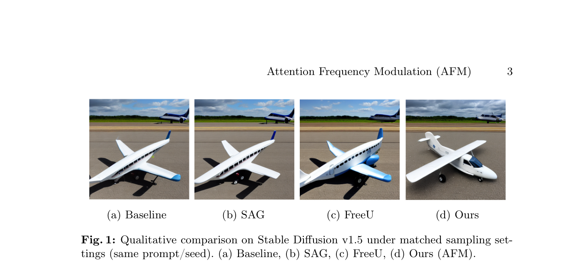
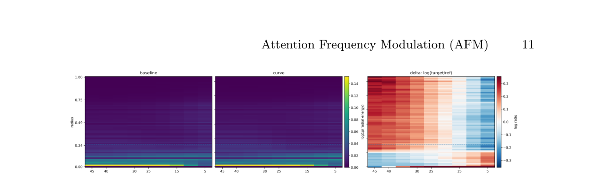
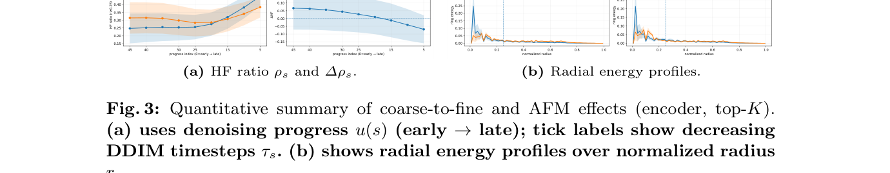

# AI Daily: Attention Frequency Modulation (AFM)

## 今日閱讀：Attention Frequency Modulation: Training-Free Spectral Modulation of Diffusion Cross-Attention

- **論文標題**：Attention Frequency Modulation: Training-Free Spectral Modulation of Diffusion Cross-Attention
- **作者**：Seunghun Oh, Unsang Park
- **機構**：未具體標明（獨立研究者或學術機構）
- **發表時間**：2026年3月30日 (arXiv preprint)
- **論文連結**：[arXiv:2603.28114](https://arxiv.org/abs/2603.28114)
- **關鍵字**：Diffusion Models, Cross-Attention, Training-Free Control, Frequency Domain Analysis, Spectral Modulation

*圖 1：在 Stable Diffusion v1.5 上使用相同提示詞與隨機種子的生成結果比較。與 Baseline、SAG 及 FreeU 相比，AFM 展現了顯著的細節增強與結構控制能力。*

---

## 摘要與核心貢獻

在擴散模型（Diffusion Models）中，交叉注意力（Cross-Attention）是文本條件注入潛在空間的主要介面。然而，其在去噪過程中的多解析度動態變化一直未被充分探討，這限制了基於原理的免訓練（Training-Free）控制方法的發展。本篇論文提出了一種全新的視角，將擴散模型的交叉注意力視為潛在網格上的時空訊號，並透過追蹤其在去噪過程中的傅立葉頻譜（Fourier power）變化，發現了一個穩定的「由粗到細（Coarse-to-Fine）」的頻譜演進規律。

基於此發現，作者提出了 **Attention Frequency Modulation (AFM)**，這是一種隨插即用的免訓練推論期介入方法。AFM 在傅立葉域中對 Softmax 之前的交叉注意力 Logits 進行 Token 級別的頻譜重加權（Spectral Reweighting）。透過與去噪進度對齊的排程，AFM 能夠連續地調整 Token 競爭的空間尺度，而無需重新訓練模型、修改提示詞或更新參數。

**核心貢獻總結：**
1. **交叉注意力的頻域特徵化**：首次將交叉注意力轉換為與 Token 無關的濃度訊號，並揭示了其在去噪過程中穩定的由粗到細頻譜演進特徵。
2. **免訓練的注意力頻率調變 (AFM)**：提出在 Logit 空間進行頻域介入的方法，有效抑制編碼器注意力在生成後期的「高頻碎片化」現象。
3. **注意力熵（Entropy）作為輔助閘控訊號**：發現注意力熵主要作為頻率編輯的自適應增益控制，而非獨立的控制軸。

---

## 技術方法詳解

### 1. 交叉注意力作為時空訊號

傳統分析通常關注特定時間步的注意力熱圖或 Token 相關性分數，難以揭示跨空間尺度的時間組織結構。作者將每個時間步的 Token 分佈映射為與 Token 無關的濃度統計量（例如 Top-K 平均值），並分析其徑向分箱的傅立葉功率。

研究發現，在不同的提示詞和隨機種子下，編碼器（Encoder）的交叉注意力展現出高度一致的頻譜軌跡：在去噪初期，能量集中在低頻區域（決定整體佈局）；隨著去噪進行，能量逐漸向高頻區域轉移（生成局部細節）。這種穩定的時頻指紋為後續的介入提供了理論基礎。

### 2. AFM：Logit 空間的頻譜重加權

AFM 的核心在於對 Softmax 之前的 Logits 進行頻域編輯。作者指出，如果直接在 Softmax 之後的注意力權重上進行空間加性偏差編輯，會因為 Token 歸一化而失效。因此，介入必須是依賴於 Token 且在歸一化之前進行的。

具體流程如下：
1. 將每個 Token 的 Logit 列重塑為空間特徵圖。
2. 應用快速傅立葉轉換（FFT）將其轉換至頻域。
3. 根據預設的截止半徑（Cutoff Radius），將頻譜分為低頻（LF）和高頻（HF）頻段。
4. 使用與去噪進度對齊的排程函數，對低頻和高頻頻段進行重加權。
5. 透過逆傅立葉轉換（iFFT）將特徵圖轉回空間域，並展平回 Logit 矩陣。
6. 最後通過 Softmax 計算編輯後的注意力權重。

*圖 2：編碼器交叉注意力的時頻演進。左圖為 Baseline 的徑向能量分佈，中圖為應用 AFM-curve 後的分佈，右圖為兩者的對數能量比，清晰顯示了 AFM 在去噪過程中對特定頻段的放大與抑制效果。*

### 3. 排程與熵閘控 (Entropy Gating)

AFM 使用了與去噪進度 $u(s)$ 相關的曲線排程：低頻權重隨時間遞減，高頻權重隨時間遞增。此外，作者引入了歸一化的平均 Token 熵（Entropy）作為輔助閘控訊號。高熵表示 Token 分配分散，低熵表示分配集中。實驗證明，熵主要作為頻率編輯的自適應增益控制，當 AFM 強度設為零時，單獨的熵計算不會對生成結果產生任何影響。

---

## 實驗結果與性能

作者在 Stable Diffusion v1.5 和 v1.4 上進行了廣泛的實驗，並與現有的免訓練基準方法（如 SAG 和 FreeU）進行了比較。

### 1. 頻譜重分配的有效性

透過測量生成後期的「高頻能量比（HF Ratio）」，實驗證實 AFM-curve 能夠一致地抑制編碼器交叉注意力中的高頻碎片化現象。如圖 3 所示，與 Baseline 相比，AFM 顯著改變了徑向能量分佈，且這種改變在不同的截止半徑和樣本大小下都具有高度的穩健性。

*圖 3：由粗到細演進與 AFM 效果的定量總結。左圖顯示了高頻能量比隨去噪進度的變化，右圖展示了徑向能量分佈的剖面圖。*

### 2. 影像級別的控制力與對齊度

為了量化控制效果，作者將生成的影像分解為低頻（結構/佈局）和高頻（細節/紋理）分量，並分別計算 LPIPS 距離。

| 比較設定 | LPIPS_low (結構變化) | LPIPS_high (細節變化) | High/Low 比例 | P(high > low) |
| :--- | :--- | :--- | :--- | :--- |
| **AFM-curve** | 0.171 ± 0.115 | 0.188 ± 0.112 | 1.21 ± 0.28 | 78.0% |
| **AFM-curve + entropy** | 0.312 ± 0.116 | 0.329 ± 0.110 | 1.08 ± 0.15 | 72.5% |

如上表所示，AFM 在高頻殘差上引發的感知變化大於低頻分量（78% 的樣本中 LPIPS_high > LPIPS_low），這表明 AFM 更傾向於引導細節和紋理的變化，而非粗略的結構改變。

同時，CLIP 餘弦相似度的評估顯示，AFM 在引發顯著視覺編輯的同時，依然能夠很好地保持文本與影像的語義對齊（與 Baseline 的 CLIP 分數幾乎一致），證明其並未破壞原有的條件注入機制。

---

## 相關研究背景

本研究在「免訓練擴散控制（Training-Free Diffusion Control）」領域中佔據了獨特的位置。與現有方法的比較如下：

1. **與 FreeU 的比較** [1]：FreeU 透過重加權 U-Net 的主幹特徵（低頻）和跳躍連接特徵（高頻）來提升生成品質。AFM 同樣利用了頻域概念，但其作用域精確定位於**交叉注意力的 Logit 空間**，而非 U-Net 的空間特徵圖。
2. **與 SAG (Self-Attention Guidance) 的比較** [2]：SAG 利用中間的自注意力圖進行模糊處理並作為引導訊號。AFM 則專注於**交叉注意力**，並透過傅立葉轉換進行更具原則性的頻譜調變。
3. **與 Prompt-to-Prompt / Attend-and-Excite 的比較** [3][4]：這些方法主要透過直接操作或替換注意力權重圖來實現語義編輯或解決主體遺漏問題。AFM 則指出 Softmax 後的編輯會受到歸一化的限制，因此主張在 **Softmax 之前的 Logit 空間**進行介入，從而提供了一種連續且全域的空間尺度控制旋鈕。

---

## 個人評價與意義

這篇論文為擴散模型的內部機制解釋提供了一個非常優雅的數學視角。將交叉注意力視為時空訊號並進行頻域分析，不僅證實了生成過程中「由粗到細」的直覺認知，更將其量化為可觀測、可操作的頻譜特徵。

AFM 最大的亮點在於其**介入點的選擇（Pre-softmax Logits）**與**介入方式（Fourier Domain Reweighting）**。這種設計避免了直接修改注意力權重帶來的歸一化衝突，使得控制更加平滑且自然。雖然論文目前的評估主要集中在細節與結構的權衡上，但這種頻域調變的思想極具啟發性，未來或許能與其他空間控制方法（如 ControlNet 或 Layout Guidance）結合，實現更精細的生成控制。對於關注 Training-Free 和 Attention Modulation 的研究者來說，這是一篇必讀的佳作。

---

## References

[1] Si, C., et al. (2024). FreeU: Free Lunch in Diffusion U-Net. *CVPR 2024*. [arXiv:2309.11497](https://arxiv.org/abs/2309.11497)
[2] Hong, S., et al. (2023). Improving Sample Quality of Diffusion Models Using Self-Attention Guidance. *ICCV 2023*. [arXiv:2210.00939](https://arxiv.org/abs/2210.00939)
[3] Hertz, A., et al. (2023). Prompt-to-Prompt Image Editing with Cross Attention Control. *ICLR 2023*. [arXiv:2208.01626](https://arxiv.org/abs/2208.01626)
[4] Chefer, H., et al. (2023). Attend-and-Excite: Attention-Based Semantic Guidance for Text-to-Image Diffusion Models. *ACM TOG 2023*. [arXiv:2301.13826](https://arxiv.org/abs/2301.13826)
