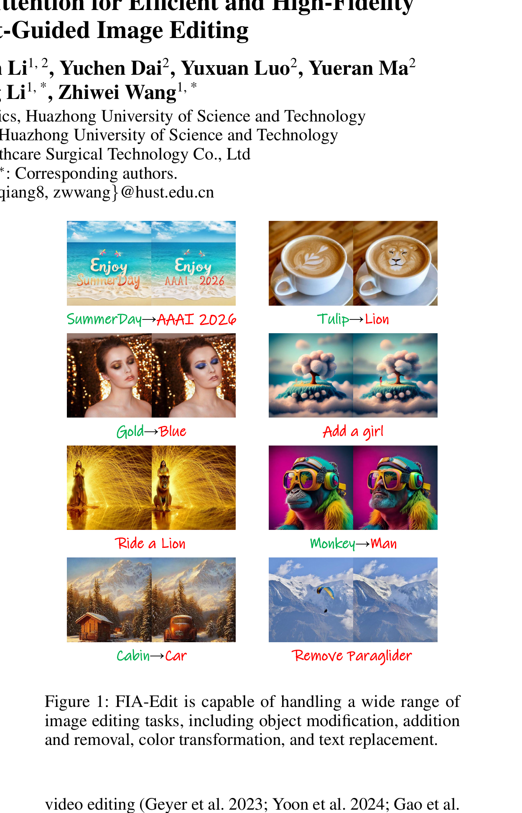
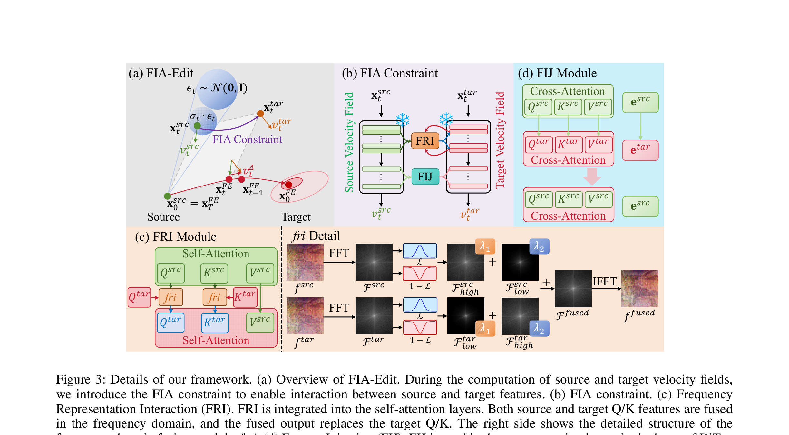

# AI Daily: FIA-Edit (Frequency-Interactive Attention for Efficient and High-Fidelity Inversion-Free Text-Guided Image Editing)

## 今日閱讀：FIA-Edit: 頻率交互注意力實現高效高保真免反轉文本引導圖像編輯

*   **論文名稱**：FIA-Edit: Frequency-Interactive Attention for Efficient and High-Fidelity Inversion-Free Text-Guided Image Editing
*   **作者**：Kaixiang Yang, Boyang Shen, Xin Li, Yuchen Dai, Yuxuan Luo, Yueran Ma, Wei Fang, Qiang Li, Zhiwei Wang
*   **機構**：華中科技大學 (Huazhong University of Science and Technology)、聯影醫療 (United Imaging Healthcare Co.)
*   **會議**：AAAI 2026
*   **arXiv**：[2511.12151](https://arxiv.org/abs/2511.12151)
*   **日期**：2026-03-14 (AAAI 發表) / 2025-11-15 (arXiv)
*   **關鍵字**：Image Editing, Inversion-Free, Rectified Flow, Frequency Domain, Attention Modulation, Training-Free

*圖 1：FIA-Edit 能夠處理廣泛的圖像編輯任務，包括對象修改、添加與移除、顏色轉換以及文本替換。*

---

## 1. 核心貢獻與摘要

隨著擴散模型（Diffusion Models）的興起，文本引導的圖像編輯技術取得了長足的進步。然而，現有的方法面臨著一個根本性的權衡：基於反轉（Inversion-based）的方法雖然保真度高，但計算成本昂貴；而免反轉（Inversion-free）的方法（如 FlowEdit）雖然高效，卻因為缺乏對源圖像特徵的有效整合，經常導致背景保留不佳、空間不一致以及過度編輯的問題。

為了解決這些痛點，華中科技大學團隊在 AAAI 2026 發表了 **FIA-Edit**。這是一個新穎的免反轉圖像編輯框架，透過「頻率交互注意力（Frequency-Interactive Attention）」機制，在不增加顯著計算負擔的情況下，實現了高保真且語義精確的編輯。

**核心貢獻包括：**
1.  提出了一個高效的免反轉圖像編輯框架，在明確保留背景結構的同時實現高保真編輯。
2.  設計了統一的頻率交互注意力機制，包含頻率表示交互（FRI）和特徵注入（FIJ）兩個模組，實現源圖像與目標圖像之間的顯式特徵級交互。
3.  在 PIE-Bench 基準測試中，FIA-Edit 在視覺質量、背景保真度和可控性方面均優於現有方法，且計算成本極低（在 RTX 4090 上處理 512x512 圖像僅需約 6 秒）。
4.  首次將通用文本引導圖像編輯方法應用於臨床醫學領域，透過合成解剖學上連貫的手術出血變化，為醫學數據增強開闢了新途徑。

---

## 2. 技術方法詳解

FIA-Edit 的骨幹網絡建立在 Rectified Flow（如 FlowEdit）之上。在免反轉範式中，模型透過計算源圖像到噪聲的軌跡與目標圖像到噪聲的軌跡之間的「速度場差異（Velocity Difference）」來引導編輯方向。然而，純粹的隱式交互會導致編輯過程過於自由地偏向目標域，從而破壞源圖像的背景。

為此，作者引入了 **FIA Constraint**，在計算目標速度場時顯式地整合源特徵。該約束由兩個關鍵模組組成：

*圖 2：FIA-Edit 框架概覽。包含頻率表示交互（FRI）模組與特徵注入（FIJ）模組。*

### 2.1 頻率表示交互模組 (Frequency Representation Interaction, FRI)

FRI 模組的設計靈感來自於一個關鍵觀察：**結構和語義在頻率空間中更容易解耦**。低頻分量主要編碼粗略的空間佈局和背景結構，而高頻分量則捕捉細粒度的紋理和語義細節。

在自注意力（Self-Attention）層中，FRI 模組執行跨域的頻率融合：
1.  首先對源特徵和目標特徵應用二維快速傅立葉變換（2D FFT）。
2.  使用高斯低通濾波器將頻譜分解為高頻和低頻分量。
3.  進行交叉加權融合：將源圖像的高頻（保留結構/紋理）與目標圖像的低頻（引入新語義佈局）進行強化，同時抑制衝突信號。
4.  最後透過逆傅立葉變換（IFFT）重建特徵，並替換目標分支的 Query 和 Key。

這種選擇性的頻率融合策略，使得模型能夠在執行語義準確編輯的同時，完美保留源圖像的視覺結構。

### 2.2 特徵注入模組 (Feature Injection, FIJ)

為了進一步提升背景保留能力，作者借鑒了基於反轉的方法（如 PnP, MasaCtrl）中的特徵注入思想，設計了 FIJ 模組。

不同於以往在整個網絡中注入特徵，FIJ 專門作用於 DiT 模型後期的交叉注意力（Cross-Attention）層。具體而言，它將源側的 Query、Key、Value 以及文本嵌入（Text Embedding）直接注入到目標注意力計算中。

值得注意的是，這種注入**僅在生成的早期階段（前 27 步）應用**，此時源特徵和目標特徵仍然高度相似。這種早期融合允許目標特徵在目標提示詞的引導下平滑地吸收源信息，避免了其他方法中常見的突兀變化，並穩定了語義對齊。

---

## 3. 實驗結果與評估

作者在 PIE-Bench 基準測試上對 FIA-Edit 進行了全面評估，涵蓋了 10 種不同的編輯類別，並與多種 LDM、FLUX 和 DiT 基線方法進行了比較。

### 3.1 定量分析

| 方法 | 模型 | 結構距離 (↓) | PSNR (↑) | LPIPS (↓) | MSE (↓) | SSIM (↑) | CLIP-整體 (↑) | CLIP-編輯區 (↑) | 平均排名 (↓) |
| :--- | :--- | :--- | :--- | :--- | :--- | :--- | :--- | :--- | :--- |
| FlowEdit | SD 3.5 | 23.62 | 23.21 | 93.81 | 69.95 | 85.09 | 26.78 | 23.73 | 6.1 |
| DNAEdit | SD 3.5 | 14.19 | 26.66 | 74.57 | 32.76 | 88.63 | 25.63 | 22.71 | 3.1 |
| P2P | SD 1.4 | 11.65 | 27.22 | 54.55 | 32.86 | 84.76 | 25.02 | 22.10 | 5.3 |
| FTEdit | SD 3.5 | 18.17 | 26.62 | 80.55 | 40.24 | 91.50 | 25.74 | 22.27 | 4.4 |
| **FIA-Edit (Ours)** | SD 3.5 | **10.34** | **27.32** | 55.02 | **28.66** | 89.21 | 25.89 | 22.82 | **1.7** |

*表 1：PIE-Bench 上的定量比較。FIA-Edit 在背景保留和語義對齊方面取得了最佳的綜合排名。*

數據顯示，FIA-Edit 在結構距離（10.34）、PSNR（27.32）和 MSE（28.66）等背景保留指標上均取得了最佳成績。與其骨幹網絡 FlowEdit 相比，FIA-Edit 的結構距離大幅下降（從 23.62 降至 10.34），證明了頻率交互機制的強大約束力。

### 3.2 運行效率

在計算效率方面，FIA-Edit 展現了免反轉方法的巨大優勢。在單張 RTX 4090 GPU 上，處理一張 512x512 圖像：
*   **P2P (SD 1.4)**: 34.84 秒
*   **FlexiEdit (SD 1.4)**: 38.97 秒
*   **FlowEdit (SD 3.5)**: 3.49 秒
*   **FIA-Edit (SD 3.5)**: **6.30 秒**

雖然比純粹的 FlowEdit 略慢（因為增加了頻率變換和特徵交互的計算），但 6.3 秒的生成時間遠低於傳統的基於反轉的方法，達到了質量與速度的完美平衡。

### 3.3 臨床醫學應用：手術出血數據增強

論文的一個亮點是將圖像編輯應用於臨床任務。早期發現術中異常出血至關重要，但此類數據極度不平衡。作者使用 FIA-Edit 對腹腔鏡胃旁路手術數據集進行編輯，合成不同嚴重程度的出血圖像。

實驗表明，將 FIA-Edit 生成的增強數據加入訓練後，下游的出血分類模型（ConvNeXt-T）的 Recall 從 29.49% 大幅提升至 32.90%，F1-score 從 37.35% 提升至 40.89%，顯著優於傳統的數據增強方法和其他編輯模型。

---

## 4. 相關研究趨勢

FIA-Edit 的出現呼應了當前圖像編輯領域的幾個重要趨勢：

1.  **免反轉 (Inversion-Free) 範式的崛起**：隨著 Rectified Flow 和 Flow Matching 技術的成熟，越來越多的研究（如 FlowEdit [1], InfEdit [2], FlowAlign [3]）致力於擺脫耗時的 DDIM Inversion 過程。FIA-Edit 證明了在免反轉框架下，依然可以透過巧妙的特徵約束達到極高的保真度。
2.  **頻率域 (Frequency Domain) 的深度利用**：將圖像特徵轉換到頻率域進行操作正成為提升編輯精度的利器。例如 FlexiEdit [4] 透過抑制高頻分量來實現非剛性編輯，FDS [5] 則利用小波分解進行頻率感知的去噪評分。FIA-Edit 創新地將頻率融合與自注意力機制結合，實現了結構與語義的優雅解耦。
3.  **注意力調製 (Attention Modulation) 的精細化**：從早期的 Prompt-to-Prompt 全局替換，到現在針對特定層（如 FIJ 僅作用於 DiT 後期層）和特定步數（僅在早期生成階段）的精細化注入，注意力調製技術變得越來越精準，有效減少了過度編輯的副作用。

---

## 5. 個人點評與總結

FIA-Edit 是一篇非常扎實且具有啟發性的 AAAI 2026 頂會論文。它精準地抓住了免反轉編輯方法「速度快但保真度差」的痛點，並給出了一個極具物理直覺的解決方案：**在頻率域中交換源圖像和目標圖像的特徵**。

將源圖像的高頻（紋理細節）與目標圖像的低頻（語義佈局）結合，這個想法雖然在傳統圖像處理中並不罕見，但將其無縫整合到 Diffusion Transformer (DiT) 的自注意力機制中，並結合 Rectified Flow 的速度場計算，展現了作者深厚的技術功底。

此外，論文將該技術應用於醫療影像的數據增強，這是一個非常聰明且具備實際價值的落地場景。醫療影像往往缺乏特定病理特徵的樣本，而高保真的圖像編輯技術恰好可以填補這一空白。對於關注 Training-free 和 Attention Modulation 的研究者來說，FIA-Edit 提供了一個極佳的參考範例。

---

## 參考文獻

[1] Kulikov, V., et al. (2024). FlowEdit: Inversion-Free Text-Based Editing Using Pre-Trained Flow Models. *arXiv preprint arXiv:2412.08629*.
[2] Xu, S., et al. (2023). Inversion-Free Image Editing with Natural Language. *CVPR 2024*.
[3] Kim, et al. (2025). FlowAlign: Trajectory-Regularized, Inversion-Free Flow-based Image Editing. *arXiv preprint arXiv:2505.23145*.
[4] Koo, G., et al. (2024). FlexiEdit: Frequency-Aware Latent Refinement for Enhanced Non-rigid Editing. *ECCV 2024*.
[5] Ren, Y., et al. (2025). FDS: Frequency-Aware Denoising Score for Text-Guided Latent Diffusion Image Editing. *CVPR 2025*.
