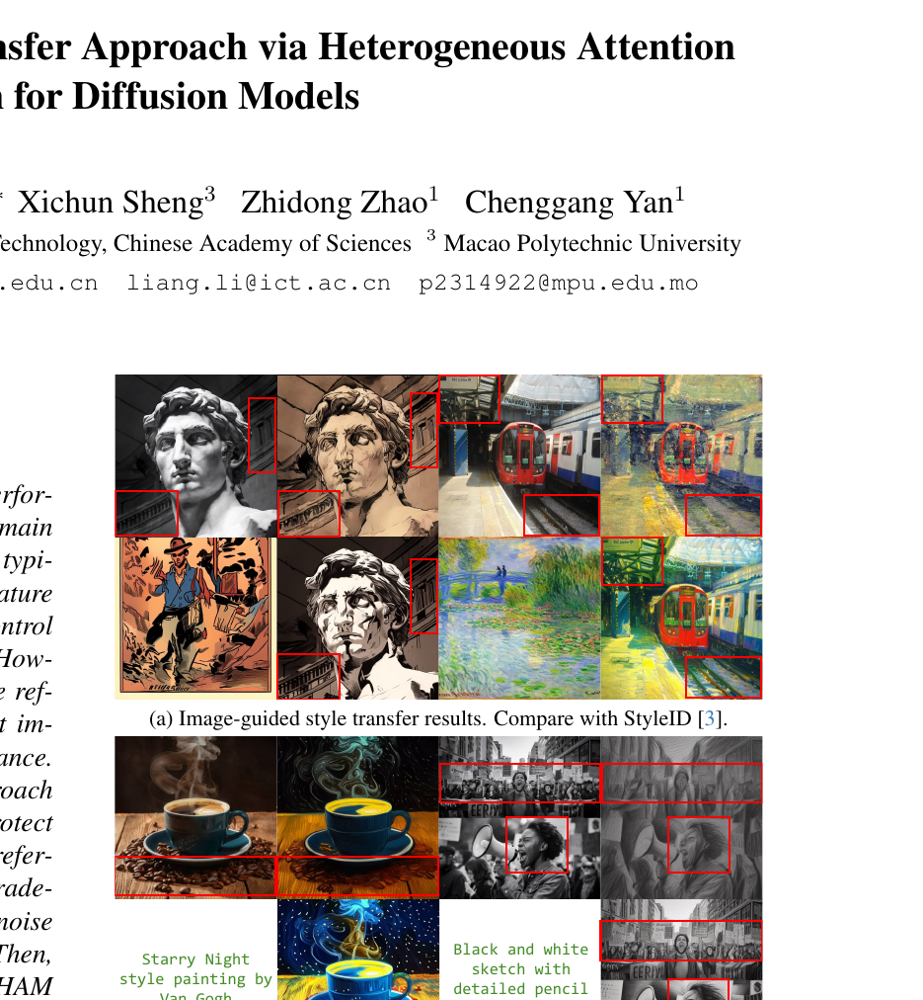
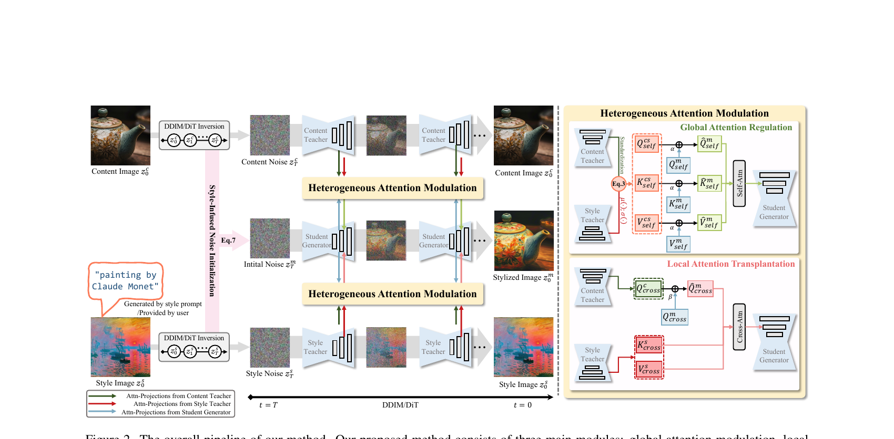
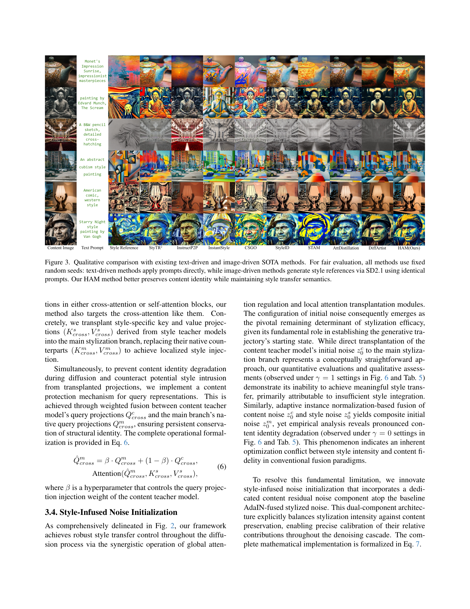

# AI Daily: HAM - A Training-Free Style Transfer Approach via Heterogeneous Attention Modulation for Diffusion Models

- **論文標題**: HAM: A Training-Free Style Transfer Approach via Heterogeneous Attention Modulation for Diffusion Models
- **作者**: Yeqi He, Liang Li, Zhiwen Yang, Xichun Sheng, Zhidong Zhao, Chenggang Yan
- **機構**: Hangzhou Dianzi University, Institute of Computing Technology (CAS), Macao Polytechnic University
- **會議**: CVPR 2026 Findings
- **arXiv**: [2603.24043](https://arxiv.org/abs/2603.24043)
- **發布日期**: 2026-03-25
- **關鍵字**: Style Transfer, Diffusion Models, Training-Free, Attention Modulation, Zero-Shot

## 摘要與核心貢獻

擴散模型（Diffusion Models）在圖像生成領域展現了卓越的性能，特別是在風格轉換（Style Transfer）任務中。然而，現有的風格轉換方法通常依賴於微調（fine-tuning）或額外的控制模組（如 LoRA 或 ControlNet），這些方法不僅計算成本高昂，且在處理複雜風格參考時，往往難以在「保留內容圖像的身份特徵（Identity）」與「捕捉風格參考的複雜細節」之間取得平衡，容易陷入風格與內容的權衡困境（Style-Content Trade-off）。

為了解決上述挑戰，本論文提出了一種名為 **HAM (Heterogeneous Attention Modulation)** 的免訓練（Training-Free）風格轉換方法。該方法透過異構注意力調節機制，在圖像或文本引導的風格轉換過程中，有效保護內容圖像的身份資訊。具體而言，HAM 引入了風格注入噪聲初始化（Style-Infused Noise Initialization, SINI）來設定擴散過程的初始潛在噪聲。隨後，在擴散生成過程中，HAM 創新地針對不同的注意力機制採用了異構調節策略，包含全局注意力調節（Global Attention Regulation, GAR）與局部注意力移植（Local Attention Transplantation, LAT）。這使得模型能夠在精準捕捉複雜風格參考的同時，更好地保留內容圖像的結構細節。

**本論文的核心貢獻包含：**
1. 提出了一種免訓練的風格化圖像生成方法 HAM，無需對風格圖像進行梯度優化即可實現高品質的風格轉換。
2. 設計了 GAR 與 LAT 兩個核心模組。GAR 能夠從宏觀層面將風格與內容教師模型的特徵引入學生生成器；而 LAT 則能精確控制風格與內容之間的引導權重。兩者的結合顯著提升了生成圖像的品質。
3. 證明了 HAM 方法在基於 DDIM（如 SD2.1）與基於 DiT（如 SD3.5）的架構上均具有普遍的兼容性，並在多項定量評估指標上達到了最先進（State-of-the-Art, SOTA）的性能。

## 技術方法詳解

HAM 的整體架構建立在「教師-學生（Teacher-Student）」框架之上。給定一張內容圖像與一張風格參考圖像（或文本提示），系統首先透過擴散模型反演（Inversion）獲取內容教師模型與風格教師模型。隨後，透過 HAM 將兩位教師的知識結合並共享給學生生成器，從而實現風格轉換。整個過程包含三個關鍵模組：SINI、GAR 與 LAT。

### 1. 風格注入噪聲初始化 (Style-Infused Noise Initialization, SINI)

在擴散過程的初始時間步 $T$，初始潛在噪聲的設定對於最終生成結果具有決定性的影響。如果直接使用內容教師的初始噪聲，會導致風格注入不足；若僅使用自適應實例歸一化（AdaIN）融合內容與風格噪聲，則會造成內容身份的嚴重退化。

為了解決這個優化衝突，HAM 提出了 SINI。該機制在基於 AdaIN 融合的風格化噪聲基礎上，額外引入了一個專門的「內容殘差噪聲（Content Residual Noise）」組件。這種雙組件架構明確地平衡了風格化強度與內容保留程度，使得在整個去噪級聯過程中能夠精確校準兩者的相對貢獻。

### 2. 全局注意力調節 (Global Attention Regulation, GAR)

自注意力（Self-Attention）投影在擴散模型中編碼了空間位置關係與內容相關的語義表示。為了在風格轉換過程中保持結構保真度，GAR 模組被設計用來對主分支（學生生成器）的自注意力層進行全局調節。

GAR 首先使用 AdaIN 將內容教師模型的注意力投影（$Q, K, V$）與風格教師模型的注意力投影進行解耦特徵重組，生成優化後的複合投影。接著，為了確保這些複合投影的統計特性與主分支原生自注意力投影的分布一致，GAR 採用了一種加權融合策略。透過一個預設的超參數 $\alpha$，將優化後的複合投影與主分支的原生表示進行線性組合。這種控制結合實現了雙重目標：在整個風格化過程中持續保留內容身份資訊，同時有規律地融入來自風格參考的風格屬性。

### 3. 局部注意力移植 (Local Attention Transplantation, LAT)

現有的免訓練注意力注入方法（如 StyleID）主要在自注意力區塊內操作。然而，由於自注意力投影本身編碼了大量的空間語義結構，直接替換這些區塊中的鍵（Key）和值（Value）矩陣不可避免地會損害內容身份的保留。

為此，HAM 提出了一種範式轉移：利用未被充分利用的交叉注意力（Cross-Attention）通道進行風格移植。LAT 模組策略性地將風格教師模型中特定於風格的鍵和值投影（$K_{cross}^s, V_{cross}^s$）移植到主風格化分支中，替換其原生的對應物，從而實現局部的風格注入。同時，為了防止擴散過程中的內容身份退化並抵消移植投影可能帶來的風格入侵，LAT 對查詢（Query）表示實施了內容保護機制。具體作法是將內容教師模型的查詢投影與主分支的原生查詢投影進行加權融合（透過超參數 $\beta$ 控制），確保結構身份的持久保存。

## 實驗結果與性能

HAM 在 MS-COCO（內容圖像）與 WikiArt（風格參考）數據集上進行了廣泛的評估，並與多種 SOTA 方法（如 StyleID, STAM, DiffArtist, CSGO 等）進行了比較。

### 定量評估 (Quantitative Evaluation)

在定量評估中，HAM 在多個關鍵指標上均取得了最優或次優的表現：
- **風格強度指標 (Style Strength)**: HAM 在 CLIP-T 指標上達到最佳（0.223），顯示其在多樣化提示下與文本風格語義的卓越對齊能力。
- **內容保留指標 (Content Preservation)**: 在 LPIPS（0.479）與 LPIPS-Gray（0.362）上，HAM 顯著超越所有基線方法，證明其在保留結構完整性與細粒度細節方面的絕對優勢。DINO（0.728）與 CLIP-I（0.682）的最高得分進一步驗證了其在維持圖像間結構連貫性與視覺語義一致性上的穩健性。
- **綜合品質指標 (Overall Quality)**: 在 ArtFID（15.151）、DC（2.113）與 CC（2.057）等綜合指標上，HAM 保持了整體內容保留與精確風格語義之間的最佳平衡，明顯優於所有競爭方法。

### 定性評估 (Qualitative Evaluation)

視覺結果顯示，現有的 SOTA 方法在處理複雜風格模式時，往往會出現明顯的風格洩漏（Style Leakage）與內容失真（Content Distortion）。例如，StyleID、STAM 與 DiffArtist 雖然能產生合理的風格化結果，但始終存在風格-內容權衡的問題：要麼犧牲內容結構以捕捉風格，要麼保留內容但風格表達不足。相比之下，HAM 能夠在各種風格參考下準確捕捉風格屬性，同時保持高度的內容保真度，從而提升了生成風格化圖像的整體品質。

## 相關研究背景

風格轉換（Style Transfer）旨在將參考風格的視覺特徵應用於內容圖像，同時保留其結構與語義核心。當前基於擴散模型的方法主要分為兩類：
1. **基於微調的方法 (Tuning-based)**: 透過參數更新來適應模型，例如 ControlNet [1] 訓練條件副本，B-LoRA [2] 創新權重優化，以及 CSGO [3] 使用精心策劃的適配器。
2. **免訓練方法 (Training-free)**: 在推理過程中操縱擴散機制而無需更改參數。例如 P2P [4] 注入重建的交叉注意力圖，以及 StyleID [5] 將特徵融合到自注意力層以實現零樣本（Zero-shot）風格化。

HAM 屬於免訓練方法，但與僅在自注意力區塊內操作的現有方法（如 StyleID [5]、STAM [6]）不同，HAM 創新地同時利用了自注意力（GAR）與交叉注意力（LAT）通道，實現了異構注意力調節，從而更有效地解耦了風格引導與內容保留。

## 個人評價與意義

HAM (Heterogeneous Attention Modulation) 是一篇非常扎實且實用的 CVPR 2026 Findings 論文。在免訓練（Training-Free）風格轉換領域，如何打破「風格-內容權衡（Style-Content Trade-off）」一直是一個核心難題。過去的方法（如 StyleID）過度依賴自注意力機制的操縱，導致在注入強烈風格時，往往會破壞原有的空間結構與身份特徵。

HAM 的最大亮點在於其**異構（Heterogeneous）**的設計思維：
1. **全局與局部的分工**: 利用自注意力（Self-Attention）進行全局的內容保護與風格融合（GAR），同時開闢了過去較少被利用的交叉注意力（Cross-Attention）通道來進行局部的風格特徵移植（LAT）。這種分工明確的架構，使得模型能在不破壞主體結構的前提下，精準地「貼上」風格細節。
2. **SINI 的巧思**: 在初始噪聲階段就引入了「內容殘差（Content Residual）」，這是一個非常直觀且有效的設計，確保了生成軌跡的起點就帶有足夠的內容錨點。

對於實際應用而言，HAM 提供了一種高效（無需微調）、高品質且高度可控的風格轉換方案。其在 SD2.1 與 SD3.5 架構上的兼容性，也證明了這種異構注意力調節機制的普適性。這項研究為未來的零樣本圖像編輯與風格化生成提供了一個極具參考價值的強大基線。

## References
[1] Adding conditional control to text-to-image diffusion models. (ICCV 2023)
[2] Implicit style-content separation using b-lora.
[3] Csgo: content-style composition in text-to-image generation.
[4] Prompt-to-prompt image editing with cross-attention control.
[5] Style injection in diffusion: a training-free approach for adapting large-scale diffusion models for style transfer. (CVPR 2024)
[6] STAM: zero-shot style transfer using diffusion model via attention modulation. (CVPR 2025)
