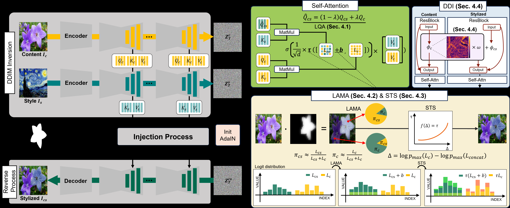
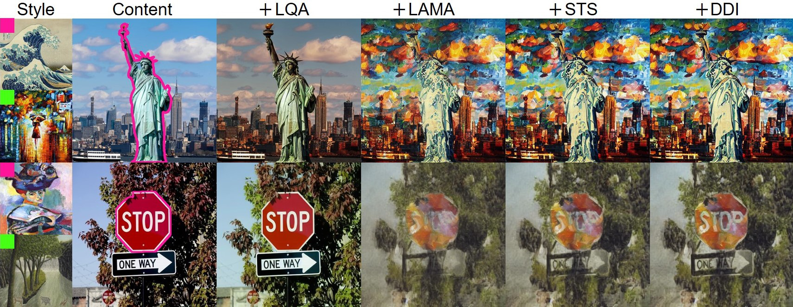
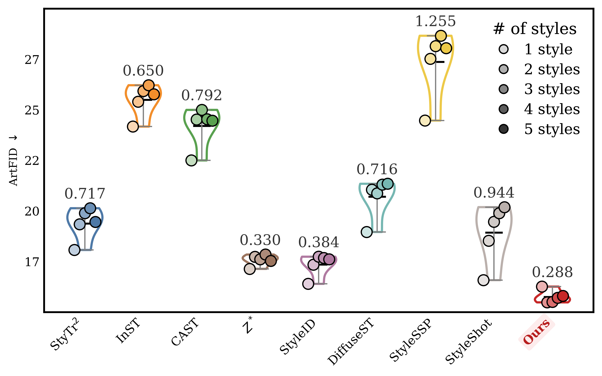

# AI Daily: MAST - Mask-Guided Attention Mass Allocation for Training-Free Multi-Style Transfer

- **論文標題**: MAST: Mask-Guided Attention Mass Allocation for Training-Free Multi-Style Transfer
- **作者**: Dongkyung Kang, Jaeyeon Hwang, Junseo Park, Minji Kang, Yeryeong Lee, Beomseok Ko, Hanyoung Roh, Jeongmin Shin, Hyeryung Jang
- **機構**: Dongguk University, Republic of Korea
- **arXiv**: [2604.12281](https://arxiv.org/abs/2604.12281)
- **發布日期**: 2026-04-14
- **關鍵字**: Style Transfer, Diffusion Models, Training-Free, Multi-Style, Attention Modulation, Zero-Shot

## 摘要與核心貢獻

現有的基於擴散模型（Diffusion Models）的風格轉換方法（Style Transfer）大多針對單一全局風格（Single-style）設計。當這些方法被擴展到多風格（Multi-style）場景時，往往會面臨三大挑戰：**邊界偽影（Boundary Artifacts）**、**注意力扁平化（Attention Flattening）**導致的紋理模糊，以及**結構不一致（Structural Inconsistency）**。這些問題主要源於多個風格表示在擴散模型的注意力機制中相互干擾。

為了解決這些限制，本論文提出了一種名為 **MAST (Mask-Guided Attention Mass Allocation)** 的免訓練（Training-Free）多風格轉換框架。MAST 透過在擴散注意力機制中明確控制內容與風格的交互作用，實現了無偽影且保留結構的高品質多風格轉換。

**本論文的核心貢獻包含：**
1. 提出了一個統一的免訓練多風格轉換框架，能夠在單一圖像中精確地將不同風格應用於指定的遮罩（Mask）區域。
2. 引入了 **LAMA (Logit-level Attention Mass Allocation)** 模組，透過在 Logit 層級確定性地分配注意力質量（Attention Mass），有效防止了風格之間的相互干擾與洩漏。
3. 設計了 **STS (Sharpness-aware Temperature Scaling)** 機制，自適應地恢復因多風格注入而退化的注意力銳度，確保風格紋理的清晰度。
4. 採用了雙尺度的內容保護策略，結合 **LQA (Layout-preserving Query Anchoring)** 與 **DDI (Discrepancy-aware Detail Injection)**，在強烈的風格注入下依然能穩健地保持全局語義佈局與局部高頻細節。

## 技術方法詳解

MAST 的整體架構建立在 DDIM 反演（Inversion）與注意力特徵操作的基礎上。給定一張內容圖像與多個風格-遮罩對，系統首先透過 AdaIN 進行區域性的潛在特徵初始化，隨後在去噪過程中透過四個核心模組注入風格。

### 1. 佈局保留查詢錨定 (Layout-preserving Query Anchoring, LQA)

在風格轉換中，若直接將自注意力機制的鍵（Key）和值（Value）替換為風格特徵，查詢（Query）往往會缺乏足夠的結構先驗，導致佈局崩塌。LQA 透過將內容查詢 $Q_c$ 與風格化查詢 $Q_{cs}$ 進行線性混合（$\hat{Q}_{cs} = \lambda \cdot Q_c + (1-\lambda) \cdot Q_{cs}$），作為全局錨點來穩定語義結構，確保風格 Token 能夠準確映射到原始的語義區域。

### 2. Logit 層級注意力質量分配 (Logit-level Attention Mass Allocation, LAMA)

為了解決多風格之間的衝突與邊界洩漏，LAMA 在網路的 Logit 層級確定性地重新分配風格資源（即注意力機率質量）。具體而言，LAMA 透過引入一個無需學習的偏差項（Learnable-free Bias）$b$ 到風格 Logits 中，強制總注意力質量滿足目標分配比例（例如 $\pi^* = 0.9$）。這種硬約束（Hard Constraint）確保了每種風格只會精確地注入其指定的遮罩區域，實現了無縫的邊界過渡。

### 3. 銳度感知溫度縮放 (Sharpness-aware Temperature Scaling, STS)

雖然 LAMA 實現了精確的空間控制，但多風格特徵的拼接會導致注意力分佈變得扁平化（Attention Flattening），進而使生成的紋理變得模糊。STS 透過測量內容 Logits 與拼接 Logits 之間的最大機率對數差（Sharpness Gap $\Delta$），並利用二次多項式擬合來自適應地計算溫度縮放係數 $\tau$。這項機制主動恢復了模型的注意力銳度，使得在複雜的多風格場景下依然能渲染出生動的風格紋理。

### 4. 差異感知細節注入 (Discrepancy-aware Detail Injection, DDI)

為了彌補在風格化過程中丟失的高頻細節（如紋理、邊緣與精細結構），DDI 模組從內容特徵中提取高頻成分，並根據風格化特徵與內容特徵之間的結構差異（透過餘弦相似度計算）來動態調節注入強度。當結構失真較大時，DDI 會增強高頻細節的注入；反之則抑制，從而在保持風格一致性的同時恢復精細結構。

## 實驗結果與性能

MAST 在 MS-COCO（內容）與 WikiArt（風格）數據集上進行了廣泛的評估，並與多種 SOTA 方法（如 Z* [1], StyleID [2], DiffuseST [3] 等）進行了比較。

### 定量評估 (Quantitative Evaluation)

在雙風格（Two-style）設定下，MAST 在多個關鍵指標上均取得了最佳表現：
- **綜合品質**: 在 ArtFID（14.780）上顯著優於所有基線方法，展現了內容保留與風格保真度之間的最佳平衡。
- **風格保真度**: FID 達到最低的 8.656，證明其生成的圖像分布與目標風格最為接近。
- **結構一致性**: 在 CFSD（0.132）與 M-FID（15.193）上均取得最優成績，顯示其在區域風格對齊與結構保持上的卓越能力。

### 多風格擴展性 (Multi-style Scalability)

MAST 展現了極強的擴展性。如上圖所示，當風格數量從 1 增加到 5 時，大多數基線方法（如 InST, StyleSSP）的 ArtFID 會出現顯著退化。相反地，MAST 不僅在多風格下保持了最低的 ArtFID，且其相鄰風格數量間的平均絕對差異（MAD）也是最小的，證明了其在處理複雜多風格組合時的極高穩定性。

### 定性評估 (Qualitative Evaluation)

視覺結果顯示，現有的方法在多風格場景下經常出現嚴重的紋理出血（Texture Bleeding）或邊界扭曲。而 MAST 能夠在保持銳利物件邊界的同時，實現高保真度的內容結構保留。即使在 5 種風格的複雜設定下（如上圖），MAST 依然能確保各個風格嚴格遵守遮罩邊界，防止風格間的相互干擾。

## 相關研究背景

基於擴散模型的風格轉換方法主要分為兩類：
1. **基於訓練的方法 (Training-based)**: 透過微調模型來適應特定的內容-風格對。
2. **免訓練方法 (Training-free)**: 透過操作內部表示（如注意力圖或潛在特徵）來實現靈活的風格化。例如 Z* [1] 透過注意力重加權（Attention Reweighting）實現零樣本風格轉換；StyleID [2] 則透過特徵融合將風格注入自注意力層。

MAST 屬於免訓練方法，但與現有主要針對單一風格設計的方法不同，MAST 專注於解決多風格場景下的干擾問題。其提出的 LAMA 機制將注意力操作從簡單的特徵替換或重加權，提升到了 Logit 層級的確定性機率質量分配（Mass Allocation），這在擴散模型的注意力控制領域是一個重要的創新。

## 個人評價與意義

MAST 是一篇針對性極強且技術細節非常扎實的論文。在免訓練（Training-Free）風格轉換領域，多風格（Multi-style）的精確控制一直是一個痛點。過去的方法（如 Z* 或 StyleID）在處理單一風格時表現優異，但一旦引入多個遮罩與風格，注意力機制的全局特性就會導致嚴重的風格洩漏與邊界模糊。

MAST 的最大亮點在於其對 **Diffusion Attention Mechanism 的深度解剖與精確控制**：
1. **LAMA 的數學優雅性**: 透過在 Logit 層級引入計算好的 Bias 來強制分配 Attention Mass，這比傳統的 Masking 或 Reweighting 更加底層且有效，從根本上解決了風格洩漏問題。
2. **STS 的洞察力**: 作者敏銳地觀察到多風格特徵拼接會導致 Softmax 分布扁平化（Attention Flattening），並巧妙地利用內容 Logits 作為參考來進行自適應的溫度縮放（Temperature Scaling），這是一個非常實用且具啟發性的技巧。
3. **模組間的互補性**: LQA 保全局結構，LAMA 負責精確注入，STS 恢復銳度，DDI 補足高頻細節。Ablation Study 完美展示了這四個模組如何環環相扣，解決風格轉換中的各個痛點。

對於實際應用而言，MAST 提供了一種高度可控、無需微調且支援複雜多風格組合的圖像編輯方案。其在 Logit 層級操作注意力的思路，不僅適用於風格轉換，對於其他需要精細空間控制的擴散模型生成任務（如組合生成、局部編輯）也具有很高的參考價值。

## References
[1] Z*: zero-shot style transfer via attention reweighting. (CVPR 2024)
[2] Style injection in diffusion: a training-free approach for adapting large-scale diffusion models for style transfer. (CVPR 2024)
[3] Diffusest: unleashing the capability of the diffusion model for style transfer. (ACM MM Asia 2024)
