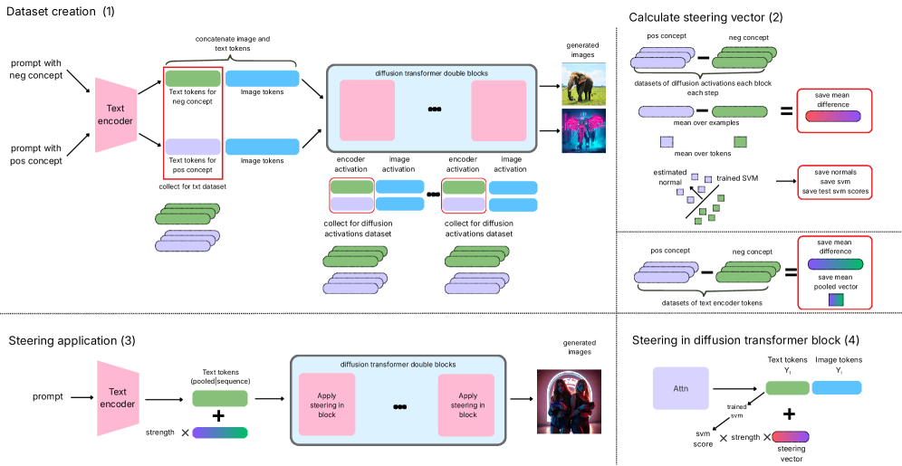
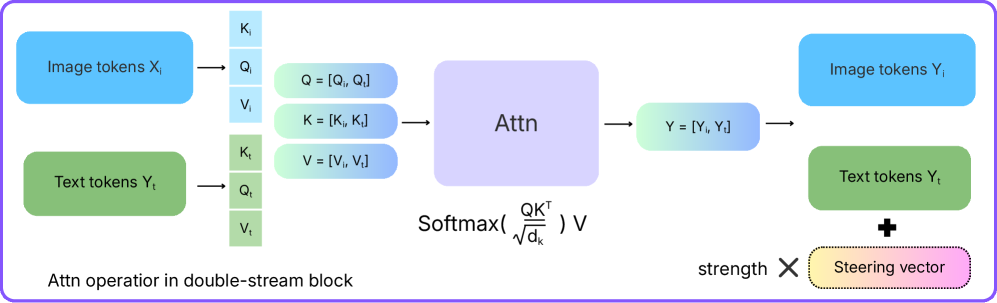
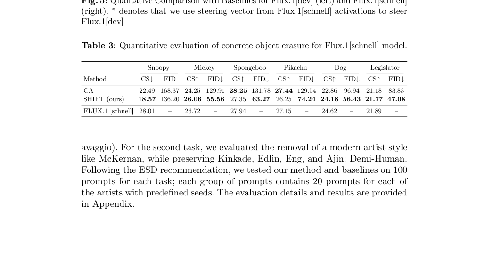
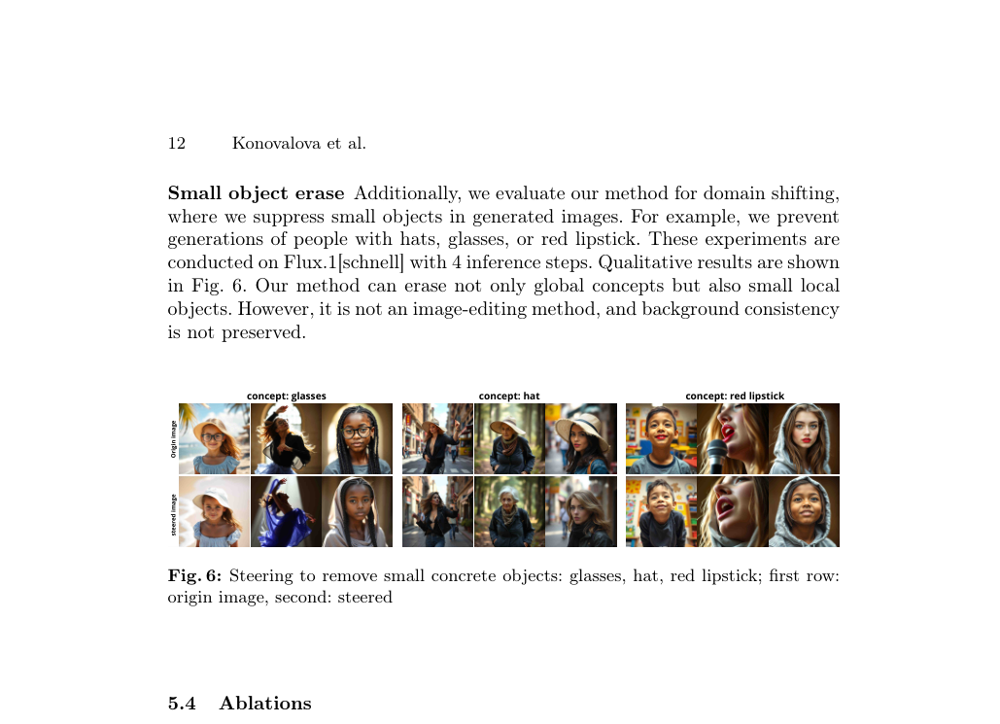

# AI Daily: SHIFT: Steering Hidden Intermediates in Flow Transformers

- **論文名稱**: SHIFT: Steering Hidden Intermediates in Flow Transformers
- **作者**: Nina Konovalova, Andrey Kuznetsov, Aibek Alanov (FusionBrain Lab, HSE University)
- **發表日期**: 2026-04-10
- **論文連結**: [arXiv:2604.09213](https://arxiv.org/abs/2604.09213)
- **開源代碼**: [GitHub](https://github.com/ControlGenAI/SHIFT)

## 摘要與核心貢獻

隨著擴散模型（Diffusion Models）在圖像生成領域取得卓越成就，如何有效控制模型以避免生成有害內容或侵權圖像成為了重要的研究課題。傳統的概念擦除（Concept Erasure）方法大多依賴於模型權重的微調，這對於擁有超過百億參數的現代擴散變壓器（Diffusion Transformers, DiTs，如 FLUX）來說，計算成本極為高昂。為了解決這一痛點，本研究提出了 **SHIFT**，這是一個簡單且輕量級的免訓練（Training-free）框架，旨在透過操控推理階段的中間激活來實現概念擦除與風格轉換。

SHIFT 的核心靈感來自於大型語言模型（LLMs）中的激活引導（Activation Steering）技術。研究團隊發現，在 DiT 架構中，語義概念被編碼為潛在流形（Latent Manifold）中穩定的全局方向。透過收集少量的對比提示詞對（Contrastive Prompt Pairs），SHIFT 能夠快速計算出特定概念的引導向量（Steering Vectors）。在推理過程中，這些向量被動態地應用於選定的注意力層和時間步，從而有效抑制不需要的視覺概念，同時保持整體圖像質量和提示詞的對齊度。

本研究的主要貢獻包括：
1. 首次將 LLM 的激活引導技術成功應用於擁有統一注意力機制（Unified Attention）的百億參數級 DiT 模型（如 FLUX）。
2. 提出了一種完全免訓練的推理期控制機制，無需修改模型權重即可實現概念擦除、風格轉換和對象操作。
3. 引入了基於支持向量機（SVM）的輕量級分類器作為正則化器，有效防止了過度引導（Over-steering）導致的圖像質量下降。
4. 證明了引導向量在不同蒸餾版本模型間的可轉移性（例如從 FLUX.1[schnell] 轉移至 FLUX.1[dev]）。

## 技術方法詳解

SHIFT 的技術流程主要分為三個階段：數據集構建、引導向量計算以及推理期應用。

*圖 1：SHIFT 的引導流程概覽。包含從對比提示詞對構建數據集、計算平均差異和分離平面的引導向量，以及在推理期間應用該向量。*

### 1. 介入點的選擇 (Where to Steer)

在傳統的 U-Net 架構中，交叉注意力層（Cross-attention Layers）提供了調節文本影響的明確接口。然而，現代 DiT 模型（如 FLUX）在共享的注意力空間中同時處理圖像和文本標記。因此，SHIFT 選擇了兩個關鍵組件進行介入：
- **文本編碼器的池化嵌入（Pooled Embedding）**：具體而言，是 FLUX 中的 CLIP 向量標記。
- **擴散變壓器的文本標記（Text Tokens）**：在 DiT 主幹網絡的共享注意力層之後的文本表示。

*圖 2：FLUX 架構中的雙流區塊（Double-stream Block），展示了文本和圖像標記的聯合注意力機制。*

### 2. 引導向量的構建 (Steering Vector Construction)

為了構建引導向量，研究人員首先收集了一個小型的對比提示詞數據集。例如，將中性提示詞「一頭大象」與包含目標概念的提示詞「賽博龐克風格的一頭大象」配對。透過在這些提示詞上運行模型，記錄選定位置的激活值。

對於文本編碼器，SHIFT 直接使用原始的激活差異向量作為引導方向。對於擴散變壓器，研究團隊比較了多種方法，最終發現基於線性 SVM 訓練得到的分離超平面法向量（Hyperplane Normal）和標記級平均差異（Mean Token-wise Difference）都能產生有效的引導向量。

### 3. 推理期引導與正則化 (Inference-time Steering)

在推理階段，SHIFT 透過將特定概念的方向添加到選定的激活中來引導模型。為了避免過度引導導致非目標概念的語義失真，SHIFT 引入了兩種正則化機制：
- **文本編碼器強度控制**：基於初始提示詞嵌入與目標概念嵌入之間的餘弦相似度來動態調整引導強度。
- **擴散變壓器分類器正則化**：使用輕量級的 SVM 分類器信號來評估當前激活中是否仍存在目標概念。當目標概念的證據強烈時放大引導，當激活遠離目標類別時則抑制引導。

## 實驗結果與性能

研究團隊在多個任務上對 SHIFT 進行了全面評估，包括抽象概念擦除（如裸露內容）、具體概念擦除（如特定卡通角色）以及風格轉換。

### 抽象概念擦除 (Abstract Concept Erasure)

在 I2P 基準測試中，SHIFT 在擦除不當內容方面展現了卓越的性能。與現有的基線方法（如 ESD, EAP, CA, UCE）相比，SHIFT 實現了超過 3 到 4 倍的抑制效果。

*表 1：在 I2P 基準測試中檢測到的顯式內容數量比較。SHIFT 在顯著減少裸露內容的同時，維持了與基線相當的 FID 和 CLIP 分數。*

### 具體概念擦除與小物件移除 (Concrete Concept and Small Object Erasure)

在具體概念擦除任務中，SHIFT 能夠有效移除目標概念（如 Snoopy），同時更好地保留相關的非目標概念（如 Mickey, SpongeBob）。此外，SHIFT 還展示了移除局部小物件（如眼鏡、帽子、紅唇）的能力，這進一步證明了其在細粒度控制上的潛力。

*圖 3：使用 SHIFT 移除生成圖像中的小物件（眼鏡、帽子、紅唇）。上排為原始生成圖像，下排為引導後的結果。*

## 相關研究背景

概念擦除在擴散模型領域一直備受關注。早期的開創性工作如 **Erased Stable Diffusion (ESD)** [1] 透過微調模型權重來引導輸出遠離目標概念。隨後，**Unified Concept Editing (UCE)** [2] 提出了一種無需訓練的閉式解（Closed-form Solution），能夠同時進行多個概念的編輯。

然而，這些方法大多針對 U-Net 架構設計。隨著架構向 Rectified Flow Transformers 演進，**EraseAnything** [3] 成為了首個專門針對此類架構（如 FLUX, SD3）的概念擦除方法，但其仍依賴於雙層優化（Bi-level Optimization）。

SHIFT 的獨特之處在於其靈感來自於大型語言模型中的 **Representation Engineering** [4] 和激活引導技術。與同期針對交叉注意力層的免訓練方法 **CASteer** [5] 不同，SHIFT 成功將這一理念擴展到了具有統一注意力機制的百億參數級 DiT 模型上，實現了真正的免訓練推理期控制。

## 個人評價與意義

SHIFT 是一篇極具啟發性的論文，它巧妙地將 LLM 領域成熟的激活引導技術遷移到了視覺生成領域的最前沿架構（DiT）上。這種跨領域的技術借鑒不僅證明了 Transformer 架構在不同模態下潛在表示的相似性，也為未來的研究開闢了新的方向。

從實用角度來看，SHIFT 的 **Training-free** 特性極具吸引力。對於像 FLUX 這樣龐大的模型，微調的成本令人望而卻步。SHIFT 僅需極少量的對比樣本即可在推理期實現精確控制，這對於需要快速響應的內容審核和版權保護系統來說具有巨大的應用價值。此外，其在 Zero-shot 風格轉換和局部對象操作上的潛力，也展示了 Attention Modulation 在精細化圖像編輯中的強大能力。

## References

[1] Gandikota, R., et al. (2023). Erasing Concepts from Diffusion Models. *ICCV 2023*.
[2] Gandikota, R., et al. (2024). Unified Concept Editing in Diffusion Models. *WACV 2024*.
[3] Gao, D., et al. (2025). EraseAnything: Enabling Concept Erasure in Rectified Flow Transformers. *ICML 2025*.
[4] Zou, A., et al. (2023). Representation Engineering: A Top-Down Approach to AI Transparency. *arXiv:2310.01405*.
[5] Gaintseva, T., et al. (2025). CASteer: Cross-Attention Steering for Controllable Concept Erasure. *ICLR 2026*.
