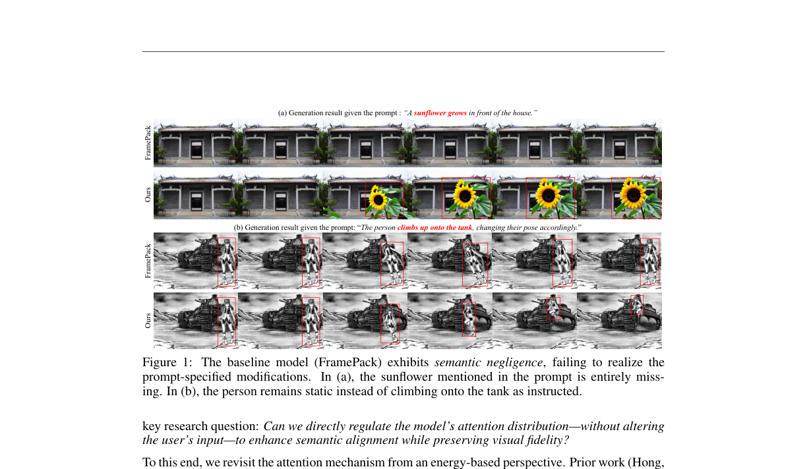
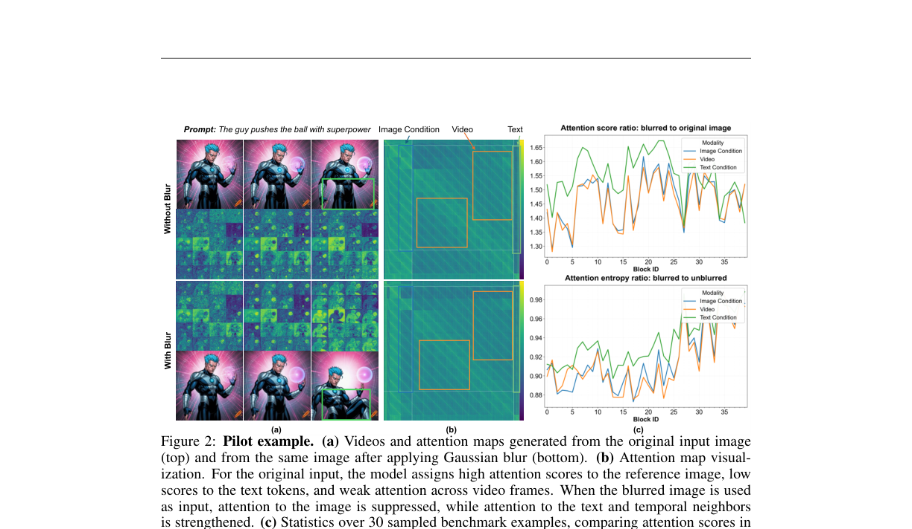

# AI Daily

## AlignVid: Taming Visual Dominance via Training-Free Attention Modulation in Text-guided Image-to-Video Generation

**論文標題**：AlignVid: Taming Visual Dominance via Training-Free Attention Modulation in Text-guided Image-to-Video Generation [1]
**作者**：Yexin Liu, Wenjie Shu, Zile Huang, Haoze Zheng, Yueze Wang, Manyuan Zhang, Jinjing Zhu, Ser-Nam Lim, Harry Yang
**發表機構**：香港科技大學 (HKUST), 中央佛羅里達大學 (UCF), 北京人工智慧研究院 (BAAI), 香港中文大學 (CUHK)
**發表時間**：2026年5月 (ICML 2026 Poster)
**論文連結**：[arXiv:2512.01334](https://arxiv.org/abs/2512.01334) [2]

---

### 核心貢獻與創新點

在基於擴散模型（Diffusion Models）與 Transformer（DiT/MMDiT）的文本引導圖像到視頻（Text-guided Image-to-Video, TI2V）生成領域，模型通常能很好地保持主體一致性與時間連貫性。然而，當輸入的文本提示（Prompts）要求對參考圖像進行大幅度的語義修改（例如：新增、刪除或修改特定物體）時，現有模型往往會直接忽略這些文本指令，而傾向於死板地保留參考圖像的原始外觀。

這篇論文首次正式定義並命名了這一普遍存在的瓶頸——**語義忽視（Semantic Negligence）**。作者通過深入的 Pilot Study 發現，這一問題本質上源於**視覺主導（Visual Dominance）**：參考圖像的強大視覺先驗在交叉注意力（Cross-Attention）中造成了嚴重的注意力色散（Attention Dispersion），從而抑制了模型整合新語義信息的能力。

為了解決這一痛點，本文提出了 **AlignVid**，這是一種**無需訓練（Training-Free）**的即插即用干預機制。AlignVid 通過重新調校模型內部的注意力分佈，在幾乎不增加計算開銷的情況下，顯著提升了視頻生成的語義忠實度。

**主要創新點包括：**
1. **正式定義「語義忽視（Semantic Negligence）」**：指出了現有 TI2V 模型在執行物體新增、刪除或修改等複雜編輯指令時的失效現象。
2. **揭示「視覺主導」本質並建立能量視角**：通過對輸入圖像施加高斯模糊的對比實驗，證明了降低注意力熵（Attention Entropy）與提高語義忠實度之間的直接關聯，並基於能量模型給出了理論解釋。
3. **提出 AlignVid 免訓練框架**：包含**注意力縮放調製（Attention Scaling Modulation, ASM）**與**引導調度（Guidance Scheduling, GS）**兩大模組，通過對 Q/K 矩陣的輕量級縮放，在不破壞美學質量的前提下大幅改善語義遵從性。
4. **推出 OmitI2V 基準數據集**：首個專門用於評估 TI2V 語義忽視的基準，包含 367 個人工標注的高質量樣本，並採用基於多模態大模型（Qwen2.5-VL-32B）的 VQA 評估協議。

*圖 1：基線模型（FramePack）與 AlignVid 的生成效果對比。在 (a) 中，基線模型完全忽略了「在房子前長出向日葵」的指令（語義忽視）；而在 (b) 中，基線模型無法實現「人爬上坦克」的動作。AlignVid 則能精準遵循文本指令進行合理的語義修改。*

---

### 技術方法簡述

#### 1. 溫度的 Q/K 縮放與能量視角

作者從能量模型的視角（Energy-based perspective）重新審視了注意力機制。在單個注意力頭中，視注意力計算為最小化底層能量函數的梯度步驟。對於第 $i$ 個查詢（Query），其注意力 logits 為 $z^{(i)}$，對應的 Softmax 概率分佈為 $p^{(i)} = \sigma(z^{(i)})$。

**Lemma 4.1 (Q/K 縮放作為溫度控制)**：在去噪步驟 $t$ 中，將查詢向量 $Q_t$ 替換為 $\gamma_t Q_t$（或將鍵向量 $K_t$ 替換為 $\gamma_t K_t$），等效於對注意力機制的 Softmax 引入了逆溫度 $\alpha_t = \gamma_t$。這會直接改變注意力 logits：
$$ Z'_t = \gamma_t Z_t $$

**Lemma 4.2 (塊內熵單調性)**：對於任意子集 $S$ 的鍵（例如，由文本和圖像組成的條件塊 $S_{\text{cond}}$），其受限 Softmax 的熵 $H_{i,S}(\alpha)$ 隨逆溫度 $\alpha$ 的增加而單調遞減：
$$ \frac{\mathrm{d}}{\mathrm{d}\alpha}H_{i,S}(\alpha) = -\alpha \mathrm{Var}_{p^{(i)}_S(\alpha)}[z^{(i)}_S] \leq 0 $$

這項理論推導表明，**增加逆溫度（即對 Q 或 K 進行放大縮放）能夠直接降低注意力分佈的熵，使注意力更加聚焦**。在 TI2V 中，這相當於一種「語義銳化（Semantic Sharpening）」操作，能有效抑制冗餘的背景視覺干擾，並放大文本信號的強度。

*圖 2：Pilot Study 實驗與統計。 (a) 展示了對輸入圖像施加高斯模糊後，模型能更好地生成「用超能力推球」的動作。(b) 注意力圖可視化表明，模糊圖像能抑制對圖像的過度關注，並增強對文本和時間鄰近幀的注意力。(c) 統計數據顯示，施加模糊能顯著降低條件塊的注意力熵（Entropy Ratio < 1.0），實現更銳利、更聚焦的注意力。*

#### 2. 注意力縮放調製 (Attention Scaling Modulation, ASM)

為了解決靜態掩碼（Static Masks）在開放域場景下脆弱且開銷大的問題，ASM 直接在注意力層內部修改計算過程：
$$ \text{Attention}_{\text{ASM}}(Q,K,V) = \mathrm{softmax}\left(\frac{Q'(K')^T}{\sqrt{d_k}}\right)V $$

論文中探討了兩種縮放變體：
- **(S1) 標量縮放（Scalar Scaling）**：直接將固定係數 $\gamma_s > 1$ 乘以 $Q$ 或 $K$（即 $Q' = \gamma_s Q$ 或 $K' = \gamma_s K$），簡單直接地拉大 logits 的對比度。
- **(S2) 能量基調製（Energy-based Modulation）**：根據注意力 logits 的擴散程度，自適應地計算縮放係數：
  $$ \gamma_e = f\left(\frac{1}{n_q n_k} \sum_{i,j} \frac{Q_i K_j^T}{\sqrt{d_k}}\right) $$
  其中 $f(\cdot)$ 為單調遞增函數。當注意力分佈越彌散時，施加越強的調製。

#### 3. 引導調度 (Guidance Scheduling, GS)

如果無差別地在所有 Transformer 模組和所有去噪步驟中應用 ASM，會導致生成視頻的美學質量下降。因此，AlignVid 引入了雙重調度機制：

1. **模組級引導調度 (Block-level Guidance Scheduling, BGS)**：
   作者發現不同的 Transformer 模組對前景和背景的敏感度不同。他們通過在小型驗證集上收集注意力圖並使用 SAM2 進行前景分割，計算出每個模組的**前景比例（Foreground Ratio） $r^{(l)}$**。只有當 $r^{(l)} > \tau$（設定為 0.5）時，該模組 $l$ 才被判定為前景敏感模組並啟用 ASM：
   $$ g^{(l)} = \begin{cases} \gamma & \text{if } r^{(l)} > \tau \\ 1 & \text{otherwise} \end{cases} $$
   實驗表明，前景敏感模組主要集中在網路的前 50% 深度中。

2. **步驟級引導調度 (Step-level Guidance Scheduling, SGS)**：
   在去噪擴散的早期步驟（高噪聲階段）決定了全局的語義對齊，而後期步驟則主要負責美學細節。因此，SGS 將 ASM 限制在特定的去噪區間 $[t_{\text{low}}, t_{\text{high}}]$ 內：
   $$ m(t) = \begin{cases} 1 & \text{if } t \in [t_{\text{low}}, t_{\text{high}}] \\ 0 & \text{otherwise} \end{cases} $$

結合 BGS 與 SGS，最終調製後的 $Q$ 與 $K$ 表示為：
$$ Q'^{(l,t)} = \left(1 + s_Q \times m(t) b^{(l)} (\gamma - 1)\right) Q^{(l)} $$
$$ K'^{(l,t)} = \left(1 + s_K \times m(t) b^{(l)} (\gamma - 1)\right) K^{(l)} $$
其中 $s_Q, s_K \in \{0, 1\}$ 為控制縮放 Query 或 Key 的開關。

---

### 實驗結果和性能指標

#### 1. OmitI2V 基準測試定量評估

作者在 OmitI2V 基準上測試了多個主流的開源 TI2V 模型。結果顯示，現有模型普遍存在嚴重的語義忽視問題（語義對齊得分大多在 60%~70% 之間）。

當將 AlignVid 作為免訓練外掛整合到基線模型（FramePack 與 Wan2.1）中時，各項語義對齊指標均獲得了顯著的提升，同時美學質量（Aesthetic Quality）幾乎沒有受到影響，且動態程度（Dynamic Degree）有大幅增加。

| 模型基線 (Model Baseline) | 修改任務 (Modification) ↑ | 新增任務 (Addition) ↑ | 刪除任務 (Deletion) ↑ | 動態程度 (Dynamic Degree) ↑ | 美學質量 (Aesthetic Quality) ↑ |
| :--- | :---: | :---: | :---: | :---: | :---: |
| **FramePack** (Original) | 64.99% | 68.55% | 58.14% | 20.05% | **63.94%** |
| **FramePack + AlignVid** (Ours) | **68.22%** *(+3.23)* | **73.13%** *(+4.58)* | **60.21%** *(+2.07)* | **28.53%** *(+8.48)* | 63.57% *(-0.37)* |
| **FramePack F1** (Original) | 64.45% | 67.79% | 58.50% | 24.42% | **63.10%** |
| **FramePack F1 + AlignVid** (Ours) | **71.27%** *(+6.82)* | **71.60%** *(+3.81)* | **61.06%** *(+2.56)* | **33.16%** *(+8.74)* | 62.10% *(-1.00)* |
| **Wan2.1** (Original) | 72.35% | 71.75% | 63.13% | 46.02% | **63.12%** |
| **Wan2.1 + AlignVid** (Ours) | **77.20%** *(+4.85)* | **79.54%** *(+7.79)* | **69.47%** *(+6.34)* | **47.04%** *(+1.02)* | 61.63% *(-1.49)* |

#### 2. 調製變體的消融實驗

針對不同的調製方式（固定標量縮放 vs. 自適應能量調製），消融實驗表明：**固定標量縮放（Scalar Scaling）在多數任務中能取得最佳的語義對齊效果**。這可能是因為固定縮放提供了更穩定、更具強制性的注意力重分配，而自適應調製雖然更優雅，但有時會因為內置函數的平滑性而削弱了極端衝突場景下的干預強度。

---

### 相關研究背景

1. **Zero-Shot 圖像與視頻編輯**：
   - **Prompt-to-Prompt (Hertz et al., 2022)** [3]：開創了通過替換和操控交叉注意力圖（Cross-Attention Maps）來實現免訓練圖像編輯的先河。
   - **MasaCtrl (Cao et al., 2023)** [4]：通過將自注意力（Self-Attention）轉化為互注意力（Mutual Attention），實現了非剛性對象的精確修改。
   - **FateZero (Qi et al., 2023)** [5]：將注意力操控技術引入視頻領域，在去噪過程中融合注意力圖以保持時間一致性。

2. **注意力能量模型（Energy-Based Attention）**：
   - **Smoothed Energy (Hong et al., 2024)** [6]：將 Transformer 中的自注意力機制與現代能量模型（EBM）聯繫起來，證明注意力矩陣實質上是在能量景觀（Energy Landscape）上進行梯度下降。AlignVid 正是借鑒了這一視角，通過 Q/K 縮放來平坦化或陡峭化能量景觀。

---

### 個人評價與行業啟示

AlignVid 是一篇在學術深度與工程實用性上都極具代表性的佳作。它敏銳地捕捉到了當前 TI2V 模型在實際應用中最令人頭疼的「不聽話」問題（即語義忽視），並給出了一個極其優雅的免訓練解決方案。

這項研究為 **Attention Modulation** 與 **Training-Free Guidance** 領域帶來了以下重要啟發：

1. **「少即是多」的極簡美學**：
   在當前動輒微調數十億參數模型的行業風氣下，AlignVid 證明了**僅僅通過在現有模型的注意力矩陣中乘以一個標量係數（溫度調控）**，就能逼迫模型在「保留原圖」與「聽從指令」的博弈中倒向後者。這種零額外參數、零訓練成本的方法，對於硬體資源受限的個人開發者和輕量級部署場景具有無可比擬的價值。

2. **博弈論與能量景觀的工程化落地**：
   論文不僅給出了直覺，還通過嚴謹的數學證明（Lemma 4.1 & 4.2）將「縮放 Q/K」與「降低交叉注意力熵」統一起來。這告訴我們，在多模態融合中，不同模態（圖像先驗 vs. 文本指令）在潛在空間中是在進行一場能量博弈。當其中一方過於強大（視覺主導）時，我們可以主動通過逆溫度調節來「銳化」弱勢方的信號，從而重塑博弈的平衡點。

3. **對未來 VAR 與自迴歸視頻生成模型的指引**：
   當前諸如 Sora、Wan2.1、HunyuanVideo 等 DiT 架构已成為主流。AlignVid 提出的 Block-level 與 Step-level 引導調度（GS）思想，完全可以無縫推廣到更廣泛的自迴歸（Autoregressive）或流匹配（Flow Matching）架構中。這為我們在控制生成內容的「動態性（Motion）」與「結構忠實度（Structure Preservation）」之間提供了一個極佳的滑動變阻器。

---

### 參考文獻

[1] Yexin Liu, Wenjie Shu, Zile Huang, Haoze Zheng, Yueze Wang, Manyuan Zhang, Jinjing Zhu, Ser-Nam Lim, Harry Yang. "AlignVid: Taming Visual Dominance via Training-Free Attention Modulation in Text-guided Image-to-Video Generation." *International Conference on Machine Learning (ICML)*, 2026.  
[2] arXiv:2512.01334 [cs.CV]. [https://arxiv.org/abs/2512.01334](https://arxiv.org/abs/2512.01334)  
[3] Amir Hertz, Ron Mokady, Jay Tenenbaum, Kfir Aberman, Yael Pritch, Daniel Cohen-Or. "Prompt-to-Prompt Image Editing with Cross Attention Control." *arXiv preprint arXiv:2208.01626*, 2022. [https://arxiv.org/abs/2208.01626](https://arxiv.org/abs/2208.01626)  
[4] Mingdeng Cao, Yan-Pei Cao, Kai Han, Ying Shan, Chao Ma. "MasaCtrl: Tuning-Free Mutual Self-Attention Control for Consistent Image Synthesis and Editing." *International Conference on Computer Vision (ICCV)*, 2023. [https://arxiv.org/abs/2304.08465](https://arxiv.org/abs/2304.08465)  
[5] Chenyang Qi, Xiaodong Cun, Yong Zhang, Chenmin Lei, Xintao Wang, Ying Shan, Qifeng Chen. "FateZero: Fusing Attentions for Zero-Shot Text-Guided Video Editing." *International Conference on Computer Vision (ICCV)*, 2023. [https://arxiv.org/abs/2303.09535](https://arxiv.org/abs/2303.09535)  
[6] Hong et al. "Smoothed Energy-Based Attention Physics." *arXiv preprint*, 2024.
