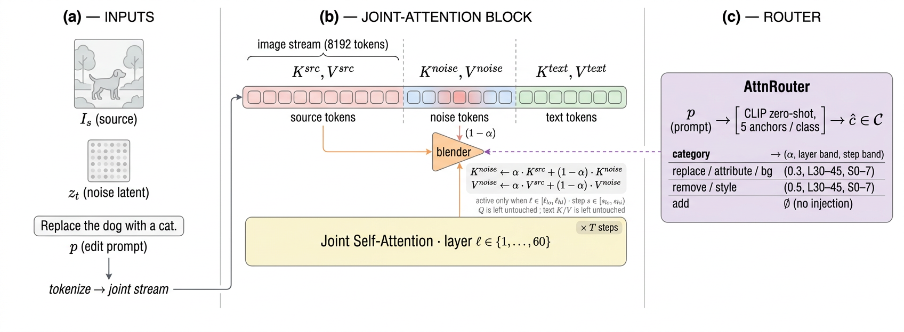
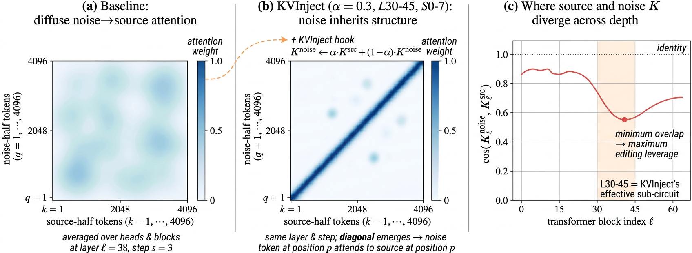
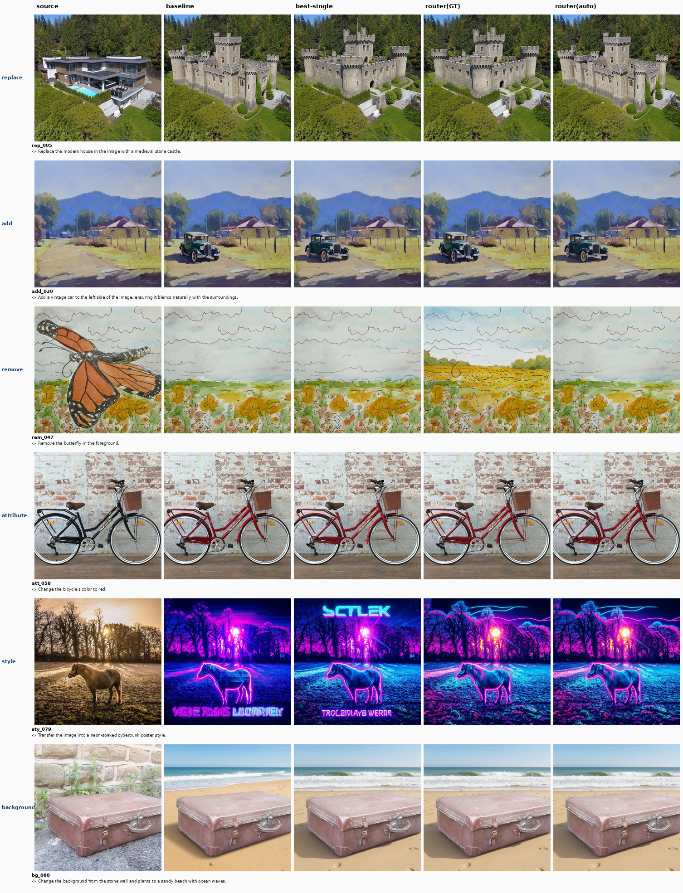

# AI Daily: AttnRouter - Per-Category Attention Routing for Training-Free Image Editing on MMDiT

在多模態擴散 Transformer（MMDiT）架構中，圖像編輯通常被視為一種條件採樣問題，其中來源圖像被編碼為額外的 Token 併入去噪骨幹網路中。然而，如何在不進行重新訓練的情況下，精確控制編輯強度並保留來源圖像的結構，一直是學術界和工業界的難題。本文深入探討了 2026 年最新發表的一篇極具創新性的論文：**《AttnRouter: Per-Category Attention Routing for Training-Free Image Editing on MMDiT》** [1]。

本篇報告由 **Manus AI** 撰寫，系統性地剖析了該論文的核心貢獻、技術實現、實驗結果以及其在 MMDiT 架構下對訓練免除（Training-Free）圖像編輯技術的重新定義。

---

## 核心技術背景與挑戰

在傳統的 UNet 擴散模型中，訓練免除圖像編輯擁有非常清晰的架構槓桿。例如，**Prompt-to-Prompt (P2P)** [2] 通過修改交叉注意力（Cross-Attention）來控制文字與像素的對齊，而 **MasaCtrl** [3] 則通過重用來源圖像的自注意力（Self-Attention）鍵/值（K/V）矩陣來保持非剛性編輯中的主體一致性。這種架構上的分離給了編輯器四個正交的控制維度：空間位置、時間步、模態以及層家族。

然而，**MMDiT**（如 Qwen-Image-Edit-2511 [4]、FLUX.1 Kontext [5] 和 SD3-Edit [6]）徹底打破了這種分離。在 MMDiT 中：
* 圖像和文字 Token 流經同一個聯合注意力（Joint Attention）通道。
* 來源圖像與噪聲流（Noise Stream）僅僅是同一個圖像流中不同位置的 Token。
* 傳統的「自注意力 vs 交叉注意力」區分不復存在。

如果直接將 UNet 時代的 MasaCtrl 移植到 MMDiT 上，會導致嚴重的**提示詞不匹配（Prompt-Mismatch）**，進而使編輯質量崩塌。這是因為 MasaCtrl 需要運行兩次前向傳播（一次使用中性提示詞記錄 K/V，一次使用編輯提示詞進行注入），而在 MMDiT 中，中性提示詞產生的 K/V 缺乏編輯所需的語義，注入後會嚴重干擾目標圖像的生成。

---

## 技術創新：KVInject 與 AttnRouter

為了解決上述挑戰，論文作者提出了兩大核心貢獻：**KVInject** 與 **AttnRouter**。

### 1. KVInject: 單次前向 $\alpha$-混合算子

**KVInject** 是一種極其簡潔且高效的單次前向（Single-Forward）注意力操縱方法。它直接在**同一次前向傳播**中，將來源部分的 K/V 投影與噪聲部分的 K/V 投影進行 $\alpha$-混合（$\alpha$-blend）：

$$K_{\text{noise}}^{\prime} = \alpha \cdot K_{\text{src}} + (1 - \alpha) \cdot K_{\text{noise}}$$
$$V_{\text{noise}}^{\prime} = \alpha \cdot V_{\text{src}} + (1 - \alpha) \cdot V_{\text{noise}}$$

此操作僅在特定的層區間（Layer Band, $[\ell_{\text{lo}}, \ell_{\text{hi}})$）和步區間（Step Band, $[s_{\text{lo}}, s_{\text{hi}})$）內激活。其偽代碼如 **Algorithm 1** 所示：

```python
# Algorithm 1: KVInject (Per block l, Per step s)
# Inputs: pre-attention K, V of shape [B, 8192, d], alpha, band (l_lo, l_hi, s_lo, s_hi)

if not (l_lo <= l < l_hi and s_lo <= s < s_hi):
    return K, V  # Out of band, do nothing

# Split image stream into noise-half (first 4096 tokens) and source-half (last 4096 tokens)
K_noise, K_src = K[:, :4096], K[:, 4096:]
V_noise, V_src = V[:, :4096], V[:, 4096:]

# Perform alpha-blending
K_noise = alpha * K_src + (1 - alpha) * K_noise
V_noise = alpha * V_src + (1 - alpha) * V_noise

# Re-concatenate and return
return concat(K_noise, K_src, dim=1), concat(V_noise, V_src, dim=1)
```

> **為什麼 KVInject 能夠成功？**
> 
> 在 MMDiT 中，來源圖像的 Token 與編輯提示詞（Edit Prompt）是協同注意（Co-attended）的。這意味著在前向傳播中，來源部分的 $K_{\text{src}}$ 已經自然融入了編輯提示詞的語義，因此不需要像 MasaCtrl 那樣進行複雜的兩次前向傳播。

### 2. AttnRouter: 基於類別的注意力路由機制

實驗表明，沒有任何一種單一的注意力操縱配置能夠在所有編輯類型中稱霸。例如：
* **Style（風格轉換）** 和 **Remove（物體消除）** 編輯需要更強的來源保留，偏好較高的混合強度（$\alpha = 0.5$）。
* **Replace（替換）**、**Attribute（屬性修改）** 和 **Background（背景替換）** 則在 $\alpha = 0.3$ 時達到最佳平衡。
* **Add（物體添加）** 編輯如果注入過多的來源 K/V，會抑制新物體的生成，因此最佳策略是**不進行任何注入（即 Baseline）**。

基於此，作者設計了 **AttnRouter**，一個基於編輯類別的離散路由表：

| 編輯類別 (Category) | 路由策略 (Operation) | 核心參數配置 |
| :--- | :--- | :--- |
| **Replace, Attribute, Background** | KVInject ($\alpha = 0.3$) | 層區間: L30–45, 步區間: S0–7 |
| **Remove, Style** | KVInject ($\alpha = 0.5$) | 層區間: L30–45, 步區間: S0–7 |
| **Add** | Baseline | 無注意力操縱 (No Injection) |

在推理時，**AttnRouter** 首先使用一個輕量級的 **CLIP Zero-Shot 分類器**（每個類別預先設計 5 個錨定句子，如「Replace X with Y」）對編輯指令進行分類，然後根據預測的類別自動路由到對應的 KVInject 算子。


*圖 1: AttnRouter 完整流水線。來源圖像與噪聲潛變量被拼接為 8192 個 Token 的圖像流。在進入聯合注意力層前，KVInject 對 K/V 投影進行 $\alpha$-混合。*

---

## 實驗結果與消融分析

作者在 **ImgEdit-Bench** [7] 的 100 個分層樣本子集上進行了廣泛評估，採用 **CLIP-T**（衡量編輯保真度）和 **DINO-I**（衡量來源保留度）作為核心指標。

### 1. 主實驗對比

如下表所示，**AttnRouter** 在綜合得分（Composite Score）上顯著超越了所有基準方法：

| 操縱方法 (Method) | CLIP-T $\uparrow$ | DINO-I $\uparrow$ | CLIP-D $\uparrow$ | Composite $\uparrow$ |
| :--- | :---: | :---: | :---: | :---: |
| **Baseline** | 0.2193 | 0.5565 | 0.0608 | 0.3879 |
| **Simple K/V Scale (Best)** | 0.2203 | 0.5304 | 0.0605 | 0.3753 |
| **TextScale (P2P-like)** | **0.2234** | 0.5772 | 0.0676 | 0.4003 |
| **MasaCtrl-proper** | 0.2248 | 0.3107 | 0.0506 | 0.2678 |
| **KVInject (Single Best)** | 0.2203 | 0.5852 | 0.0645 | 0.4028 |
| **AttnRouter (Auto, CLIP)** | 0.2214 | 0.6012 | 0.0677 | **0.4113** |
| **AttnRouter (Oracle)** | 0.2218 | **0.6037** | **0.0685** | **0.4127** |

* **MasaCtrl 在 MMDiT 上失效**：DINO-I 指標從 0.557 暴跌至 0.311，證實了提示詞不匹配導致的生成崩潰。
* **自動路由逼近上限**：儘管 CLIP Zero-Shot 分類器的分類準確率僅為 55%，但 **Auto Router**（0.4113）幾乎完全閉合了與 **Oracle Router**（0.4127）之間的差距。這是因為容易混淆的類別（如 Replace 和 Attribute）共享相同的路由路徑，使系統對分類錯誤具有極強的魯棒性。

### 2. 層區間與時間步消融：定位編輯子電路

論文中最具啟發性的發現是**成功定位了 MMDiT 中的編輯有效子電路（Editing-Effective Sub-Circuit）**：

* **時間步消融 (Step-Band)**：如 **Table 4** 所示，**所有的編輯增益幾乎全部來自前 7 個去噪步（S0–7）**。僅在 S0–7 內注入 K/V 就能恢復 99% 的全步注入增益（Composite 0.4022 vs. 0.4028）。這與擴散模型「前期確立粗糙結構，後期渲染精細紋理」的物理直覺高度吻合。
* **層區間消融 (Layer-Band)**：在 60 層的 Qwen-Image 中，僅有中間的 **L30–45** 區間能夠同時優化編輯保真度與來源保留。過早（L0–15）或過晚（L45–60）的注入都會導致生成退化為來源圖像的近乎複製（DINO-I 飆升但無法完成編輯指令）。


*圖 2: (a) 基準模型中 diffuse 的注意力分佈；(b) KVInject 注入後，噪聲 Token 與來源 Token 之間建立了清晰的對角線對齊，從而傳遞幾何結構；(c) 噪聲與來源 K 矩陣的餘弦相似度在 L30–45 處達到最低，這正是 KVInject 操縱槓桿最大的區域。*

---

## 定性效果對比

通過直觀的視覺對比（圖 3），我們可以清晰地看到 AttnRouter 的優勢：
* 在 **Style（風格化）** 編輯中，AttnRouter 完美保留了背景結構。
* 在 **Attribute（屬性修改）** 中，它精確地改變了自行車的顏色，同時杜絕了背景牆面的幻覺（Hallucination）。


*圖 3: 視覺效果對比。從左至右依次為：來源圖像、Baseline、單一最佳算子、Oracle 路由器、Auto 路由器。*

---

## 局限性與未來展望

儘管 AttnRouter 取得了顯著的成功，但作者也指出了一些待解決的局限性：
1. **多主體場景下的身份漂移 (Identity Drift)**：當圖像中存在多個主體時，全域的 $\alpha$-混合會導致主體特徵混淆。未來可以引入**位置感知（Position-Aware）**的 KVInject，僅在交叉注意力圖預測的編輯區域內進行混合。
2. **整體的風格轉移限制**：對於需要徹底改變全圖紋理的風格化任務，當前的硬性 K/V 保留有時顯得過於保守，未來可探索**動態 $\alpha$ 衰減調度**。
3. **可微路由器**：將離散的分類路由升級為一個輕量級的可微神經網路，直接從指令文本預測連續的 $(\alpha, \text{layers}, \text{steps})$ 參數。

---

## 總結

**AttnRouter** 為多模態擴散 Transformer（MMDiT）時代的訓練免除圖像編輯提供了一套極具啟發性的新範式。它表明：**在 MMDiT 中，圖像編輯不再是尋找單一主導算子的過程，而是一個基於編輯類別的注意力路由問題。** 通過將操縱精確限制在 L30–45 和 S0–7 的編輯子電路中，KVInject 以極低的計算開銷（$<2\%$）和零參數新增，實現了極佳的結構保留與編輯保真度平衡。

---

## 參考文獻

[1] G. Li and M. Ye, "AttnRouter: Per-Category Attention Routing for Training-Free Image Editing on MMDiT," *arXiv preprint arXiv:2605.01480*, 2026. [ArXiv Link](https://arxiv.org/abs/2605.01480)

[2] A. Hertz et al., "Prompt-to-prompt image editing with cross-attention control," in *ICLR*, 2023. [ArXiv Link](https://arxiv.org/abs/2208.01626)

[3] M. Cao et al., "MasaCtrl: tuning-free mutual self-attention control for consistent image synthesis and editing," in *ICCV*, 2023. [ArXiv Link](https://arxiv.org/abs/2304.08465)

[4] Qwen Team, "Qwen-Image-Edit-2511," *Hugging Face*, 2025. [HF Link](https://huggingface.co/Qwen/Qwen-Image-Edit-2511)

[5] Black Forest Labs, "FLUX.1 Kontext: flow matching for in-context image generation and editing in latent space," *arXiv preprint arXiv:2506.15742*, 2025. [ArXiv Link](https://arxiv.org/abs/2506.15742)

[6] P. Esser et al., "Scaling rectified flow transformers for high-resolution image synthesis," in *ICML*, 2024. [ArXiv Link](https://arxiv.org/abs/2403.03206)

[7] ImgEdit-Bench authors, "ImgEdit-Bench: A benchmark for instruction-based image editing," 2025.
